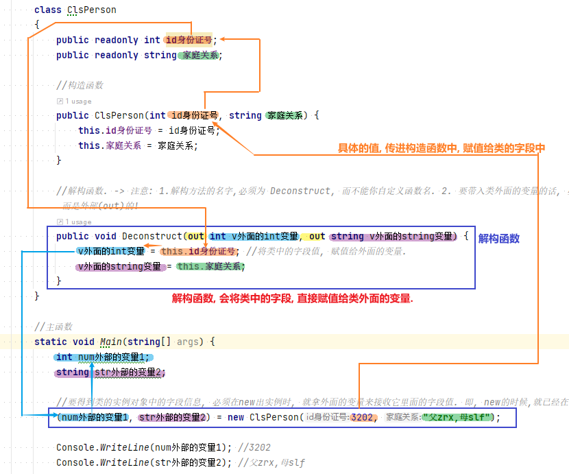
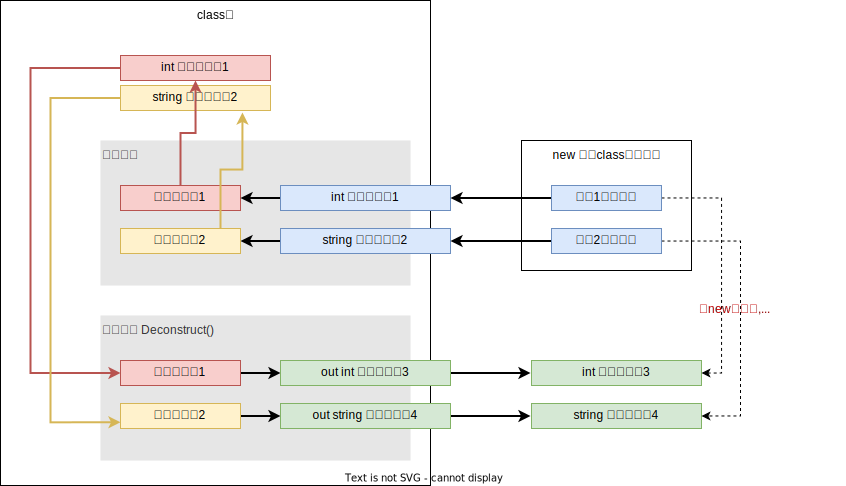

= 类 - 解构函数
:sectnums:
:toclevels: 3
:toc: left

---

== 解构函数 Deconstruct

一个解构器(或称之为"解构方法"), 其实就是"构造器"(构造函数)的反向过程: 构造器, 将外面的值, 通过参数，传递到类里面, 赋值给字段. 而**"解构器"则把这个过程反过来: 将类里面的字段, 拿到外面, 赋值给类外面的变量.**

[,subs=+quotes]
----
internal class Program
{
    class ClsPerson
    {
        public readonly int id身份证号;
        public readonly string 家庭关系;

        //构造函数
        public ClsPerson(int id身份证号, string 家庭关系) {
            this.id身份证号 = id身份证号;
            this.家庭关系 = 家庭关系;
        }

        *//解构函数. -> 注意: 1.解构方法的名字,必须为 Deconstruct, 而不能你自定义函数名. 2. 要带入类外面的变量的话, 必然就要用out关键字了. out本身就告诉了你, 这个参数的变量,不是类内部(in)的, 而是外部(out)的!*
        public *void Deconstruct(out int v外面的int变量, out string v外面的string变量)* {
            v外面的int变量 = this.id身份证号; //将类中的字段值, 赋值给外面的变量.
            v外面的string变量 = this.家庭关系;
        }
    }

    //主函数
    static void Main(string[] args) {
        int num外部的变量1;
        string str外部的变量2;

        *//要得到类的实例对象中的字段信息, 必须在new出实例时, 就拿外面的变量来接收它里面的字段值. 即, new的时候,就已经在调用"解构函数"了. 就已经再"拆包"出里面的字段了. 即必须这样来写(解构该实例):*
        *(num外部的变量1, str外部的变量2) = new ClsPerson(3202, "父zrx,母slf"); //这里虽然用了new, 但也会同时调用"解构函数"!*

        Console.WriteLine(num外部的变量1); //3202
        Console.WriteLine(str外部的变量2); //父zrx,母slf

        // 注意: 下面的写法是错误的. 即, 解构函数, 是没有返回值的. 即, 如果你手动调用该解构函数时, 是不能用变量来接收它的.
        //ClsPerson insPerson = new ClsPerson(3202, "父zrx,母slf");
        //(num外部的变量1, str外部的变量2) = insPerson.Deconstruct(); //报错, 会提示 :No 'Deconstruct' method with 2 out parameters found for type 'void'

        //但你可以这样写:
        ClsPerson insPerson = new ClsPerson(3202, "父zrx,母slf");

        *insPerson.Deconstruct(out num外部的变量1, out str外部的变量2);  //直接调用它, 把外部的两个承接变量传进去, 即可. 也不需要前面写等号. (写等号必然报错, 因为解构函数没有返回值! 它直接就联系上了外部变量.)*

        Console.WriteLine(num外部的变量1); //3202
        Console.WriteLine(str外部的变量2); //父zrx,母slf

    }
}
----

还有更简单的解包方法:
[,subs=+quotes]
----
int num外部的变量1;
string str外部的变量2;

ClsPerson insPerson = new ClsPerson(3202, "父zrx,母slf");

*(num外部的变量1, str外部的变量2) = insPerson; //也可以这样来解包, 更简单. 等号右边直接是实例对象名字就行了. 这种操作, 就称为"解构(解包)赋值".*

Console.WriteLine(num外部的变量1); //3202
Console.WriteLine(str外部的变量2); //父zrx,母slf
----

事实上, 我们还可以通过重载 Deconstruct()方法, 向调用者提供一系列解构方案。

'''

