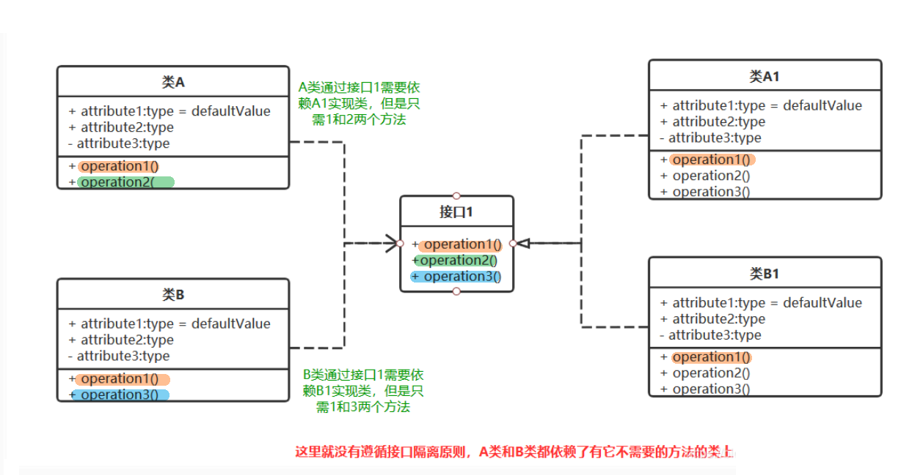
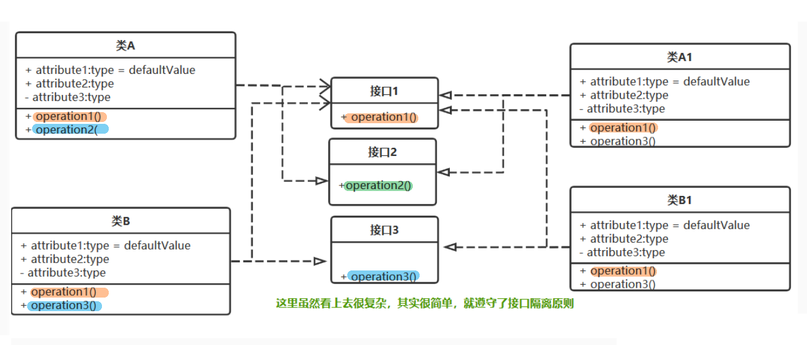


= 接口
:sectnums:
:toclevels: 3
:toc: left

---

== 接口 interface

- 接口中, 只包含方法的声明, 而没有方法的实现. 方法的实现是派生类的责任. 换言之, 接口本身并不实现任何功能，它只是提供了派生类应遵循的标准结构 (苹果 Apple MFi 认证).
- 接口不能有"构造函数"，也不能有字段.
- 接口也不允许运算符重载.
- 接口定义中, 不允许声明成员的修饰符，接口成员都是公有的.

'''

== 创建一个接口

image:img/0034.png[,]

image:img/0035.png[,]

[,subs=+quotes]
----
//接口
namespace my03_接口
{
    internal *interface InterfaceFly*
    {
        public void fnFly(); *//在本接口中, 我们声明一个fly飞翔方法, 但没有具体函数体.*
    }
}

//用来实现接口的"类":
internal *class Cls我 : InterfaceFly  // 本类, 将要实现 InterfaceFly接口*
{

    *public void fnFly()  //在本类中, 来具体实现"接口中定义的方法".*
    {
        Console.WriteLine("Cls我, 这个类, 具体实现了 fly 方法");
    }
}
----

'''

==== 引入接口, 就能让类与类之间的耦合, 变松

[,subs=+quotes]
----
namespace ConsoleApp4 {

    //接口
    *interface Itf手机 {*
        void fn拨号();
        void fn上网();
        void fn装app();
    }

    //下面的类, 来实现上面的接口
    *class Cls苹果手机 : Itf手机 {*
        public void fn拨号() {
            Console.WriteLine("苹果手机, 拨号...");
        }

        public void fn上网() {
            Console.WriteLine("苹果手机, 上网...");
        }

        public void fn装app() {
            Console.WriteLine("苹果手机, 装app...");
        }
    }

    //谷歌手机, 也实现上面的接口
    class Cls谷歌手机 : Itf手机 {
        public void fn拨号() {
            Console.WriteLine("谷歌手机, 拨号...");
        }

        public void fn上网() {
            Console.WriteLine("谷歌手机, 上网...");
        }

        public void fn装app() {
            Console.WriteLine("谷歌手机, 装app...");
        }
    }

    //用户类
    class Cls消费者 {
        *private Itf手机 ins手机;  //有一部接口类型的手机*

        //构造函数
        *public Cls消费者(Itf手机 ins手机) {*
            this.ins手机 = ins手机;
        }

        public void fn用户使用手机() {
            this.ins手机.fn拨号();
            this.ins手机.fn上网();
            this.ins手机.fn装app();
        }
    }

    //主函数
    internal class Program {
        static void Main(string[] args) {

            *Cls消费者 ins消费者 = new Cls消费者(new Cls苹果手机()); //给用户实例, 传入一步实现了接口的苹果手机.*
            ins消费者.fn用户使用手机();

            //输出:
            // 苹果手机, 拨号...
            // 苹果手机, 上网...
            // 苹果手机, 装app...

            *Cls消费者 ins消费者2 = new Cls消费者(new Cls谷歌手机()); //给用户实例, 传入一步实现了接口的谷歌手机.*
            ins消费者2.fn用户使用手机();
            //输出:
            // 谷歌手机, 拨号...
            // 谷歌手机, 上网...
            // 谷歌手机, 装app...
        }
    }
}
----

*接口, 就是为了 class 与 class 之间"解耦合"的目的而生. +
但注意:当类实现一个接口的时候，class 与 interface 之间的关系也是“紧耦合”.*

'''

== 接口变量, 可以指针指向"任何实现了该接口的具体类的实例对象"

[,subs=+quotes]
----
//接口
internal *interface* InterfaceFly {
    public void fnFly();
    public void fn隐身();
}

//实现了该接口的 "Cls我"类
internal *class Cls我 : InterfaceFly  // 本类, 将要实现 InterfaceFly接口*
{

    public void fnFly() { //在本类中, 来具体实现"接口中定义的方法".      
        Console.WriteLine("Cls我, 这个类, 具体实现了 fly 方法");
    }

    public void fn隐身() {
        Console.WriteLine("Cls我, 这个类, 具体实现了 \"隐身\"方法");
    }
}

//实现了该接口的 "Cls别人"类
internal **class Cls别人 : InterfaceFly { //本类实现了该接口 **
    public void fnFly() {
        Console.WriteLine("Cls别人, 这个类, 具体实现了 fly 方法");
    }

    public void fn隐身() {
        Console.WriteLine("Cls别人, 这个类, 具体实现了 隐身 方法");
    }
}

//主函数
internal class Program {
    static void Main(string[] args) {
        *InterfaceFly v接口变量;  //这里,我们定义了一个接口变量, 让它可以指向"任何实现了该接口的具体类的实例对象".  即, 这个接口变量的指针, 指向那个类的实例, 就能调用该类实例中的方法.*

        *v接口变量 = new Cls我();  // 让接口变量,指向 "Cls我"类的实例.*
        v接口变量.fnFly(); //Cls我, 这个类, 具体实现了 fly 方法

        *v接口变量 = new Cls别人(); // 让接口变量,指向 "Cls别人"类的实例.*
        v接口变量.fn隐身(); //Cls别人, 这个类, 具体实现了 隐身 方法
    }
}
----

上面, v接口变量, 由于指向了不同的类的实例, 就能"变身"为不同角色, 执行不同功能. 这就是"多态" (多种形态).

image:img/0036.png[,]

'''

== 接口的继承

[,subs=+quotes]
----
//父接口
internal *interface IF父接口*
{
    public void fn父接口中的方法();
}

//子接口
internal *interface IF子接口: IF父接口   //子接口, 继承自父接口*
{
    public void fn子接口中的方法();
}

//实现接口的"类"
internal *class Cls我 : IF子接口  // 本类, 将要实现 "IF子接口", 由于"子接口", 继承了"父接口", 所以"子接口"中就有两个方法了, 都要被具体实现*
{
    public void fn子接口中的方法()
    {
        Console.WriteLine("Cls我, 实现了\"子接口\"中的方法");
    }

    public void fn父接口中的方法()
    {
        Console.WriteLine("Cls我, 实现了\"父接口\"中的方法");
    }
}

//主文件
Cls我 my = new Cls我();
my.fn子接口中的方法(); //Cls我, 实现了"子接口"中的方法
my.fn父接口中的方法(); //Cls我, 实现了"父接口"中的方法
----

'''

==== C#中的类, 允许同时继承多个接口.

C#中的类, 不允许同时继承多个父类, 但允许同时继承多个接口.

[,subs=+quotes]
----
internal *class Cls我 : ClsFather, IF子接口, IF父接口*
{
}
//一个类, 既继承了"父类", 又继承了"接口"时, 接口必须写在后面.
----

image:img/0157.png[,]

'''

== SOLID原则

SOLID原则, 包括5个子原则:

=== "单一职责"原则 (SRP) Single Responsibility Principle

一个类，最好只负责一件事，只有一个引起它变化的原因。 +
There should never be more than one reason for a class to change。

单一职责通常意味着单一的功能，因此不要为类实现过多的功能点，以保证实体只有一个引起它变化的原因。

'''

=== Open Close Principle，开闭原则

软件实体（包括类、模块、功能等）应该对扩展开放，但是对修改关闭。 +
Software entities (classes, modules, functions) should be open for extension /but closed for modification。

对修改关闭, 就是说，应该尽量在不修改源代码的基础上面, 扩展组件。因为修改已经存在的源代码是存在很大风险的.  +
在别人的代码上面改功能，做过开发的都知道，苦不堪言，因为你不知道别人哪里会给你埋一个“坑”。 +
在现有代码上面改，也存在很大的风险，即使做好之后, 所有的功能都必须重新经过严格的测试.

不允许修改源代码，那我们如何应对需求变更呢？答案就是"对扩展开放". 这要求我们必须要"面向接口编程"，或者说"面向抽象编程"。所有参数类型、引用传递的对象, 必须使用抽象（接口或者抽象类）的方式定义。

'''

=== Liskov Substitution Principle，里氏替换原则

[options="autowidth"]
|===
|Header 1 |Header 2

|里氏代换原则：
|任何基类可以出现的地方，子类一定可以出现。通俗理解：子类可以扩展父类的功能，但不能改变父类原有的功能。

|1.子类可以实现父类的抽象方法，但是不能覆盖父类的非抽象方法. *子类继承父类时，除添加新的方法完成新增功能外，尽量不要重写父类的方法。*
|**在我们做系统设计时，经常会设计接口或抽象类，然后由子类来实现抽象方法，**这里使用的其实就是里氏替换原则。

里氏替换原则的关键点在于: 不能覆盖父类的非抽象方法。 *父类中凡是已经实现好的方法，实际上是在设定一系列的规范和契约，虽然它不强制要求所有的子类必须遵从这些规范，但是如果子类对这些非抽象方法任意修改，就会对整个继承体系造成破坏。* +
如果通过重写父类的方法来完成新的功能，整个继承体系的可复用性就会比较差.

|2.子类中, 可以增加自己特有的方法.
|当功能扩展时，子类尽量不要重写父类的方法，而是另写一个新方法.

|3.当子类覆盖或实现父类的方法时，方法的前置条件（即方法的形参）, 要比父类方法的输入参数更宽松.
|
|===

'''

=== "接口隔离"原则(ISP) Interface Segregation Principle

"接口隔离原则"指出:

==== (1) 不应该强行要求客户端依赖于它们不用的接口. 

Clients should not be forced to depend upon interfaces that they don't use.

反过来说，*如果客户端依赖了它们不需要的接口，那么这些客户端程序, 就面临不需要的接口变更引起的客户端变更的风险，* 这样就会增加客户端和接口之间的耦合程度，显然与“高内聚、低耦合”的思想相矛盾。

'''

==== (2) 类之间的依赖, 应该建立在最小的接口上面.

The dependency of one class to another one /should depend on the smallest possible interface.

这里最小的粒度, 取决于"单一职责原则"的划分.

'''

=== Dependency Inversion Principle，依赖倒置原则

'''

image:img/0165.png[,]

