= 多线程
:sectnums:
:toclevels: 3
:toc: left

---

== 启动一个线程

.标题
====
例如：

[source, java]
----
namespace ConsoleApp2
{
    internal class Program
    {

        private static void fn某任务()
        {
            Console.WriteLine("某任务正在执行...");
        }

        static void Main(string[] args) //Main函数, 会运行在主线程中.
        {

            Thread t = Thread.CurrentThread;  //获取"当前线程" 的实例
            t.Name = "主线程"; //实例的Name属性, 可以让你给该"线程实例", 设置名字.
            Console.WriteLine(t.Name); //  主线程

            Thread t2 = new Thread(fn某任务);
            t2.Start(); //某任务正在执行...  ← Start()方法, 意思是将这个线程对象,启动起来

            //也可以写成下面的形式
            Thread t3 = new Thread(new ThreadStart(fn某任务)); //ThreadStart表示在Thread上执行的方法. new ThreadStart(function)是显式声明一个委托，注意function没有小括号.

            t3.Start(); //某任务正在执行...

            /*
             换言之,
            Thread t1 = new Thread(aMethod);
            Thread t2 = new Thread(new ThreadStart(aMethod));
            这两个功能是相同的.
             */
        }

    }
}
----

image:img/0037.png[,]

====

.标题
====
例如：

下面, 我们模拟两个线程的同时运行:

[source, java]
----
namespace ConsoleApp2
{
    internal class Program
    {

        private static void fn某任务()
        {
            while (true)
            {
                Console.WriteLine("多线程任务, 正在执行...");
                Thread.Sleep(1000);  //让线程,暂停1秒
            }
        }

        static void Main(string[] args) //Main函数, 会运行在主线程中.
        {

            Thread ins线程1 = new Thread(fn某任务);
            ins线程1.Start();

            while (true)
            {
                Console.WriteLine("主线程, 在工作...");
                Thread.Sleep(1000);  //让线程,暂停1秒
            }

        }
    }
}
----

注意代码的前后顺序:

image:img/0038.png[,]
====

== C#启动线程的几种方法

一、 最常见的就是使用参数为 ThreadStart类型的线程构造函数

Thread t = new Thread(new ThreadStart(FunctionName));

可以写成 Thread t = new Thread(FunctionName);   这就是最基本的创建线程方法。**但是ThreadStart是无参数的委托类型，这种方法也就不能直接给线程函数传递参数。**但是线程函数可以直接访问他所在的类中的其他成员变量，参数可以设置在其他成员变量中，让线程函数去读取。

二、 使用参数为 ParameterizedThreadStart类型的线程构造函数

Thread t = new Thread(new ParameterizedThreadStart(FunctionName));

ParameterizedThreadStart也是一个委托类型，*其委托的函数必须带一个object类型的参数。虽然只带一个object类型参数，但是可以把N个参数都包装进一个类对象，通过这个object参数直接把该对象传给线程，也就相当于传了N个参数，不过多了包装这步。*

三、 直接采用异步委托调用

受委托的函数, 可以拥有任何数量和类型的参数。*线程的本质实际上也是异步委托调用，线程类Thread也可以看成是对异步委托调用的一层封装*，当然多一层封装后灵活性就降低了（体现在参数数量和类型被限定），但是方便使用。

如果直接采取异步委托调用的方式，必须自己协调多个线程之间的同步问题，这个工作原来是由Thread类替我们完成了。换句话说，是在方便和灵活之间做一个选择。通常使用现成的Thread类已可以应付所有操作。

四、 创建内嵌的线程类

这种方法把线程要完成的工作及其资源包装成一个类，符合面向对象的思想。这个类不一定要是内嵌类，但是对于winform程序来说，如果不是内嵌类，就意味着无法访问Form类上的控件、修改程序界面。

内嵌类本身是个非常麻烦的概念。他可以访问外部类的private成员变量和方法，但是之前必须加上一个外部对象的引用，所以在内嵌类中通常需要有一个成员变量用来持有对外部对象的引用，可以在内嵌类的构造函数中把外部对象的引用作为参数传递、赋值给该变量。有了这个引用，内嵌类才能在堆内存中找到外部对象，找到以后即使是外部对象中的private成员，内嵌类也是有权限访问的。

.标题
====
例如：

[,subs=+quotes]
----
namespace ConsoleApp2
{

    internal class Program
    {
        *static void fn任务1()*
        {
            Console.WriteLine("任务1, 启动");
            Thread.Sleep(1000);
            Console.WriteLine("任务1, 完成");
        }

        static void Main(string[] args)
        {
            *Thread t线程1 = new Thread(fn任务1)*; //给线程1, 分配一个任务(去执行那个函数方法). 使用Thread类"构造函数"创建的实例, 要接收一个"无返回值、无参数的方法". 只有ParameterizedThreadStart 委托, 才可以用于带参数的方法。
            t线程1.Start(); //启动线程. 线程不会直接运行，直至调用Start()方法时为止。

            Console.WriteLine("Main函数中的任务2,完成");

        }
    }
}
----

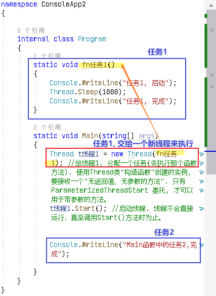

上面的代码, 会输出:
....
Main函数中的任务2,完成
任务1, 启动
任务1, 完成
....

说明, 这两个任务, 是在不同的线程里的. 虽然任务1的代码, 是写在任务2的代码前面, 但执行时, 它们是并行执行的. 谁先完成, 谁先返回.
====

.标题
====
也可以给线程, 分配一个匿名方法.

[,subs=+quotes]
----
//也可以给线程, 分配一个匿名方法.
Thread t线程2 = new Thread(*() => { Console.WriteLine("任务3, 完成");* });
t线程2.Start();
----

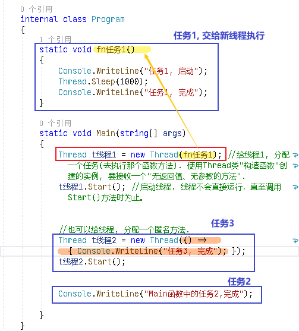

会输出:
....
任务1, 启动
Main函数中的任务2,完成
任务3, 完成
任务1, 完成
....

====

---

== 获取当前线程的id  → Thread.CurrentThread.ManagedThreadId

[,subs=+quotes]
----
using System.Xml;

namespace ConsoleApp2
{

    internal class Program
    {
        static void fn任务1()
        {
            Console.WriteLine("任务1, 启动");

            *int num当前线的id= Thread.CurrentThread.ManagedThreadId;* //获取当前线程的id
            Thread.Sleep(1000);
            Console.WriteLine("当前线程的id是:{0}",num当前线的id); //当前线程的id是:9

            Console.WriteLine("任务1, 完成");
        }

        static void Main(string[] args)
        {
            Thread t线程1 = new Thread(fn任务1); //给线程1, 分配一个任务(去执行那个函数方法). 使用Thread类"构造函数"创建的实例, 要接收一个"无返回值、无参数的方法".
            t线程1.Start(); //启动线程. 线程不会直接运行，直至调用Start()方法时为止。

            Console.WriteLine("Main函数中的任务2,完成");

        }
    }
}
----

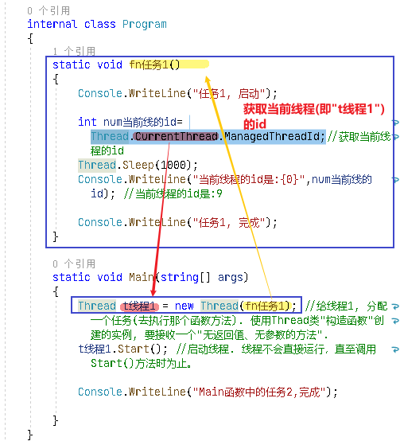

---

== 给线程, 分配一个有参函数 (即让线程, 去执行一个有参函数)

==== 只传递一个参数.

[,subs=+quotes]
----
using System.Xml;

namespace ConsoleApp2
{

    internal class Program
    {

        //下面这个有参函数, 之后会交给线程1来执行
        static void *fn有参任务1(Object objArg参数)* //参数必须设置为 Object类型, 相当于一个泛型, 即用户可以给这个函数, 传入任意类型的参数.
        {
            string str下载地址 = objArg参数 as string; //强制类型转换

            Console.WriteLine("下载程序, 正在下载{0}", str下载地址); //会输出: 下载程序, 正在下载http://www...
        }

        static void Main(string[] args)
        {
            Thread t线程1 = new Thread(fn有参任务1);
            *t线程1.Start("http://www...")*;  //在启动线程时, 再给它要执行的函数, 传入参数.

        }
    }
}
----

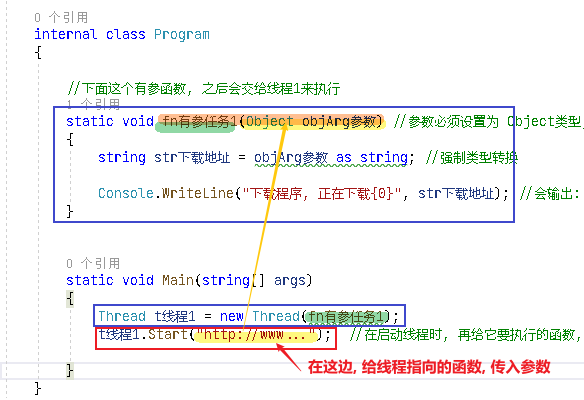

---

==== 传递多个参数 (不推荐! 比较麻烦)

方法是:

1. 把多个参数, 用一个结构体类struct 的实例, 来保存.
2. 然后把该实例, 作为参数, 传递给"新线程"所指向的函数(参数类型要用 Object).
3. 再在函数里面, 把这个 Object类型的参数, "强制类型转换"回"结构体类型 struct". 交给"该结构体类的变量"来指针指向它.
4. 就能拿到这个"结构体实例"里面保存的多个参数值了.

[,subs=+quotes]
----
using System.Xml;

namespace ConsoleApp2
{

    //创建一个结构体(类似于python中的 键值对 dict类型, 只不过dict中没有方法, 只有字段), 用来保存之后要传给"线程指向函数"的多个参数

    internal class Program

    {
        public struct strc存多参数
        {
            public string name;
            public int age;
        }

        //下面这个有参函数, 之后会交给线程1来执行
        static void fn有参任务1(Object objArg参数) //参数必须设置为 Object类型, 相当于一个泛型, 即用户可以给这个函数, 传入任意类型的参数.
        {
            strc存多参数 ins结构体2 = (strc存多参数)objArg参数; //强制类型转换. 注意: 结构体不能用as语法来强制类型转换, 即不能写成: objArg参数 as strc多参数, 会报错.

            Console.WriteLine("{0},{1}",ins结构体2.name, ins结构体2.age); //会输出: zrx,19

        }

        static void Main(string[] args)
        {

            //让这个结构体类型的实例, 保存各参数中的具体指.
            strc存多参数 insStrc多参数的值 = new strc存多参数();
            insStrc多参数的值.name = "zrx";
            insStrc多参数的值.age = 19;

            Thread t线程1 = new Thread(fn有参任务1);
            t线程1.Start(insStrc多参数的值);  //在启动线程时, 再给它要执行的函数, 传入参数.

        }
    }
}
----

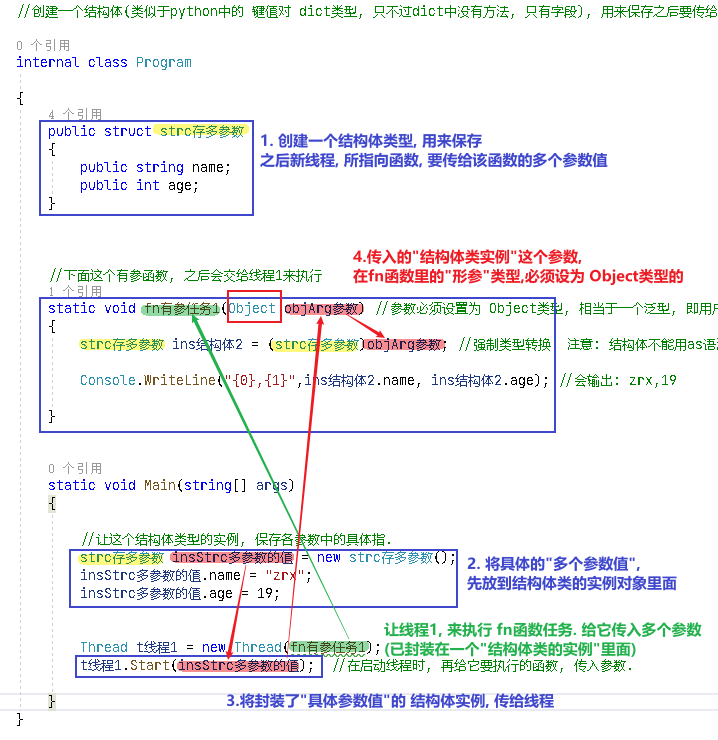

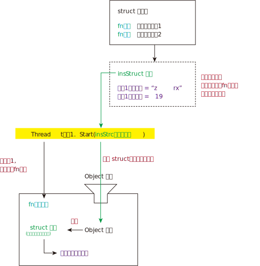

---

==== 传递多个参数 (推荐), 直接让"类中的方法", 来干函数的活. 传参数, 就是在实例化该类时, 传给构造函数了.

其实, 我们可以把多个参数, 就封装在一个类里面, 写成类中的字段, 然后对这些参数(字段)的操作, 就是通过类中的方法来完成就行了.  我们的新线程, 就只需指向(执行)这个类中的方法就行了. 比上面的创建"结构体"方法要容易得多!

.标题
====
例如：

类: //下面是个很普通的类, 没有任何特殊之处.
[,subs=+quotes]
----
namespace ConsoleApp2
{
    internal class Cls下载程序
    {
        private string V下载地址 { get; set; }
        private string V下载目录 { get; set; }

        //构造方法
        public Cls下载程序(string v下载地址, string v下载目录)
        {
            V下载地址 = v下载地址;
            V下载目录 = v下载目录;
        }

        public void fn执行下载()
        {
            Console.WriteLine("开始下载{0}, 保存到{1} 目录中",V下载地址,V下载目录);
        }
    }
}

----

主文件中:
[,subs=+quotes]
----
internal class Program

{

    static void Main(string[] args)
    {
        Cls下载程序 ins下载程序 = new Cls下载程序("http://xxx...", "c:\\my");

        //我们直接让线程, 来执行 "类实例"中的方法. 该方法的参数, 已经在实例化该类时, 传给其"构造函数"了. 就不需要我们绕远路拜托线程来传给它指向的函数了.
        Thread t线程1 = *new Thread(ins下载程序.fn执行下载)*;
        t线程1.Start(); // 输出: 开始下载http://xxx..., 保存到c:\my 目录中

    }
}
----
====

---

== 线程: 前台, 后台

线程可分为两种: 前台线程, 后台线程. 两者的区别是：

- 应用程序, 必须运行完所有的"前台线程"后, 才可以退出； 即"前台线程"是大爷, 是甲方.
- 而对于"后台线程"，应用程序则可以不考虑其是否已经运行完毕, 而直接退出. 即, 所有的"后台线程"在应用程序退出时, 都会自动结束。即"后台线程"是孙子. 是服务人员, 是乙方.

点net环境**使用Thread建立的线程, 默认情况下是"前台线程"，即线程属性IsBackground=false.** 在进程中，只要有一个"前台线程"未退出，进程就不会终止。"主线程"就是一个"前台线程"。

而"后台线程"不管线程是否结束，只要所有的"前台线程"都退出（包括正常退出和异常退出）后，进程就会自动终止。

*一般"后台线程"用于处理时间较短的任务*，如在一个Web服务器中, 可以利用"后台线程"来处理客户端发过来的请求信息。 +
而**"前台线程"一般用于处理需要长时间等待的任务**，如在Web服务器中的监听客户端请求的程序，*或是定时对某些系统资源进行扫描的程序。*

*要注意的是，必须在调用Start方法之前设置线程的类型，否则一但线程运行，将无法改变其类型。*

*通过BeginXXX方法运行的线程, 都是"后台线程".*

启动了多个线程的程序, 在关闭的时候却出现了问题，*如果程序退出的时候不关闭线程，那么线程就会一直的存在*，但是大多启动的线程都是局部变量，不能一一的关闭，如果调用Thread.CurrentThread.Abort()方法关闭主线程的话，就会出现ThreadAbortException 异常，因此这样不行。后来找到了这个办法： Thread.IsBackground设置线程为后台线程。

==== 前台线程

[,subs=+quotes]
----
internal class Program

{
    static void fn目标函数()
    {
        Console.WriteLine("目标函数启动");
        Thread.Sleep(1000);
        Console.WriteLine("目标函数结束");
    }

    static void Main(string[] args)  //主线程, 也是前台线程.
    {
        //下面, 我们创建一个线程实例, 把它手动的改成"前台线程",虽然它默认就是"前台线程"
        Thread t1 = *new Thread(fn目标函数) { IsBackground = false };*
        t1.Start();

        Console.WriteLine("main函数启动");

    }
}
----

输出:
....
main函数启动
目标函数启动
目标函数结束
....

==== 后台线程

[,subs=+quotes]
----
internal class Program

{
    static void fn目标函数()
    {
        Console.WriteLine("目标函数启动");
        Thread.Sleep(1000);
        Console.WriteLine("目标函数结束");
    }

    static void Main(string[] args)
    {
        //下面, 我们创建一个线程实例, 把改成"后台线程",则, "前台线程"一结束, 不管"后台进程"结没结束, 都会强制结束"后台进程".
        Thread t1 = *new Thread(fn目标函数) { IsBackground = true };*
        t1.Start();

        Console.WriteLine("前台线程: main函数启动");
        Console.WriteLine("前台线程: main函数结束");

    }
}
----

会输出:
....
目标函数启动
前台线程: main函数启动
前台线程: main函数结束 //← 可以看到, 前台进程一结束, 后台进程就会被强制关掉, 而不管它结束没有. 所以"目标函数结束"的代码没有被执行.
....

---

== 线程的优先级

线程的优先级（Thread的priority属性）决定了相对操作系统中其他活跃线程执行所占的时间。

优先等级为： +
enum ThreadPriority{Lowest, BelowNormal, Normal, AboveNromal, Highest}

提升线程优先级别的时候特别注意，因为他可能“饿死” 其他线程。

如果想让某个线程的优先级比其他进程（Process）中的线程（Thread）高 ，那就必须提升进程（Process）的优先级。

使用 System.Diagnos 下的Process类。 +
Process p = Process.GetCurrentProcess(); +
p.PriorityClass = ProcessPriorityClass.AboveNormal;

这可以很好得用只能少量工作需要较低的延迟的非UI进程。

对于要大量计算应用程序，提高进程优先级会使其他进程饿死，从而降低计算机的速度。

默认情况下, 你新建的线程, 具有相同的优先级.

[,subs=+quotes]
----
using System.Xml;

namespace ConsoleApp2
{

    internal class Program

    {
        static void fn1()
        {
            while (true)
            {
                Console.WriteLine("fn1");
                Thread.Sleep(100);
            }
        }

        static void fn2()
        {
            while (true)
            {
                Console.WriteLine("fn2");
                Thread.Sleep(100);
            }
        }

        static void Main(string[] args)
        {

            *Thread t1 = new Thread(fn1);*  //你新建的线程, 具有相同的优先级
            *Thread t2 = new Thread(fn2);*

            t1.Start();
            t2.Start();
        }
    }
}

----

会输出:
....
fn1
fn2
fn2
fn1
fn2
fn1
fn2
fn1
fn1
fn2
....

你要提高某个线程的优先级, 就这样写:
[,subs=+quotes]
----
static void Main(string[] args)
{

    Thread t1 = new Thread(fn1);
    Thread t2 = new Thread(fn2);

    *t1.Priority = ThreadPriority.Highest;* //将t1线程的优先级, 设为最高.

    t1.Start();
    t2.Start();
}
----

注意: 优先级高, 并不一定是优先输出你, 而是说 cpu会更关照你.

---

== 线程池

创建线程还是比较简单的，但是由于线程的创建和销毁, 需要耗费一定的开销(默认情况下，主线程占用1M，子线程占用512KB，线程越多，占用内存也越多)，过多的使用线程, 反而会造成内存资源的浪费，从而影响性能，
出于对性能的考虑，于是引入了线程池的概念。

线程池是**应用程序要创建线程来执行任务的时候，线程池才会初始化一个线程，
初始化的线程和其他线程一样，但是在线程完成任务之后不会自行销毁，
而是以挂起的状态回到线程池，当应用程序再次向线程池发出请求的时候，线程池里挂起的线程会再度激活执行任务。
这样做可以减少线程创建和销毁所带来的开销。**

简单说：*线程池，其实就是一个容纳多个线程的容器，其中的线程可以反复使用，省去了频繁创建线程对象的操作，无需反复创建线程而消耗过多资源。*

线程池非常适合大量小的运算。

*当应用程序想要执行一个异步操作时 ,需要调用QueueUserWorkItem方法, 将对应的任务添加到"线程池"中。
线程池会从队列中提取任务, 并且将其委派给"线程池"中的线程执行。(线程池, 就相当于是个外包公司, 专门接甲方的活, 分派给下面的外包人员来干的.)*

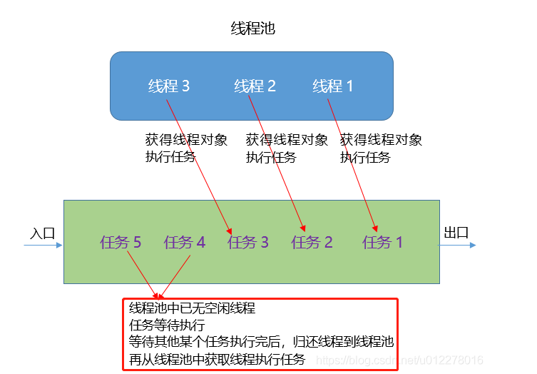

注意: 线程池中的线程, 都是后台线程(又称工作者线程). 即, 如果前台线程结束, 线程池的线程接收的任务, 也会跟着结束.

ThreadPool 是一个静态类

线程池可以看作一个容纳线程的容器 一个应用程序最多有一个线程池 在首次向线程池排入工作函数时自动创建

线程池可以设置最小线程数量, 和最大线程数量

可以复用线程,  避免重复的销毁和创建,  不能控制线程的调用和释放, 默认为后台线程（即 IsBackground=true）,优先级为ThreadPriority.Normal 每个线程都使用默认的堆栈大小

https://blog.csdn.net/SmillCool/article/details/127221960

---

== 任务 Task

Task是在ThreadPool的基础上推出的.

ThreadPool的弊端：

- 不能控制线程池中线程的执行顺序，
- 不能获取线程池内线程取消/异常/完成的通知。

net4.0在ThreadPool的基础上推出了Task，Task拥有"线程池"的优点，同时也解决了使用"线程池"不易控制的弊端。

首先明确Task并不是线程. Task的执行需要线程池中的, 或者独立线程来完成. Task和线程并不是1对1的关系.

Task 使"线程池"中的每个线程, 都有一个本地队列. "线程池"通过一个任务调度器分配任务.

当"主线程"创建一个Task, 由于创建这个Task的并不是"线程池"中的线程, 则任务调度器会把该Task, 放入全局队列中. 如果这个Task是由"线程池"中的线程创建，并且未设置TaskCreationOptions.PreferFairness标记（默认情况下未设置），则任务调度器会把该Task, 放入到该线程的本地队列中。如果设置了TaskCreationOptions.PreferFairness标记，则放入全局队列.

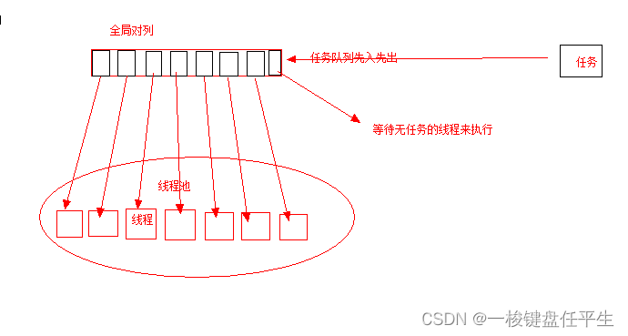

https://www.bilibili.com/video/BV1GW4y1E7pd?p=30&spm_id_from=pageDriver&vd_source=52c6cb2c1143f8e222795afbab2ab1b5

[,subs=+quotes]
----
    internal class Program

    {
        static void fn1()
        {
            Console.WriteLine("fn1");
        }

        static void Main(string[] args)
        {
            //创建一个任务, 并给它分配"工作函数".
            *Task t = new Task(fn1);*
            *t.Start();* //fn1

            Thread.Sleep(5000); //注意, 用Task创建的任务, 也是后台线程, 所以要运行的话, 你必须先把前台的main函数中的操作, 先暂停下.
        }
    }
----

==== 连续任务

如果一个任务t1的执行, 是依赖于另一个任务t2的，那么就需要在这个任务t2执行完毕后, 才开始执行t1。这个时候我们可以使用"连续任务"。

[,subs=+quotes]
----
internal class Program

{
    static void fn1()
    {
        Console.WriteLine("fn1 先做");
        Thread.Sleep(1000);
    }

    // 注意: 下面的fn2函数, 会作为task任务中的"连续任务", 就必须给它传入一个 Task t 参数才行.
    *static void fn2(Task t)*
    {
        Console.WriteLine("fn2 后做");
    }

    static void Main(string[] args)
    {
        //创建一个任务, 并给它分配"工作函数".
        Task t1 = new Task(fn1);
        *t1.ContinueWith(fn2)*; //即, fn2接着fn1来执行.
        t1.Start(); //fn1

        Thread.Sleep(5000); //注意, 用Task创建的任务, 也是后台线程, 所以要运行的话, 你必须先把前台的main函数中的操作, 先暂停下.
    }
}
----

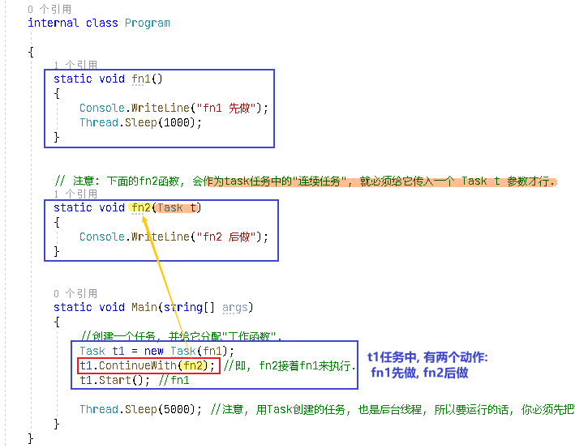

会输出:
....
fn1 先做
(1秒后)
fn2 后做
....

可以一次性多次调用"连续任务":
[,subs=+quotes]
----
//可以多次调佣连续任务
*t1.ContinueWith(fn2).ContinueWith(fn3);* //即, 执行顺序是: fn1 -> fn2 -> fn3
t1.Start();
----

输出:
....
fn1 先做
fn2 后做
fn3 最后做
....

可以把"任务体", 让另一个"任务变量"指向.

[,subs=+quotes]
----
t1.ContinueWith(fn2).ContinueWith(fn3); //即, 执行顺序是: fn1 -> fn2 -> fn3
*Task t2 = t1;* // 可以把"任务体", 让另一个"任务变量"指向.
t2.Start();
----

---

== 资源访问冲突

.标题
====
例如：

类:
[,subs=+quotes]
----
internal class Cls写入操作
{
    private int state = 0;
    public void fn改变state的值()
    {
        if(state == 0)
        {
            state = 1;
            *Console.WriteLine("state={0}, 线程id={1}",state,Thread.CurrentThread.ManagedThreadId);*
        }

        state= 0;
    }
}
----

主文件:
[,subs=+quotes]
----
internal class Program

{
    static void Main(string[] args)
    {
        Cls写入操作 ins写入操作 = new Cls写入操作();

        //下面,我们创建20个线程,都来执行 同一个"ins写入操作"实例中的"fn改变state的值"方法. 注意, 这就会造成对 该实例的state值的设置冲突.
        *for (int i = 0; i < 20; i++)*
        {
            *Thread t = new Thread(ins写入操作.fn改变state的值);*
            t.Start();
        }
    }
}
----

会输出:
....
state=1, 线程id=11
state=1, 线程id=9
state=1, 线程id=13
state=1, 线程id=15
state=1, 线程id=17
state=1, 线程id=19
state=1, 线程id=21
state=1, 线程id=23
state=0, 线程id=25   // ←你看到 这里, state的值变成了0, 和和其他不一样.
state=1, 线程id=27
state=1, 线程id=28
....
====

要解决这个问题, 其中一个解决方式, 就是加锁. 即, 多个线程,要使用同一把锁. 也就是多个线程对同一个变量执行的写入操作, 这个"同一个变量"所属的类中, 要写上"锁"的代码.

我们只要改一下上面的类文件, 主文件不用动.

类文件:
[,subs=+quotes]
----
internal class Cls写入操作
{
    //锁, 要写在类里面. 这样, 当之后有多个线程来执行这个类实例的方法时, 就只会有其中一个线程拿到锁.来执行锁中的代码. 其他线程就会等待. 等拿到锁的线程释放锁之后, 其他线程, 才能再有一个拿到锁,来执行里面的代码. 这样循环. 即, 有了锁后, 就能保证锁里面的代码, 同一时间只能被一个线程所执行.
    *private Object ins你加的锁Lock = new Object();*

    private int state = 0;
    public void fn改变state的值()
    {
        //把你的 Console.WriteLine()操作, 放到锁里面, 先锁起来.
        *lock (ins你加的锁Lock)* //你的锁
        {
            if (state == 0)
            {
                state = 1;
                Console.WriteLine("state={0}, 线程id={1}", state, Thread.CurrentThread.ManagedThreadId);
            }
        }

        state = 0;
    }
}
----

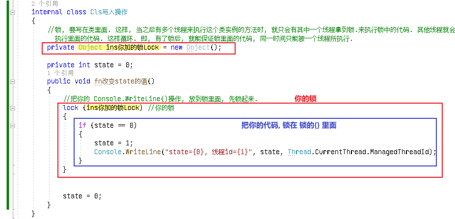

在执行主文件的main函数, 就不会有"资源访问冲突"问题了.

C#提供了一个关键字lock，它可以把一段代码, 定义为"互斥段"（critical section），互斥段在一个时刻内, 只允许一个线程进入执行，而其他线程必须等待。

lock 用于对一个引用类型进行加锁，同一时刻内只有一个线程能够访问此对象。lock 是语法糖，是通过 Monitor 来实现的。

Lock 锁定的对象，应该是静态的引用类型（字符串除外）。

锁的对象也不一定要静态才行，也可以通过类实例的成员变量，作为锁对象。

锁不太适合I/O场景，例如文件I/O，繁杂的计算或者操作比较持久的过程，会给程序带来很大的性能损失。

---

== 进程与线程

一个应用程序启动，会启动一个"进程"（应用程序运行的载体），然后"进程"启动多个"线程"。

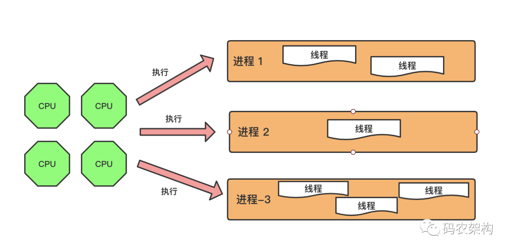

做个简单的比喻：进程(火车)=火车，线程(车厢)=车厢

线程(车厢)在进程(火车)下行进（单纯的车厢无法运行）

一个进程(火车)可以包含多个线程(车厢)（一辆火车可以有多个车厢）

不同进程(火车)间数据很难共享（一辆火车上的乘客很难换到另外一辆火车，比如站点换乘）

同一进程(火车)下不同线程(车厢)间数据很易共享（A车厢换到B车厢很容易）

进程(火车)要比线程(车厢)消耗更多的计算机资源（采用多列火车相比多个车厢更耗资源）

*进程(火车)间不会相互影响，一个线程(车厢)挂掉将导致整个进程(火车)挂掉.*（一列火车不会影响到另外一列火车，但是如果一列火车上中间的一节车厢着火了，将影响到所有车厢）

进程(火车)可以拓展到多机，进程(火车)最多适合多核（不同火车可以开在多个轨道上，同一火车的车厢不能在行进的不同的轨道上）

进程(火车)使用的内存地址可以上锁，即一个线程(车厢)使用某些共享内存时，其他线程(车厢)必须等它结束，才能使用这一块内存。（比如火车上的洗手间）－"互斥锁"

进程(火车)使用的内存地址可以限定使用量（比如火车上的餐厅，最多只允许多少人进入，如果满了需要在门口等，等有人出来了才能进去）－“信号量”

---

== 异步委托

同步委托, 效果是:

.标题
====
例如：

[,subs=+quotes]
----
namespace ConsoleApp2
{

    internal class Program
    {
        static void fn静态方法1()
        {
            Console.WriteLine("静态方法1,启动");
            Console.WriteLine("静态方法1,执行中...");
            Thread.Sleep(3000); //模拟本任务执行需3秒钟
            Console.WriteLine("静态方法1,结束");
        }

        //创建一个委托(即函数指针)
        *delegate void dleFn委托指针();*

        static void Main(string[] args)
        {
            *dleFn委托指针 ins委托指针 = fn静态方法1;*  //让委托指针,指向"fn静态方法1".
            ins委托指针();

            Console.WriteLine("Main函数执行完毕");

        }
    }
}
----

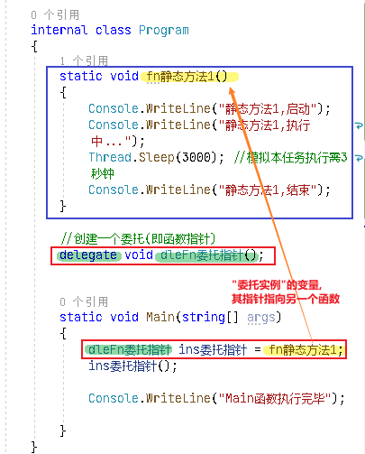

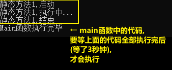
====

下面 我们换用"异步委托", 来执行上面的代码.

如果让一个委托变量指向的函数, 变成"异步操作"的? 只需调用它(该委托变量)的 BeginInvoke()方法. (试验没成功, 教程也没成功. 似乎官方不推荐此方法了. 下面就不用看了)

- 如果是 Invoke() 调用时，Invoke会阻止当前主线程的运行，等到 Invoke() 方法返回才继续执行后面的代码，表现出“同步”的概念。

- BeginInvoke() 调用时，当前线程会启用线程池中的某个线程,来执行此方法，*BeginInvoke不会阻止当前主线程的运行*，而是等当前主线程做完事情之后,再执行BeginInvoke中的代码内容，表现出“异步”的概念。在想获取 BeginInvoke() 执行完毕后的结果时，调用EndInvoke() 方法来获取。而这两个方法中执行的是一个委托。

*BeginInvoke方法, 可以使用线程"异步地"执行委托所指向的方法。然后通过EndInvoke方法, 获得"被代理方法"的返回值*（EndInvoke方法的返回值就是被调用方法的返回值），或是确定方法已经被成功调用。

---

