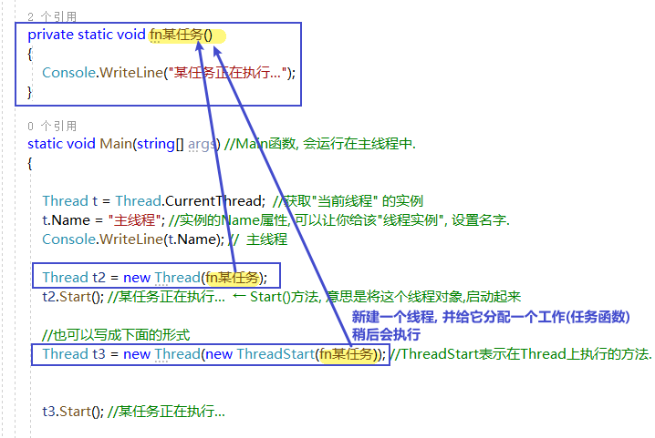
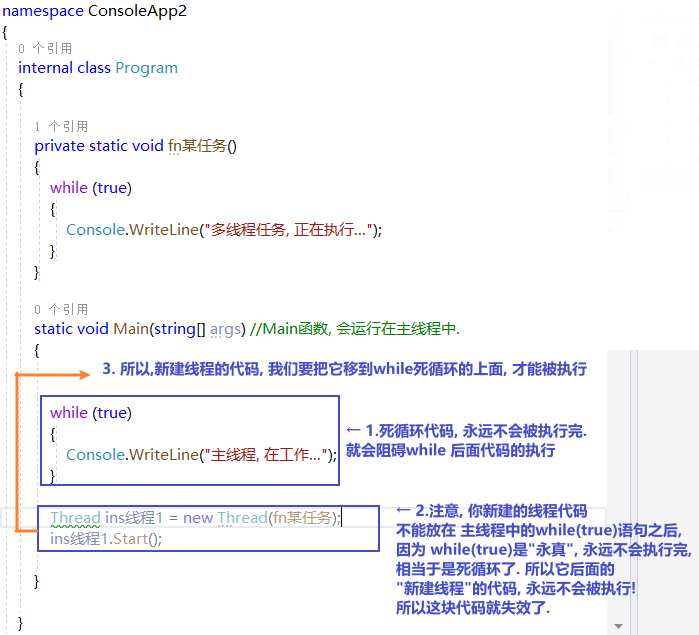

= 多线程
:sectnums:
:toclevels: 3
:toc: left

---

== 启动一个线程

.标题
====
例如：

[source, java]
----
namespace ConsoleApp2
{
    internal class Program
    {

        private static void fn某任务()
        {
            Console.WriteLine("某任务正在执行...");
        }

        static void Main(string[] args) //Main函数, 会运行在主线程中.
        {

            Thread t = Thread.CurrentThread;  //获取"当前线程" 的实例
            t.Name = "主线程"; //实例的Name属性, 可以让你给该"线程实例", 设置名字.
            Console.WriteLine(t.Name); //  主线程

            Thread t2 = new Thread(fn某任务);
            t2.Start(); //某任务正在执行...  ← Start()方法, 意思是将这个线程对象,启动起来

            //也可以写成下面的形式
            Thread t3 = new Thread(new ThreadStart(fn某任务)); //ThreadStart表示在Thread上执行的方法. new ThreadStart(function)是显式声明一个委托，注意function没有小括号.

            t3.Start(); //某任务正在执行...

            /*
             换言之,
            Thread t1 = new Thread(aMethod);
            Thread t2 = new Thread(new ThreadStart(aMethod));
            这两个功能是相同的.
             */
        }

    }
}
----

====

.标题
====
例如：

下面, 我们模拟两个线程的同时运行:

[source, java]
----
namespace ConsoleApp2
{
    internal class Program
    {

        private static void fn某任务()
        {
            while (true)
            {
                Console.WriteLine("多线程任务, 正在执行...");
                Thread.Sleep(1000);  //让线程,暂停1秒
            }
        }

        static void Main(string[] args) //Main函数, 会运行在主线程中.
        {

            Thread ins线程1 = new Thread(fn某任务);
            ins线程1.Start();

            while (true)
            {
                Console.WriteLine("主线程, 在工作...");
                Thread.Sleep(1000);  //让线程,暂停1秒
            }

        }
    }
}
----

注意代码的前后顺序:

====

