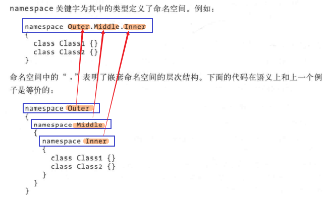
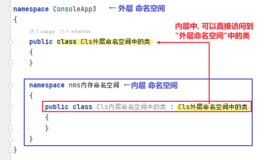
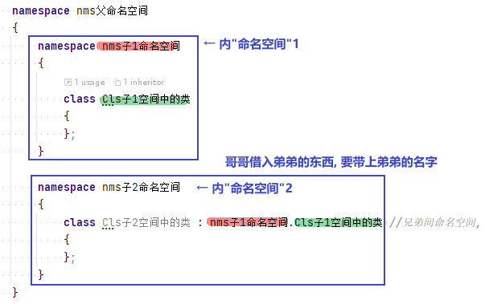

= 命名空间
:sectnums:
:toclevels: 3
:toc: left

---

== 命名空间

命名空间, 好似文件夹, 库, 或包 的概念. 不同命名空间中, 允许有同名的文件.

一个命名空间中的类文件, 无法访问到另一个命名空间中的类文件. 除非你用 using来引入它 (如同"引入库"一样).

在同一个项目的不同文件中, 有不同的"命名空间"(来管理里面的类), 也可以通过 using来引用该"命名空间"后, 就能调用里面的类.

image:/img/0083.png[,]

注意: 虽然在不同的"命名空间"中, 定义相同类名的 class是合法的(而且通常是需要的)。但是, 如果你要同时导入这两个"命名空间"的话, 这两个同名类, 就可能造成冲突.

'''

== 命名空间, 可以嵌套

image:/img/0082.png[,]

*命名空间中的“.”, 表明了嵌套命名空间的层次结构:*

*如果某个类class 没有在任何"命名空间"中定义，则它存在于全局命名空间(global namespace)中。*

'''

==== 嵌套命名空间中, 内层可以直接使用外层中的class类.

[,subs=+quotes]
----
namespace nms外层命名空间
{
    public *class Cls外层命名空间中的类*
    {
    }

    namespace nms内层命名空间
    {
        *public class Cls内层命名空间中的类: Cls外层命名空间中的类 //内层中, 可以直接使用外层"命名空间"中的类.*
        {...}
    }
}
----

'''

==== 同辈间的命名空间, 来调用它同辈"命名空间"中的class类时, 就要带上它兄弟"命名空间"的名字.

[,subs=+quotes]
----
namespace nms父命名空间
{
    *namespace nms子1命名空间*
    {
        class Cls子1空间中的类
        {
        };
    }

    namespace nms子2命名空间
    {
        class Cls子2空间中的类 : *nms子1命名空间.Cls子1空间中的类* //兄弟间命名空间, 要调用它兄弟空间中的类时, 要带上兄弟(命名空间)的名字
        {
        };
    }
}
----

'''

命名空间的其他用法, 见<c# 7.0 核心技术指南> 83页前后

'''

== 在一个项目中,引用另一个项目中的类

image:/img/0146.png[,]

我们在项目1上, 对依赖项, 右键, 添加引用

image:/img/0147.png[,]

image:/img/0148.png[,]

然后, 你就可以在项目1的main函数中, 调用项目2中的类了.

[,subs=+quotes]
----
using Newtonsoft.Json;
using System.Diagnostics;
*using ConsoleApp2; //引用另一个项目的命名空间*

namespace ConsoleApp1
{
    internal class Program
    {

        static void Main(string[] args)
        {
            *ClsTest insT = new ClsTest(); //ClsTest是项目2 (即 ConsoleApp2 命名空间)中的类.*
        }
----

*但注意: 项目2中的类, 必须是 public的, 而不能是 internal的. 否则, 项目1中是看不到项目2中的 internal类的.*

*用 internal修饰的类. 只能在同一个程序集中被访问到.* 同一个程序集, 表示同一个dll程序集, 或同一个exe程序集. *在vs中一个项目会生成一个dll文件，因此这个dll或这个项目, 也就是一个"程序集"。*

总之: 一个项目就是一个"程序集"。一个程序集可以体现为一个dll文件，或者exe文件。

'''

