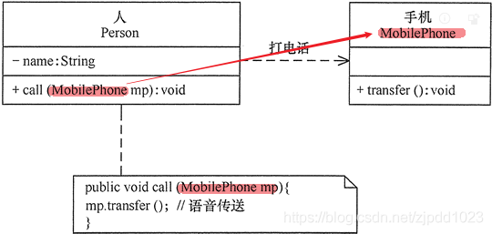
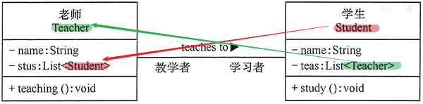
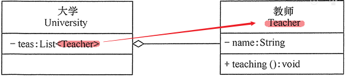
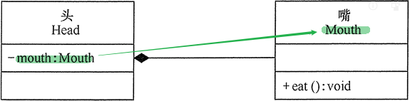
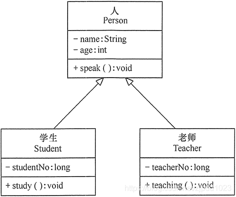
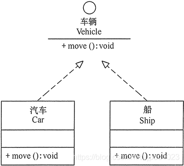

= 类之间的耦合关系
:sectnums:
:toclevels: 3
:toc: left

---

== 耦合强度

根据类与类之间的耦合度, 从弱到强排列，UML 中的类图有以下几种关系：

[options="autowidth" cols="1a,1a"]
|===
|Header 1 |Header 2

|依赖关系 Dependency
|

- 耦合度: 最弱
- 即A类中的方法, 来临时调用B类中的字段, 方法等. 即, B类中的成员, 对A类来说, 只是"使用工具"而已. A类是甲方, B类是乙方.

|关联关系 Association
|- 若B类的实例对象, 是作为A类里面的成员字段来用的, 则它们之间就是"关联关系".
- 可以双向关联, 即你的类型实例, 嵌入到我的字段中, 而且是互相嵌入, 你中有我, 我中有你.

|聚合关系 Aggregation
|- 也是"关联关系"的一种，*但它是"强关联关系"，是"整体"和"部分"之间的关系，是一种拥有的关系, 是 has-a 的关系。*
- B类的实例对象, 作为了A类里面的成员字段. 但成员对象B, 可以脱离A类而独立存在。例如，学校与老师的关系，学校包含老师，但如果学校停办了，老师依然存在。

- 在 UML 类图中，*聚合关系, 可以用带空心菱形的实线来表示，菱形指向整体。*

|组合关系 Composition
|- 也是关联关系的一种，也表示类之间的整体与部分的关系，但它是一种更强烈的聚合关系，*是 contains-a 关系。*
- 在组合关系中，*整体对象可以控制部分对象的生命周期，一旦整体对象不存在. 但部分对象也将不存在，部分对象不能脱离整体对象而存在。(皮之不存, 毛将焉附).*

|泛化关系 Generalization
|- 是对象之间耦合度最大的一种关系，*表示一般与特殊的关系，是父类与子类之间的关系，是一种继承关系，是 is-a 的关系。*
- UML 类图中，泛化关系用带空心三角箭头的实线来表示，箭头从子类指向父类。

|实现关系 Realization
|- 是"接口"与"实现类"之间的关系.
- UML 类图中，实现关系使用带空心三角箭头的虚线来表示，箭头从实现类指向接口.

|===

'''

== 原则: 低耦合，高内聚

- 低耦合: 能降低了一个类或一个模块, 发生修改对其他类或模块造成的影响，将影响范围简单化。实现单向的依赖，实现抽象的耦合，都是实现"低耦合"的基础条件。
- 高内聚: 将功能紧密联系的职责, 封装为一个类（或模块）. 保持内部的封装性，关联的双方不要深入实现细节进行通信. 
- 不需要进行数据交换的双方，不要实现多此一举的关联，人们将此形象称为“不要向陌生人说话（Don't talk to strangers）”。

