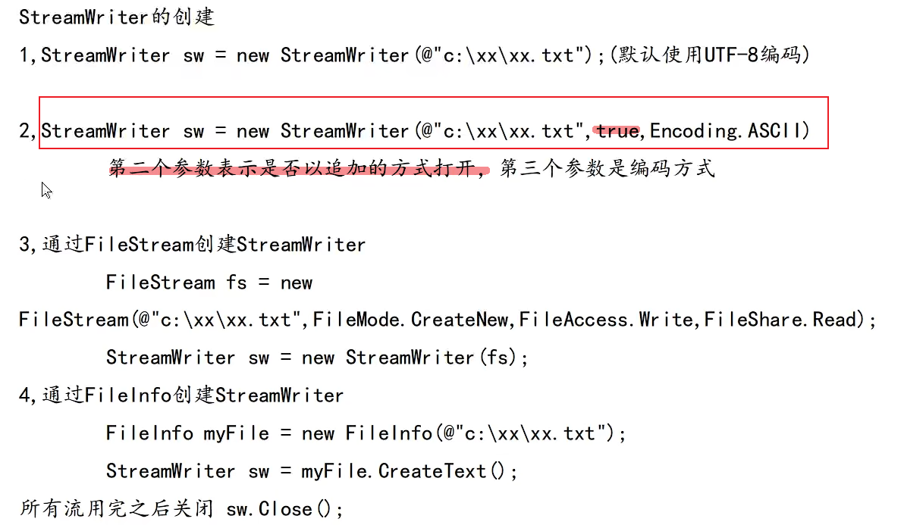
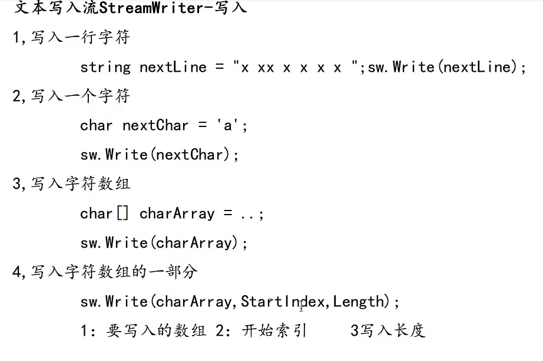
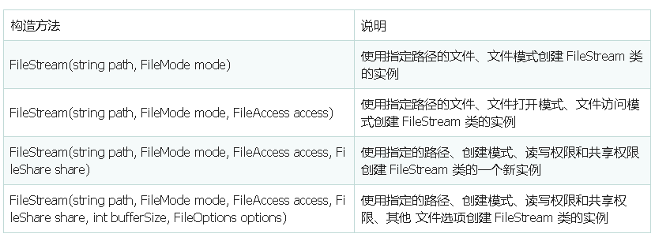

= 读写文件
:sectnums:
:toclevels: 3
:toc: left

---

== 拼接"目录"和"文件"成完整的路径 -> Path.Combine()

[,subs=+quotes]
----
//Path类的Combine()方法, 能帮而我们拼接"目录"和"文件"成完整的路径
string strPath = Path.Combine(@"c:\my\son\","123.txt");
Console.WriteLine(strPath); //c:\my\son\123.txt
----

---

== 读取文件

==== 读取文件中的所有内容 -> File.ReadAllText(filePath)

如果你要读取的文件内容不是很多，可以使用 File.ReadAllText(filePath) 或指定编码方式 File.ReadAllText(FilePath, Encoding)的方法。它们都一次性将文本内容全部读完，并返回一个包含全部文本内容的字符串.

[,subs=+quotes]
----
string str1 = File.ReadAllText(@"c:\temp\a.txt");

//也可以指定编码方式
string str2 = File.ReadAllText(@"c:\temp\a.txt", Encoding.ASCII);
----

实例化StreamReader类有很多种方式。下面我罗列出几种：
[,subs=+quotes]
----
StreamReader sR1 = new StreamReader(@"c:\temp\a.txt");

// 同样也可以指定编码方式
StreamReader sR2 = new StreamReader(@"c:\temp\a.txt", Encoding.UTF8);

FileStream fS = new FileStream(@"C:\temp\a.txt", FileMode.Open, FileAccess.Read, FileShare.None);
StreamReader sR3 = new StreamReader(fS);
StreamReader sR4 = new StreamReader(fS, Encoding.UTF8);

FileInfo myFile = new FileInfo(@"C:\temp\a.txt");
// OpenText 创建一个UTF-8 编码的StreamReader对象
StreamReader sR5 = myFile.OpenText();
// OpenText 创建一个UTF-8 编码的StreamReader对象
StreamReader sR6 = File.OpenText(@"C:\temp\a.txt");
----

[,subs=+quotes]
----
//读取文件中的所有内容
string filePath = @"c:\temp\出师表.txt";
string str = *File.ReadAllText(filePath);*
Console.WriteLine(str);
----

---

==== 读取文件, 返回一个字符串数组 -> File.ReadAllLines()

也可以使用方法File.ReadAllLines()，该方法一次性读取文本内容的所有行，返回一个字符串数组，数组元素是每一行的内容.

[,subs=+quotes]
----
//读取文件中的所有内容
string filePath = @"c:\temp\出师表.txt";

//File.ReadAllLines()，该方法一次性读取文本内容的所有行，返回一个字符串数组，数组元素是每一行的内容
*string[] arrStr = File.ReadAllLines(filePath);*

foreach (string line in arrStr)
{
    Console.WriteLine(line);
}
----

---

==== 读取文件(按指定字符数, 流操作)

当文本的内容比较大时，我们就不要将文本内容一次性读完，而应该采用流（Stream）的方式来读取内容。.Net为我们封装了StreamReader类，它旨在以一种特定的编码从字节流中读取字符。StreamReader类的方法不是静态方法，所以要使用该类读取文件首先要实例化该类，在实例化时，要提供读取文件的路径。

[,subs=+quotes]
----
string filePath1 = @"c:\temp\出师表.txt";

StreamReader sr1 = new StreamReader(filePath1);

// 读一行
*string str = sr1.ReadLine();*

//读20个字符
char[] arrChar = new char[20];
*sr1.Read(arrChar, 0, 20);* //从index=0开始,读取20个字符, 存到arrChar 字符数组中.
Console.WriteLine(arrChar);

// 全部读完
*string strAll = sr1.ReadToEnd();*
Console.WriteLine(strAll);

sr1.Close(); //使用完StreamReader之后，不要忘记关闭它： sR.Close();
----

假如我们需要一行一行的读，将整个文本文件读完

[,subs=+quotes]
----
string filePath1 = @"c:\temp\出师表.txt";

StreamReader sr1 = new StreamReader(filePath1);

//假如我们需要一行一行的读，将整个文本文件读完
string strNextLine ;  //用来存放读取到的一行的内容
int count = 1; //用来作为行号提示用

*while ((strNextLine = sr1.ReadLine())!=null)* //只要读取到的行, 内容不为空,就循环读下一行
{
    Console.WriteLine("num {0}",count);  //输出行号
    *Console.WriteLine(strNextLine);*
    count++;
}

sr1.Close(); //使用完StreamReader之后，不要忘记关闭它： sR.Close();
----

又如:
[,subs=+quotes]
----
// See https://aka.ms/new-console-template for more information

string filePath = @"D:\123\古诗.txt";

StreamReader ins读取的文件流 = new StreamReader(filePath);

//只读取一行
Console.WriteLine(*ins读取的文件流.ReadLine()*);

//读取全部行
string line当前读取到的一行内容 = null;

*while ((line当前读取到的一行内容 = ins读取的文件流.ReadLine())!=null)* {
    Console.WriteLine(line当前读取到的一行内容);
}

// 从指针开始的地方, 一直读到末尾全部.
string strAll = *ins读取的文件流.ReadToEnd()*; //返回一个字符串. 从指针开始的地方, 一直读到末尾全部.
Console.WriteLine(strAll);

//只读取一个字符
Console.WriteLine(*ins读取的文件流.Read()*); //输出的是一个数字?

//读取多个字符
char[] arrChar = new char[10];
*ins读取的文件流.Read(arrChar, 0, 10);*
Console.WriteLine(arrChar);  //可以直接打印字符数组, 能得到中文.

ins读取的文件流.Close();
----

---

== 写入文件

==== 写入文件(会覆盖目标文件中的老内容) -> File.WriteAllText(filePath, str要写入的内容)

写文件和读文件一样，如果你要写入的内容不是很多，可以使用File.WriteAllText方法来一次将内容全部写如文件。如果你要将一个字符串的内容写入文件，可以用File.WriteAllText(FilePath) 或指定编码方式 File.WriteAllText(FilePath, Encoding)方法.

[,subs=+quotes]
----
string filePath = @"c:\temp\aaa.txt";
string strContents = "白日依山尽 \n 黄河入海流 \n";
*File.WriteAllText(filePath, strContents);* //将字符串内容, 写入文件中. 下面会覆盖目标文件中的原内容.
----

---

==== 将字符串数组中的内容, 写入文件中 (会覆盖目标文件中的老内容) -> File.WriteAllLines(filePath, allStr)

如果你有一个字符串数组，你要把数组的每一个元素作为一行写入文件中，可以用File.WriteAllLines方法.

*使用File.WriteAllText或File.WriteAllLines方法时，如果指定的文件路径不存在，会创建一个新文件；如果文件已经存在，则会覆盖原文件.*

[,subs=+quotes]
----
string filePath = @"c:\temp\aaa.txt";

string[] allStr = { "111", "222", "333" };
*File.WriteAllLines(filePath, allStr);* //将字符串数组中的内容, 写入文件中. 会覆盖目标文件中的原内容.
----

---

==== 写入文件 : 用 "Stream流" 的方式 (可追加写入)

当要写入的内容比较多时，同样也要使用流（Stream）的方式写入. .Net为我们封装了StreamWriter类，它以一种特定的编码向字节流中写入字符。StreamWriter类的方法同样也不是静态方法，所以要使用该类写入文件首先要实例化该类.

实例化StreamWriter类同样有很多方式：

[,subs=+quotes]
----
// 如果文件不存在，创建文件； 如果存在，覆盖文件
StreamWriter sW1 = new StreamWriter(@"c:\temp\a.txt");

// 也可以指定编码方式, *true 是 Appendtext*, false 为覆盖原文件
StreamWriter sW2 = *new StreamWriter(@"c:\temp\a.txt", true, Encoding.UTF8);*

// FileMode.CreateNew: 如果文件不存在，创建文件；如果文件已经存在，抛出异常
FileStream fS = new FileStream(@"C:\temp\a.txt", FileMode.CreateNew, FileAccess.Write, FileShare.Read);
StreamWriter sW3 = new StreamWriter(fS);
StreamWriter sW4 = new StreamWriter(fS, Encoding.UTF8);

// 如果文件不存在，创建文件； 如果存在，覆盖文件
FileInfo myFile = new FileInfo(@"C:\temp\a.txt");
StreamWriter sW5 = myFile.CreateText();
----

初始化完成后，可以用StreamWriter对象一次写入一行，一个字符，一个字符数组，甚至一个字符数组的一部分:

[,subs=+quotes]
----
// 写一个字符
sw.Write('a');

// 写一个字符数组
char[] charArray = new char[100];
sw.Write(charArray);

// 写一个字符数组的一部分(10~15)
sw.Write(charArray, 10, 15);
----

同样，StreamWriter对象使用完后，不要忘记关闭。sW.Close(); 最后来看一个完整的使用StreamWriter一次写入一行的例子：

[,subs=+quotes]
----
FileInfo myFile = new FileInfo(@"C:\temp\a.txt");
StreamWriter sW = myFile.CreateText();
string[] strs = { "早上好", "下午好" ,"晚上好};
foreach (var s in strs)
{
    sW.WriteLine(s);
}
sW.Close();
----

.标题
====
例如：

又如: 用流, 来复制文件

[,subs=+quotes]
----
string filePath = @"D:\123\古诗.txt";
string file目标地址 = @"D:\123\古诗2.txt";

StreamReader ins读取的文件流 = new StreamReader(filePath);
StreamWriter ins写入的文件流 = new StreamWriter(file目标地址); //*注意: 如果再增加第二个参数, StreamWriter ins写入的文件流 = new StreamWriter(file目标地址, true);  //第二个参数设为 true, 就会以"追加"的方式来写入.*

//下面开始复制文件, 读取一行, 就写入一行到新文件中
string line内容 = null;
*while ((line内容 = ins读取的文件流.ReadLine()) != null)* {
    *ins写入的文件流.WriteLine(line内容);*
}

ins写入的文件流.Close();
ins读取的文件流.Close();
----
====

---

== (从网上下载)复制文件 (流操作) -> FileStream 类

下面, 我们来从老文件读取1个字节, 就写入1个字节到新文件中. (当然, 这是效率很低的. 为什么不一次性读取多个字节呢?)
[,subs=+quotes]
----
using System.Runtime.CompilerServices;
using System.Xml;

namespace ConsoleApp2
{

    internal class Program

    {
        static void Main(string[] args)
        {
            DateTime time开始时间 = DateTime.Now; // 获取当前时间.

            string filePath = @"D:\123\经济腾飞路李光耀回忆录1965-2000.pdf";
            string path复制出来的文件地址 = @"D:\123\复制出来的文件.pdf";

            //将要读取的文件, 包装成一个"流实例"
            *FileStream ins读取的文件流 = new FileStream(filePath, FileMode.Open, FileAccess.Read);* //第二个参数是: FileMode.Open：打开已经存在的文件，如果文件不存在，则会抛出异常。第三个参数是: FileAccess.Read：以只读方式打开文件。

            //将要写入的文件, 包装成一个"流实例"
            *FileStream ins写入的文件流 = new FileStream(path复制出来的文件地址, FileMode.CreateNew, FileAccess.Write);* //第二个参数 FileMode.CreateNew：创建新文件，如果文件已经存在，则会抛出异常。 第三个参数 FileAccess.Write 是以"写"方式打开文件。

            //下面, 把读取到的字节,写入新文件中 (即复制操作)
            int 读取到字节 = -1;  //为什么这里要设置成-1? 因为下面我们会用到 "ins读取的文件流.ReadByte()"方法,其作用是: 从文件只读取1个字节. 如果没读取到字节(比如全部读取完了, 没内容了), 就会返回-1.

            while ((读取到字节 = *ins读取的文件流.ReadByte())* != -1) //如果读取到的字节, 还没返回-1, 即还没读到最后的话, 我们就让他循环把读到的字节,写入到新文件中.
            {
                *ins写入的文件流.WriteByte((byte)读取到字节);* //写入1个字节.  注意, 由于我们上面把"读取到字节"变量,设置成了int类型. 所以这里, 要把它强制类型转成 byte类型, 才是真正读取到的字节内容的类型.
            }

            //关闭流
            ins写入的文件流.Close();
            ins读取的文件流.Close();

            DateTime time结束时间 = DateTime.Now;
            TimeSpan time时段 = time结束时间.Subtract(time开始时间);

            Console.WriteLine(time时段.TotalSeconds); //总的秒数 0.2927383
            Console.WriteLine(time时段.TotalMilliseconds); //总的毫秒数 292.7383

        }
    }
}
----

下面, 我们来优化上面的代码, 每次读取1024个字节后, 再一次性写入新文件中.(而非每次只读取1个字节,就存1个字节).

https://learn.microsoft.com/zh-cn/dotnet/api/system.io.filestream.read?view=net-5.0

[,subs=+quotes]
----
using System.Runtime.CompilerServices;
using System.Xml;

namespace ConsoleApp2
{

    internal class Program
    {

        //我们把复制文件的操作, 封装在一个函数里.
        static void fn复制文件(string path源文件, string path目标地址)
        {
            string filePath = path源文件;
            string path复制出来的文件地址 = path目标地址;

            //将要读取的文件, 包装成一个"流实例"
            FileStream ins读取的文件流 = new FileStream(filePath, FileMode.Open, FileAccess.Read);

            //将要写入的文件, 包装成一个"流实例"
            FileStream ins写入的文件流 = new FileStream(path复制出来的文件地址, FileMode.CreateNew, FileAccess.Write);

            //下面, 把读取到的字节,写入新文件中 (即复制操作)

            //*我们把读取到的每个字节, 先存放到一个字符数组中(比如长度为1024个字节的字符数组), 之后再一次性把这个数组,写到新文件中. 这样效率就会高很多.*
            byte[] arrByte1024 = new byte[1024];

            int count实际读取到的字节数 = 0;

            while ((count实际读取到的字节数 = *ins读取的文件流.Read(arrByte1024, 0, arrByte1024.Length)*) != 0)//FileStream 的 Read()方法, 从流中读取字节块并将该数据写入给定缓冲区中. 它有三个参数. 参数1:表示你要把读取到的字节, 放到那个数组里面? 参数2:表示你要存到数组中的从那个index处开始? 参数3:表示最多读取的字节数。我们肯定是让它每次都读取1024个字节了. 该方法有返回值, 即返回它实际读取到了多少个字节.
                                                                                               //*Read()方法, 当读取到达文件末尾时, 没有字节内容了, 就会返回 0.*
            {
                *ins写入的文件流.Write(arrByte1024, 0, arrByte1024.Length);* //FileStream 的 Write()方法, 三个参数是: 参数1:从哪个数组里读取? 参数2:从数组的哪个index处开始读取? 参数3:读取多长个的字符数?
            }

            //关闭流
            ins写入的文件流.Close(); //0.0818692
            ins读取的文件流.Close(); //81.8692
        }

        //下面是main函数
        static void Main(string[] args)
        {
            DateTime time开始时间 = DateTime.Now; // 获取当前时间.

            string filePath = @"D:\123\经济腾飞路李光耀回忆录1965-2000.pdf";
            string path复制出来的文件地址 = @"D:\123\复制出来的文件.pdf";

            fn复制文件(filePath, path复制出来的文件地址);

            DateTime time结束时间 = DateTime.Now;
            TimeSpan time时段 = time结束时间.Subtract(time开始时间);

            Console.WriteLine(time时段.TotalSeconds); //总的秒数 0.2927383
            Console.WriteLine(time时段.TotalMilliseconds); //总的毫秒数 292.7383

        }
    }
}
----

在 C# 语言中文件读写流使用 FileStream 类来表示，FileStream 类主要用于文件的读写，不仅能读写普通的文本文件，还可以读取图像文件、声音文件等不同格式的文件。

区别于File类的是, 它对文件可进行分步读写，减小内存压力，缺点是**我们需要手动的关闭和释放资源.**

FileStream 类的构造方法有很多，这里介绍一些常用的构造方法，如下表所示。

[options="autowidth"]
|===
|构造方法|说明

|FileStream(string path, FileMode mode)	|使用指定路径的文件、文件模式创建 FileStream 类的实例
|FileStream(string path, FileMode mode, FileAccess access)	|使用指定路径的文件、文件打开模式、文件访问模式创建 FileStream 类的实例
|FileStream(string path, FileMode mode, FileAccess access, FileShare share)	|使用指定的路径、创建模式、读写权限和共享权限创建 FileStream 类的一个新实例
|FileStream(string path, FileMode mode, FileAccess access, FileShare share, int bufferSize, FileOptions options)	|使用指定的路径、创建模式、读写权限和共享权限、其他 文件选项创建 FileStream 类的实例
|===

FileStream

[options="autowidth"]
|===
|属性或方法	|作用

|bool CanRead	|只读属性，获取一个值，该值指示当前流是否支持读取
|bool CanSeek	|只读属性，获取一个值，该值指示当前流是否支持查找
|bool CanWrite	|只读属性，获取一个值，该值指示当前流是否支持写入
|bool IsAsync	|只读属性，获取一个值，该值指示 FileStream 是异步还 是同步打开的
|long Length	|只读属性，获取用字节表示的流长度
|string Name	|只读属性，获取传递给构造方法的 FileStream 的名称
|long Position	|属性，获取或设置此流的当前位置
|int Read(byte[] array, int offset, int count)	|从流中读取字节块并将该数据写入给定缓冲区中
|int ReadByte()	|从文件中读取一个字节，并将读取位置提升一个字节
|long Seek(lorig offset, SeekOrigin origin)	|将该流的当前位置设置为给定值
|void Lock(long position, long length)	|防止其他进程读取或写入 System.IO.FileStream
|void Unlock(long position, long length)	|允许其他进程访问以前锁定的某个文件的全部或部分
|void Write(byte[] array, int offset, int count)	|将字节块写入文件流
|void WriteByte(byte value)	|将一个字节写入文件流中的当前位置
|===

这是【C# 教程系列第 19 篇】，如果觉得有用的话，欢迎关注专栏。

首先，FileMode，FileAccess都是枚举类型。

一：FileMode，指定操作系统打开文件的方式

[options="autowidth"]
|===
|Header 1 |无同名文件存在 |有同名老文件存在

|FileMode.CreateNew：
|创建新的文件
|会抛出异常

|FileMode.Create
|创建新的文件
|覆盖老文件

|FileMode.Open : 打开文件
|会抛出异常
|打开文件

|FileMode.OpenOrCreate：打开或者新建文件夹
|则新建文件
|打开文件，把指针指到文件的开始

|FileMode.Truncate (截短，缩短，删节（尤指掐头或去尾）)
|则抛出异常
|打开文件，清除这个文件中的内容，把指针指到文件的开始，保留最初文件的创建日期（重写）.

|FileMode.Append：追加
|则新建文件
|打开文件，把指针指到文件的末尾
|===

二：FileAccess，访问权限(只读，只写，可读可写)

1）FileAccess.Read：
用法：获得对文件的读取访问权限，进而可以从文件中读取数据(只读)。

2）FileAccess.Write：
用法：获得对文件的写入访问权限，进而可以将数据写入该文件(只写)。

3）FileAccess.ReadWrite：
用法：获得读取，写入文件的访问权限， 进而可以从文件中读取，写入数据(可读可写)。

FileAccess

FileAccess 枚举类型主要用于设置文件的访问方式，具体的枚举值如下。

- Read：以只读方式打开文件。
- Write：以写方式打开文件。
- ReadWrite：以读写方式打开文件。

FileMode

FileMode 枚举类型主要用于设置文件打开或创建的方式，具体的枚举值如下。

- CreateNew：创建新文件，如果文件已经存在，则会抛出异常。

- Create：创建文件，如果文件已存在，则删除原来的文件，重新创建文件。

- Open：打开已经存在的文件，如果文件不存在，则会抛出异常。

- OpenOrCreate：打开已经存在的文件，如果文件不存在，则创建文件。

- Truncate：打开已经存在的文件，并清除文件中的内容，保留文件的创建日期。如果文件不存在，则会抛出异常。

-  Append：打开文件，用于向文件中追加内容，如果文件不存在，则创建一个新文件。

FileShare

FileShare 枚举类型主要用于设置多个对象同时访问同一个文件时的访问控制，具体的枚举值如下。

- None：谢绝共享当前的文件。

- Read：允许随后打开文件读取信息。

- ReadWrite：允许随后打开文件读写信息。

- Write：允许随后打开文件写入信息。

- Delete：允许随后删除文件。

- Inheritable：使文件句柄可由子进程继承。

FileOptions

FileOptions 枚举类型用于设置文件的高级选项，包括文件是否加密、访问后是否删除等，具体的枚举值如下。

- WriteThrough：指示系统应通过任何中间缓存、直接写入磁盘。

- None：指示在生成 System.IO.FileStream 对象时不应使用其他选项。

-  Encrypted：指示文件是加密的，只能通过用于加密的同一用户账户来解密。

- DeleteOnClose：指示当不再使用某个文件时自动删除该文件。

-  SequentialScan：指示按从头到尾的顺序访问文件。

-  RandomAccess：指示随机访问文件。

-  Asynchronous：指示文件可用于异步读取和写入。

FileStream 类的构造方法有很多，这里介绍一些常用的构造方法，如下表所示。

---
