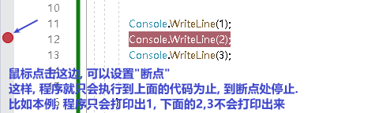
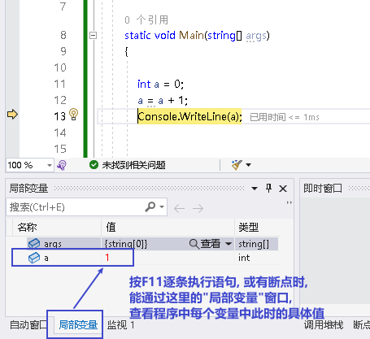

= 调试 bug
:sectnums:
:toclevels: 3
:toc: left

---

== 断点

---

== 逐条语句执行 : F11

---

== 查看局部变量中的值

---

== try... catch... finally...

[source, java]
----
try
{
    int[] arr = { 1, 2, 3 };
    Console.WriteLine(arr[3]); //这里会出错
}
catch (IndexOutOfRangeException e) //我们打算捕捉这个异常. 即创建一个IndexOutOfRangeException异常类型 的对象e
  {
    Console.WriteLine("出现数组下标越界错误");
    // throw; //这个throw语句不需要写. 你写的话,它就会强制抛出错误. 和程序自动检测到的"报错提示"就没区别了.
}
catch(Exception e) //可以连续写多条catch 来同时捕获多个可能的异常错误
{

}
  finally  // finally语句表示, 不管上面出现何种异常, 这条finally语句都会执行
{

}
----

.标题
====
例如：判断用户输入的数据,是否符合正确数据类型

[source, java]
----
int num1 = 0;
int num2 = 0;

Console.WriteLine("请输入两个数字, 每个一行");

while (true)  //使用while循环的目的是, 如果用户连续出错, 可以一直让用户输入, 来输入正确的数据. 而非只判断一次.
{
  try
  {
      num1 = Convert.ToInt32(Console.ReadLine());
      num2 = Convert.ToInt32(Console.ReadLine());
      break; //如果上面两条"读取输入"的语句, 没出错, 就用break跳出该while循环. 否则, 程序会一直循环要我们输入, 就无穷无尽了.
  }
  catch (FormatException e)  //如果你输入的不是数字, 就会这里捕获到输入类型错误.
  {
      Console.WriteLine("必须输入数字!");
  }
}

Console.WriteLine("sum is = {0}", num1 + num2);
----
====

---

