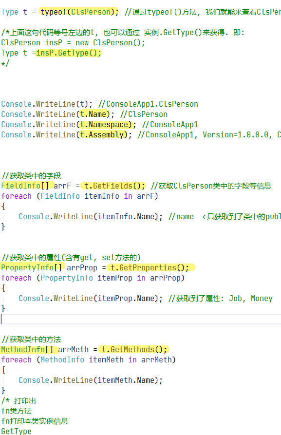
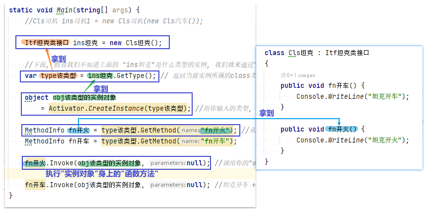
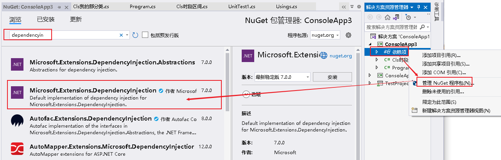

= 反射
:sectnums:
:toclevels: 3
:toc: left

---

== 反射

反射, 能查看一个类中本身的信息(就像x光线扫描一样, 内透)

[source, java]
----
// See https://aka.ms/new-console-template for more information

using System.Reflection;
using ConsoleApp1;

Type t = typeof(ClsPerson); //通过typeof()方法, 我们就能来查看ClsPerson类里面的信息了.

/*上面这句代码等号左边的t, 也可以通过 实例.GetType()来获得. 即:
ClsPerson insP = new ClsPerson();
Type t =insP.GetType();
*/

Console.WriteLine(t); //ConsoleApp1.ClsPerson
Console.WriteLine(t.Name); //ClsPerson
Console.WriteLine(t.Namespace); //ConsoleApp1
Console.WriteLine(t.Assembly); //ConsoleApp1, Version=1.0.0.0, Culture=neutral, PublicKeyToken=null

//获取类中的字段
FieldInfo[] arrF = t.GetFields(); //获取ClsPerson类中的字段等信息
foreach (FieldInfo itemInfo in arrF)
{
    Console.WriteLine(itemInfo.Name); //name  ←只获取到了类中的public字段, 因为private字段是私有的. 即使用反射也无法被访问到.
}

//获取类中的属性(含有get, set方法的)
PropertyInfo[] arrProp = t.GetProperties();
foreach (PropertyInfo itemProp in arrProp)
{
    Console.WriteLine(itemProp.Name); //获取到了属性: Job, Money
}

//获取类中的方法
MethodInfo[] arrMeth = t.GetMethods();
foreach (MethodInfo itemMeth in arrMeth)
{
    Console.WriteLine(itemMeth.Name);
}
/* 打印出
fn类方法
fn打印本类实例信息
GetType
ToString
Equals
GetHashCode
*/
----

C#编写的程序会编译成一个程序集(.DLL或.exe)，其中会包含元数据、编译代码和资源，通过反射可以获取到程序集中的信息.
通俗来讲，*反射就是我们在只知道一个对象的外部而不了解内部结构的情况下，可以知道这个对象的内部实现.*

三：通过Type类获取程序集、模块、类的相关信息
——Type类是一个抽象类，因此不能用他去实例化对象
——object类中定义了一个GetType方法，因此所有类都可以使用GetType()获取到某一个对象所属类的Type对象（有命名空间的话参数填命名空间.类名）
——通过Type对象可以获取到类中字段、属性、方法、构造函数等信息
——获取的时候可以通过BindingFlags筛选，注意BindingFlags.Static和BindingFlags.Instance这两个必须要使用一个，BindingFlags.NonPublic和BindingFlags.Public这两个必须要使用一个，默认是BindingFlags.Static|BindingFlags.Public|BindingFlags.Instance

得到一个Type类型对象有三种方法：object.GetType()、Type.GetType()、typeof()
使用object.GetType()必须先创建一个实例，而后两种不需要创建实例，但使用typeof运算符仍然需要知道类型的编译时信息，Type.GetType()静态方法不需要知道类型的编译时信息，所以是首选方法

1、什么是反射
        Reflection，中文翻译为反射。
        这是.Net中获取运行时类型信息的方式，.**Net的应用程序由几个部分：‘程序集(Assembly)’、‘模块(Module)’、‘类型(class)’组成，而反射提供一种编程的方式，让程序员可以在程序运行期获得这几个组成部分的相关信息，**例如：

Assembly类可以获得正在运行的装配件信息，也可以动态的加载装配件，以及在装配件中查找类型信息，并创建该类型的实例。
**Type类可以获得对象的类型信息，此信息包含对象的所有要素：方法、构造器、属性等等，**通过Type类可以得到这些要素的信息，并且调用之。
*MethodInfo包含方法的信息，通过这个类可以得到方法的名称、参数、返回值等，并且可以调用之。*
诸如此类，还有FieldInfo、EventInfo等等，这些类都包含在System.Reflection命名空间下。

命名空间与装配件的关系

2、命名空间与装配件的关系
        很多人对这个概念可能还是很不清晰，对于合格的.Net程序员，有必要对这点进行澄清。
        命名空间类似与Java的包，但又不完全等同，因为Java的包必须按照目录结构来放置，命名空间则不需要。

*装配件是.Net应用程序执行的最小单位，编译出来的.dll、.exe都是装配件。*

*装配件和命名空间的关系不是一一对应，也不互相包含，一个装配件里面可以有多个命名空间，一个命名空间也可以在多个装配件中存在*，这样说可能有点模糊，举个例子：

装配件A：
namespace  N1
{
      public  class  AC1  {…}
      public  class  AC2  {…}
}
namespace  N2
{
      public  class  AC3  {…}
      public  class  AC4{…}
}

装配件B：
namespace  N1
{
      public  class  BC1  {…}
      public  class  BC2  {…}
}
namespace  N2
{
      public  class  BC3  {…}
      public  class  BC4{…}
}

**这两个装配件中都有N1和N2两个命名空间，而且各声明了两个类，**这样是完全可以的，*然后我们在一个应用程序中引用装配件A，那么在这个应用程序中，我们能看到N1下面的类为AC1和AC2，N2下面的类为AC3和AC4。*

接着我们去掉对A的引用，加上对B的引用，那么我们在这个应用程序下能看到的N1下面的类变成了BC1和BC2，N2下面也一样。
*如果我们同时引用这两个装配件，那么N1下面我们就能看到四个类：AC1、AC2、BC1和BC2。*

到这里，我们可以清楚一个概念了，*命名空间只是说明一个类型是那个族的，比如有人是汉族、有人是回族；而装配件表明一个类型住在哪里，比如有人住在北京、有人住在上海；那么北京有汉族人，也有回族人，上海有汉族人，也有回族人，这是不矛盾的。*

上面我们说了，*装配件是一个类型居住的地方，那么在一个程序中要使用一个类，就必须告诉编译器这个类住在哪儿，编译器才能找到它，也就是说必须引用该装配件。*

那么**如果在编写程序的时候，也许不确定这个类在哪里，仅仅只是知道它的名称，就不能使用了吗？答案是可以，这就是反射了，就是在程序运行的时候提供该类型的地址，而去找到它。**
有兴趣的话，接着往下看吧。

3、运行期得到类型信息有什么用
        有人也许疑问，既然在开发时就能够写好代码，干嘛还放到运行期去做，不光繁琐，而且效率也受影响。
这就是个见仁见智的问题了，就跟早绑定和晚绑定一样，应用到不同的场合。有的人反对晚绑定，理由是损耗效率，但是很多人在享受虚函数带来的好处的时侯还没有意识到他已经用上了晚绑定。这个问题说开去，不是三言两语能讲清楚的，所以就点到为止了。
        我的看法是，晚绑定能够带来很多设计上的便利，合适的使用能够大大提高程序的复用性和灵活性，但是任何东西都有两面性，使用的时侯，需要再三衡量。

接着说，*运行期得到类型信息到底有什么用呢？*
还是举个例子来说明，*很多软件开发者喜欢在自己的软件中留下一些接口，其他人可以编写一些插件来扩充软件的功能，比如我有一个媒体播放器，我希望以后可以很方便的扩展识别的格式，那么我声明一个接口：*

public  interface  IMediaFormat
{
string  Extension  {get;}
Decoder  GetDecoder();
}

这个接口中包含一个Extension属性，这个属性返回支持的扩展名，另一个方法返回一个解码器的对象（这里我假设了一个Decoder的类，这个类提供把文件流解码的功能，扩展插件可以派生之），通过解码器对象我就可以解释文件流。
那么我规定所有的解码插件都必须派生一个解码器，并且实现这个接口，在GetDecoder方法中返回解码器对象，并且将其类型的名称配置到我的配置文件里面。
这样的话，我就不需要在开发播放器的时侯知道将来扩展的格式的类型，只需要从配置文件中获取现在所有解码器的类型名称，而动态的创建媒体格式的对象，将其转换为IMediaFormat接口来使用。

这就是一个反射的典型应用。
4、如何使用反射获取类型
        首先我们来看如何获得类型信息。
        *获得类型信息有两种方法，一种是得到实例对象*
        这个时侯我仅仅是得到这个实例对象，得到的方式也许是一个object的引用，也许是一个接口的引用，但是我并不知道它的确切类型，我需要了解，那么就可以通过调用System.Object上声明的方法GetType来获取实例对象的类型对象，比如在某个方法内，我需要判断传递进来的参数是否实现了某个接口，如果实现了，则调用该接口的一个方法：

public  void  Process(  object  processObj  )
{
Type  t  =  processsObj.GetType();
if(  t.GetInterface(“ITest”)  !=null  )
                    …
}
*另外一种获取类型的方法是通过Type.GetType以及Assembly.GetType方法*，如：
              Type  t  =  Type.GetType(“System.String”);
        需要注意的是，前面我们讲到了命名空间和装配件的关系，要查找一个类，必须指定它所在的装配件，或者在已经获得的Assembly实例上面调用GetType。
        本装配件中类型可以只写类型名称，另一个例外是mscorlib.dll，这个装配件中声明的类型也可以省略装配件名称（.Net装配件编译的时候，默认都引用了mscorlib.dll，除非在编译的时候明确指定不引用它），比如：
          System.String是在mscorlib.dll中声明的，上面的Type  t  =  Type.GetType(“System.String”)是正确的
          System.Data.DataTable是在System.Data.dll中声明的，那么：
Type.GetType(“System.Data.DataTable”)就只能得到空引用。
          必须：
Type  t  =  Type.GetType("System.Data.DataTable,System.Data,Version=1.0.3300.0,  Culture=neutral,  PublicKeyToken=b77a5c561934e089");
          这样才可以，大家可以看下面这个帖子：
                http://expert.csdn.net/Expert/to ... 2.xml?temp=.1919977
          qqchen的回答很精彩

5、如何根据类型来动态创建对象
        System.Activator提供了方法来根据类型动态创建对象，比如创建一个DataTable：

Type  t  =  Type.GetType("System.Data.DataTable,System.Data,Version=1.0.3300.0,  Culture=neutral,  PublicKeyToken=b77a5c561934e089");
DataTable  table  =  (DataTable)Activator.CreateInstance(t);
例二：根据有参数的构造器创建对象

复制代码
namespace  TestSpace
{
  public  class  TestClass
      {
      private  string  _value;
      public  TestClass(string  value)
    {
      _value=value;
      }
  }
}
…
Type  t  =  Type.GetType(“TestSpace.TestClass”);
Object[]  constructParms  =  new  object[]  {“hello”};  //构造器参数
TestClass  obj  =  (TestClass)Activator.CreateInstance(t,constructParms);
复制代码
把参数按照顺序放入一个Object数组中即可

6、如何获取方法以及动态调用方法

复制代码
namespace  TestSpace
{
      public  class  TestClass  {
          private  string  _value;
          public  TestClass()  {
          }
          public  TestClass(string  value)  {
                _value  =  value;
          }
          public  string  GetValue(  string  prefix  )  {
          if(  _value==null  )
          return  "NULL";
          else
            return  prefix+"  :  "+_value;
            }
            public  string  Value  {
set  {
_value=value;
}
get  {
if(  _value==null  )
return  "NULL";
else
return  _value;
}
            }
      }
}
复制代码
上面是一个简单的类，包含一个有参数的构造器，一个GetValue的方法，一个Value属性，我们可以通过方法的名称来得到方法并且调用之，如：

复制代码
//获取类型信息
Type  t  =  Type.GetType("TestSpace.TestClass");
//构造器的参数
object[]  constuctParms  =  new  object[]{"timmy"};
//根据类型创建对象
object  dObj  =  Activator.CreateInstance(t,constuctParms);
//获取方法的信息
MethodInfo  method  =  t.GetMethod("GetValue");
//调用方法的一些标志位，这里的含义是Public并且是实例方法，这也是默认的值
BindingFlags  flag  =  BindingFlags.Public  |  BindingFlags.Instance;
//GetValue方法的参数
object[]  parameters  =  new  object[]{"Hello"};
//调用方法，用一个object接收返回值
object  returnValue  =  method.Invoke(dObj,flag,Type.DefaultBinder,parameters,null);
复制代码
属性与方法的调用大同小异，大家也可以参考MSDN

7、动态创建委托
        委托是C#中实现事件的基础，有时候不可避免的要动态的创建委托，实际上委托也是一种类型：System.Delegate，所有的委托都是从这个类派生的
        System.Delegate提供了一些静态方法来动态创建一个委托，比如一个委托：

复制代码
namespace  TestSpace  {
      delegate  string  TestDelegate(string  value);
      public  class  TestClass  {
public  TestClass()  {
                  }
                  public  void  GetValue(string  value)  {
                          return  value;
                  }
        }
}
复制代码
使用示例：

TestClass  obj  =  new  TestClass();
//获取类型，实际上这里也可以直接用typeof来获取类型
Type  t  =  Type.GetType(“TestSpace.TestClass”);
//创建代理，传入类型、创建代理的对象以及方法名称
TestDelegate  method  =  (TestDelegate)Delegate.CreateDelegate(t,obj,”GetValue”);
String  returnValue  =  method(“hello”);

.标题
====
我的例子:

[,subs=+quotes]
----

namespace ConsoleApp3
{
    interface Itf武器类接口
    {
        void fn开火();
    }

    interface Itf坦克类接口 : Itf车类接口, Itf武器类接口 //接口, 可以继承自多个接口
     {

    }

    class Cls坦克: Itf坦克类接口
    {
        public void fn开车() {
            Console.WriteLine("坦克开车");
        }

        public void fn开火() {
            Console.WriteLine("坦克开火");
        }
    }

    internal class Program
    {
        static void Main(string[] args) {

            //Cls司机 ins司机1 = new Cls司机(new Cls汽车());

            Itf坦克类接口 ins坦克 = new Cls坦克();

            *//下面, 假设我们不知道上面的 "ins坦克"是什么类型的实例, 我们就来通过"反射"(相当于反编译)功能, 来从内存中, 分析出该实例所属的类型, 并拿到该类型里面拥有的函数方法, 并通过该实例, 来调用这些方法.*
            *var type该类型 =  ins坦克.GetType(); // 返回当前实例所属的class类型.*

            *object obj该类型的实例对象 = Activator.CreateInstance(type该类型); //用你输入的类型, 来创建出该类的实例*

            *MethodInfo fn开火 = type该类型.GetMethod("fn开火"); //从该类型身上, 来查找(通过你输入的方法名字)它里面具有的公开方法(函数).*
            MethodInfo fn开车 = type该类型.GetMethod("fn开车");

            *fn开火.Invoke(obj该类型的实例对象,null); //调用你的"obj该类型的实例对象"身上的"fn开火"方法. 第二个参数, 是你要传给"fn开火"函数中的参数. 没有的话, 就写 null.*

            fn开车.Invoke(obj该类型的实例对象, null); //坦克开车 ← 正确输出.

        }
    }
}
----

====

'''

== 依赖注入

官方帮我们封装好了的"反射", 其中最重要的功能, 就是"依赖注入".

依赖注入, 要借助于"依赖注入框架", 需要安装 microsoft.Extensions.DependencyInjection 包

然后, 代码这样写:

[,subs=+quotes]
----
*var insSc容器 = new ServiceCollection(); //ServiceCollection()会返回给我们一个容器Container实例.*

*insSc容器.AddScoped(typeof(Itf坦克类接口),typeof(Cls坦克)); //第一个参数是"接口", 第二个参数是"实现了此接口的类". Typeof代表:动态的拿到这个类的信息.*

*var insSp服务提供者 = insSc容器.BuildServiceProvider(); //创建一个"服务提供者"*

//下面, 就能让"服务提供者"给我们服务了
*Itf坦克类接口 ins坦克 = insSp服务提供者.GetService<Itf坦克类接口>(); //从服务提供者中, 拿到<T>泛型这个具体类型的实例.*

*ins坦克.fn开车(); //输出成功*
ins坦克.fn开火();
----

'''

== 更松的耦合 -- 插件式编程

https://www.bilibili.com/video/BV1Ns411n7Pg?p=29&vd_source=52c6cb2c1143f8e222795afbab2ab1b5

1.02.30

