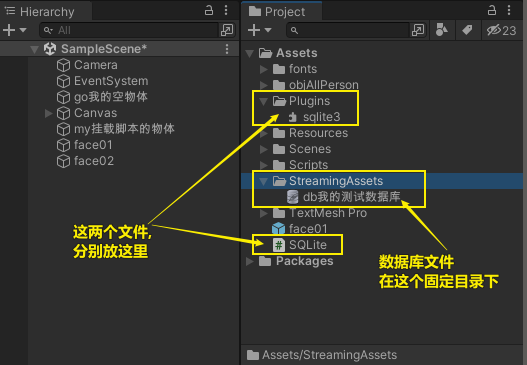
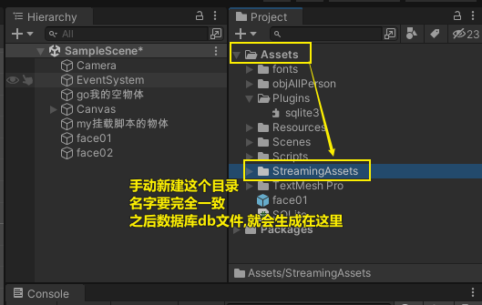
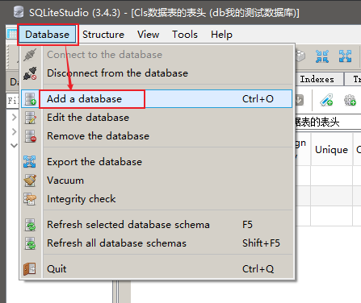
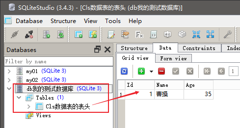

= sqlite 数据库
:sectnums:
:toclevels: 3
:toc: left
''''

== 官方文档

https://www.sqlite.org/index.html

网上的代码操作教程 https://www.cnblogs.com/guangzhiruijie/p/15906008.html

SQLite，是一款轻型的关系型数据库。它的设计目标是嵌入式。

它能够支持Windows/Linux/Unix等等主流的操作系统，同时能够跟很多程序语言相结合，比如 C++、C#、Object-C、PHP、Java等。

手游开发，在手机上使用SQLite 存储数据是很方便的。

== sqlite 下载

https://www.sqlite.org/download.html

1.下载下面两个文件

image:/img/003.png[]

2.创建文件夹 C:\sqlite，并在此文件夹下解压上面两个压缩文件，将得到 sqlite3.def、sqlite3.dll 和 sqlite3.exe 文件。

3.然后, 我的电脑右击->属性, 搜索"环境变量",

image:/img/004.png[]

到这一步，安装和配置已经完成了，接下来就要验证是否安装成功了。打开 CMD 命令版，输入 sqlite3，出现版本信息，则表示安装成功. +
如果输入出现提示 sqlite3 不是内部命令，那就是环境变量没有生效，配置环境变量后要重新启动电脑才能生效.

image:/img/005.png[]

新建一个文本将文件, 扩展名改为 db ，这样我们就能本地访问这个数据库.

== visual studio 中的安装

安装 System.Data.SQLite 库，用于在C#中操作SQLite的dll文件。

image:/img/002.png[]

image:/img/001.png[]

'''

== 可视化工具 SQLiteStudio

官网下载 +
https://www.sqlitestudio.pl/

[options="autowidth"]
|===
|Header 1 |Header 2

|添加数据库
|

|创建你表格的骨架
|image:/img/008.png[]

image:/img/015.png[]

image:/img/009.png[]

|添加具体数据
|image:/img/010.png[]

|===

'''

== 第一步教程

[options="autowidth"]
|===
|Header 1 |Header 2

|查看各种重要的 SQLite "点命令" -> 输入 `.help`
|image:/img/006.png[]

|查看 SQLite 命令提示符的默认设置 -> `.show`
|image:/img/007.png[]

|===

'''

== SQLite4Unity3d 的用法

在Unity3D 中使用 SQLite, 我们这里的使用的SQLite并非是通常意义上的SQLite.NET, 而是经过移植后的Mono.Data.Sqlite. 因为Unity3D基于Mono.

下载地址

https://github.com/robertohuertasm/SQLite4Unity3d/blob/master/README.md

- 将SQLite.cs 放在工程里
- sqlite3.dll 放在工程的 Plugins 文件夹中

然后, 在project工程目录中, 新建 StreamingAssets目录. 你的数据库db文件, 之后会生成在这里.

=== 增

==== 创建数据库, 并创建表

把下面的脚本, 挂载到一个空物体上来运行

[,subs=+quotes]
----
using System.Collections;
using System.Collections.Generic;
using UnityEditor.MemoryProfiler;
using UnityEngine;
using SQLite4Unity3d;
using System;

//下面的类, 其中的字段, 就是我们设置的表头
*public class Cls数据表的表头{*

    [PrimaryKey, AutoIncrement] //设置主键 自动增长
    public int Id { get; set; }
    public string Name { get; set; }
    public int Age { get; set; }

    public override string ToString() {
        return $"Person: Id={Id}, Name={Name}, Age={Age}";
    }
}

*public class Cls连接sqlite数据库 : MonoBehaviour*
{
    // Start is called before the first frame update
    void Start()
    {
        //参数1.*数据库地址，一般放在StreamingAssets文件夹中*，2.开启读写和创建数据库权限
        Debug.Log(*Application.streamingAssetsPath*); //打印出 C:/learn_unity/My project 2d/Assets/StreamingAssets ← Path数据库文件，一定是StreamingAssets文件夹下 填写的路径文件不需要填写.db后缀

        //创建或打开数据库
        *SQLiteConnection con我连接的数据库 = new SQLiteConnection(Application.streamingAssetsPath + "/db我的测试数据库.db", SQLiteOpenFlags.ReadWrite | SQLiteOpenFlags.Create);*

        //创建表
        *con我连接的数据库.CreateTable<Cls数据表的表头>();//根据表头, 创建表. 这张表的名字, 其实就是你表头类的类名. 本例即, 你创建出的表, 就叫"Cls数据表的表头"这个名字.*

        //插件作者封装了几个方法，可以让我们方便的对数据库进行插入操作

        *//给表中添加数据行*
        *Cls数据表的表头 ins表头 = new Cls数据表的表头();*
        ins表头.Id = 1;
        ins表头.Name = "曹操";
        ins表头.Age = 35;
        *con我连接的数据库.Insert(ins表头); //将表头类的实例, 插入到表中.*

    }

    // Update is called once per frame
    void Update()
    {

    }

}

----

现在, 我们打开SQLiteStudio 软件, 添加我们上面创建的表.

'''

==== 增添一条数据

[,subs=+quotes]
----
//也可以这样添加数据:
var line新行 = new Cls数据表的表头 {
    Id = 2,
    Name = "诸葛亮",
    Age = 5,
};
con我连接的数据库.Insert(line新行);
----

'''

==== 批量增添数据

[,subs=+quotes]
----

----

'''

=== 删

==== 删除数据

[,subs=+quotes]
----
//删除数据
*var data要删除的数据 = con我连接的数据库.Table<Cls数据表的表头>().Where(_ => _.Name == "曹操").FirstOrDefault();* //先找到你要删除的数据, 比如, 找到Name字段的值是"曹操"的那条数据

con我连接的数据库.Delete(data要删除的数据); //删除该条数据
----

'''

==== 根据主键, 删除数据

[,subs=+quotes]
----
//一句话就搞定
*con我连接的数据库.Delete<Cls数据表的表头>(5);* //删除主键=5 的那条数据
----

'''

==== 删除表中全部数据, 清空表

[,subs=+quotes]
----
//删除表中全部数据
con我连接的数据库.DeleteAll<Cls数据表的表头>();
----

'''

=== 改

更新数据和删除数据的使用方法一致: 先获得数据信息，然后进行更新. 注意: 必须有主键存在, 才能更新数据.

[,subs=+quotes]
----
*var data找到的数据 =con我连接的数据库.Table<Cls数据表的表头>().Where(_=>_.Name=="刘备").FirstOrDefault();*

data找到的数据.Age = 60; //将找到的那条(那行)数据中的Age字段的值, 改成60

*con我连接的数据库.Update(data找到的数据); //更新表中的数据*
----

'''

=== 查

==== 按条件查找

上面我们获取数据的方法, 就是一种查找，用来查找一条数据. +
还有条件查找, 用来查找多条数据:

[,subs=+quotes]
----
//查找所有 Age字段的值 <=10 的数据
*var arrData找到的数据 = con我连接的数据库.Table<Cls数据表的表头>().Where(_ => _.Age <= 10);*

foreach (var data单条数据 in arrData找到的数据) {
    Debug.Log(data单条数据.Name);
}
----

'''

==== 查找表中所有的数据

[,subs=+quotes]
----
*var arrData找到的数据 = con我连接的数据库.Table<Cls数据表的表头>(); //不加 where条件, 就是查找全部的数据*

foreach (var item in arrData找到的数据) {
    Debug.Log(item.Name);
}
----

'''

==== 将数据表中的所有元素, 转成 C#中的 类的实例, 再全放入一个List中.

[,subs=+quotes]
----
var arrData找到的数据 = con我连接的数据库.Table<Cls数据表的表头>(); //先找到表中的全部数据

*List<Cls数据表的表头> list全部表头行数据 =  new List<Cls数据表的表头>(arrData找到的数据); //将数据表中的每条数据, 数据类型转换为"Cls数据表的表头"类型, 并放到 List列表中.*

foreach (var 单个Ins表头 in list全部表头行数据) {
    Debug.Log(单个Ins表头.ToString());
}
----

'''

