= 坦克大战项目
:sectnums:
:toclevels: 3
:toc: left

---

== 创建一个"游戏逻辑"线程

文件框架如下

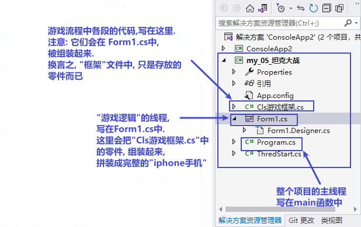

游戏各段, 零件代码,  写在 "Cls游戏框架.cs"类中 (这个文件, 相当于"零件供应商") :

[source, java]
----
using System;
using System.Collections.Generic;
using System.Linq;
using System.Text;
using System.Threading.Tasks;

namespace my_05_坦克大战
{
    internal class Cls游戏框架
    {

        //游戏开始时, 会执行的动作, 写在下面的方法里
        public static void fn游戏开始时的动作() //方法名可写成 fnStart()
        {
            Console.WriteLine("游戏开始时的动作...");
        }

        //游戏不断更新时, 会执行的动作, 写在下面的方法里(比如, 不断重新绘制新图片, 以形成动画; 不断检测敌人的行动, 以决定玩家角色的策略). 这个就和帧率FPS有关
        public static void fn游戏不断更新时会执行的动作() //方法名可写成 fnUpdate()
        {
            Console.WriteLine("游戏在不断更新,执行xxx动作...");
        }

    }
}
----

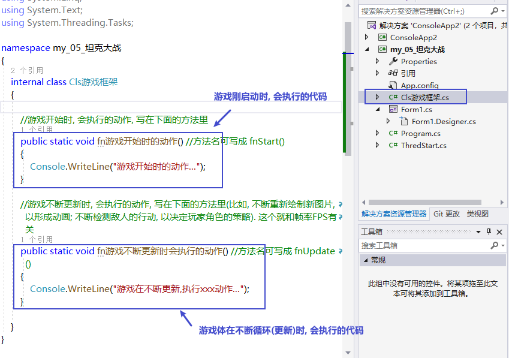

零件组装工厂(相当于富士康), 即 From1.cs 中的内容, 如下:

[source, java]
----
using System;
using System.Collections.Generic;
using System.ComponentModel;
using System.Data;
using System.Drawing;
using System.Linq;
using System.Text;
using System.Threading;
using System.Threading.Tasks;
using System.Windows.Forms;

namespace my_05_坦克大战
{
    public partial class Form1 : Form
    {
        public Form1()
        {
            InitializeComponent();

            //窗口居中显示
            this.StartPosition = FormStartPosition.CenterScreen;

            //我们创建一个线程. 来运行游戏的主内容. 为什么要创建新线程来运行它? 因为这样就不会阻塞我们对本Form1类(比如构造方法)等的运行了.
            //注意, 这个代码是写在 Form1.cs 文件中的.
            Thread t线程1 = new Thread(new ThreadStart(fn游戏主线程));
            t线程1.Start();

        }

        //创建一个静态方法. 就可以直接用类名来调用它了, 而不需要创建出实例对象再来调用.
        private static void fn游戏主线程() //注意, 这里是"游戏逻辑"的主线程, 而不是整个"坦克大战"项目的主线程. 后者是写在Main函数里的. 换言之, 这里的 "fn游戏主线程", 只是在 "Main函数"主线程下, 创建出的一个子线程而已.  子线程不结束, 一直在运行的话, 主线程也不会被结束.
        {
            Cls游戏框架.fn游戏开始时的动作(); //我们来调用另一个类"Cls游戏框架"中的静态方法. 直接用类名来调用.

            int time帧率睡眠 = 1000 / 60;   //我们不需要让游戏毫秒级更新, 只需让它达到60帧就行了, 即1/60秒内, 更新一次. 我们先在这里设置好这个"cpu睡眠时间", 下面会用到

            //下面,就持续不断地来执行"更新函数"会做的动作
            while (true)
            {
                Cls游戏框架.fn游戏不断更新时会执行的动作();
                Thread.Sleep(time帧率睡眠);
            }
        }

    }
}

----

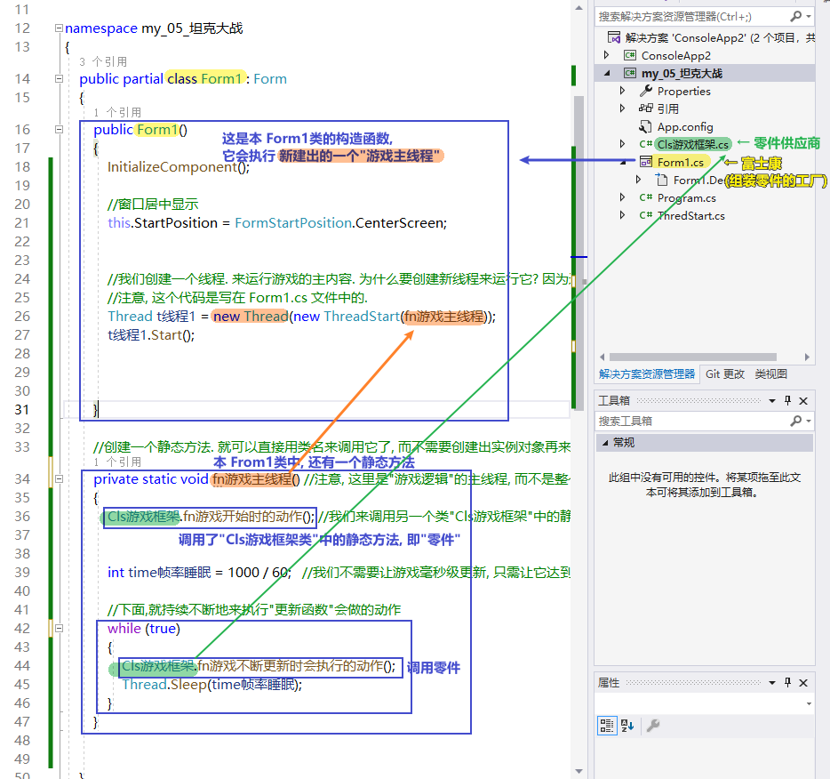

但是, 上面的代码, 还有个问题, 即: 即使我们把窗体关掉了, 游戏线程依然在运行. 所以 我们要再添加一个监控事件, 即: 一旦监测到窗体被关闭了, 就让游戏线程也结束.

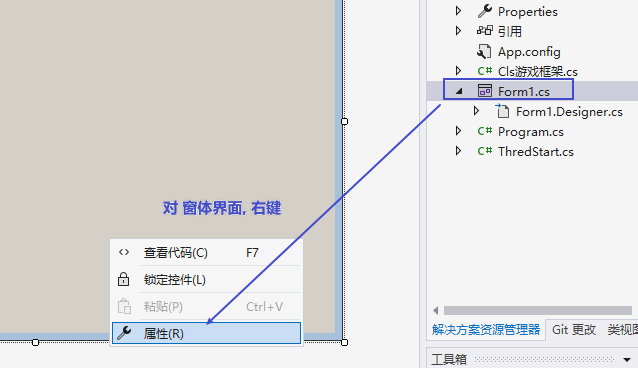

找到 FormClosed 事件, 双击后面空白处, 会自动添加代码到 Form1.cs文件中

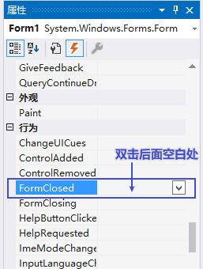

现在, 新的 From1.cs 代码如下:

[source, java]
----
using System;
using System.Collections.Generic;
using System.ComponentModel;
using System.Data;
using System.Drawing;
using System.Linq;
using System.Text;
using System.Threading;
using System.Threading.Tasks;
using System.Windows.Forms;

namespace my_05_坦克大战
{
    public partial class Form1 : Form
    {
        Thread t线程1; // 先申明一个 Thread类的变量

        //下面是本Form1类的构造函数
        public Form1()
        {
            InitializeComponent();

            //窗口居中显示
            this.StartPosition = FormStartPosition.CenterScreen;

            //我们创建一个线程. 来运行游戏的主内容. 为什么要创建新线程来运行它? 因为这样就不会阻塞我们对本Form1类(比如构造方法)等的运行了.
            //注意, 这个代码是写在 Form1.cs 文件中的.
            t线程1 = new Thread(new ThreadStart(fn游戏主线程));
            t线程1.Start();

        }

        //创建一个静态方法. 就可以直接用类名来调用它了, 而不需要创建出实例对象再来调用.
        private static void fn游戏主线程() //注意, 这里是"游戏逻辑"的主线程, 而不是整个"坦克大战"项目的主线程. 后者是写在Main函数里的. 换言之, 这里的 "fn游戏主线程", 只是在 "Main函数"主线程下, 创建出的一个子线程而已.  子线程不结束, 一直在运行的话, 主线程也不会被结束.
        {
            Cls游戏框架.fn游戏开始时的动作(); //我们来调用另一个类"Cls游戏框架"中的静态方法. 直接用类名来调用.

            int time帧率睡眠 = 1000 / 60;   //我们不需要让游戏毫秒级更新, 只需让它达到60帧就行了, 即1/60秒内, 更新一次. 我们先在这里设置好这个"cpu睡眠时间", 下面会用到

            //下面,就持续不断地来执行"更新函数"会做的动作
            while (true)
            {
                Cls游戏框架.fn游戏不断更新时会执行的动作();
                Thread.Sleep(time帧率睡眠);
            }
        }

        //下面这个, 就是针对 FormClosed事件, 会执行的方法函数.
        private void Form1_FormClosed(object sender, FormClosedEventArgs e)
        {
            t线程1.Abort();  //即, 一旦监测到窗体被关闭了, 我们也让游戏线程关闭.
        }
    }
}
----

即:

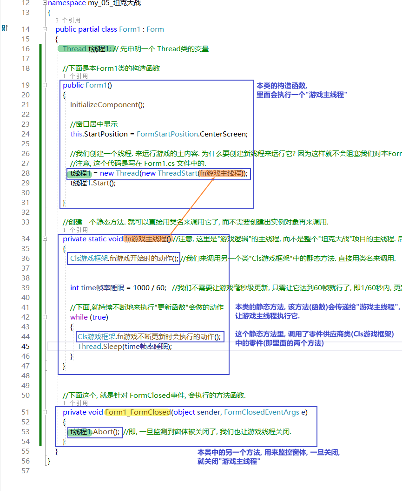

---

== 将窗体的背景色, 改成黑色

主要修改两个文件中的代码:
[source, java]
----
using System;
using System.Collections.Generic;
using System.Drawing;
using System.Linq;
using System.Text;
using System.Threading.Tasks;

namespace my_05_坦克大战
{
    internal class Cls游戏框架
    {

        public static Graphics ins游戏框架中的画布; //先申明一个画布变量, 还未赋具体值(还未用指针指向具体的画布类实例对象)

        //游戏开始时, 会执行的动作, 写在下面的方法里
        public static void fn游戏开始时的动作() //方法名可写成 fnStart()
        {
            Console.WriteLine("游戏开始时的动作...");
        }

        //游戏不断更新时, 会执行的动作, 写在下面的方法里(比如, 不断重新绘制新图片, 以形成动画; 不断检测敌人的行动, 以决定玩家角色的策略). 这个就和帧率FPS有关
        public static void fn游戏不断更新时会执行的动作() //方法名可写成 fnUpdate()
        {
            Console.WriteLine("游戏在不断更新,执行xxx动作...");
        }

    }
}
----

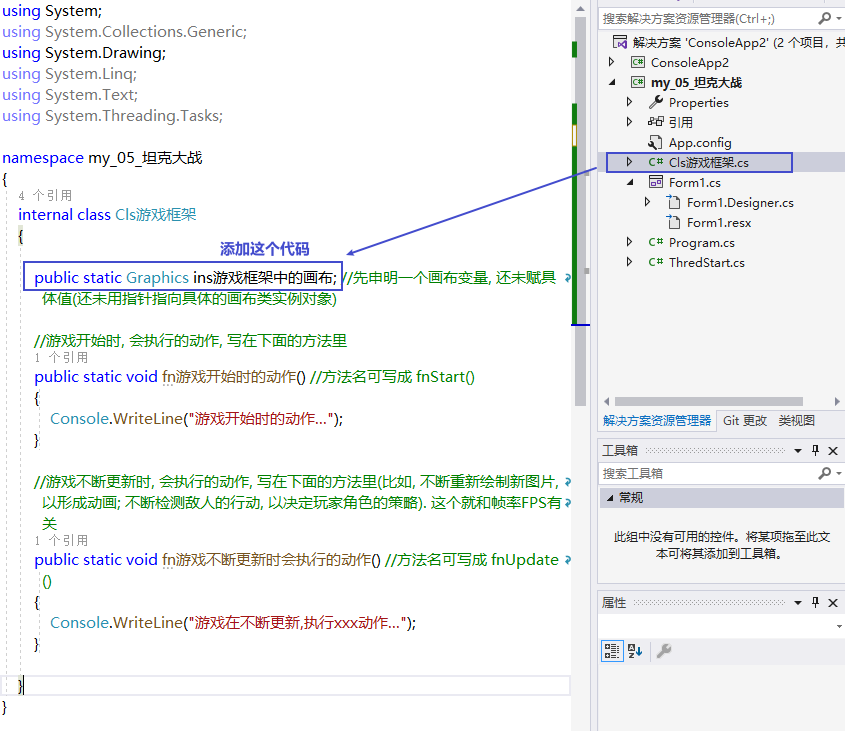

在From1.cs文件中
[source, java]
----
using System;
using System.Collections.Generic;
using System.ComponentModel;
using System.Data;
using System.Drawing;
using System.Linq;
using System.Text;
using System.Threading;
using System.Threading.Tasks;
using System.Windows.Forms;

namespace my_05_坦克大战
{
    public partial class Form1 : Form
    {
        private Thread t线程1; // 先申明一个 Thread类的变量
        private Graphics ins画布;  //申明画布变量

        //下面是本Form1类的"构造函数"
        public Form1()
        {
            InitializeComponent();

            //窗口居中显示
            this.StartPosition = FormStartPosition.CenterScreen;

            //创建画布实例
            ins画布 = this.CreateGraphics();
            Cls游戏框架.ins游戏框架中的画布 = ins画布; //将本Form1类中创建的画布实例, 让"Cls游戏框架"类中的画布实例, 来指针指向它.

            //我们创建一个线程. 来运行游戏的主内容. 为什么要创建新线程来运行它? 因为这样就不会阻塞我们对本Form1类(比如构造方法)等的运行了.
            //注意, 这个代码是写在 Form1.cs 文件中的.
            t线程1 = new Thread(new ThreadStart(fn游戏主线程));
            t线程1.Start();

        }

        //创建一个静态方法. 就可以直接用类名来调用它了, 而不需要创建出实例对象再来调用.
        private static void fn游戏主线程() //注意, 这里是"游戏逻辑"的主线程, 而不是整个"坦克大战"项目的主线程. 后者是写在Main函数里的. 换言之, 这里的 "fn游戏主线程", 只是在 "Main函数"主线程下, 创建出的一个子线程而已.  子线程不结束, 一直在运行的话, 主线程也不会被结束.
        {
            Cls游戏框架.fn游戏开始时的动作(); //我们来调用另一个类"Cls游戏框架"中的静态方法. 直接用类名来调用.

            int time帧率睡眠 = 1000 / 60;   //我们不需要让游戏毫秒级更新, 只需让它达到60帧就行了, 即1/60秒内, 更新一次. 我们先在这里设置好这个"cpu睡眠时间", 下面会用到

            //下面,就持续不断地来执行"更新函数"会做的动作
            while (true)
            {
                Cls游戏框架.ins游戏框架中的画布.Clear(Color.Black); // Clear()方法, 用来用某个颜色清空画布

                Cls游戏框架.fn游戏不断更新时会执行的动作();
                Thread.Sleep(time帧率睡眠);
            }
        }

        //下面这个, 就是针对 FormClosed事件, 会执行的方法函数.
        private void Form1_FormClosed(object sender, FormClosedEventArgs e)
        {
            t线程1.Abort();  //即, 一旦监测到窗体被关闭了, 我们也让游戏线程关闭.
        }
    }
}
----

即, 添加下面蓝色框出的代码

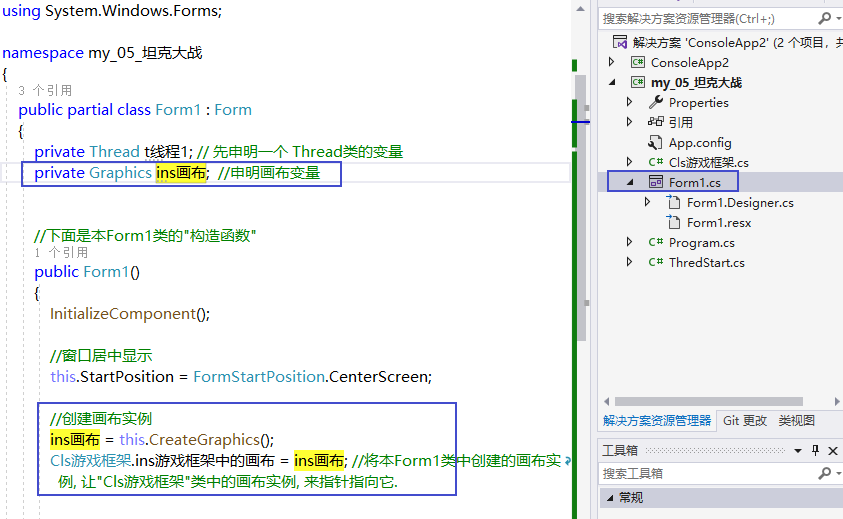

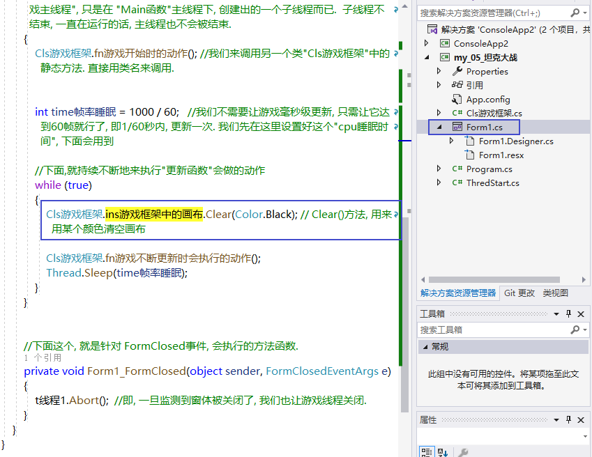

窗体就能变成黑色背景

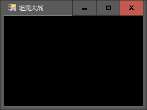

---

== 完成游戏中, 各种物体的类的创建

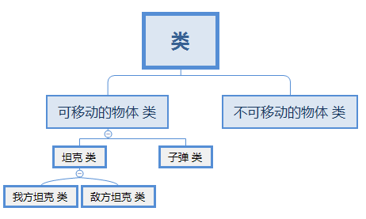

文件框架结构是:

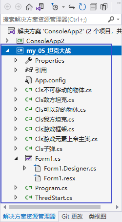

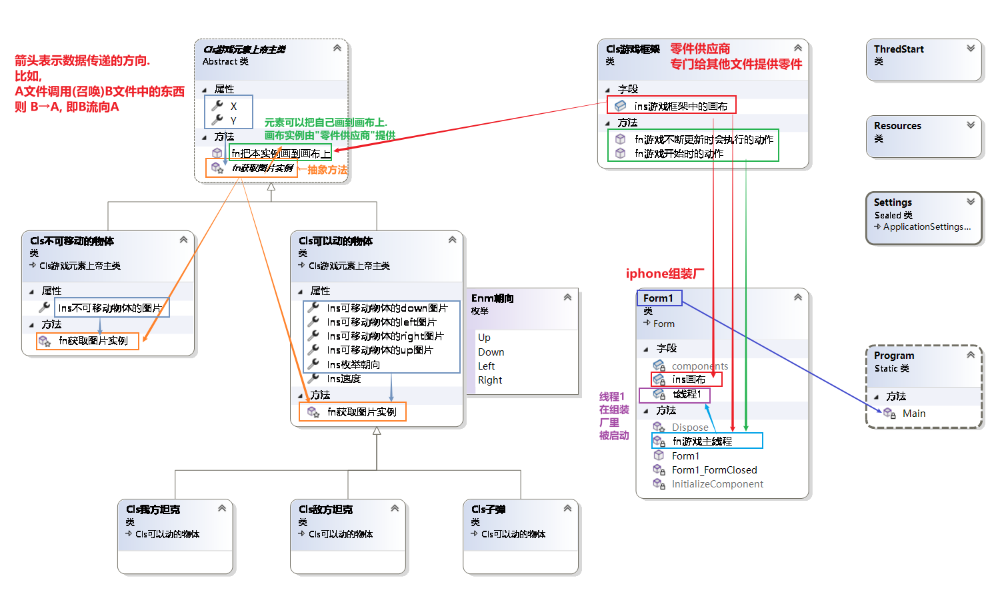

==== 上帝主类:
[source, java]
----
using System;
using System.Collections.Generic;
using System.Drawing;
using System.Linq;
using System.Text;
using System.Threading.Tasks;
using System.Windows.Forms;

namespace my_05_坦克大战
{
    abstract internal class Cls游戏元素上帝主类 //这里我们把它定义成"抽象类", 因为该类里面有"抽象方法"存在. 而"抽象方法"只能存在于"抽象类"中.
    {

        // 所有的元素, 都有x,y坐标属性
        public int X { get; set; }  //添加变量x, 及其属性(get,set方法). 这样, 这句的x, 就直接写成大小的X了.
        public int Y { get; set; }

        // 这里创建一个抽象方法. 因为, 对于可以动的物体, 我们需要先获取该物体的坐标位置, 才能在画布上来画它. 所以这里, 我们不能把这里面的" fn获取图片实例"函数写实, 只能让子类取完成它. 即让子类来具体实现 " fn获取图片实例"函数.
        //因为抽象方法，必须存在于抽象类当中. 所以这里, 我们必须把本"Cls游戏元素上帝主类"也改成抽象类.
        //(不过, 抽象类中不一定全部是抽象方法, 我们可以在里面写上普通方法，有实现的虚方法或者没有实现的虚方法都可以。另外, 父类的虚方法可以实现(有方法体)，也可以不实现（没有方法体）。而抽象方法必须通过子类的重写来实现。)
        //(抽象类可以被实例化，但不能通过普通的实例化new，它只能通过父类的应用指向子类的实例来间接的实例化子类。)
        protected abstract Image fn获取图片实例(); //抽象方法

        //所有的元素, 还有共同的把自己绘制在画布上的功能
        public void fn把本实例画到画布上()
        {
            Graphics ins画布 = Cls游戏框架.ins游戏框架中的画布; //创建一个画布类的变量, 指针指向 'Cls游戏框架类"中的画布实例.
            ins画布.DrawImage(fn获取图片实例(), X,Y); //DrawImage()方法, 接收3个参数, 第一个参数是要画在画布上的"图片实例对象". 这里会由" fn获取图片实例()"函数(方法)来得到.  X,Y 这两个参数, 就是所有物体元素都会有的坐标值. 即本"Cls游戏元素上帝主类"中定义的 X和Y两个属性的值.
        }

    }
}
----

==== "不可移动物体"类

[source, java]
----
using System;
using System.Collections.Generic;
using System.Drawing;
using System.Linq;
using System.Text;
using System.Threading.Tasks;

namespace my_05_坦克大战
{
    internal class Cls不可移动的物体:Cls游戏元素上帝主类 //继承自"上帝类"
    {
        public Image Ins不可移动物体的图片 { get; set; }   //申明一个Image类的变量, 尚未指针指向任何实例对象.

        protected override Image fn获取图片实例()  //具体实现父类中定义的抽象方法
        {
            return Ins不可移动物体的图片;
        }
    }
}
----

==== "可移动物体"类

[source, java]
----
using System;
using System.Collections.Generic;
using System.Drawing;
using System.Linq;
using System.Text;
using System.Threading.Tasks;

namespace my_05_坦克大战
{

    //定义一个枚举类型, 用来表示"朝向"的4个方位
    enum Enm朝向
    {
        Up, Down, Left, Right
    }

    internal class Cls可以动的物体 : Cls游戏元素上帝主类
    {
        //因为可移动物体, 需要四张图来分布显示它们的: 向上, 向下,向左, 向右 的样子.所以我们这里创建4个 Image对象 (或 Bitmap对象也可以).
        public Bitmap Ins可移动物体的up图片 { get; set; }
        public Bitmap Ins可移动物体的down图片 { get; set; }
        public Bitmap Ins可移动物体的left图片 { get; set; }
        public Bitmap Ins可移动物体的right图片 { get; set; }

        //可移动物体, 还有"朝向"属性, 它到底是面向东西南北哪个方向?
        public Enm朝向 Ins枚举朝向 { get; set; }  //创建一个"朝向"枚举类的变量

        //速度属性
        public int Ins速度 { get; set; }

        //具体实现父类中定义的抽象方法
        protected override Image fn获取图片实例()
        {
            switch (Ins枚举朝向)
            {
                case Enm朝向.Up:
                    return Ins可移动物体的up图片;
                case Enm朝向.Down:
                    return Ins可移动物体的down图片;
                case Enm朝向.Left:
                    return Ins可移动物体的left图片;
                case Enm朝向.Right:
                    return Ins可移动物体的right图片;
            }

            return Ins可移动物体的up图片; //如果上面的switch中的条件都不满足,就返回"Ins可移动物体的up图片". 这句代码一定要写, 否则vs会默认你 switch没有 如同"有if 却没有 else功能"的语句, 而报错.
        }

    }
}

----

==== 可移动:  我方坦克类

[source, java]
----
using System;
using System.Collections.Generic;
using System.Linq;
using System.Text;
using System.Threading.Tasks;

namespace my_05_坦克大战
{
    internal class Cls我方坦克:Cls可以动的物体  //继承自"可移动物体"类
    {

    }
}
----

==== 可移动: 敌方坦克类

[source, java]
----
using System;
using System.Collections.Generic;
using System.Linq;
using System.Text;
using System.Threading.Tasks;

namespace my_05_坦克大战
{
    internal class Cls敌方坦克:Cls可以动的物体
    {

    }
}
----

==== 可移动:  子弹类

[source, java]
----
using System;
using System.Collections.Generic;
using System.Linq;
using System.Text;
using System.Threading.Tasks;

namespace my_05_坦克大战
{
    internal class Cls子弹 : Cls可以动的物体
    {

    }
}
----

==== 游戏框架(零件供应商)类

[source, java]
----
using System;
using System.Collections.Generic;
using System.Drawing;
using System.Linq;
using System.Text;
using System.Threading.Tasks;

namespace my_05_坦克大战
{
    internal class Cls游戏框架
    {

        public static Graphics ins游戏框架中的画布; //先申明一个画布变量, 还未赋具体值(还未用指针指向具体的画布类实例对象). 这里设置成了静态属性, 就能在其他类中, 直接调用本"Cls游戏框架"类名, 来调用该画布属性了.

        //游戏开始时, 会执行的动作, 写在下面的方法里
        public static void fn游戏开始时的动作() //方法名可写成 fnStart()
        {
            Console.WriteLine("游戏开始时的动作...");
        }

        //游戏不断更新时, 会执行的动作, 写在下面的方法里(比如, 不断重新绘制新图片, 以形成动画; 不断检测敌人的行动, 以决定玩家角色的策略). 这个就和帧率FPS有关
        public static void fn游戏不断更新时会执行的动作() //方法名可写成 fnUpdate()
        {
            Console.WriteLine("游戏在不断更新,执行xxx动作...");
        }

    }
}
----

==== Form1 (富士康组装工厂)类

[source, java]
----
using System;
using System.Collections.Generic;
using System.ComponentModel;
using System.Data;
using System.Drawing;
using System.Linq;
using System.Text;
using System.Threading;
using System.Threading.Tasks;
using System.Windows.Forms;

namespace my_05_坦克大战
{
    public partial class Form1 : Form
    {
        private Thread t线程1; // 先申明一个 Thread类的变量
        private Graphics ins画布;  //申明画布变量

        //下面是本Form1类的"构造函数"
        public Form1()
        {
            InitializeComponent();

            //窗口居中显示
            this.StartPosition = FormStartPosition.CenterScreen;

            //创建画布实例
            ins画布 = this.CreateGraphics();
            Cls游戏框架.ins游戏框架中的画布 = ins画布; //将本Form1类中创建的画布实例, 让"Cls游戏框架"类中的画布实例, 来指针指向它.

            //我们创建一个线程. 来运行游戏的主内容. 为什么要创建新线程来运行它? 因为这样就不会阻塞我们对本Form1类(比如构造方法)等的运行了.
            //注意, 这个代码是写在 Form1.cs 文件中的.
            t线程1 = new Thread(new ThreadStart(fn游戏主线程));
            t线程1.Start();

        }

        //创建一个静态方法. 就可以直接用类名来调用它了, 而不需要创建出实例对象再来调用.
        private static void fn游戏主线程() //注意, 这里是"游戏逻辑"的主线程, 而不是整个"坦克大战"项目的主线程. 后者是写在Main函数里的. 换言之, 这里的 "fn游戏主线程", 只是在 "Main函数"主线程下, 创建出的一个子线程而已.  子线程不结束, 一直在运行的话, 主线程也不会被结束.
        {
            Cls游戏框架.fn游戏开始时的动作(); //我们来调用另一个类"Cls游戏框架"中的静态方法. 直接用类名来调用.

            int time帧率睡眠 = 1000 / 60;   //我们不需要让游戏毫秒级更新, 只需让它达到60帧就行了, 即1/60秒内, 更新一次. 我们先在这里设置好这个"cpu睡眠时间", 下面会用到

            //下面,就持续不断地来执行"更新函数"会做的动作
            while (true)
            {
                Cls游戏框架.ins游戏框架中的画布.Clear(Color.Black); // Clear()方法, 用来用某个颜色清空画布

                Cls游戏框架.fn游戏不断更新时会执行的动作();
                Thread.Sleep(time帧率睡眠);
            }
        }

        //下面这个, 就是针对 FormClosed事件, 会执行的方法函数.
        private void Form1_FormClosed(object sender, FormClosedEventArgs e)
        {
            t线程1.Abort();  //即, 一旦监测到窗体被关闭了, 我们也让游戏线程关闭.
        }
    }
}
----

=== Program.cs 主文件(Main函数)

[source, java]
----
using System;
using System.Collections.Generic;
using System.Linq;
using System.Threading.Tasks;
using System.Windows.Forms;

namespace my_05_坦克大战
{
    internal static class Program
    {
        /// 

        /// 应用程序的主入口点。
        /// 

        [STAThread]
        static void Main()
        {
            Application.EnableVisualStyles();
            Application.SetCompatibleTextRenderingDefault(false);
            Application.Run(new Form1());
        }
    }
}
----

---

== 绘制地图

所有文件, 见这个目录中:  +
C:\phpStorm_proj\11_programme_Learning\50 C_Shapr\11 窗体项目\101-02 坦克大战项目 04 绘制地图-所有文件

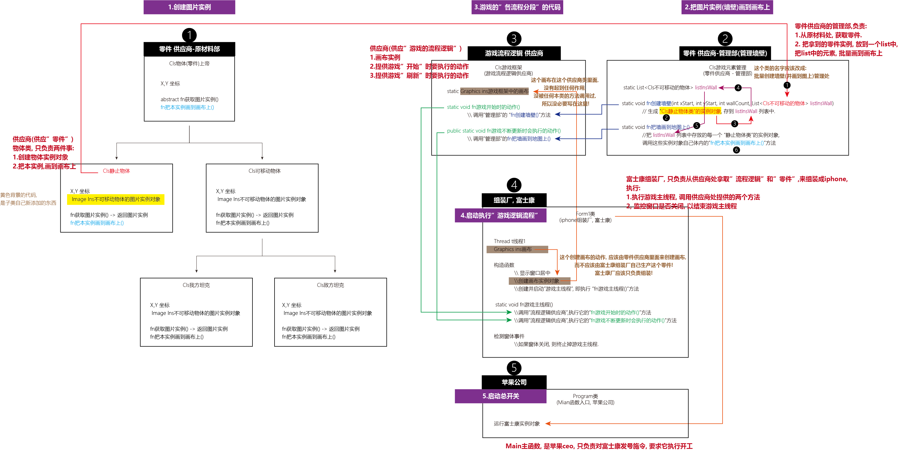

我们关注这3个文件中的改动:

==== Cls不可移动的物体:
[source, java]
----
using System;
using System.Collections.Generic;
using System.Drawing;
using System.Linq;
using System.Text;
using System.Threading.Tasks;

namespace my_05_坦克大战
{
    internal class Cls不可移动的物体:Cls游戏元素上帝主类 //继承自"上帝类"
    {
        public Image Ins不可移动物体的图片 { get; set; }   //申明一个Image类的变量, 尚未指针指向任何实例对象.

        //构造方法
        public Cls不可移动的物体(int x, int y, Image ins图像实例)
        {
            this.X= x;
            this.Y= y;
            this.Ins不可移动物体的图片 = ins图像实例;
        }

        protected override Image fn获取图片实例()  //具体实现父类中定义的抽象方法
        {
            return Ins不可移动物体的图片;
        }
    }
}
----

image:../img/0078.png[,]

==== Cls游戏元素管理 (这是比之前的进度, 新建的一个类)
[source, java]
----
using my_05_坦克大战.Properties;
using System.Collections.Generic;

namespace my_05_坦克大战
{
    internal class Cls游戏元素管理
    {

        //下面创建一个列表, 用来存储你下面会批量创建出来的n个墙壁的实例.
        private static List<Cls不可移动的物体> listInsWall = new List<Cls不可移动的物体>(); // 这里的字段, 必须设为静态的, 才能被本类中的方法直接调用到.

        //创建墙壁函数(方法)
        public static void fn创建墙壁(int xStart, int yStart, int wallCount, List<Cls不可移动的物体> listInsWall) //一个方格就是一个矩形的墙壁单位.  // wallCount : 表示要创建的墙的数量 //该"fn创建墙壁"函数, 返回一个 List<Cls不可移动的物体> 类型的东西.
        {
            int xEnd = xStart * 30;
            int yEnd = yStart * 30;

            //下面开始批量创建墙
            for (int i = yEnd; i < yEnd + wallCount * 30; i += 15) // i 其实是你新创建的墙的左上角点的x坐标.
            {
                Cls不可移动的物体 insWall1 = new Cls不可移动的物体(xEnd, i, Resources.picWall);  //可以把你导入的png图片(即 Resources.picWall), 直接作为 Image类的实例对象来用.

                Cls不可移动的物体 insWall2 = new Cls不可移动的物体(xEnd + 15, i, Resources.picWall);  //

                listInsWall.Add(insWall1); //注意, 此时listInsWall的作用, 只是把所有的墙的实例(包括它们的左上角坐标位置), 收集起来. 下面在  "fn把墙画到地图上()"方法中, 会用到这个列表.
                listInsWall.Add(insWall2);
            }
        }

        //下面的函数, 把所有创建出来的墙壁(包括它们每一块的左上角坐标位置), 收集在一个列表listInsWall中.
        public static void fn生成墙壁的列表() //
        {
            fn创建墙壁(1, 1, 5, listInsWall); // 从左上角坐标(1,1)开始, 创建5个墙
        }

        //把地图画出来的函数
        public static void fn把墙画到地图上()
        {
            foreach (var itemObj in listInsWall)  //从列表listInsWall中, 把每一个墙的实例抽取出来, 执行它们身上的"fn把本实例画到画布上()"方法.
            {
                itemObj.fn把本实例画到画布上();
            }
        }

    }
}
----

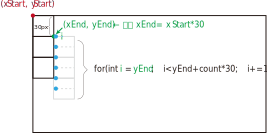

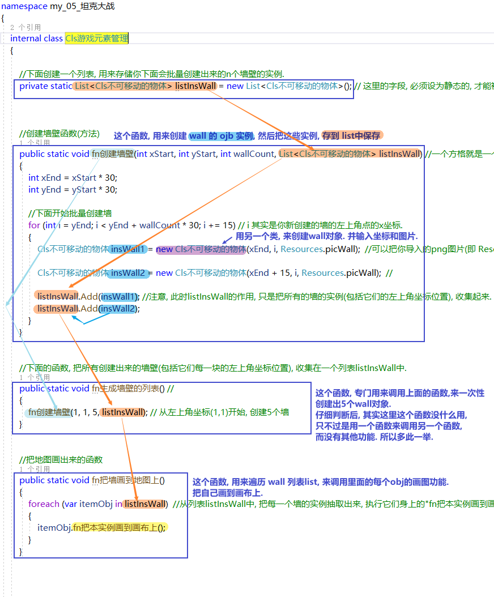

==== Cls游戏框架
[source, java]
----
using System;
using System.Collections.Generic;
using System.Drawing;
using System.Linq;
using System.Text;
using System.Threading.Tasks;

namespace my_05_坦克大战
{
    internal class Cls游戏框架
    {

        public static Graphics ins游戏框架中的画布; //先申明一个画布变量, 还未赋具体值(还未用指针指向具体的画布类实例对象). 这里设置成了静态属性, 就能在其他类中, 直接调用本"Cls游戏框架"类名, 来调用该画布属性了.

        //游戏开始时, 会执行的动作, 写在下面的方法里
        public static void fn游戏开始时的动作() //方法名可写成 fnStart()
        {
            Console.WriteLine("游戏开始时的动作...");
            Cls游戏元素管理.fn生成墙壁的列表();
        }

        //游戏不断更新时, 会执行的动作, 写在下面的方法里(比如, 不断重新绘制新图片, 以形成动画; 不断检测敌人的行动, 以决定玩家角色的策略). 这个就和帧率FPS有关
        public static void fn游戏不断更新时会执行的动作() //方法名可写成 fnUpdate()
        {
            Console.WriteLine("游戏在不断更新,执行xxx动作...");
            Cls游戏元素管理.fn把墙画到地图上();  //每一帧刷新时, 都要执行绘制操作.
        }

    }
}
----

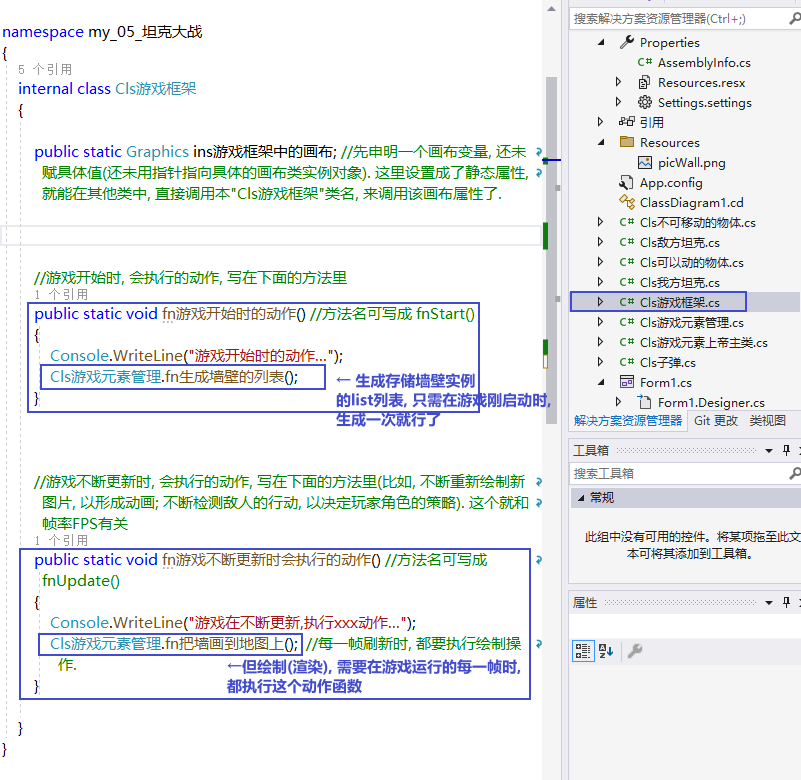

---

