= 游戏
:sectnums:
:toclevels: 3
:toc: left

---

== 创建窗体

在"解决方案"上, 右键, 新建项目.

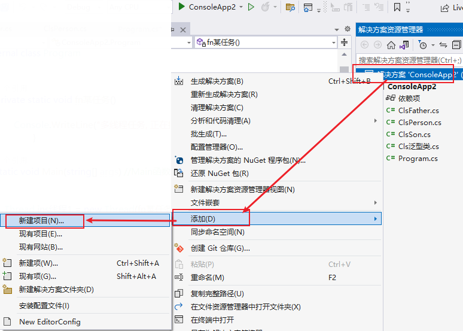

然后, 搜索"窗体", 选择 windows窗体应用(.NET Framework)

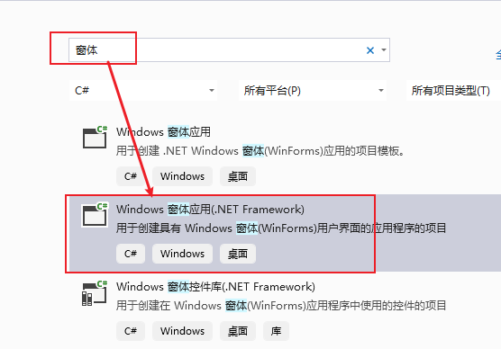

---

== 修改窗体上的显示名称

在 From1.cs 下的 Designer.cs文件中修改

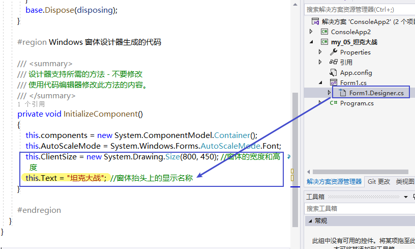

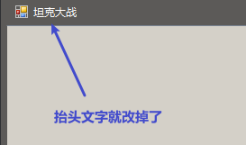

---

== 打开控件

在菜单: 试图 -> 工具箱, 可以打开控件.

我们拖些控件上去, 然后打开 From1.cs -> Designer.cs

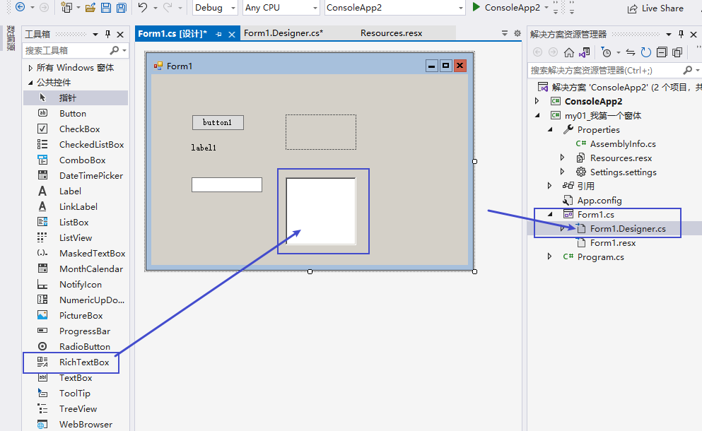

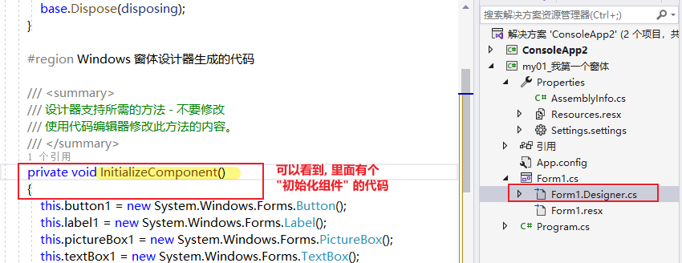

然后, 我们右键查看  From1.cs 文件的代码

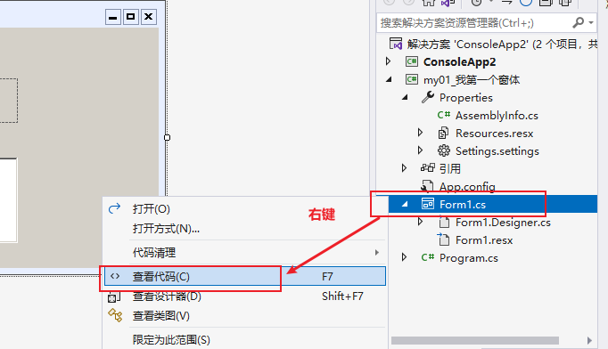

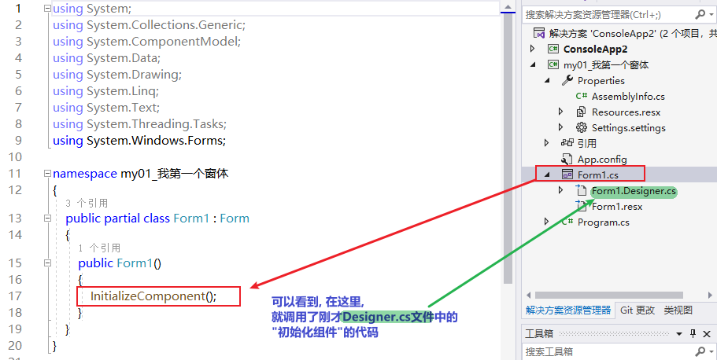

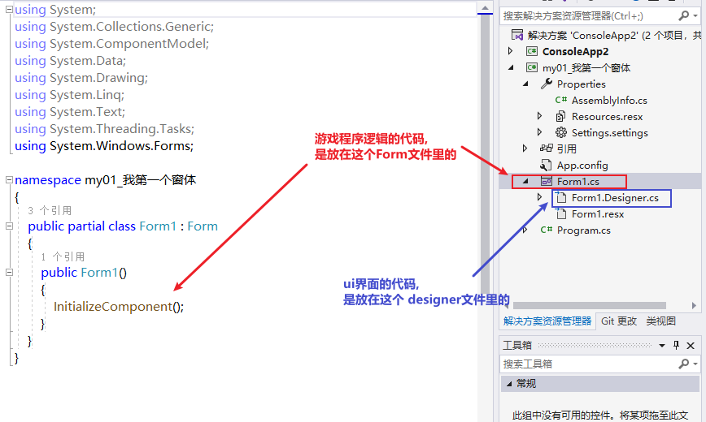

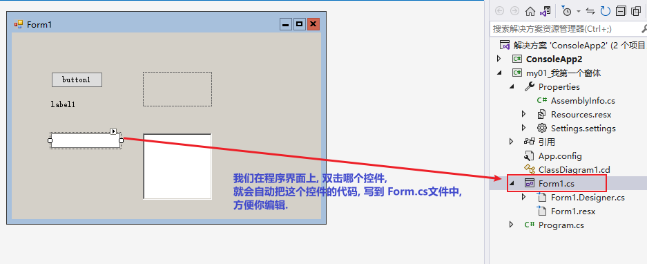

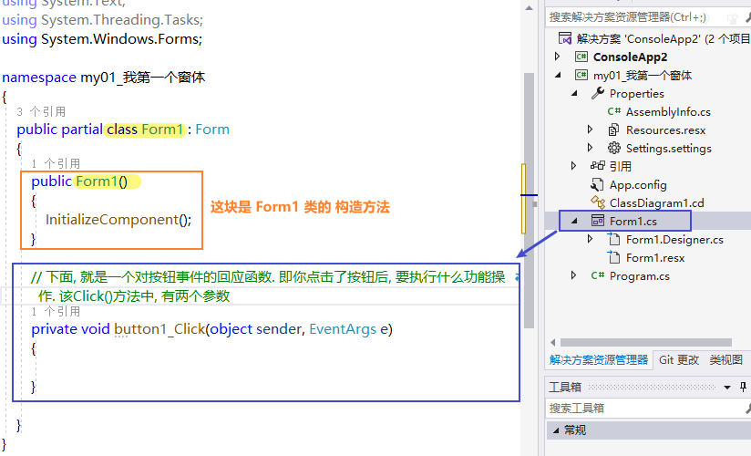

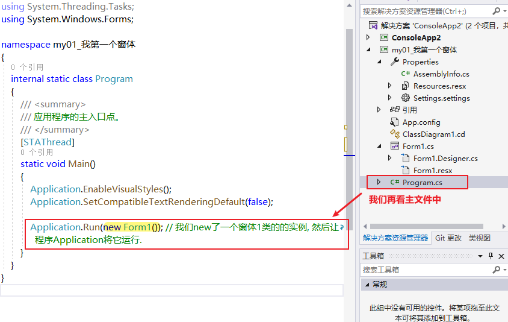

---

== 手动创建一个窗体类, 并运行它的实例对象

.标题
====
例如：
首先, 新建一个项目, 是windows窗体应用(.NET Framework)

然后, 新建一个类 "Cls窗体1", 代码如下
[source, java]
----
using System;
using System.Collections.Generic;
using System.Linq;
using System.Threading.Tasks;
using System.Windows.Forms;

namespace my0我用代码来创建一个窗体
{
    internal static class Program
    {

        static void Main()
        {
            Application.Run(new Cls窗体1()); //将你手动创建的窗体类, 新建一个实例出来, 来运行它.
        }
    }
}
----

主 Programma.cs文件中, 代码如下

[source, java]
----
using System;
using System.Collections.Generic;
using System.Linq;
using System.Threading.Tasks;
using System.Windows.Forms;

namespace my0我用代码来创建一个窗体
{
    internal static class Program
    {

        static void Main()
        {
            Application.Run(new Cls窗体1()); //将你手动创建的窗体类, 新建一个实例出来, 来运行它.
        }
    }
}
----

然后运行, 就能看到一个空白窗体出来了.

这个项目的目录结构如下:

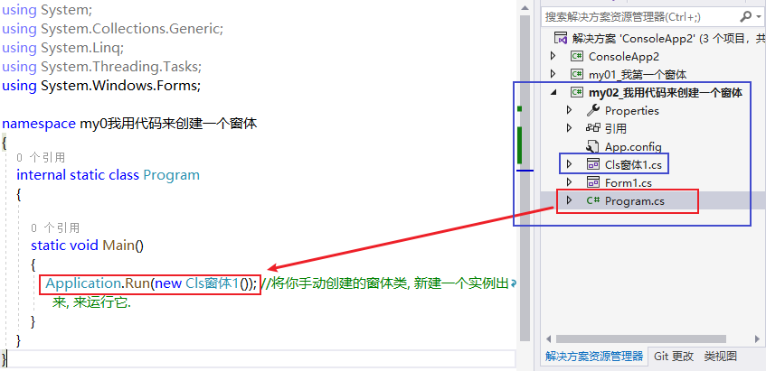

====

---

== 设置窗体在屏幕上的显示位置

首先, 新建一个项目, 不改动 visual studio 给出的默认代码.

打开 Form1.cs, 在里面设置窗体的显示位置:

[source, java]
----
using System;
using System.Collections.Generic;
using System.ComponentModel;
using System.Data;
using System.Drawing;
using System.Linq;
using System.Text;
using System.Threading.Tasks;
using System.Windows.Forms;

namespace my04_项目_坦克大战
{
    public partial class Form1 : Form
    {
        public Form1()
        {
            InitializeComponent();

            //让窗体, 在屏幕居中显示
            //this.StartPosition = FormStartPosition.CenterScreen; //我们将之后会新建出来的窗体实例, 显示位置, 放到屏幕的中央来显示.

            //让窗体, 由你自定义显示位置
            this.StartPosition = FormStartPosition.Manual; //手动来设置窗体实例的显示位置
            this.Location = new Point(100, 500); // 第一个参数是离屏幕左边界的距离(像素), 第二个参数是离屏幕上边距的距离.

        }
    }
}
----

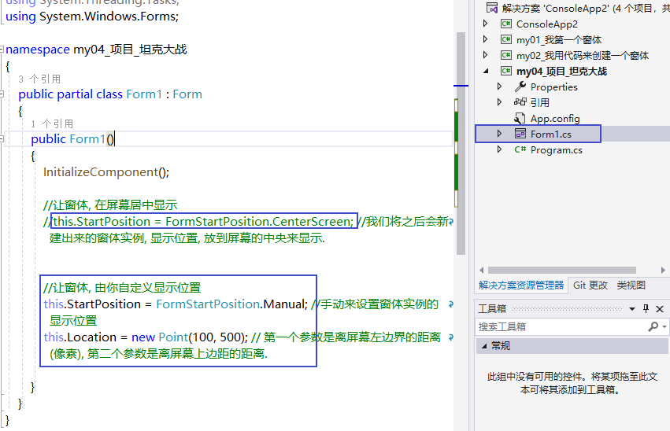

---

== 画一条直线

绘图窗口内容或大小每改变一次，都要调用"Paint事件"进行重绘操作，该操作会使画面重新刷新一次,以维持窗口正常显示。刷新过程中会导致所有图元重新绘制. 因此整个窗口中，只要是图元所在的位置，都在刷新，而刷新的时间是有差别的，闪烁现象自然会出现。

当进行鼠标跟踪绘制操作或者对图元进行变形操作时，Paint事件会频繁发生，这会使窗口的刷新次数大大增加。虽然窗口刷新一次的过程中所有图元同时显示到窗口，但也会有时间延迟，因为此时窗口刷新的时间间隔远小于图元每一次显示到窗口所用的时间。因此闪烁现象并不能完全消除！

所以说，此时导致窗口闪烁现象的关键因素在于Paint事件发生的次数多少。

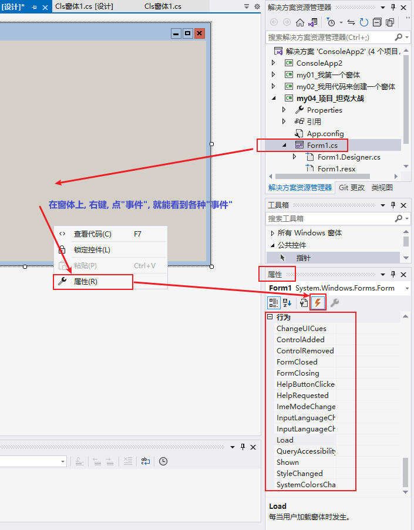

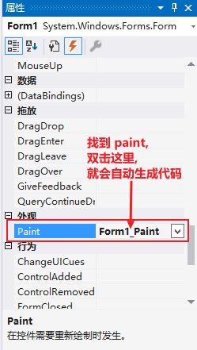

双击 Paint后, vs会自动帮我们在 Form1.cs文件中, 输入监听Paint事件的代码. 你把"画直线'代码, 写在它里面即可.

[source, java]
----
using System;
using System.Collections.Generic;
using System.ComponentModel;
using System.Data;
using System.Drawing;
using System.Linq;
using System.Text;
using System.Threading.Tasks;
using System.Windows.Forms;

namespace my04_项目_坦克大战
{
    public partial class Form1 : Form
    {
        public Form1()
        {
            InitializeComponent();

            //让窗体, 在屏幕居中显示
            this.StartPosition = FormStartPosition.CenterScreen; //我们将之后会新建出来的窗体实例, 显示位置, 放到屏幕的中央来显示.

        }

        //下面这段监听事件的代码, 就是我们刚刚双击Paint事件后, 自动帮我们生成的代码, 我们需要在它里面, 来书写"画直线"的代码.
        private void Form1_Paint(object sender, PaintEventArgs e)
        {
            Graphics ins画布对象 = this.CreateGraphics(); //创建一个画布实例
            Pen ins画笔 = new Pen(Color.Black); //创建一个画笔实例
            ins画布对象.DrawLine(ins画笔, new Point(0, 0), new Point(100, 200));
        }
    }
}
----

即 +
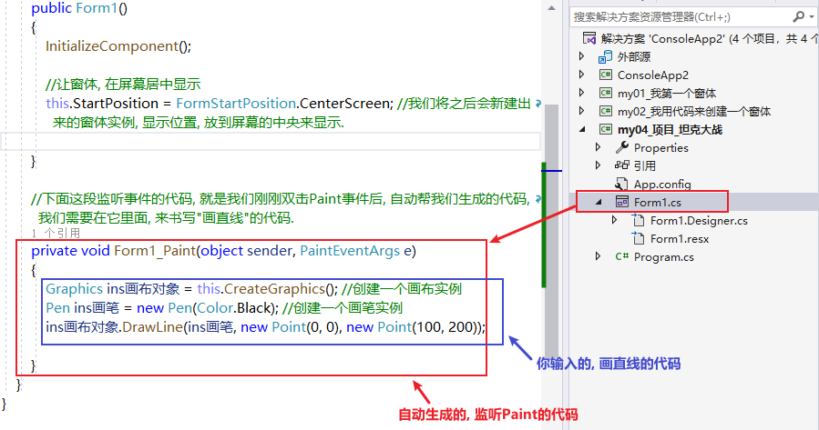

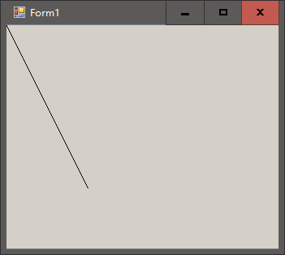

---

== 在画布上, 输出文字

在 Form1.cs文件中:
[source, java]
----
using System;
using System.Collections.Generic;
using System.ComponentModel;
using System.Data;
using System.Drawing;
using System.Linq;
using System.Text;
using System.Threading.Tasks;
using System.Windows.Forms;

namespace my04_项目_坦克大战
{
    public partial class Form1 : Form
    {
        public Form1()
        {
            InitializeComponent();

            //让窗体, 在屏幕居中显示
            this.StartPosition = FormStartPosition.CenterScreen; //我们将之后会新建出来的窗体实例, 显示位置, 放到屏幕的中央来显示.

        }

        //下面这段监听事件的代码, 就是我们刚刚双击Paint事件后, 自动帮我们生成的代码, 我们需要在它里面, 来书写"画直线"的代码.
        private void Form1_Paint(object sender, PaintEventArgs e)
        {
            Graphics ins画布对象 = this.CreateGraphics(); //创建一个画布实例
            //Pen ins画笔 = new Pen(Color.Black); //创建一个画笔实例
            //ins画布对象.DrawLine(ins画笔, new Point(0, 0), new Point(100, 200));

            //下面, 我们来在画布上输出文字
            Font ins字体对象 = new Font("微软雅黑", 20); //第二个参数, 是字号的大小
            SolidBrush ins刷子 = new SolidBrush(Color.Black);
            ins画布对象.DrawString("hello zrx", ins字体对象,ins刷子, new Point(20, 40)); //第三个参数是字体右上角的坐标位置

        }
    }
}
----

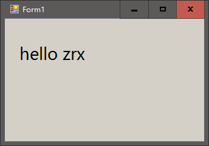

---

== 绘制图片

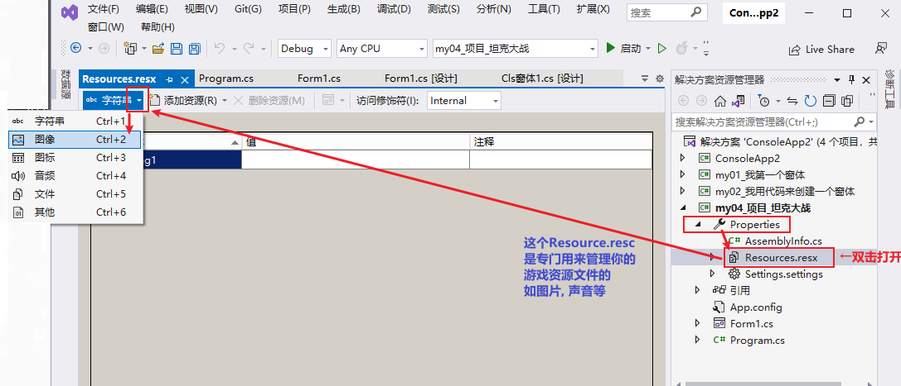

下面, 我们载入本地图片资源

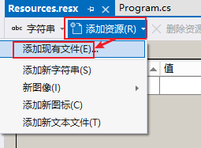

注意: 千万不要直接把图片拷到这个目录中: C:\learn_C_sharp\ConsoleApp2\my04_项目_坦克大战\Resources, 因为该操作, 不会让vs自动帮你添加"加载在图片资源"的代码!

[source, java]
----
using my04_项目_坦克大战.Properties;
using System;
using System.Collections.Generic;
using System.ComponentModel;
using System.Data;
using System.Drawing;
using System.Linq;
using System.Text;
using System.Threading.Tasks;
using System.Windows.Forms;

namespace my04_项目_坦克大战
{
    public partial class Form1 : Form
    {
        public Form1()
        {
            InitializeComponent();

            //让窗体, 在屏幕居中显示
            this.StartPosition = FormStartPosition.CenterScreen; //我们将之后会新建出来的窗体实例, 显示位置, 放到屏幕的中央来显示.

        }

        //下面这段监听事件的代码, 就是我们刚刚双击Paint事件后, 自动帮我们生成的代码, 我们需要在它里面, 来书写"画直线"的代码.
        private void Form1_Paint(object sender, PaintEventArgs e)
        {
            Graphics ins画布对象 = this.CreateGraphics(); //创建一个画布实例

            Image insImg1 = Properties.Resources.face01; //我们来引入你导入的图片资源 face01.jpg, 但需要用一个 Image类的实例对象来接收它. 注意, 你的图片等资源, 都在 Properties.Resources 下面
            ins画布对象.DrawImage(insImg1, 200, 200); //在画布对象上, 用 DrawImage()方法, 来把你的 Imgage 对象(指向了你的face1.jpg), 画出来.

            Bitmap isnImg2 = Properties.Resources.face02; // 也可以用Bitmap类的实例, 来接收. Bitmap类其实继承自 Image类.
            ins画布对象.DrawImage(isnImg2, 400, 200);
        }
    }
}
----

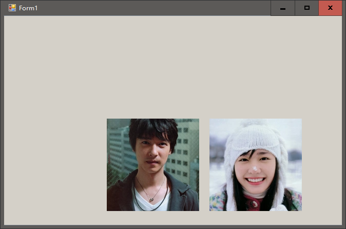

---

==== 让图片黑色的地方变透明

....
语句是:
isnImg3.MakeTransparent(Color.Black); //让黑色变透明.
....

[source, java]
----
using my04_项目_坦克大战.Properties;
using System;
using System.Collections.Generic;
using System.ComponentModel;
using System.Data;
using System.Drawing;
using System.Linq;
using System.Text;
using System.Threading.Tasks;
using System.Windows.Forms;

namespace my04_项目_坦克大战
{
    public partial class Form1 : Form
    {
        public Form1()
        {
            InitializeComponent();

            //让窗体, 在屏幕居中显示
            this.StartPosition = FormStartPosition.CenterScreen; //我们将之后会新建出来的窗体实例, 显示位置, 放到屏幕的中央来显示.

        }

        //下面这段监听事件的代码, 就是我们刚刚双击Paint事件后, 自动帮我们生成的代码, 我们需要在它里面, 来书写"画直线"的代码.
        private void Form1_Paint(object sender, PaintEventArgs e)
        {
            Graphics ins画布对象 = this.CreateGraphics(); //创建一个画布实例

            // 让图片中的某种颜色(比如黑色), 变透明. 注意, 它只能让100%纯黑的地方变透明, 如果你的图片上不是纯黑的, 即使你肉眼看上去很黑, 它也不会变透明. 所以建议直接用透明底的png图.
            Bitmap isnImg3 = Properties.Resources.黑白图; // 也可以用Bitmap类的实例, 来接收. Bitmap类其实继承自 Image类.
            isnImg3.MakeTransparent(Color.Black); //让黑色变透明.
            ins画布对象.DrawImage(isnImg3, 100, 100);

            Bitmap isnImg1 = Properties.Resources.png透明底图; // 如果你的图像是透明底的png, 则直接就能去背景了, 变成透明显示.
            ins画布对象.DrawImage(isnImg1, 400, 100);

        }
    }
}
----

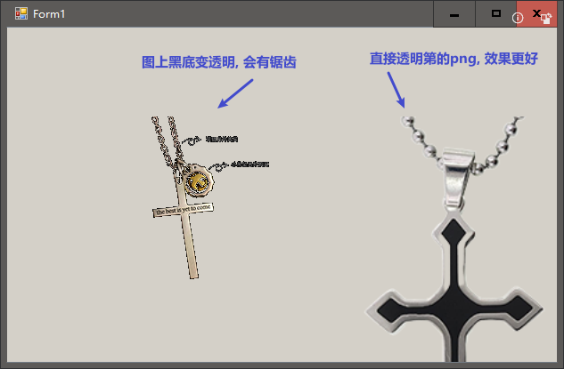

---

