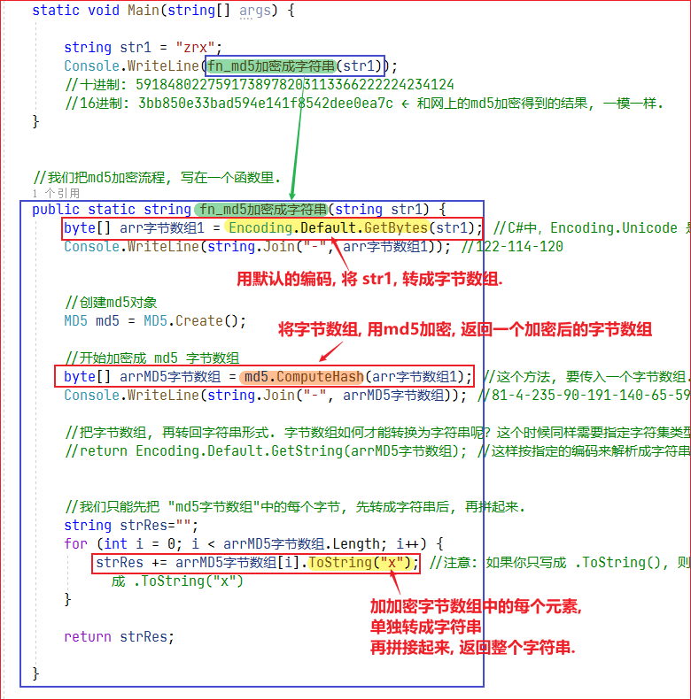

= md5加密
:sectnums:
:toclevels: 3
:toc: left
''''

MD5算法会对原始的消息进行有损的压缩计算，无论要加密的字节长度有多长，都会生成一个固定长度的消息摘要（密文），所以MD5算法具有不可逆性. 但MD5算法还是无法提供绝对的安全性，无法避免碰撞攻击，所以安全性没有那么高，一般用于普通数据的加密。

针对不同长度待加密的数据、字符串等等，其都可以返回一个固定长度的MD5加密字符串。（通常32位的16进制字符串）；

其加密过程几乎不可逆，除非维护一个庞大的Key-Value数据库来进行碰撞破解，否则几乎无法解开。

对于一个固定的字符串。数字等等，MD5加密后的字符串是固定的，也就是说不管MD5加密多少次，都是同样的结果。

md5的长度，默认为128bit，也就是128个0和1的二进制串。这样表达是很不友好的。所以将二进制转成了16进制，每4个bit表示一个16进制，所以128/4 = 32 换成16进制表示后，为32位了。

MD5的作用

①一致性检验

②数字签名。只是把md5看出了一个指纹，按了个手印说明独一无二了。

③安全访问认证，这个就是平时系统设计的问题了。

在用户注册时，会将密码进行md5加密，存到数据库中。这样可以防止那些可以看到数据库数据的人，恶意操作了。

'''

== 字符串, 转"字节数组"

在C#中，System.Text.Encoding.Unicode与System.Text.Encoding.UTF8分别是2种编码方式。如果UTF-8是Unicode的一种实现方式，那C#中为什么将Encoding.Unicode作为与UTF8并列的一种编码方式呢？

*原来Windows默认的Unicode实现是UTF-16，所以C#中Encoding.Unicode就是UTF-16。*

Windows handles so-called "Unicode" strings as UTF-16 strings, while most UNIXes default to UTF-8 these days.

C#中，Encoding.Unicode ＝ UTF-16 。

ASCII(American Standard Code for Information Interchange) 美国信息互换标准代码. ASCII码最大的缺点就是只能表示美国英语中常用的字符数字和符号，不能表示其他语言中的字符符号等，比如中文中的汉字。

Unicode码是能够容纳世界上所有的文字和符号的编码方案，成为统一码，满足跨语言跨平台的需求. 所以被使用的更加广泛，ASCII几乎不怎么用了。

以上两种编码方式说明了如何将常用的字符进行编码，并赋予每个字符一个code point(a number)来表示，这个是固定的。方便以后的应用。比如汉字"字"对应的Unicode编码为23383.

ASCII码的编码比较简单，因为ASCII码是以字节为单位编码的，最大为255，直接可以使用一个字节在内存中进行表示，编码无需特殊操作。

Unicode编码相对比较复杂，因为Unicode要表示所有语言的字母符号等.

Unicode编码可分为以下五种：

ASCIIEncoding

UTF7Encoding

UTF8Encoding

UnicodeEncoding

UTF32Encoding

UTF是一种将Unicode码编码成内存中二进制表示的方法。

[options="autowidth"]
|===
|Header 1 |Header 2

|ASCIIEncoding
|ASCIIEncoding只需要使用一个字节对Unicode码进行编码。ASCII字母被限制在Unicode中最小的128个字符，ASCIIEncoding不提供错误检测，如果需要错误检测的话，你的程序被推荐使用UTF8Encoding，UnicodeEncoding或者UTF32Encoding。

UTF8Encoding，UnicodeEncoding或者UTF32Encoding更适合用来构建全球范围的应用程序。

|UTF7Encoding
|UTF7Encoding推荐不被使用。

|UTF-8 encoding
|UTF-8 encoding 以字节对Unicode进行编码，不同范围的字符使用不同长度的编码，UTF-8 encoding 的最大长度为4个字节。 UTFEncoding将Unicode码编码成1-4个单字节码。

UTF8Encoding的编码速度要比其他的所有编码方式都要快，即使是要编码的内容都是ASCII码，编码速度也要比用ASCIIEncoding编码的速度要快。

*UTF8Encoding的效果要比ASCIIEncoding的效果好的多，所以推荐用UTF8Encoding，而不是ASCIIEncoding。*

|UnicodeEncoding
|UnicodeEncoding编码以16位无符号整数为编码单位，*编码成1-2个16位的integers。*

*UnicodeEncoding无法兼容ASCII，C#的默认编码方式就是UnicodeEncoding。使用的编码方式为UTF-16*

|UTF32Encoding
|UTF32Encoding 以32位无符号整数为编码单位，编码成一个32bit的integer.
|===

[,subs=+quotes]
----
string str1 = "zrx";

//ASII码 : 字符串中的每个字符, 用一个字节表示。适用于英文转"字节数组"
char[] arrChar字符数组 = str1.ToCharArray();
byte[] arrByte1 = Encoding.ASCII.GetBytes(str1);

Console.WriteLine(string.Join("-", arrByte1)); //122-114-120  ← string.Join() 可以将一个数组遍历连接起来, 通过阻断符, 连接成一个字符串

//Unicode码：字符串中的每个字符,用两个字节表示。 适用于中文转"字节数组"
string str2 = "周芷若";
*byte[] arr2 = Encoding.Unicode.GetBytes(str2);* //C#中，Encoding.Unicode 是＝ UTF-16 的.
Console.WriteLine(string.Join("-",arr2)); //104-84-183-130-229-130

//也可
string str3 = "hello,周芷若";
**byte[] arr3 = Encoding.UTF8.GetBytes(str3); **
Console.WriteLine(string.Join("-", arr3)); //104-101-108-108-111-44-229-145-168-232-138-183-232-139-165
----

== md5 加密

[,subs=+quotes]
----
internal class Program {
        static void Main(string[] args) {

            string str1 = "zrx";
            Console.WriteLine(fn_md5加密成字符串(str1));
            //十进制: 5918480227591738978203113366222224234124
            //16进制: 3bb850e33bad594e141f8542dee0ea7c ← 和网上的md5加密得到的结果, 一模一样.
        }

        //我们把md5加密流程, 写在一个函数里.
        public static string fn_md5加密成字符串(string str1) {
            byte[] arr字节数组1 = Encoding.Default.GetBytes(str1); //C#中，Encoding.Unicode 是＝ UTF-16 的. 如果你要改成 utf8, 就写成 Encoding.UTF8.GetBytes(str1)
            Console.WriteLine(string.Join("-", arr字节数组1)); //122-114-120

            //创建md5对象
            *MD5 md5 = MD5.Create();*

            //开始加密成 md5 字节数组
            *byte[] arrMD5字节数组 = md5.ComputeHash(arr字节数组1); //这个方法, 要传入一个字节数组. 注意: 是"字节数组"! 不是字符数组. 然后, 该方法, 返回一个加密好的字节数组*
            Console.WriteLine(string.Join("-", arrMD5字节数组)); //81-4-235-90-191-140-65-59-121-238-21-73-188-32-200-19

            //把字节数组, 再转回字符串形式. 字节数组如何才能转换为字符串呢？这个时候同样需要指定字符集类型。如: Encoding.UTF8.GetString(字节数组)
            //return Encoding.Default.GetString(arrMD5字节数组); //错误! 注意: 这样按指定的编码来解析成字符串, 不行. 因为我们不能直接把整个 md5字节数组, 直接转成字符串, 否则这个字符串输出会是乱码.

            *//我们只能先把 "md5字节数组"中的每个字节, 先转成字符串后, 再拼起来.*
            string strRes="";
            for (int i = 0; i < arrMD5字节数组.Length; i++) {
                *strRes += arrMD5字节数组[i].ToString("x"); //注意: 如果你只写成 .ToString(), 则得到的 strRes, 会这个字符串中全是数字, 表明它是"十进制"的, 而我们md5加密后的结果字符串, 应该是包括英文的, 即它是16进制的. 所以, 我们还要把10进制, 转成16进制. 也就是写成 .ToString("x"). x的意思, 就是把10进制转成16进制.*
            }

            return strRes;

        }

    }
}
----

'''

