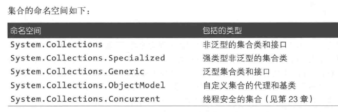
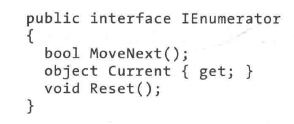
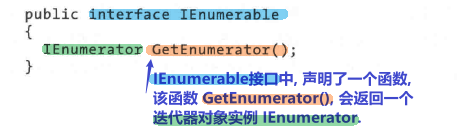
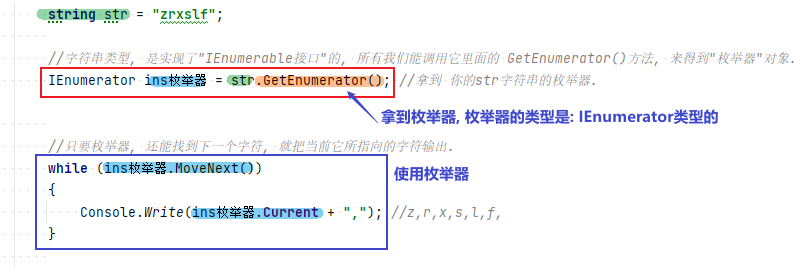
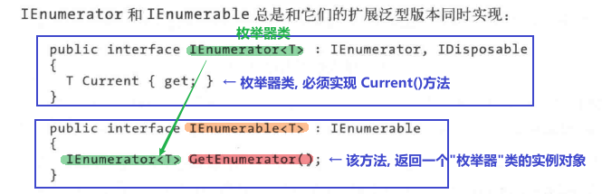
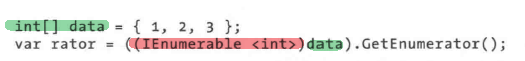
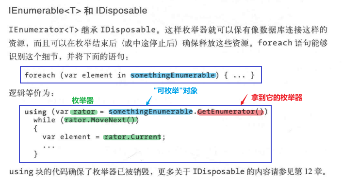

= 集合
:sectnums:
:toclevels: 3
:toc: left
---

点NET Framework提供了一系列标准的存储和管理对象集合的类型。其中包括可变大小的列表、链表、排序或非排序字典以及数组。

在这些类型中，*只有数组是C#语言的一部分，而其余的集合只是一些类，我们可以和其他类一样将其实例化。*

Framework中的集合类型, 可以分为以下类别:

- 定义标准集合协议的接口
- 开箱即用的集合类(列表、字典等)
- 编写应用程序特有集合的基类

'''

== 枚举

计算中, 会涉及很多不同类型的集合，有简单数据结构, 如"数组"或"链表"，也有复杂的"红黑树"和"散列表"。虽然这些数据结构的内部实现和外部特征, 差异很大，*但几乎都需要实现"遍历"集合内容这一功能。Framework 通过一系列接口(IEnumerable、IEnumerator及其泛型接口)来支持该需求，允许不同的数据结构使用一组通用的遍历API。*

==== IEnumerable 和 IEnumerator 接口

IEnumerator接口, 定义了以前向方式遍历或枚举集合元素的基本底层协议。其声明如下:

- MoveNext() : 将当前元素或“游标”, 向前移动到下一个位置，如果集合没有更多的元素，那么它会返回false。
- **Current() : 返回当前位置的元素(通常需要从object, 转换为更具体的类型)。**在取得第一个元素之前, 必须先调用MoveNext()，即使是空集合也支持这个操作。
- *如果实现了Reset()方法，那么它的作用就是将当前位置移回起点，并允许再一次枚举集合*。Reset()方法存在的目的, 主要是COM互操作; 而其他情况, 应当尽量避免直接调用该方法, 因为它并未得到广泛支持(另外，调用用该方法并没有太大必要，因为完全可以重新实例化一个枚举器来达到相同效果)。

*通常，集合本身并不实现枚举器，而是通过 IEnumerable接口, 提供枚举器*:

通过定义一个"返回枚举器 GetEnumerator()"的方法，IEnumerable接口, 灵活地将迭代逻辑的代码编写, 转移到了另一个类上(即该类会实现 IEnumerable接口 中定义的这个方法).

此外，多个消费者可以同时遍历同一个集合而不互相影响。*IEnumerable接口, 可以看作是"IEnumerator枚举器"的提供者 ，它是所有集合类型需要实现的最基础接口。*

[,subs=+quotes]
----
static void Main(string[] args)
{
    string str = "zrxslf";

    *//字符串类型, 是实现了"IEnumerable接口"的, 所有我们能调用它里面的 GetEnumerator()方法, 来得到"枚举器"对象.*
    *IEnumerator ins枚举器 = str.GetEnumerator(); //拿到 你的str字符串的枚举器.*

    //只要枚举器, 还能找到下一个字符, 就把当前它所指向的字符输出.
    *while (ins枚举器.MoveNext())*
    {
        Console.Write(*ins枚举器.Current* + ","); //z,r,x,s,l,f,
    }

    *//上面是"枚举器"的标准用法. 事实上, 我们很少采用这种直接调用"枚举器"方法的方式。因为C#提供了更快捷的语法: foreach语句.*
    foreach (var item in str)
    {
        Console.Write(item+","); //z,r,x,s,l,f,
    }

}
----

'''

==== 泛型版本:  IEnumerable<T> 和 IEnumerator<T>

注意: 如果直接调用 GetEnumerator()方法, 会返回一个泛型的 "IEnumerator<T> 枚举器". 所以, 如果你想对数组, 拿到它的枚举器, 必须在用了 GetEnumerator()方法后, 把拿到的泛型枚举器, 强制指定该"泛型类型"为你数组中元素的类型. 即:

幸好我们可以使用foreach语句，因此无须编写上述代码。

'''

== 实现枚举接口 : "IEnumerable 接口"

如果你想实现下面的功能, 你就要来实现 IEnumerable 或 IEnumerable<T> 接口:

- 支持 foreach语句
- 与任何标准集合进行互操作
- 为了达到一个成熟的集合接口的要求
- 为了支持集合初始化器

*要实现 IEnumerable / IEnumerable<T>, 就必须提供一个"枚举器"。可以采用如下三种方式实现:*

- 如果这个类“包装”了任何一个集合，那么就返回所包装集合的枚举器
- *使用 yield return 来进行迭代. ← 推荐!*
- 实例化自己的 IEnumerator / IEnumerator<T> 实现

[,subs=+quotes]
----

----

