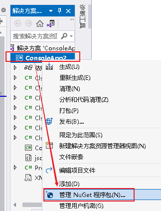
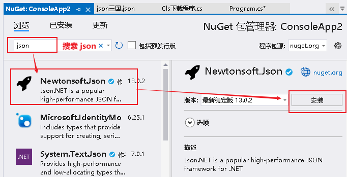
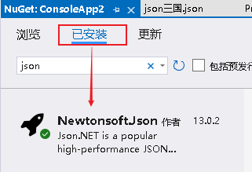
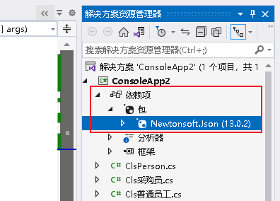
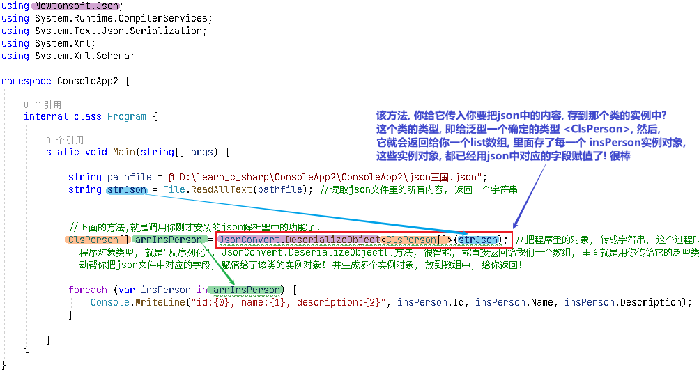
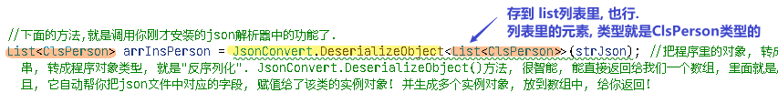
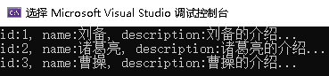
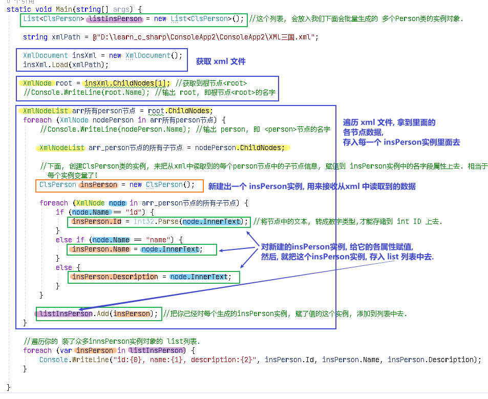

= json & axml
:sectnums:
:toclevels: 3
:toc: left

---

XML 和 JSON 是现今互联网中最常用的两种数据交换格式。

XML 格式由 W3C 于 1996 年提出。JSON 格式由 Douglas Crockford 于 2002 年提出。

二者间最大的不同在于 XML 可以通过在标签中添加属性这一简单的方法来存储 元数据(metadata)。而使用 JSON 时需要创建一个对象，把元数据当作对象的成员来存储。

由于 JSON 文件天生的简洁性，与包含相同信息的 XML 相比，JSON 总是更小，这意味着更快的传输和处理速度。

JSON 的另一个优点在于其对对象和数组的表述和 宿主语言(host language)中的数据结构相对应，例如 对象(object)、 记录(record)、 结构体(struct)、 字典(dictionary)、 哈希表(hash table)、 键值列表(keyed list)还有 数组(array)、 向量(vector)、 列表(list)，以及对象组成的数组等等。

虽然 XML 里也能表达这些数据结构，也只需调用一个函数就能完成解析，而往往需要更多的代码才能正确的完成 XML 的序列化和反序列化处理。

而且 XML 对于人类来说不如 JSON 那么直观，XML 标准缺乏对象、数组的标签的明确定义。当结构化的标记可以替代嵌套的标签时，JSON 的优势极为突出。

也许 JSON 比 XML 更优的部分是因为 JSON 是 JavaScript 的子集，所以在 JavaScript 代码中对它的解析或封装都非常的自然。

简单地说，XML 的目标是标记文档。这和 JSON 的目标想去甚远，所以只要用得到 XML 的地方就尽管用。它使用树形的结构和包含语义的文本来表达混合内容以实现这一目标。在 XML 中可以表示数据的结构，但这并不是它的长处。

== json (推荐)

==== json 语法

JSON 的两种结构：

1、对象：大括号 {} 保存的对象是一个无序的名称/值对集合。一个对象以左括号 { 开始， 右括号 } 结束。每个"键"后跟一个冒号 :，名称/值对使用逗号 , 分隔。

....
{
    "sites": [
        { "name":"菜鸟教程" , "url":"www.runoob.com" },
        { "name":"google" , "url":"www.google.com" },
        { "name":"微博" , "url":"www.weibo.com" }
    ]
}
....

2、数组：中括号 [] 保存的数组是值（value）的有序集合。一个数组以左中括号 [ 开始， 右中括号 ] 结束，值之间使用逗号 , 分隔。

....
[
    { key1 : value1-1 , key2:value1-2 },
    { key1 : value2-1 , key2:value2-2 },
    { key1 : value3-1 , key2:value3-2 },
    ...
    { key1 : valueN-1 , key2:valueN-2 },
]
....

JSON 语法衍生于 JavaScript 对象标记法语法：

数据在名称/值对中 +
数据由逗号分隔 +
花括号容纳对象 +
方括号容纳数组 +

- JSON 名称需要双引号。而 JavaScript 名称不需要。

在 JSON 中，键必须是字符串，由双引号包围：
....
{ "name":"Bill Gates" }
....

而 JavaScript 中, 对象是
....
{ name:"Bill Gates" }
....

- 在 JSON 中，值必须是以下数据类型之一：

字符串
数字
对象（JSON 对象）
数组
布尔
null

- 在 JSON 中，字符串值必须由双引号编写：
....
{ "name":"Bill Gates" }
....

JSON 实例
....
{"employees":[
    { "firstName":"Bill", "lastName":"Gates" },
    { "firstName":"Steve", "lastName":"Jobs" },
    { "firstName":"Elon", "lastName":"Musk" }
]}
....

- JSON 中的数字必须是整数或浮点数。
....
{ "age":30 }
....

- JSON 中的值可以是对象。
....
{
"employee":{ "name":"Bill Gates", "age":62, "city":"Seattle" }
}
....

- JSON 中的值可以是数组。
....
{
"employees":[ "Bill", "Steve", "David" ]
}
....

- JSON 中的值可以是 true/false。
....
{ "sale":true }
....

JSON 中的值可以是 null。
....
{ "middlename":null }
....

---

==== 安装 json 解析工具 -- Json.NET

c# 没有内置的json解析工具, 必须用第三方的.

到json 官网: +
https://www.json.org/json-en.html

也可以这样操作: 对你的项目, 右键, 选"管理 nuGet 程序包"

安装完后, 就能在"已安装"中看到了.

然后, 你也能在你项目的"依赖项"里面, 看到它.

官方使用文档在这里: +
https://www.newtonsoft.com/json/help/html/Introduction.htm

---

==== ★ c# 读取json文件中的数据, 批量赋值给 Person类生成的多个实例中

json文件是:
[,subs=+quotes]
----
[
  {
    "id": 01,
    "name": "刘备",
    "description": "刘备的介绍..."
  },
  {
    "id": "02",
    "name": "诸葛亮",
    "description": "诸葛亮的介绍..."
  },
  {
    "id": "03",
    "name": "曹操",
    "description": "曹操的介绍..."
  }
]
----

ClsPerson类是:
[,subs=+quotes]
----
using System;
using System.Collections.Generic;
using System.Linq;
using System.Text;
using System.Threading.Tasks;

namespace ConsoleApp2
{
    internal class ClsPerson
    {
        public int Id { get; set; }
        public string Name { get; set; }
        public string Description { get; set; }
    }
}
----

[,subs=+quotes]
----
**using Newtonsoft.Json; ** //引入你的json解析器!
using System.Runtime.CompilerServices;
using System.Text.Json.Serialization;
using System.Xml;
using System.Xml.Schema;

namespace ConsoleApp2 {

    internal class Program {

        static void Main(string[] args) {

            string pathfile = @"D:\learn_c_sharp\ConsoleApp2\ConsoleApp2\json三国.json";
            string strJson = File.ReadAllText(pathfile); //读取json文件里的所有内容, 返回一个字符串

            //下面的方法,就是调用你刚才安装的json解析器中的功能了.
            *ClsPerson[] arrInsPerson = JsonConvert.DeserializeObject<ClsPerson[]>(strJson);* //把程序里的对象, 转成字符串, 这个过程叫做"序列化". 因此, 反过来, 把一个字符串, 转成程序对象类型, 就是"反序列化".
             //JsonConvert.DeserializeObject()方法, 你要给它传入一个json文件中全部内容的字符串形式. *该方法也很智能, 能直接返回给我们一个数组, 里面就是用你传给它的泛型类 <ClsPerson[]> 生成的实例对象了! 而且, 它自动帮你把json文件中对应的字段, 赋值给了该类的实例对象! 并生成多个实例对象, 放到数组中, 给你返回!*
            // 注意: 这里, 也可以让它帮我们存到 list列表里面(列表就是可变长度的数组), 即写成: *List<ClsPerson>* arrInsPerson = *JsonConvert.DeserializeObject<List<ClsPerson>>(strJson)*;

            foreach (var insPerson in arrInsPerson) {
                Console.WriteLine("id:{0}, name:{1}, description:{2}", insPerson.Id, insPerson.Name, insPerson.Description);
            }

        }
    }
}
----

上面的代码, 其实存到 list列表里也行 (如下图). 其他代码都不用动, 就改这一句. 同样可以运行成功 :

输出:

---

==== 读取有嵌套数据的json文件

json.json文件:
[,subs=+quotes]
----
{
    "country": "蜀",
    "officerPrimeMinister": "诸葛亮",
    "listOfficer": [
        {"id": 01, "name": "蒋琬"},
        {"id": 02, "name": "姜维"}
    ]
}
----

ClsPerson.cs类
[,subs=+quotes]
----
namespace ConsoleApp1;

public class ClsPerson
{
    public int Id { get; set; }
    public string Name { get; set; }

}
----

ClsCountry类
[,subs=+quotes]
----
using System;
using System.Collections.Generic;
using System.Linq;
using System.Text;
using System.Threading.Tasks;

namespace ConsoleApp1
{
    internal class ClsCountry
    {

        public string Country { get; set; }
        public string OfficerPrimeMinister { get; set; }

        public List<ClsPerson> listOfficer { get; set; } //注意, 这个列表中的元素, 是ClsPerson类型的.
    }
}
----

主文件:
[,subs=+quotes]
----
using Newtonsoft.Json;
using System.Diagnostics;

namespace ConsoleApp1
{
    internal class Program
    {

        static void Main(string[] args)
        {

            string pathJson = @"C:\learn_C_sharp\ConsoleApp1\ConsoleApp1\json.json";
            *string strJson = File.ReadAllText(pathJson);* //读取json文件中的全部内容, 返回一个字符串

            //反序列化
            *ClsCountry insCountry = JsonConvert.DeserializeObject<ClsCountry>(strJson);* //将json内容字符串传进去. 因为我们json文件中, 只有一个数据, 只需赋给一个ClsCountry类的实例就行了, 就没用列表来接收了.
            Console.WriteLine(insCountry.Country);
            Console.WriteLine(insCountry.OfficerPrimeMinister);

            //*因为 insCountry.listOfficer 属性的值, 依然是个数组, 我们继续遍历,来输出里面的元素*
            foreach (var insPerson in insCountry.listOfficer)
            {
                Console.WriteLine("id:{0},name:{1}",insPerson.Id,insPerson.Name);
            }

        }
    }
}
----

---

== 序列化 (obj -> string), 和"反序列化"(string -> obj)

[,subs=+quotes]
----
ClsPerson insPerson1 = new ClsPerson();
insPerson1.Id = 01;
insPerson1.Name = "赵云";
insPerson1.Description = "赵云的介绍...";

//下面开始"序列化",把obj实例对象, 变成 string 存储到json文件中.
string str1 = ** JsonConvert.SerializeObject(insPerson1);** //序列化后, 就得到了实例对象的字符串形式.
Console.WriteLine(str1); //{"Id":2,"Name":"黄忠","Description":"黄忠的介绍..."}

//也可以把数组, 进行"序列化"
string[] arrName = { "周瑜", "鲁肃", "张昭" };
string str2 = *JsonConvert.SerializeObject(arrName);*
Console.WriteLine(str2); //["周瑜","鲁肃","张昭"]
----

---

== ----- -----

---

== xml (不推荐, 太麻烦了)

==== XML 语法规则

- XML 标签对大小写敏感
- XML 的属性值须加引号(单引号和双引号均可使用), 如: <note date="08/08/2008"> +
如果属性值本身包含双引号，那么有必要使用单引号包围它，就像这个例子：
....
<gangster name='George "Shotgun" Ziegler'>
....

另外, 请看这些例子：
....
<person sex="female">
  <firstname>Anna</firstname>
  <lastname>Smith</lastname>
</person>

<person>
  <sex>female</sex>
  <firstname>Anna</firstname>
  <lastname>Smith</lastname>
</person>
....

在第一个例子中，sex 是一个属性。在第二个例子中，sex 则是一个子元素。两个例子均可提供相同的信息。

没有什么规矩可以告诉我们什么时候该使用属性，而什么时候该使用子元素。我的经验是在 HTML 中，属性用起来很便利，但是在 XML 中，您应该尽量避免使用属性。如果信息感觉起来很像数据，那么请使用子元素吧。

在此我们极力向您传递的理念是：元数据（有关数据的数据）应当存储为属性，而数据本身应当存储为元素。

- 以下字符, 在xml中,必须转义:

[options="autowidth"]
|===
|Header 1 |Header 2 |Header 3

|\&lt;	|<	|小于
|\&gt;	|>	|大于
|\&amp;	|&	|和号
|\&apos;	|'	|单引号
|\&quot;	|"	|引号
|===

- XML 中的注释
在 XML 中编写注释的语法与 HTML 的语法很相似：
....
<!-- This is a comment -->
....

- 在 XML 中，空格会被保留 +
HTML 会把多个连续的空格字符裁减（合并）为一个, 但在 XML 中，文档中的空格不会被删节。

- XML 以 LF 存储换行 +
在 Windows 应用程序中，换行通常以一对字符来存储：回车符 (CR) 和换行符 (LF)。这对字符与打字机设置新行的动作有相似之处。在 Unix 应用程序中，新行以 LF 字符存储。而 Macintosh 应用程序使用 CR 来存储新行。

- XML 元素必须遵循以下命名规则： +
名称不能以字符 “xml”（或者 XML、Xml）开始 +
名称不能包含空格

---

==== 获取节点名字, 及节点中的文本内容

[,subs=+quotes]
----
static void Main(string[] args)
{
    string xmlPath = @"D:\123\xml.xml";

    //必须先创建一个XmlDocument类的实例, 才能用这个实例, 来解析xml文件
    *XmlDocument insXml = new XmlDocument();*
    *insXml.Load(xmlPath);* //给实例加载进xml文件

    //获取根节点
    XmlNode node根节点 = *insXml.ChildNodes[2];* //这里的索引是几, 要根据你的xml文件来. 有的可能是[1], 有的可能是[2]之类.

    //获取根节点下的所有子节点
    XmlNodeList arr第二层节点 = *node根节点.ChildNodes;*

    foreach (XmlNode item单个第二层节点 in arr第二层节点)
    {
        //Console.WriteLine(item单个第二层节点.Name); //获取到节点的名字, 即tag名

        XmlNodeList arr第三层子节点 = item单个第二层节点.ChildNodes;
        foreach (XmlNode item单个第三层节点 in arr第三层子节点)
        {
            //Console.WriteLine(*item单个第三层节点.Name*); //获取到再下一层节点的名字
            Console.WriteLine(*item单个第三层节点.InnerText*); //获取到节点中的具体文本值
        }

    }

}

----

==== 例子: 从xml读取游戏人物数据, 存入(赋值到) 由ClsPerson类 新建出的每个实例对象身上去.

xml文件内容如下:
[,subs=+quotes]
----
<?xml version="1.0" encoding="utf-8" ?>
<root>
	<person>
		<id>001</id>
		<name>刘备</name>
		<description>
			刘玄德的介绍...
		</description>
	</person>
	<person>
		<id>002</id>
		<name>诸葛亮</name>
		<description>
			诸葛亮的介绍...
		</description>
	</person>
	<person>
		<id>003</id>
		<name>曹操</name>
		<description>
			曹操的介绍...
		</description>
	</person>
</root>
----

ClsPerson类:
[,subs=+quotes]
----
internal class ClsPerson
{
    public int Id { get; set; }
    public string Name { get; set; }
    public string Description { get; set; }
}
----

主文件:
[,subs=+quotes]
----
using System.Runtime.CompilerServices;
using System.Xml;
using System.Xml.Schema;

namespace ConsoleApp2
{

    internal class Program
    {

        static void Main(string[] args)
        {
            List<ClsPerson> listInsPerson = new List<ClsPerson>(); //这个列表, 会放入我们下面会批量生成的 多个Person类的实例对象.

            string xmlPath = @"D:\learn_c_sharp\ConsoleApp2\ConsoleApp2\XML三国.xml";

            *XmlDocument insXml = new XmlDocument();*
            *insXml.Load(xmlPath);*

            XmlNode root = *insXml.ChildNodes[1];* //获取到根节点<root>
            //Console.WriteLine(root.Name); //输出 root, 即根节点<root>的名字

            XmlNodeList arr所有person节点 = *root.ChildNodes;*
            foreach (XmlNode nodePerson in arr所有person节点)
            {
                //Console.WriteLine(*nodePerson.Name*); //输出 person, 即 <person>节点的名字

                XmlNodeList arr_person节点的所有子节点 = *nodePerson.ChildNodes;*

                //下面, 创建ClsPerson类的实例, 来把从xml中读取到的每个person节点中的子节点信息, 赋值到 insPerson实例中的各字段属性上去. 相当于是从你三国人物的数据库表中, 读取信息, 生成他们的每个实例变量了!
                ClsPerson insPerson = new ClsPerson();

                foreach (XmlNode node in arr_person节点的所有子节点)
                {
                    *if (node.Name == "id")*
                    {
                        *insPerson.Id = Int32.Parse(node.InnerText);* //将节点中的文本, 转成数字类型,才能存储到 int ID 上去.
                    }
                    else if (node.Name == "name")
                    {
                        insPerson.Name = node.InnerText;
                    }
                    else
                    {
                        insPerson.Description = node.InnerText;
                    }

                }

                listInsPerson.Add(insPerson); //把你已经对每个生成的insPerson实例, 赋了值的这个实例, 添加到列表中去.

            }

            //遍历你的 装了众多innsPerson实例对象的 list列表.
            foreach (var insPerson in listInsPerson)
            {
                Console.WriteLine("id:{0}, name:{1}, description:{2}", insPerson.Id, insPerson.Name, insPerson.Description);
            }

        }
    }
}
----

---

==== 对xml中, 节点属性的读取

https://www.bilibili.com/video/BV1gA4y1R7HX?p=47&spm_id_from=pageDriver&vd_source=52c6cb2c1143f8e222795afbab2ab1b5

---

