= LINQ
:sectnums:
:toclevels: 3
:toc: left

---

== LINQ

LINQ的英文全称是Language Integrated Query,中文翻译为“语言集成查询”。LINQ作为一种查询技术，首先要解决数据源封装的问题，在.NET框架库中，大致使用三大组件来实现这个封装，分别是LINQ to Objects、LINQ to ADO.NET 、LINQ to XML.

LINQ 用于保存和检索来自不同数据源的数据，从而消除了编程语音和数据库之间的不匹配，以及为不同类型的数据源提供单个查询接口。

LINQ总是使用对象，因此可以使用相同的查询语法来查询和转换XML、对象集合、SQL数据库、ADO.NET数据库以及任何其他可用的LINQ提供程序格式的数据

LINQ主要包含三个部分：
1、LINQ to Objects     主要负责对象的查询。 +
2、LINQ to XML          主要负责XML的查询。 +
3、LINQ to ADO.NET  主要负责数据库的查询。 +
         LINQ to SQL +
         LINQ to DataSet +
         LINQ to Entities +

微软官方linq教程 +
https://learn.microsoft.com/zh-cn/dotnet/csharp/programming-guide/concepts/linq/basic-linq-query-operations

LINQ的基本语法包含如下的8个上下文关键字:

[options="autowidth"]
|===
|关键字	|说明
|from	|指定范围变量和数据源
|where	|根据bool表达式, 从数据源中筛选数据
|select	|指定查询结果中的元素所具有的类型或表现形式
|group	|对查询结果, 按照键值进行分组(IGrouping<TKey,TElement>)
|into	|提供一个标识符，它可以充当对join、group或select子句结果的引用
|orderby	|对查询出的元素, 进行排序(ascending/descending)
|join	|按照两个指定匹配条件, 来Equals连接两个数据源
|let	|产生一个用于存储查询表达式中的子表达式查询结果的范围变量
|===

where子句，它是LINQ表达式的元素筛选机制，除了开始和结束的位置，它几乎可以出现在LINQ表达式的任意位置上。

在一个LINQ表达式中，可以有where子句，也可以没有；可以有一个，也可以有多个；多个where子句之间的逻辑关系相当于逻辑“与”，每个where子句可以包含1个或多个bool逻辑表达式，这些条件成为谓词，谓词逻辑之间用的是“&&”“||”等而不是SQL中的and 、or。

Where操作包括3种形式，分别为简单形式、关系条件形式、First()形式。下面分别用实例举例下：

1.简单形式：

 使用where筛选在伦敦的客户
....
var q =
    from c in db.Customers
    where c.City == "London"
    select c;
....

2.关系条件形式：

 筛选库存量在订货点水平之下但未断货的产品：

....
var q =
    from p in db.Products
    where p.UnitsInStock <= p.ReorderLevel && !p.Discontinued
    select p;
....

下面这个例子是调用两次where以筛选出UnitPrice大于10且已停产的产品。

....
var q =
    db.Products.Where(p=>p.UnitPrice > 10m).Where(p=>p.Discontinued);
....

3.First()形式：

返回集合中的一个元素，其实质就是在SQL语句中加TOP (1)。

简单用法：选择表中的第一个发货方。

....
Shipper shipper = db.Shippers.First();
....

元素：选择CustomerID 为“BONAP”的单个客户

....
Customer cust = db.Customers.First(c => c.CustomerID == "BONAP");
....

条件：选择运费大于 10.00 的订单：

....
Order ord = db.Orders.First(o => o.Freight > 10.00M);
....

---

==== 查询某类的n个实例中, "某个字段值>某个值" 的所有实例

.标题
====

ClsPerson类
[,subs=+quotes]
----
namespace ConsoleApp1;

    public class ClsPerson {
        public int Id { get; set; }
        public string Name { get; set; }
        public string Country { get; set; }
        public int Age { get; set; }
        public int Ablity政治能力 { get; set; }

        public override string ToString() {
            return $"{nameof(Id)}: {Id}, {nameof(Name)}: {Name},  {nameof(Country)}: {Country},{nameof(Age)}: {Age}, {nameof(Ablity政治能力)}: {Ablity政治能力}";
        }
    }
}
----

Cls政治能力:
[,subs=+quotes]
----
public class Cls政治能力
{
    public int Id { set; get; }
    public string Name { set; get; }
    public int Weight权重重要性 { set; get; }

    public override string ToString() {
        return $"{nameof(Id)}: {Id}, {nameof(Name)}: {Name}, {nameof(Weight权重重要性)}: {Weight权重重要性}";
    }
}
----

主文件:
[,subs=+quotes]
----
using Newtonsoft.Json;
using System.Diagnostics;

namespace ConsoleApp1
{
    internal class Program
    {

        static void Main(string[] args)
        {
            //创建一个列表, 在大括号里直接对它赋值元素, 而不设每一个实例的变量名
            List<ClsPerson> listInsPerson = new List<ClsPerson>() {
                new ClsPerson(){Id=01,Name="刘备",Country="蜀",Age=40,Ablity政治能力=8},
                new ClsPerson(){Id=02,Name="诸葛亮",Country="蜀",Age=20,Ablity政治能力=10},
                new ClsPerson(){Id=02,Name="法正",Country="蜀",Age=30,Ablity政治能力=6},
                new ClsPerson(){Id=03,Name="曹操",Country="魏",Age=40,Ablity政治能力=10},
                new ClsPerson(){Id=04,Name="荀彧",Country="魏",Age=20,Ablity政治能力=7},
                new ClsPerson(){Id=04,Name="张辽",Country="魏",Age=30,Ablity政治能力=6},
                new ClsPerson(){Id=05,Name="孙权",Country="吴",Age=10,Ablity政治能力=8},
                new ClsPerson(){Id=05,Name="周瑜",Country="吴",Age=10,Ablity政治能力=9},
                new ClsPerson(){Id=05,Name="鲁肃",Country="吴",Age=10,Ablity政治能力=9}
            };

            //创建并赋值各种政治能力的实例, 将所有实例存入一个list中.
            List<Cls政治能力> listIns政治能力 = new List<Cls政治能力>()
            {
                new Cls政治能力(){Id=01,Name="情商",weight权重重要性=10},
                new Cls政治能力(){Id=02,Name="智商",weight权重重要性=9},
                new Cls政治能力(){Id=03,Name="钱商",weight权重重要性=8},
                new Cls政治能力(){Id=04,Name="人际能力",weight权重重要性=10},
                new Cls政治能力(){Id=05,Name="融资能力",weight权重重要性=9}
            };

            //查询所有 Ablity政治能力>=8的 insPerson. *注意: linq语句末尾不需要分号, 但select 语句却要加分号 !*
            *var listRes = from ins in listInsPerson*  //form后面, 为你要查询的集合
                          *where ins.Ablity政治能力>=8* //where后面, 跟上查询的条件
                          *select ins;* //select语句会将找到的结果,放在一个集合里,返回给 listRes.

            //然后,我们就能遍历这个linq返回的集合, 来查看里面的元素了.
            foreach (var item in listRes)
            {
                Console.WriteLine(item);
            }

        }
    }
}
----

输出:
....
Id: 1, Name: 刘备, Age: 40, Ablity政治能力: 8
Id: 2, Name: 诸葛亮, Age: 20, Ablity政治能力: 10
Id: 3, Name: 曹操, Age: 40, Ablity政治能力: 10
Id: 5, Name: 孙权, Age: 10, Ablity政治能力: 8
....

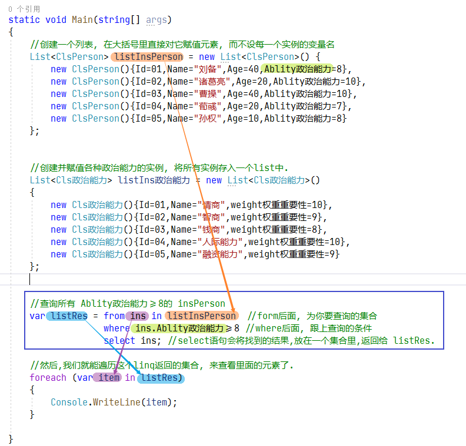

如果你指向返回满足查询条件的 所有insPerson 的name字段的话, 就这样写:
[,subs=+quotes]
----
//查询所有 Ablity政治能力>=8的 insPerson
var listRes = from ins in listInsPerson  //form后面, 为你要查询的集合
              where ins.Ablity政治能力>=8 //where后面, 跟上查询的条件
              select *ins.Name*; //select语句会将找到的结果,放在一个集合里,返回给 listRes.
----

就会输出:
....
刘备
诸葛亮
曹操
孙权
....
====

==== 同时搜索"满足两个条件"的实例

[,subs=+quotes]
----
//查询所有 Ablity政治能力>=8, 且 其Country字段是"魏" 的 insPerson
var listRes = from ins in listInsPerson   //form后面, 为你要查询的集合
              *where ins.Ablity政治能力 >= 8 && ins.Country == "魏"*  //where后面, 跟上查询的条件
              select ins;  //select语句会将找到的结果,放在一个集合里,返回给 listRes.
----

你也可以用匿名函数来实现:
[,subs=+quotes]
----
var listRes = *listInsPerson.Where(insPerson => insPerson.Ablity政治能力>=8 && insPerson.Country=="蜀");* //也可以给where传入lamda 表达式, 即匿名函数.
----

---

==== list实例的集合.Where(fn过滤函数) ← 能帮你过滤出符合条件的实例, 返回一个筛选处理的实例集合.

[,subs=+quotes]
----
namespace ConsoleApp2 {
    internal class Program {
        static void Main(string[] args) {
            //创建一个列表, 在大括号里直接对它赋值元素, 而不设每一个实例的变量名
            List<ClsPerson> listInsPerson = new List<ClsPerson>() {
                new ClsPerson(){Id=01,Name="刘备",Country="蜀",Age=40,Ablity政治能力=8},
                new ClsPerson(){Id=02,Name="诸葛亮",Country="蜀",Age=20,Ablity政治能力=10},
                new ClsPerson(){Id=02,Name="法正",Country="蜀",Age=30,Ablity政治能力=6},
                new ClsPerson(){Id=03,Name="曹操",Country="魏",Age=40,Ablity政治能力=10},
                new ClsPerson(){Id=04,Name="荀彧",Country="魏",Age=20,Ablity政治能力=7},
                new ClsPerson(){Id=04,Name="张辽",Country="魏",Age=30,Ablity政治能力=6},
                new ClsPerson(){Id=05,Name="孙权",Country="吴",Age=10,Ablity政治能力=8},
                new ClsPerson(){Id=05,Name="周瑜",Country="吴",Age=10,Ablity政治能力=9},
                new ClsPerson(){Id=05,Name="鲁肃",Country="吴",Age=10,Ablity政治能力=9}
            };

            //创建并赋值各种政治能力的实例, 将所有实例存入一个list中.
            List<Cls政治能力> listIns政治能力 = new List<Cls政治能力>()
            {
                new Cls政治能力(){Id=01,Name="情商",Weight权重重要性=10},
                new Cls政治能力(){Id=02,Name="智商",Weight权重重要性=9},
                new Cls政治能力(){Id=03,Name="钱商",Weight权重重要性=8},
                new Cls政治能力(){Id=04,Name="人际能力",Weight权重重要性=10},
                new Cls政治能力(){Id=05,Name="融资能力",Weight权重重要性=9}
            };

            *var listRes = listInsPerson.Where(fn过滤函数);*

            *static bool fn过滤函数(ClsPerson insPerson)* {
                if(insPerson.Ablity政治能力 >= 8) {
                    return true;
                }
                return false;
            }

            //然后,我们就能遍历这个linq返回的集合, 来查看里面的元素了.
            foreach (var item in listRes) {
                Console.WriteLine(item);
            }

        }
    }
}
----

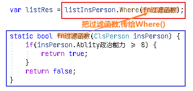

上面,也可以给where传入lamda 表达式, 即匿名函数.

[,subs=+quotes]
----
var listRes = listInsPerson.Where(*insPerson => insPerson.Ablity政治能力>=8*);
----

---

== 从多个list中, 做联合查询

.标题
====
例如：
[,subs=+quotes]
----
//用linq在两个list里面,做联合查询
var listRes = *from insPerson in listInsPerson*
              *from ins政治能力 in listIns政治能力*
              *select new { p = insPerson, c = ins政治能力 };* //为了同时返回 筛选出的 insPerson 和 ins政治能力, *我们把它们包装在一个临时对象中返回. 就是new出一个临时对象, 里面有两个字段, 一个是p,指向 筛选出的insPerson; 另一个字段是 c, 指向筛选出的ins政治能力.* 然后 select会把符合要求的 这些临时对象, 都放到数组中返回.
//在两个list中做联合查询,不做任何筛选的话, 比如 list1中有5个实例元素, list2中有8个实例元素. 联合查询就会返回它们的乘积数量, 即 5*8=40个实例元素.

//然后,我们就能遍历这个linq返回的集合, 来查看里面的元素了.
foreach (var item in listRes) {
    Console.WriteLine(item);
}
----

会输出: +
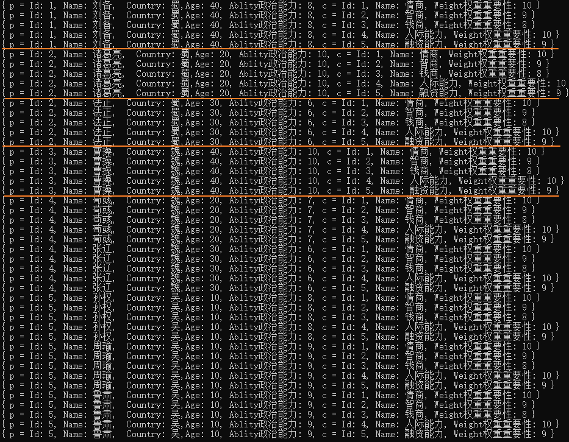

即: +
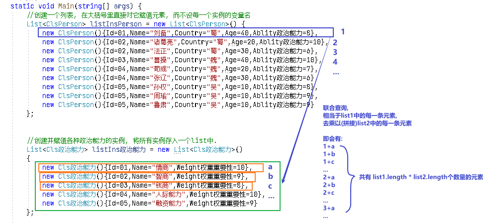
====

.标题
====
下面, 我们加上筛选条件: 找出两个列表联合起来看的话, 满足 insPerson中能力大于8的, 和"ins政治能力"中权重>=9的, 所有的实例.
[,subs=+quotes]
----
//用linq在两个list里面,做联合查询
var listRes = from insPerson in listInsPerson
              from ins政治能力 in listIns政治能力
              *where insPerson.Ablity政治能力 >8 && ins政治能力.Weight权重重要性>= 9* //找出两个列表联合起来看的话, 满足 insPerson中能力大于8的, 和"ins政治能力"中权重>=9的, 所有的实例.
              select new { p = insPerson, c = ins政治能力 };
----

输出:
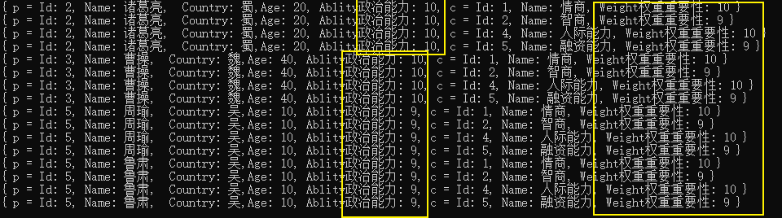

====

---

== 对筛选出的结果, 进行排序

==== 从小到大, 升序排列

[,subs=+quotes]
----
//查询所有 Ablity政治能力>=8的 insPerson
var listRes = from ins in listInsPerson   //form后面, 为你要查询的集合
              where ins.Ablity政治能力 >= 8  //where后面, 跟上查询的条件
              *orderby ins.Ablity政治能力* //按"Ablity政治能力"数值, 来进行排序(*默认是从小到大, 升序排列*)
              select ins;  //select语句会将找到的结果,放在一个集合里,返回给 listRes. 注意select语句末尾要加分号.
----

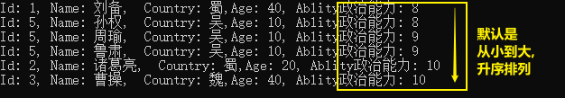

---

==== 降序排列 (从大到小)

[,subs=+quotes]
----
//查询所有 Ablity政治能力>=8的 insPerson
var listRes = from ins in listInsPerson   //form后面, 为你要查询的集合
              where ins.Ablity政治能力 >= 8  //where后面, 跟上查询的条件
              *orderby ins.Age descending* //按"Age"年龄数值, *来降序排序(从大到小), 就加上关键词 descending*
              select ins;  //select语句会将找到的结果,放在一个集合里,返回给 listRes. 注意select语句末尾要加分号.
----

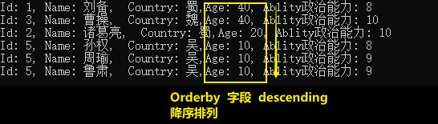

---

==== 对多字段排序, 比如对字段A, 要求升序; 对字段B 要求降序

[,subs=+quotes]
----
//查询所有 Ablity政治能力>=7的 insPerson
var listRes = from ins in listInsPerson   //form后面, 为你要查询的集合
              where ins.Ablity政治能力 >= 7  //where后面, 跟上查询的条件
              *orderby ins.Ablity政治能力, ins.Age descending //用逗号, 来分隔多字段. 比这里, 对政治能力数据, 就按默认的"升序"排列(从小到大). 若多个实例对象有相同数值的"政治能力", 就按第二个字段 Age, 按"降序"来排列(从大到小), 加上关键词 descending*
              select ins;  //select语句会将找到的结果,放在一个集合里,返回给 listRes. 注意select语句末尾要加分号.
----

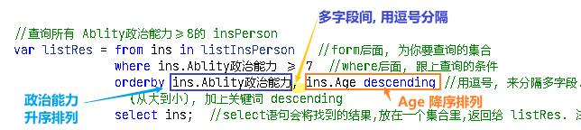

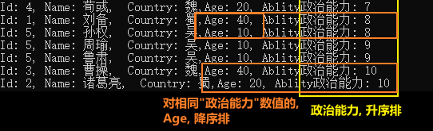

上面的代码, 也可以一句话写成:
[,subs=+quotes]
----
var listRes = *listInsPerson.Where(insPerson => insPerson.Ablity政治能力>7).OrderBy(insPerson=> insPerson.Ablity政治能力).ThenByDescending(insPerson => insPerson.Age);* //即先筛选出政治能力>7的所有实例, 然后, 对"政治能力"字段, 做升序排列(OrderBy()方法). 若该字段数值相同的实例, 就继续对 age字段做降序排列(ThenByDescending()方法).
----

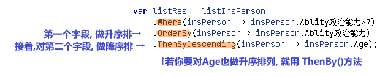

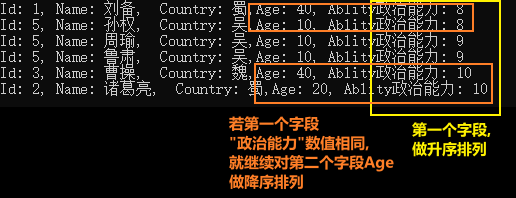

---

== 集合联合查询 (即将两个list中Cls的 "共同字段", 连接起来了) -> from... join... on... equals...

在C#的LINQ查询语句中，使用join子句可以实现多个表集合之间的连接，相当于SQL Server中的连接查询。

例如：在SQL Server中，分类表与产品表之间使用主外键实现的内连接。根据产品表中的分类ID就能查询出分类表中分类名称。

LINQ中join子句的基本语法如下：
....
join…in…on…equals…
....
on是比较的条件，如equals表示相等，一般用于两个集合中具有相等值的字段。

比如, 有两个类, 一个学生类，一个班级类，并使用泛型列表List<T>来存储数据。 +
在学生类中有一个班级Id属性，通过班级Id能够查询出所在的班级名称。

List<Student>相当于SQL Server中的学生表，List<OnClass>相当于班有表。

这里使用C#中的LINQ查询来模拟数据库表查询，实现这2个集合的连接，并查询出有用的信息。

....
学生类:
public class Student
{
public int CId { get; set; } //所在班级ID
}

班级类:
{
public int CId { get; set; } //班级ID
}

....

学生类中有一个Cid字段的值, 关联班级类中的Cid字段的值。相当于SQL Server中的外键关系。

.标题
====
例如：

ClsPerson类
[,subs=+quotes]
----
namespace ConsoleApp2 {
    public class ClsPerson {
        public int Id { get; set; }
        public string Name { get; set; }
        public string Country { get; set; }
        public int Age { get; set; }
       ** public int id专业方向的id号 { get; set; }**

        //public int Ablity政治能力 { get; set; }

        public override string ToString() {
            return $"{nameof(Id)}: {Id}, {nameof(Name)}: {Name},  {nameof(Country)}: {Country},{nameof(Age)}: {Age}, {nameof(id专业方向的id号)}: {id专业方向的id号}";
        }
    }
}
----

Cls专业方向:
[,subs=+quotes]
----
1namespace ConsoleApp2 {
    internal class Cls专业方向 {
        *public int id专业方向的id号 { get; set; }*
        //public List<string> list专业课程系列 { get; set; }
        public List<string> list就业方向系列 { get; set; }
        public int num社会名望 { get; set; }

        public override string ToString() {
            return $"{nameof(id专业方向的id号)}: {id专业方向的id号}, {nameof(list就业方向系列)}: {list就业方向系列}, {nameof(num社会名望)}: {num社会名望}";
        }
    }
}
----

主文件
[,subs=+quotes]
----
using System.Diagnostics.Metrics;

namespace ConsoleApp2 {
    internal class Program {
        static void Main(string[] args) {
            //创建一个列表, 在大括号里直接对它赋值元素, 而不设每一个实例的变量名
            List<ClsPerson> listInsPerson = new List<ClsPerson>() {
                new ClsPerson(){Id=01,Name="刘备",Country="蜀",Age=40,id专业方向的id号=8},
                new ClsPerson(){Id=02,Name="诸葛亮",Country="蜀",Age=20,id专业方向的id号=10},
                new ClsPerson(){Id=02,Name="法正",Country="蜀",Age=30,id专业方向的id号=6},
                new ClsPerson(){Id=03,Name="曹操",Country="魏",Age=40,id专业方向的id号=10},
                new ClsPerson(){Id=04,Name="荀彧",Country="魏",Age=20,id专业方向的id号=7},
                new ClsPerson(){Id=04,Name="张辽",Country="魏",Age=30,id专业方向的id号=6},
                new ClsPerson(){Id=05,Name="孙权",Country="吴",Age=10,id专业方向的id号=8},
                new ClsPerson(){Id=05,Name="周瑜",Country="吴",Age=10,id专业方向的id号=9},
                new ClsPerson(){Id=05,Name="鲁肃",Country="吴",Age=10,id专业方向的id号=9}
            };

            //创建多个 "Cls专业方向"的实例, 将所有实例存入一个list中.
            List<Cls专业方向> listIns专业方向 = new List<Cls专业方向>() {
                new Cls专业方向(){id专业方向的id号=6, list就业方向系列=new List<string>(){"內朝","外朝","刺史","太守"},num社会名望=6},
                new Cls专业方向(){id专业方向的id号=7, list就业方向系列=new List<string>(){"內朝","外朝"},num社会名望=6},
                new Cls专业方向(){id专业方向的id号=8, list就业方向系列=new List<string>(){"君主"},num社会名望=10},
                new Cls专业方向(){id专业方向的id号=9, list就业方向系列=new List<string>(){"內朝","丞相","外朝","都督"},num社会名望=8},
                new Cls专业方向(){id专业方向的id号=10, list就业方向系列=new List<string>(){"君主","內朝","丞相","外朝","都督"},num社会名望=10},
            };

            //下面, 将两个list做连接, 即这两个list中, 对应两个Cls类, *这两个类中, 有共同的字段存在. 就像"桥"一样, 就可以把两个"表格"连接起来.*
            var listRes = from insPerson in listInsPerson
                          *join ins专业方向 in listIns专业方向 on insPerson.id专业方向的id号 equals ins专业方向.id专业方向的id号* //join 表示将两个list做连接, on表示"连接的条件". 本处, 两个Cls中, 有共同的字段"id专业方向的id号"存在, 所以可以把它当做桥, 来联通两个list(两张表).
                          select new { obj1 = insPerson, obj2 = ins专业方向 };

            //然后,我们就能遍历这个linq返回的集合, 来查看里面的元素了.
            foreach (var item in listRes) {
                Console.WriteLine(item);
            }

        }
    }
}
----

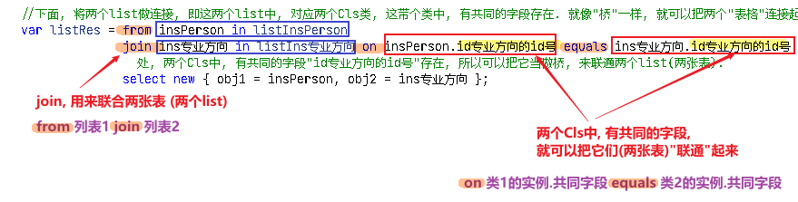

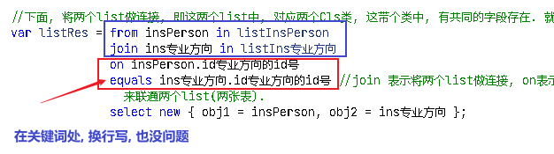

输出: +
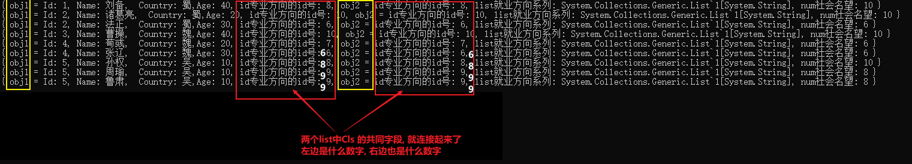

====

上面的代码, 两个list连接起来后, 还可以添加上条件查询语句:
[,subs=+quotes]
----
var listRes = *from* insPerson in listInsPerson
              *join* ins专业方向 in listIns专业方向
              *on* insPerson.id专业方向的id号
              *equals* ins专业方向.id专业方向的id号

              *where insPerson.Age>=30 && ins专业方向.num社会名望>=8*  //做条件查询
              select new { obj1 = insPerson, obj2 = ins专业方向 };
----

---

== 对结果进行分组操作 (分组查询)

微软官方文档 +
https://learn.microsoft.com/zh-cn/dotnet/csharp/linq/group-query-results

[,subs=+quotes]
----
//把 所有insPerson 按"id专业方向的id号"分组.
var queryRes = from insPerson in listInsPerson
               join ins专业方向 in listIns专业方向
               on insPerson.id专业方向的id号
               equals ins专业方向.id专业方向的id号

               *group new { insPerson, ins专业方向 } by ins专业方向.id专业方向的id号*; // 按 "ins专业方向.id专业方向的id号" 这个字段来分组.

//然后,我们就能遍历这个linq返回的集合, 来查看里面的元素了.
foreach (var item单个组 in queryRes) {
    foreach (var item in item单个组) {

        Console.WriteLine(item);
    }
}
----

---

==== 按字段分组, 并统计

[,subs=+quotes]
----
var queryRes = from insPerson in listInsPerson
               *group insPerson by insPerson.Country into newGroup* //将所有的insPerson实例, 做分组. 按什么字段来分组呢? 按Country字段来分组. 放到新的newGroup组里面去.
               *select new { count = newGroup.Count(), key = newGroup.Key };* //newGroup.Key 上的 Key属性, 存的就是你按"哪个字段"分段组的那个"字段名".

//然后,我们就能遍历这个linq返回的集合, 来查看里面的元素了.
foreach (var item in queryRes) { //返回的集合, 里面的元素, 就是上面new出来的obj对象,这个obj对象里面存了两个"键值对"字段, 一个是 count, 一个是 key.
    Console.WriteLine(item);
}
----

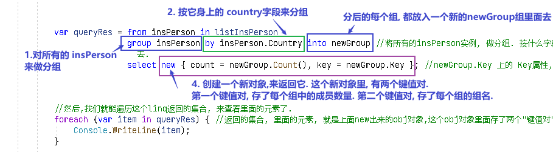

输出
....
{ count = 4, key = 蜀 }
{ count = 4, key = 魏 }
{ count = 4, key = 吴 }
....

每一组为一个IEnumberAble或IQeuryAble的集合，可以继续枚举。

说明：在linq里面，group by 和groupby是两个不同的概念，前者标识分组，后者标识排序。分组时如不特意制定select，则将分组后的结果作为结果集。

分组是根据一个特定的值将序列中的元素进行分组。LINQ只包含一个分组操作符：GroupBy。GroupBy操作符类似于T-SQL语言中的Group By语句。来看看GroupBy的方法定义：

从方法定义中可以看出：GroupBy的返回值类型是：IEnumerable<IGrouping<TKey, TSource>>。其元素类型是IGrouping<TKey, TSource>。TKey属性代表了分组时使用的关键值，TSource属性代表了分组之后的元素集合。遍历IGrouping<TKey, TSource>元素可以读取到每一个TSource类型。

---

== 查询判断

==== 是否有存在某个"字段值"的实例存在? (即excel表中,是否有存在某个字段值的 "行条目"存在?) → 只要有一个满足, 就返回 ture.

Any()用于判断集合中, 是否有元素满足某一条件.

[,subs=+quotes]
----
//判断某个list中的所有ins实例对象身上, 是否有满足某个条件(比如存在某个字段)的实例存在?
bool res = *listInsPerson.Any(insP => insP.Country == "蜀");* //判断listInsPerson中的所有实例身上,是否有存在 Country字段的值是"蜀"的 存在?
Console.WriteLine(res); //True
----

---

==== 判断一个集合中, 是否所有的实例, 它们的某个字段值, 全都等于某个数?

All() 用于判断集合中, **所有元素**是否都满足某一条件.

[,subs=+quotes]
----
bool res = listInsPerson.*All*(insP => insP.Country == "蜀"); //判断listInsPerson中, 是否全部的实例身上,其Country字段的值都是"蜀"?
Console.WriteLine(res); //False
----

---

====

Contains() 用于判断集合中, *是否包含有某一元素*.

---
