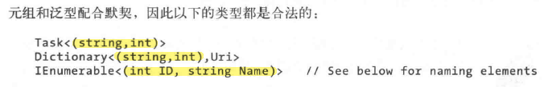

= tuple 元组
:sectnums:
:toclevels: 3
:toc: left

---

== tuple 元组

和匿名类型一样，元组（tuple)也是存储一组值的便捷方式。*元组的主要目的是不使用out参数, 而从方法中返回多个值(这是匿名类型做不到的)。*

**元组几乎可以做到匿名类型做到的任何事情，甚至更多。**而它的缺点之一是命名元素的运行时类型擦除。

[,subs=+quotes]
----
internal static class Program
{
    static void Main()
    {

        *//元组似乎不能用 Tuple作为变量前的类型定义, 只能用var?*
        *var theOne = ("zrx", 33);*
        Console.WriteLine(*theOne.Item1*); //zrx *←元组,要访问里面的元素, 只能使用 Item1, Item2 来访问.*
        Console.WriteLine(theOne.Item2); //33

        *//元组是"值类型", 可读可写.*
        theOne.Item1 = "slf";
        Console.WriteLine(theOne); //(slf, 33)

        *//定义元组时, 可以显示的指定"元组"中每一个元素的类型*
        *(string, int) theTwo = ("zzt", 5);*

        //调用下面的函数
        (string, int) tuple1 = fn打包成元组返回("tom", 35);
        Console.WriteLine(tuple1); //(tom, 35)
    }

    //下面的函数, 接收string 和 int参数, 然后在内部打包成元组返回.
    static (string,int) *fn打包成元组返回(string name, int age)*
    {
        return (name, age);
    }
}
----

[,subs=+quotes]
----

----

