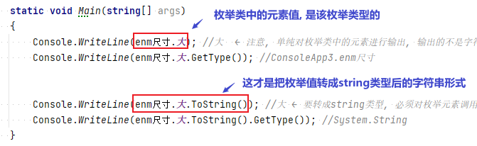
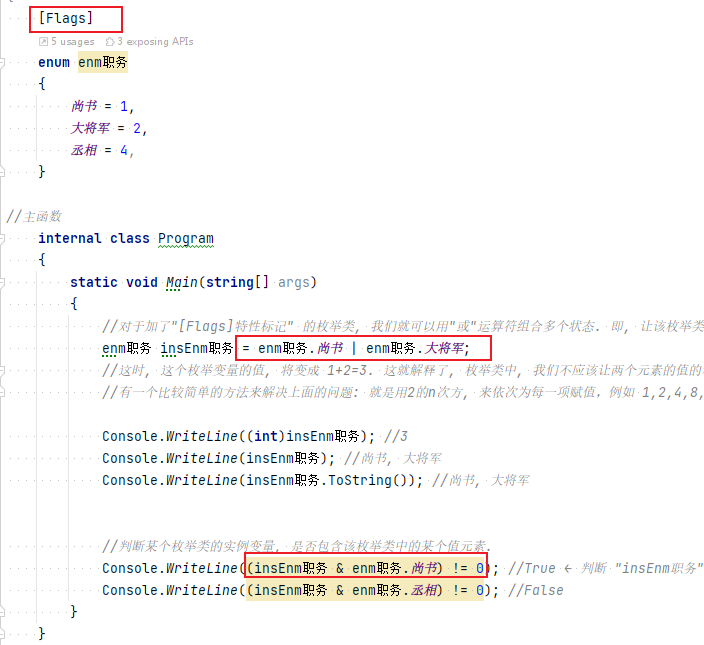
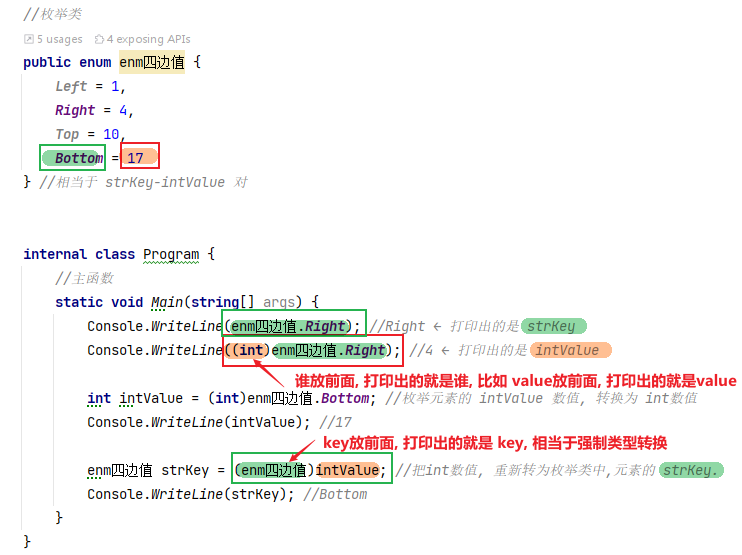
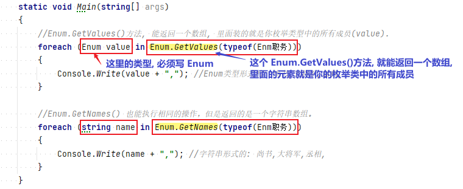


= 枚举类型
:sectnums:
:toclevels: 3
:toc: left

---

== 定义一个枚举类型

枚举, 是一个class类, 所以定义你自己的枚举类型时, 要和其他的class并列摆放. 即不要写在main函数里面!

[,subs=+quotes]
----
enum enmType职业
{
    皇帝, 丞相, 大都督, 刺史, 太守, 将军  *//注意:这些字符串不需要加双引号*
}

static void Main(string[] args)
{
    *enmType职业 status诸葛亮 = enmType职业.丞相;*
    Console.WriteLine(status诸葛亮); //丞相
}
----

又例: +
image:img/0002.png[,]

类中的字段, 使用枚举类型:
[,subs=+quotes]
----
//枚举也是个类, 要与其他类并排写
enum Enm级别枚举类 {
    皇帝,
    丞相,
    大都督,
    刺史,
    太守,  *//最后一个元素后,逗号可加可不加, 但一般都加着, 方便你扩充枚举元素*
}

internal class ClsPerson {
    public int Id { get; set; }
    public string Name { get; set; }
    *public Enm级别枚举类 enm级别 { get; set; }  //这个字段, 我们是用枚举类型*

    //构造函数
    public ClsPerson(int id, string name, *Enm级别枚举类 enm级别*) { //你在创建实例对象时, 要赋值进来一个枚举类的值.
        Id = id;
        Name = name;
        this.enm级别 = enm级别;
    }
}
----

'''

==== 将枚举类型中的元素值, 转为string类型

[,subs=+quotes]
----
//枚举类, 是个class, 不能写在函数里面.
enum enm尺寸
{
    大,
    中,
    小
}

//主函数
internal class Program
{
    static void Main(string[] args)
    {
        Console.WriteLine(*enm尺寸.大*); //大  ← *注意, 单纯对枚举类中的元素进行输出, 输出的不是字符串类型! 而是该枚举类型*
        Console.WriteLine(enm尺寸.大.GetType()); //ConsoleApp3.enm尺寸

        Console.WriteLine(*enm尺寸.大.ToString()*); //大 ← *要转成string类型, 必须对枚举元素调用 toString()方法.*
        Console.WriteLine(enm尺寸.大.ToString().GetType()); //System.String

        Console.WriteLine(*enm尺寸.大.GetType().Name*); // enm尺寸 ← *拿到"枚举类成员"的所属"枚举类型"的名字*
    }
}
----

'''

== 枚举类的 [flags] 特性标签

枚举类, 我们一般有两种用法:  +
-> 表示唯一的元素序列，例如一周里的各天 +
-> 还有就是**用来表示多种复合的状态, 这个时候一般需要为枚举加上[Flags]特性标记为位域. **

[,subs=+quotes]
----
*[Flags]*
enum enm职务
{
    尚书 = 1,
    大将军 = 2,
    丞相 = 4,
}

//主函数
internal class Program
{
    static void Main(string[] args)
    {
        *//对于加了"[Flags]特性标记" 的枚举类, 我们就可以用"或"运算符组合多个状态. 即, 让该枚举类的变量, 能拥有该枚举类中的多个元素*
        *enm职务 insEnm职务 = enm职务.尚书 | enm职务.大将军;*
        //这时, 这个枚举变量的值, 将变成 1+2=3. 这就解释了, 枚举类中, 我们不应该让两个元素的值的和, 等于第三个元素. 这会造成混乱.
        *//有一个比较简单的方法来解决上面的问题: 就是用2的n次方, 来依次为每一项赋值，例如 1,2,4,8,16,32,64 ...*

        Console.WriteLine((int)insEnm职务); //3
        Console.WriteLine(insEnm职务); //尚书, 大将军
        Console.WriteLine(insEnm职务.ToString()); //尚书, 大将军

        *//判断某个枚举类的实例变量, 是否包含该枚举类中的某个值元素.*
        Console.WriteLine(*(insEnm职务 & enm职务.尚书) != 0*); //True ← 判断 "insEnm职务"这个枚举实例, 其值是否包含"enm职务.尚书".
        Console.WriteLine((insEnm职务 & enm职务.丞相) != 0); //False
    }
}
----

要将 int形式,或字符串形式的枚举值, 转换回"枚举类中的元素"类型, 就用 Enum.Parse() 方法.

'''

== 枚举值有三种表示形式, 及它们之间的互相转换

枚举值有三种表示形式:

- enum成员
- 对应的整数
- 字符串

可以在这三种表达形式之间, 进行互相转换.

'''

== 枚举成员, 是有int值的

==== 成员的数值, 默认从0开始

不给成员赋值的话，成员的数值, 默认就从0开始 (类似于索引值 index了)

[,subs=+quotes]
----
*//直接打印枚举类中的元素, 会得到该元素的字符串.*
Console.WriteLine(*Enm级别枚举类.皇帝*); //皇帝

*//如果想看该枚举元素背后代表的int值, 就要先强制类型转换. 输出的结果, 就相当于是枚举元素的index值.*
Console.WriteLine(*(int) Enm级别枚举类.皇帝*); //0
Console.WriteLine((int) Enm级别枚举类.丞相); //1
----

'''

====  若给成员赋数值，则下一个成员的值, 就是上一个成员值+1

[,subs=+quotes]
----
internal class Program {
    enum enum状态 {
        a = 3,
        b,
        c
    }

    static void Main(string[] args) {
        Console.WriteLine(enum状态.b); //b ←直接输出枚举中的成员, 只会输出该成员名字
        Console.WriteLine(*(int)enum状态.b*);//4 *←你要转成int类型,才能看到它代表的数值.*
    }
}
----

这个功能有什么用呢? 可以用每个元素的数值, 来比较它们("各官职级别")的大小 :

[,subs=+quotes]
----
enum Enm级别枚举类 {
    皇帝 = 100,
    丞相 = 90,
    大都督 = 70,
    刺史 = 50,
    太守 = 20,
}

Console.WriteLine((int) Enm级别枚举类.皇帝); //100
Console.WriteLine(*(int) Enm级别枚举类.丞相*); //90
Console.WriteLine((int) Enm级别枚举类.大都督); //70
----

'''

== 枚举类型的实例, 可以与它对应的整数值, 相互显式转换

[,subs=+quotes]
----
public enum enm四边值 {
    Left = 1,
    Right = 4,
    Top = 10,
    Bottom = 17
} *//相当于 strKey-intValue 对*

internal class Program {
    //主函数
    static void Main(string[] args) {
        Console.WriteLine(*enm四边值.Right*); //Right ← *打印出的是 strKey*
        Console.WriteLine(*(int)enm四边值.Right*); //4 ← *打印出的是 intValue*

        int intValue = (int)enm四边值.Bottom; //枚举元素的 intValue 数值, 转换为 int数值
        Console.WriteLine(intValue); //17

        *enm四边值 strKey = (enm四边值)intValue; //强制类型转换. 把int数值, 重新转为枚举类中,元素的 strKey.*
        Console.WriteLine(strKey); //Bottom
    }
}
----

'''

== 可以在枚举类中的元素上, 做变量计算

[,subs=+quotes]
----
enum enum状态 {
    a = 3,   //相当于 key = value
    b,
    *c= a+ 5*  //可以在枚举中做变量计算, 即枚举成员的值, 可以等于某个成员值, 加上一另个值
}

static void Main(string[] args) {
    Console.WriteLine((int)enum状态.c); //8
}
----

'''

== 查

==== 以 value 取 key  -> Enum.GetName(typeof(insEnum), itemValue)

以元素的"数值 value", 来取到该元素的"名字 key" (以值取键) -> Enum.GetName(typeof(你的枚举类型),枚举元素的数值)

[,subs=+quotes]
----
enum enum状态 {
    a = 3, //相当于 key = value
    b,
    c
}

static void Main(string[] args) {

    *string itemName = Enum.GetName(typeof(enum状态),4);* 
    //*用 Enum.GetName(typeof(你的枚举类型),枚举元素的数值) ← 来获取"该元素数值"对应的"枚举成员的名字".* 即, 如果把枚举成员(是一个键值对)的名字看做 key, 它的数值看做 value的话, 就是 输入value, 来获取到其对应的key值.

    Console.WriteLine(itemName); //b
}
----

'''

==== 获取 all keys -> Enum.GetNames(typeof(insEnum))

获取你的枚举类型中, 所有成员的名字(即所有的 key), 返回一个字符串数组. -> Enum.GetNames(typeof(你的枚举类型))

[,subs=+quotes]
----
enum enum状态 {
    a = 3,  //相当于 key=value
    b,
    c
}

static void Main(string[] args) {
    *string[] arrName = Enum.GetNames(typeof(enum状态));* //获取你输入的枚举类型中, 所有成员的名字, 返回一个字符串数组.

    foreach (var item in arrName) {
        Console.WriteLine(item);
    }
}
----

'''

==== 获取 all values -> Enum.GetValues(typeof(insEnum))

获取你输入的枚举类型中, 所有成员的数值(即所有的 value), 返回一个Array 类型的集合. -> Enum.GetValues(typeof(你的枚举类型))

[,subs=+quotes]
----
enum enum状态 {
    a = 3,  //相当于 key=value
    b,
    c
}

static void Main(string[] args) {
    *Array arrValue = Enum.GetValues(typeof(enum状态));* //获取你输入的枚举类型中, 所有成员的名字, 返回一个字符串数组.

    foreach (var item in arrValue) {
        Console.WriteLine(item); //这个, 只会输出所有的 key名字
        Console.WriteLine(*(int)item*); //*这个, 才能输出 所有的 value值*
    }
}
----

'''

== 遍历你的枚举类中的所有成员 -> Enum.GetValues(typeof(你的枚举类))  或  Enum.GetNames(typeof(你的枚举类))

[,subs=+quotes]
----
enum Enm职务
{
    尚书 = 1,
    大将军 = 2,
    丞相 = 4,
}

//主函数
internal class Program
{
    static void Main(string[] args)
    {
        *//Enum.GetValues()方法, 能返回一个数组, 里面装的就是你枚举类型中的所有成员(value). "枚举类的成员"的类型, 是Enum类型的.*
        *foreach (Enum value in Enum.GetValues(typeof(Enm职务)))*
        {
            Console.Write(value+","); //Enum类型形式的: 尚书,大将军,丞相,
        }

        *//Enum.GetNames() 也能执行相同的操作，但是返回的是一个字符串数组。*
        *foreach (string name in Enum.GetNames(typeof(Enm职务)))*
        {
            Console.Write(name+","); //字符串形式的: 尚书,大将军,丞相,
        }

    }
}
----

'''

== 判断

==== 判断某 value 是否存在 -> Enum.IsDefined(typeof(insEnum), 你要查找的value值)

判断你传入的枚举类型中, 是否存在某个 value ? -> Enum.IsDefined(typeof(你的枚举类型), 你要查找的value值)

[,subs=+quotes]
----
enum enum状态 {
    a = 3,  //相当于 key=value
    b,
    c
}

static void Main(string[] args) {
    *bool res = Enum.IsDefined(typeof(enum状态), 5);* //判断你的"enum状态"这个枚举类型中, 是否有"成员值=5" 的元素存在?
    Console.WriteLine(res);
}
----

'''

