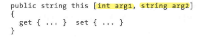

= 索引器
:sectnums:
:toclevels: 3
:toc: left

---

== 索引器

使用索引器的语法, 就像使用数组一样，不同之处在于索引参数, 可以是任意类型。

.标题
====
例如：

索引器, 是写在类中的.

含有索引器的类:

[,subs=+quotes]
----
internal class Cls含有索引器的类
{
    private string[] arr高官姓名 = { "诸葛亮","关羽","张飞","赵云" };

    *public string this[int index] //创建一个索引器. 该"索引器"的功能, 是把本类中的某个数组成员, 要访问其里面的元素时, 可以用 "实例对象[index]" 的方法,来访问.* 编写索引器, 首先要定义一个名为this的属性，并将参数定义(即索引 index)放在一对方括号中。

    {
        get
        {
            return arr高官姓名[index];
        }
        set
        {
            arr高官姓名[index] = value; // value就是用户会赋值的新值, 默认会由索引器中的 value变量来接收.
        }
    }
}
----

主文件
[,subs=+quotes]
----
static void Main(string[] args)
{
    Cls含有索引器的类 ins = new Cls含有索引器的类();

    Console.WriteLine**(ins[2]**); //张飞  *←可以把类的实例对象, 当做数组来使用. 这个"数组", 就是在类里面定义的"索引器"的功能*

    ins[3] = "黄忠";   //重新赋值
    Console.WriteLine(ins[3]); //黄忠
}
----

====

一个类型, 可以定义多个参数类型不同的索引器，一个索引器, 也可以包含多个参数:

如果省略set访问器，则索引器就是只读的.

'''

