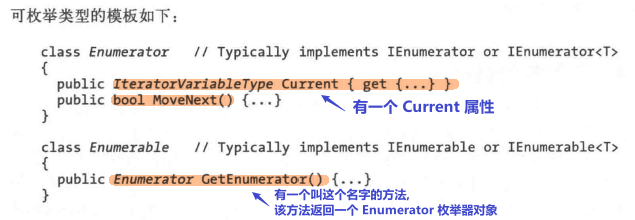
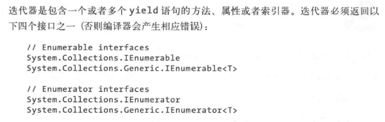
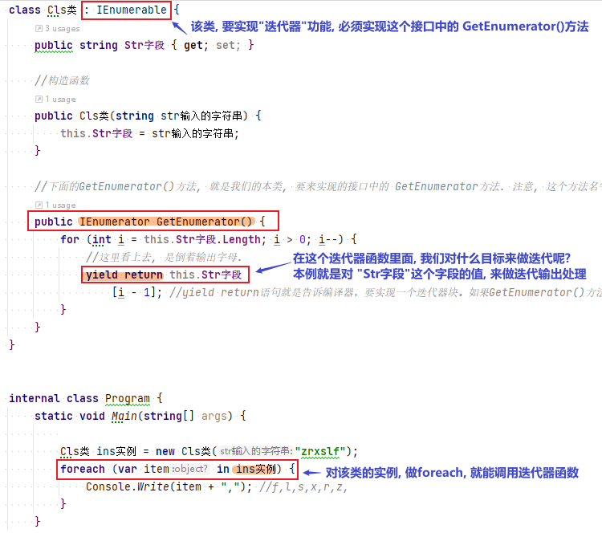
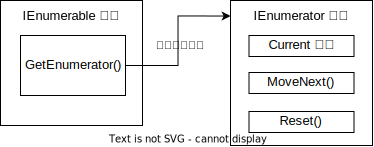
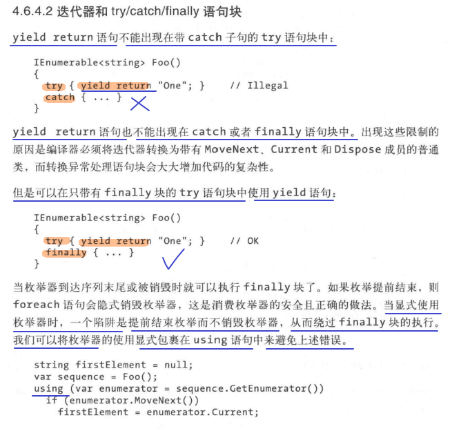

= 可枚举类型 & 迭代器
:sectnums:
:toclevels: 3
:toc: left

---

== 可枚举类型

枚举器(Enumerator), 是一个"只读"的, 且只能在"值序列"上前移的游标。枚举器实现下面的接口之一:

- system.collections.IEnumerator
- system.collections.Generic.IEnumerator<T>

**foreach 语句, 用来在可枚举（enumerable)的对象上, 执行迭代操作。**

可枚举的对象, 指逻辑上的"序列"，它本身不是游标，但是它可以在对象自身上, 生成游标.

*"可枚举的对"象可以是:*

- *实现了 IEnumerable 或 IEnumerable<T> 接口.*
- *具有名为 GetEnumerator() 的方法, 并且返回值是一个"枚举器(enumerator)对象".*

比如, 对于"zrxslf"这个字符串, 你当然可以用 foreach()来遍历输出每一个字母, 但你也可以手动定义一个枚举器, 来实现这个功能:

[,subs=+quotes]
----
using (*var enm枚举器 ="zrxslf".GetEnumerator()*) {
    while (*enm枚举器.MoveNext()*) {
        *var elm元素 = enm枚举器.Current;*
        Console.WriteLine(elm元素); //将"zrxslf"中的字母, 每行一个一个输出
    }
}
----

如果迭代器实现了 IDisposable 接口，则foreach语句, 也会起到using 语句的作用，来隐式销毁枚举器对象。

==== using

上面, using 的作用是什么?

using语法, 它清楚地说明一个通常比较占用资源的对象, 何时开始使用, 和何时被手动释放。当using可以被使用时，建议尽量使用using语句。

在.NET的环境中，托管的资源都将由.NET的垃圾回收机制来释放，而一些非托管的资源, 则需要程序员手动地将它们释放。

[options="autowidth"]
|===
|Header 1 |Header 2

|托管资源
|一般是指被CLR控制的内存资源，这些资源由CLR来管理。可以认为是.net 类库中的资源。

|非托管资源
|不受CLR控制和管理的资源，比如文件流，数据库的连接，网络连接，系统的窗口句柄，打印机资源等.
这类资源一般不存在堆上。可以认为操作系统资源的一组API。

对于托管资源，GC负责垃圾回收。*对于非托管资源，GC可以跟踪非托管资源的生存期，但是不知道如何释放它，这时候就要人工进行释放。*
|===

..NET提供了主动和被动两种释放"非托管资源"的方式,  即:

1. IDisposable接口的 Dispose()方法,
2. 类型自己的 Finalize()方法。 // Finalize [ VN] to complete the last part of a plan, trip, project, etc. 把（计划、旅行、项目等）最后定下来；定案

*任何带有"非托管资源"的类型，都有必要实现 IDisposable接口 的 Dispose()方法，并且在使用完这些类型后, 需要手动地调用对象的 Dispose()方法, 来释放对象中的"非托管资源"。*

如果类型正确地实现了Finalize()方法，那么即使不调用Dispose()方法，非托管资源也最终会被释放，但那时资源已经被很长时间地占据了。

*using语句的作用, 就是提供了一个高效的调用对象 Dispose()方法的方式。对于任何 IDisposable接口的类型，都可以使用 using语句.* 而对于那些没有实现IDisposable接口的类型，使用using语句, 则会导致一个编译错误。

使用using语句的基本语法:

[,subs=+quotes]
----

using(StreamWriter sw= new StreamWriter())
{
    // 中间处理逻辑
}
----

在上面代码中，**using语句一开始定义了一个StreamWriter的对象，之后在整个语句块中, 都可以使用 该sw实例对象.  在using语句块结束的时候，sw这个实例对象 的 Dispose()方法, 将会被自动调用。**

using语句不仅免除了程序员输入Dispose()调用的代码，它还提供了机制, 保证Dispose()方法被调用，无论using语句块顺利执行结束，还是抛出了一个异常。

还应该注意一点使用using时常犯的错误，那就是千万不要试图在using语句块外, 初始化对象 :

[,subs=+quotes]
----
MyDispose *md* = new MyDispose();

using (*md*)
{
    md.DoWork();
}
----

*上例子, 看上去似乎没有任何问题，但是在多线程的程序中，上述代码就会有隐患。试想当md被初始化后, 程序突然产生一个异常而中断，那md对象中的非托管资源, 将没有机会得到释放。所以在任何时候, 都应该在using语句中初始化需要使用的对象。*

总结: using语句为实现了 IDisposable 接口的类型对象, 调用Dispose()方法. *using语句能够保证使用的对象的Dispose()方法, 在using语句块结束时被调用，无论是否有异常被抛出。*

C#编译器在编译时, 会自动为 using语句, 加上try/finally块. 所以using的本质和异常捕获语句一样，但是语法更为简洁。

所有using使用的对象, 都应该在using语句开始后再初始化，以保证所有的对象都能够被Dispose()。

'''

== 迭代器

foreach语句, 是枚举器的"消费者". 而**迭代器, 则是枚举器的"生产者"。**

[,subs=+quotes]
----
*//下面的方法, 返回值是是一个 IEnumerable接口类型.* 该函数, 用来得到斐波那契数列. 即每一个数字, 是前两个数字之和. 即: num3 = num1 + num2.
static IEnumerable<int> fn斐波那契数列(int num想要输出几个数) {
    for (int i = 0, num1 = 1, num2 = 1; i < num想要输出几个数; i++) {
        yield return num1; *//yield return 语句表示“这是当前枚举器产生的下一个元素”。*
        int num3 = num1 + num2;
        num1 = num2;
        num2 = num3;
    }
}

static void Main(string[] args) {
    *foreach (var num斐波那契数 in fn斐波那契数列(6)) {*
        Console.Write(num斐波那契数 + ","); //1,1,2,3,5,8,

    }
}
}
----

return语句表示“这是该方法的返回值”，而yield return 语句则表示“这是当前枚举器产生的下一个元素”。

*在每条yield语句中，控制都返回给调用者*，但是必须同时维护调用者的状态(即指针现在正在指向了哪个元素?)，以便调用者枚举下一个元素的时候，方法能够继续执行。该状态的生命周期是与枚举器绑定的。当调用者枚举结束之后，该状态就可以被释放。

编译器, 将迭代方法(即函数), 转换为实现了 IEnumerable<T> 或 IEnumerator<T>的私有类。迭代器块中的代码逻辑, 被“反转”并分别进入编译器生成的 枚举器类的 MoveNext()方法 和 Current属性。

*当调用"迭代器方法"的时候，所做的仅仅是"实例化"编译器生成的类，而迭代器代码并没有真正执行。编写的迭代器代码, 只有当开始枚举序列时, 才开始执行，典型的如foreach语句。*

迭代器可以是局部方法.

**迭代器, 是包含一个或者多个yield语句的方法、属性或者索引器。**

迭代器必须返回以下四个接口之一 (否则编译器会产生相应错误):

*"迭代器"具有不同的语义，取决于迭代器返回的是"可枚举接口", 还是"枚举器接口"。*

迭代器模式, 是通过IEnumerator 和 IEnumerable接口, 以及它们的泛型版本来实现的。*如果某个类实现了IEnumerable接口，就说明它可以被迭代访问，调用GetEnumerator()方法将返回IEnumerator的实现，这个就是迭代器本身。*

在C# 1.0中，利用foreach语句实现了访问"迭代器"的内置支持，让集合的遍历变得简单、明了**。其实，foreach的实现就是调用 GetEnumerator 和MoveNext()方法, 以及Current属性。**所以说，在C# 1.0中要获得迭代器, 就必须实现IEnumerable接口中的GetEnumerator()方法. 要实现一个迭代器, 就要实现IEnumerator接口中的 MoveNext() 和 Reset()方法.

*通过C# 1.0中迭代器的代码看到，要实现一个迭代器, 就要实现 IEnumerator接口，然后实现IEnumerator接口中的MoveNext()、Reset()方法, 和Current属性。*

*在C# 2.0中提供的语法糖, 来简化迭代器的实现，可以通过yield关键字 来简化迭代器的实现。*

[,subs=+quotes]
----
*class Cls类 : IEnumerable {*
    public string Str字段 { get; set; }

    //构造函数
    public Cls类(string str输入的字符串) {
        this.Str字段 = str输入的字符串;
    }

    *//下面的GetEnumerator()方法, 就是我们的本类, 要来实现的接口中的 GetEnumerator方法. 注意, 这个方法名字必须写这个, 不能自定义名字.*
    *public IEnumerator GetEnumerator() {*
        for (int i = this.Str字段.Length; i > 0; i--) {
            //这里看上去, 是倒着输出字母.
            *yield return this.Str字段[i - 1]; //yield return语句就是告诉编译器，要实现一个迭代器块。如果GetEnumerator()方法的返回类型是非泛型接口，那么迭代器块的生成类型（yield type）是object，否则就是泛型接口的类型参数。*
        }
    }
}

internal class Program {
    static void Main(string[] args) {

        Cls类 ins实例 = new Cls类("zrxslf");
        *foreach (var item in ins实例) {*
            Console.Write(item + ","); //f,l,s,x,r,z,
        }
    }
}
----

当编译器遇到"迭代块"时，它创建了一个实现了状态机的"内部类"。这个类, 记住了我们迭代器的准确当前位置, 以及本地变量，包括参数。这个类, 它将所有需要记录的状态, 保存为实例变量。为了实现一个迭代器，这个状态机需要按顺序执行的操作：

- 它必须具有某个初始状态
- 当MoveNext()被调用时，他需要执行GetEnumerator()方法中的代码, 来准备下一个待返回的数据
- 当调用Current属性时，它必须返回上一个生成的数据.
- 需要知道什么时候迭代结束，MoveNext()会返回false

注意，当我们想要避免"迭代器"中的装箱和拆箱时，就要实现迭代器的"泛型"版本.

*通常为了实现IEnumerable，我们只会返回IEnumerator；如果仅仅是在方法中生成一个序列，可以返回IEnumerable。*

.IEnumerator 和 IEnumerable 的区别:

- *IEnumerator: 它是一个接口. 它里面规定了两种方法MoveNext和Reset, 还有一个称为Current的属性. 它是一个的集合访问器*，使用foreach()语句遍历集合或数组时，就是调用 Current、MoveNext()的结果。

[,subs=+quotes]
----
// 定义如下
public *interface IEnumerator*
{
    // 返回结果: 集合中的当前元素。
    object Current { get; }

    // 返回结果:   如果枚举数成功地推进到下一个元素，则为 true；如果枚举数越过集合的结尾，则为 false。
    bool MoveNext();

    // 调用结果:将枚举数, 设置为其初始位置，该位置位于集合中第一个元素之前。
    void Reset();
}
----

- *IEnumerable : 是个接口. 它利用 GetEnumerator() 返回 IEnumerator 集合访问器。*

[,subs=+quotes]
----
// 定义如下
public *interface IEnumerable*
{
    // 返回结果: 可用于循环访问集合的IEnumerator 对象。
    *IEnumerator GetEnumerator(); //该接口中, 声明了一个方法 GetEnumerator(), 该方法的返回值类型是 IEnumerator.*
}
----

IEnumerable是所有"可迭代非范型类"的基础接口。IEnumerable包括一个方法GetEnumerator方法，方法返回一个IEnumerator。

IEnumerator是所有"非范型迭代器"的基础接口。foreach语句隐藏了C#迭代器的复杂实现。推荐使用foreach代替直接操作迭代器。

迭代器可以读取集合中的数据，但是不能从底层修改集合。
初始的时候，迭代器定位在集合的第一个元素前面，在读取Current值之前, 需要调用一次MoveNext(), 将迭代器驱动到第一个元素的位置。
Current一直返回相同的元素直到调用了MoveNext或者Reset方法。MoveNext将Current推进到下一个元素。
如果MoveNext之后position超出了集合的范围，MoveNext将返回false。
通过调用Reset将Current重置到第一个元素之前。

*允许使用多个 yield statements.*

[,subs=+quotes]
----
*static IEnumerable<int> fn函数() { //注意:这个函数必须返回一个IEnumerable接口类型,而不是IEnumerator类型,它才能被当做迭代器来用,即用在foreach()里面. 因为在foreach开始时，会自动的去调用我们数据结构的 GetEnumerator()方法获取一个新的迭代器. GetEnumerator()方法显然只有在IEnumerable接口里才有.*
    yield return 100;
    yield return 200;
    yield return 300;
}

static void Main(string[] args) {
    *foreach (int res in fn函数()) {*
        Console.Write(res + ","); //100,200,300,
    }
}
----

'''

==== yield break

*yield break 语句, 表明迭代器块不再返回更多的元素, 而是提前退出。*

[,subs=+quotes]
----
*static IEnumerable<int> fn函数(bool bl是否暂停) {*
    yield return 100;
    yield return 200;

    if (bl是否暂停) {
        *yield break;*  //如果"bl是否暂停"变量为ture, 则本迭代器函数, 执行到这里后, 就会直接跳出, 而不会执行后面的"返回300"的语句.
    }

    yield return 300;
}

static void Main(string[] args) {
    *foreach (int res in fn函数(true)) {*
        Console.Write(res + ","); //100,200,
    }
}
----

迭代器语句块中使用return语句是非法的，应当使用yield break.

'''

==== yield return 可以出现在 try...finally 语句块中, 但不能出现在 try...catch 语句块中.

'''

