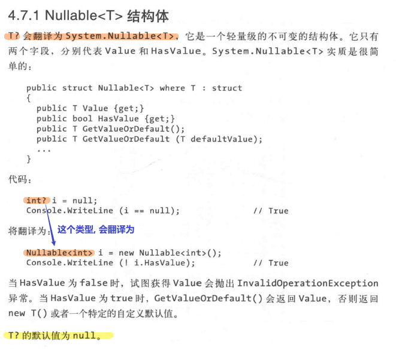

= 可空类型
:sectnums:
:toclevels: 3
:toc: left

---

== 可空类型

[,subs=+quotes]
----
string str = null; //null类型, 表示"引用类型"的空引用

//int num = null; //报错. ← 但是 int类型, 不能使用 null

*int? num = null;* //若要在值类型中表示null，则必须是用特殊的结构, 即"可空类型"(Nullable Type)。"可空类型"是由数据类型后加一个“?”表示的
----

事实上:

*注意: 从T到T?的转换, 是隐式的. 但反之则必须是显式的*:

[,subs=+quotes]
----
*int? num1 = null;*
Console.WriteLine(num1 == null); //True
num1 = 3;

//int num2 = num1; *//报错 :Cannot convert source type 'System.Nullable<int>' to target type 'int'*

*int num2 = (int)num1; //ok! 对于被 int? 声明过的变量num1, 你要赋给另一个int值, 就必须用强制类型转换, 把它重新转成 int类型.*
----

'''

180

