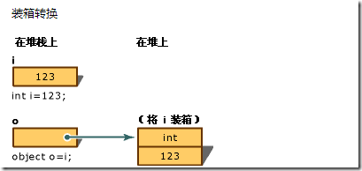
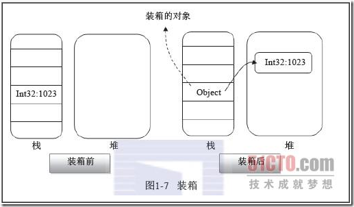
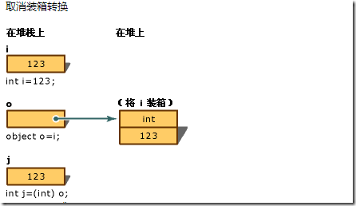
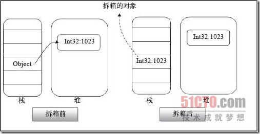

= 装箱 & 拆箱
:sectnums:
:toclevels: 3
:toc: left

---

== 装箱 & 拆箱

- 装箱 : 就是把"值类型", 变成 "引用类型"
- 拆箱 : 就是把"引用类型", 变成 "值类型"

[,subs=+quotes]
----
int num1 = 3;
*object obj = num1; //把"值类型", 变成"引用类型", 这就是"装箱". 注意, 这里之所以能转换成功, 是因为 int是obj的子类. 父类变量可以指向子类实例.*
Console.WriteLine(obj); //3

//int num2 = obj; //这里, *把"引用类型"变成"值类型", 就是"拆箱".* 这这句如果直接这样写, 会报错: Cannot convert initializer type 'object' to target type 'int'
**int num2 = (int)obj; //必须显式转换才行. **
----

什么是箱子? 就是引用类型对象. +
箱子放在哪里?托管堆上。

装箱和拆箱, 都涉及到内存的分配和对象的创建，有较大的性能影响。

如何避免隐身装箱？编码中，多使用泛型、显示装箱。

箱子就是一个引用类型对象，因此她的结构，主要包含两部分： +
1.值类型字段值； +
2.引用类型的标准配置，引用对象的额外空间：TypeHandle和同步索引块

装箱的过程？ +
1.在堆中申请内存，内存大小为值类型的大小，再加上额外固定空间（引用类型的标配：TypeHandle和同步索引块）； +
2.*将"值类型"的字段值（x=1023）, 拷贝新分配的内存中；* +
3.返回新引用对象的地址（给引用变量object o）

拆箱的过程？ +
1.检查实例对象（object o）是否有效，如是否为null，其装箱的类型与拆箱的类型（int）是否一致，如检测不合法，抛出异常； +
2.指针返回，就是获取装箱对象（object o）中值类型字段值的地址； +
3.字段拷贝，*把装箱对象（object o）中"值类型"字段值, 拷贝到栈上，意思就是创建一个新的"值类型"变量, 来存储拆箱后的值；*

box(装箱)消耗大 +
box在堆栈中创建一个新的对象，性能消耗大

[,subs=+quotes]
----
int i = 123;
// Boxing copies the value of i into object o.
object o = i;
----

过程 +
1、分配内存：在托管堆中分配好内存，内存的大小是值类型的各字段需要的内存量加上托管堆的所有对象都有的两个额外成员类型对象指针和同步块索引所需要的内存量之和。 +
2、复制对象：将值类型的字段, 复制到新分配的内存中 +
3、返回地址：将已装箱的"值类型"对象的地址, 返回给"引用类型"的变量

unboxing(拆箱) : +
1.检查对象实例 +
2.将该值从实例复制到值类型变量中

[,subs=+quotes]
----
int i = 123;      // a value type
object o = i;     // boxing
int j = (int)o;   // unboxing
----

过程 +
1、检查对象：检查类型是否为null，如果为空则抛出异常 +
2、返回地址：在堆中找到要拆箱对象的地址 +
3、数据拷贝：把object中的值类型字段, 拷贝到栈中，创建一个新的值对象, 来保存拷贝的值。

如何避免装箱拆箱 ?

- 使用重载方法，方法的参数提供不同的类型。
- 使用泛型，在.Net中有泛型集合，比如：ArrayList使用泛型集合：(List<T>) 来避免box，Hashtable对应着Dictionary<TKey, Tvalue>

如果在循环中会有某个值进行装箱，可以在循环外先装箱，避免在循环中装箱。

调用值类型的ToString()方法不会引起装箱。

'''
