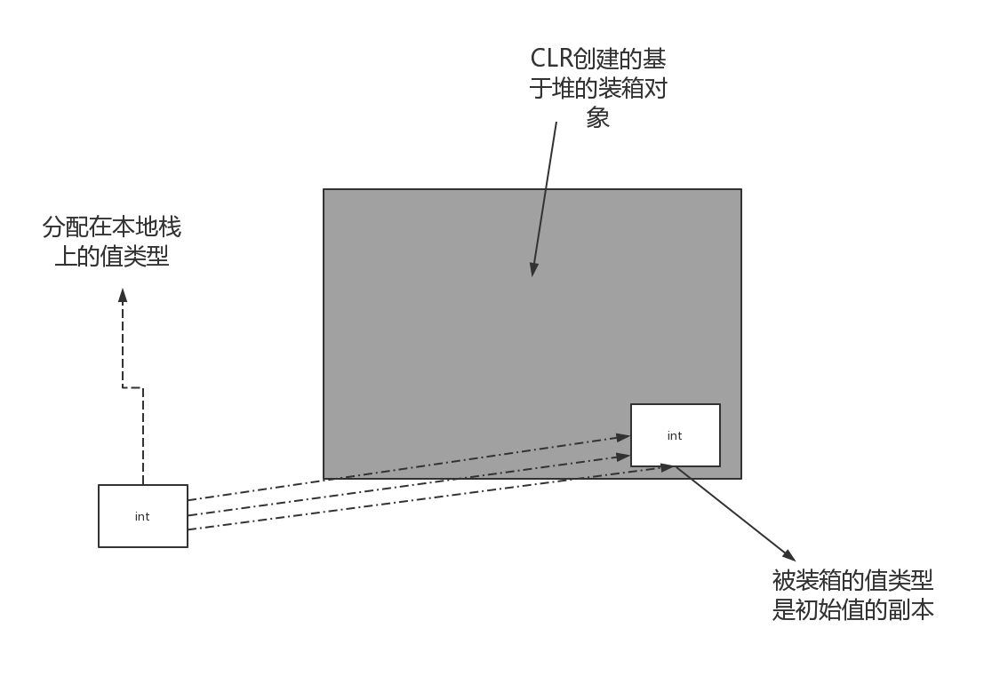


= 类型转换
:sectnums:
:toclevels: 3
:toc: left
---

== 查看数据的类型

==== 方法1 -> ins实例对象.GetType();

[,subs=+quotes]
----
Console.WriteLine(23.GetType()); //System.Int32
Console.WriteLine("zrx".GetType()); //System.String

string[] arrStr = new string[3];
Console.WriteLine(*arrStr.GetType()*); //System.String[]

Cls子类 ins子类 = new Cls子类("zrx",19);
Console.WriteLine(*ins子类.GetType()*); //ConsoleApp3.Cls子类
Console.WriteLine(*ins子类.age.GetType()*); //System.Int32
Console.WriteLine(*ins子类.age.GetType().FullName*); //System.Int32
----

'''

==== 方法2 -> typeof(Cls类型名).Name  ← 这个方法, 只能查看"class类"的类型, 不能查看"实例对象"的类型.

[,subs=+quotes]
----
Console.WriteLine(*typeof(Cls子类).Name*); //Cls子类
----

system.Type 同时还是运行时"反射模型"的访问入口。

'''

== var隐式类型

如果编译器, 能够从初始化表达式中, 推断出变量的类型，你就能够使用"var关键字"来代替"类型声明". 但是, var关键词, 会降低代码的可读性.

[,subs=+quotes]
----
*var x = new StringBuilder();*
Console.WriteLine(x); //输出空
----

'''

== object 类型

object类型(System.object), 是所有类型的最终"基类"。任何类型, 都可以"向上转换"为object类型.

==== 装箱 : 值 -> 引用类型(objcect类/接口)

装箱: 就是将"值类型"实例, 转换为"引用类型"实例的行为. +
引用类型可以是"object类"或"接口".

==== 拆箱 : 引用类型(objcect类/接口) -> 值

"拆箱"操作刚好相反，它把 object类型, 转换成原始的"值类型".

[,subs=+quotes]
----
//装箱: 将"值类型", 转成"引用类型"
int a = 8;
*object obj = a; //让"引用类型"的变量, 指针指向"值类型"的变量*
Console.WriteLine(obj); //8

//拆箱: 将"引用类型", 转成"值类型"
*int b = (int)obj;*
Console.WriteLine(b); //8
----

在C#中，"装箱"和"拆箱"发生在"值类型"与"引用类型"之间:

- 当我们把一个"值类型"转换成"引用类型"时，就发生了"装箱"操作.
- 反之，当我们将一个"引用类型"转换成"值类型"时，就发生了"拆箱"操作.

你用类来定义对象，用结构来定义值。二者之间存在一个清晰的界限。 *对象存活在有垃圾回收的内存堆上。值通常存活在临时的存储空间里，比如栈。如果值类型作为一个字段,被包含在一个对象中，那它就可以存活在堆上。*

简单地讲, 装箱就是把一个放在stack上的值, 移动到heap上，拆箱正好相反.

被装箱后，关键的点是 : **箱子内的值, 是初始值的"副本"，这意味着我们就算对箱子内的值进行更改，也不会影响到初始值**（但并不总是这样，如果使用接口类型进行装箱，则修改原始值是可能的）。

"装箱转换", 对系统提供一致性的数据类型至关重要。但这个体系并不是完美的: *数组和泛型的变量, 只能支持引用转换，不能支持"装箱转换":*

装箱拆箱中的复制语义: **装箱是把"值类型的实例", 复制到新对象中; 而拆箱是把对象的内容. 复制回"值类型的实例"中。**下面的示例修改了i的值，但并不会改变它先前装箱时复制的值:

[,subs=+quotes]
----
int i原始值 = 8;
object obj副本 = i原始值; //装箱. 装箱后, 其实是把i变量, 复制了一份, 由obj指针指向.

i原始值 = 3;  //你修改原始值, 对其副本是没有影响的.

Console.WriteLine(obj副本); //8
Console.WriteLine(i原始值); //3
----

[,subs=+quotes]
----

----

'''

== string

==== str + int = str

数字+字符串, 这个操作, 会把数字int, 也自动转成字符串string类型. 即, string + int 会调用 int的 ToString()方法.

[,subs=+quotes]
----
int age = 3;
double money = 8;

Console.WriteLine(age+money);  //11

*Console.WriteLine(age+"+"+money);  //3+8  ← 因为数字加字符串, 相当于都转成了字符串*

Console.WriteLine("a+b"+age+money);  //a+b38  ← age先和前面的字符串合并, 就会先把age转成了字符串, 再把money也转成了字符串, 最终就是 不存在数字的加减了.

Console.WriteLine("a+b"+(age+money));  //a+b11
----

'''

==== str -> int : 方法是 Convert.ToInt32(你的字符串类型的数字)

[,subs=+quotes]
----
*int a = Convert.ToInt32(Console.ReadLine());* 
// 该 Console.ReadLine()方法, 返回的是 string 类型的数据. 所以我们要用 Convert.ToInt32() 将"该string类型的数字", 转成 int 类型.
----

'''

== int

==== int → char

[,subs=+quotes]
----
int num = 103;
*char c = (char)num;*   //(char) 是强制类型转换成"字符类型".但注意, 大字节的变量数据, 强赛到小字节的变量空间里, 会导致数据丢失.
Console.WriteLine(c);  //本例会打印出一个"g"
----

'''

== Convert类

C# 中, 数据的基本类型有:  bool, char, string.System.DateTime, System.DateTimeOffset, 所有的C#数字类型.

静态类Convert, 定义了将每一个"基本类型"转换为其他"基本类型"的方法。可是这些方法大部分都没有什么实际用处，要么抛出异常，要么是隐式转换的冗余方法。然而，其中有一些方法还是很有用的.

**所有的基本类型, 都(显式)实现了 IConvertible，它定义了转换到其他基本类型的方法。**在大多数情况中，**每一种方法的实现, 都直接调用了Convert类的方法。**所以, 编写一个接受IConvertible类型的参数的方法, 在特定情况下是用处很大的。

==== Conver类的数字转换方法, 总是使用 四舍五入, 而非直接截断

[,subs=+quotes]
----
double d = 5.6;
*int i = Convert.ToInt32(d);* //在转换类型的同时, 四舍五入了
Console.WriteLine(i); //6
----

277
