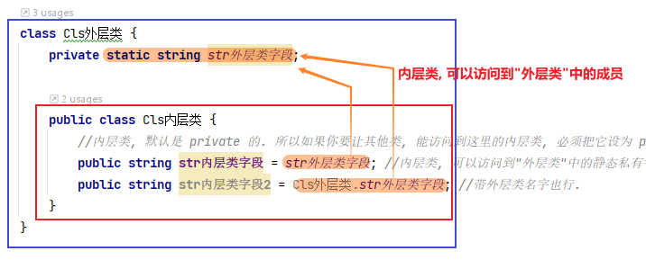
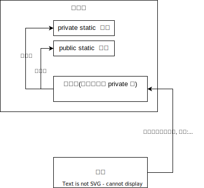
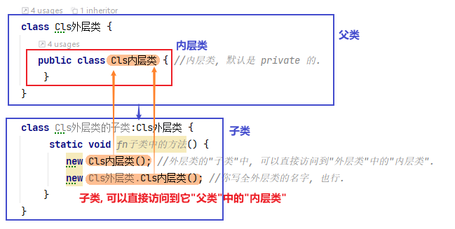

= 嵌套类
:sectnums:
:toclevels: 3
:toc: left

---

== 嵌套类

类中, 可以声明另一个类.

嵌套类型有如下的特征:

- 可以访问包含它的外层类型中的私有成员，以及外层类所能够访问的所有内容。
- 可以在声明上, 使用所有的访问权限修饰符，而不限于 public 和 internal。
- "嵌套类"的默认可访问性, 是 private 而不是 internal。
- 从"外层类"之外, 来访问"嵌套类"时, 需要使用外层类名称进行限定(就像访问静态成员一样)。

"嵌套类"在编译器中得到广泛应用，例如, 编译器在生成"迭代器"和"匿名方法"时, 就会生成包含这些结构内部状态的"私有(嵌套)类"。 +
使用"嵌套类"的主要原因, 是为了避免命名空间中, class 定义的杂乱无章。

'''

== 内层类, 可以访问到"外层类"中的 static 静态成员.

[,subs=+quotes]
----
class Cls外层类 {
    private *static* string str外层类字段;

    public class Cls内层类 {
        *//内层类, 默认是 private 的. 所以如果你要让其他类, 能访问到这里的内层类, 必须把它设为 public的. 否则, 其他类, 是看不到这里的内层类的.*
        public string str内层类字段 = str外层类字段; *//内层类, 可以访问到"外层类"中的静态私有字段 (注意: 必须是 static 的, 这是必要条件)*
    }
}

internal class Program {
    //主函数
    static void Main(string[] args) {
        *Cls外层类.Cls内层类 ins内层类实例 = new Cls外层类.Cls内层类(); //在外面, 要访问到内层类, 必须带上其外层类的名字.*
        Console.WriteLine(ins内层类实例.str内层类字段);
    }
}
----

'''

== 外层类的"子类"中, 可以直接访问到"外层类"中的"内层类"

[,subs=+quotes]
----
class Cls外层类 {
   public class Cls内层类 { //内层类, 默认是 private 的.
    }
}

class Cls外层类的子类:Cls外层类 {
     static void fn子类中的方法() {
        *new Cls内层类(); //外层类的"子类"中, 可以直接访问到"外层类"中的"内层类".*
        *new Cls外层类.Cls内层类(); //你写全外层类的名字, 也行.*
    }
}
----

'''

