= 函数
:sectnums:
:toclevels: 3
:toc: left

---

== 参数

==== 可变数量的参数 params -> 只能放在最后一个位置上.

在参数前面, 使用 params 关键词. 你就能给函数传入"任意数量"的参数了, params 会把这些参数, 封装在一个数组中. 然后就可以在函数体内, 来遍历操作该数组了.

params参数修饰符:

- 它能够使方法接受 任意数量的指定类型参数。
- 它只能修饰方法中的最后一个参数.
- *参数类型必须声明为数组.*

[,subs=+quotes]
----
internal class Program
{

    static int[] fn排序(string name, *params int[] arrInt) { //直接把传入的n个int数字, 打包成一个数组(相当于"零散存入, 整体接收"), 由arrInt变量来接收它.*
      Array.Sort(arrInt); //对你的数组实例, 进行排序. 该Array.Sort()方法没有返回值, 而是会直接修改原数组.
      return arrInt;
    }

    //主函数
    static void Main(string[] args) {
        int[] arrRes = *fn排序("zrx",4, 2, 5, 7, 54, 3, 8, 0, 15, 98, 44);*

        foreach (var item in arrRes) {
            Console.Write(item +","); //0,2,3,4,5,7,8,15,44,54,98,

        }
    }
}
----

又如:

[source, java]
----
static int fnMy(params int[] arr) //params关键词, 能帮我们把传入函数的不确定数目的参数, 自动组装到一个数组中
{
  int total = 0;
  foreach(int i in arr) {
      total += i;
  }
  return total;
}

int res= fnMy(4, 6, 2, 5, 7); //24
Console.WriteLine(res);
----

注意: params 参数, 必须是放在所有参数的最后一个位置上.

[source, java]
----
static string fnMy(string name, params string[] arrArgs) //放在最后才行
{
  foreach (var item in arrArgs):
  {
}
----

另外, 一个函数中, 只能出现一个"可变参数". 即只能有一个params 参数, 不能有多个, 因为C#没有这么智能, 能知道你到底要把多少数量的参数, 分在两个params 参数中.

'''

==== 可选参数(带有默认值) -> 必须放在"必填参数(无默认值的)"之后

在定义函数时, 如果你给函数参数, 设置了默认值, 那么你在调用该函数时, 就可以不用传入"该参数的值"了, 函数会自动使用"参数的默认值".

[,subs=+quotes]
----
internal class Program
{
    *//下面的函数, 我们给参数"v国籍"定义了一个默认值"china", 该参数就变成了"可选参数", 即你在调用函数时, 这个参数, 可以给它传入值, 也可以不传入值(就直接使用默认值).*
    static void fn函数(string name, *string v国籍 ="china"*) {
        Console.WriteLine($"名字:{name}, 你的国籍={v国籍}");
    }

    //主函数
    static void Main(string[] args) {

        fn函数("zrx"); //名字:zrx, 你的国籍=china
        fn函数("zrx","usa"); //名字:zrx, 你的国籍=usa

    }
}
----

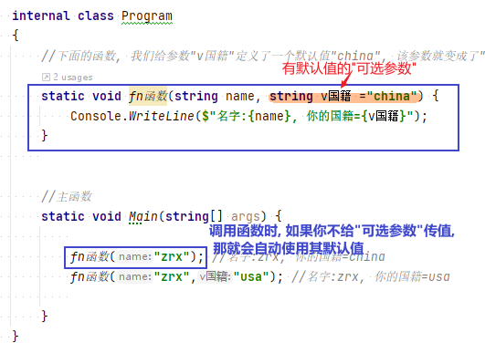

*注意: "可选参数"不能标记为 ref 或 out.*

另外, *你必须要填的参数, 必须放在"可选参数"之前.* 当然, 如果还有"params 可变参数"的话, 可变参数必须是放在最后的.  即: 三者如果同时出现, 位置是:
....
fn函数(1.必填参数, 2.可选参数=默认值, 3.params 可变数量的参数)
....

[,subs=+quotes]
----
*//下面的函数会报错, 因为"必填参数", 出现在了"可选参数"的后面.*
static void fn函数(string v国籍 ="china",string name ) {
    Console.WriteLine($"名字:{name}, 你的国籍={v国籍}");
}
----

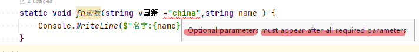

'''

==== 在调用函数时, 可以显式的指定参数名字, 但必须出现在"按位置传递的参数"前面

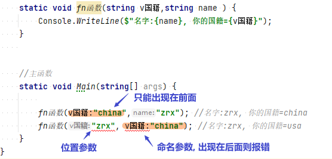

你显式地指定参数名字, 来传参, 这种用法, 在和"可选参数"混合使用时, 就很有用武之地了:
[,subs=+quotes]
----
//下面的函数中, 参数都是可选参数, 有默认值.
static void fn函数(*int id = 0, int money = 0, int age = 0*) {
    Console.WriteLine($"该人id:{id}, 钱={money},年龄={age} "); //该人id:0, 钱=1000,年龄=0
}

//主函数
static void Main(string[] args) {
    *fn函数(money: 1000); //由于该函数中的参数,都是可选参数(有默认值存在), 所以我们比如只想设置其中1个参数的值, 就可以只显示的声明该1个参数的名字.*
}
----

这个特性, 在调用 COM API 时 非常有用。

'''

== 函数参数: "按值传递", 还是按"引用传递"

==== 函数的参数, 会复制一份"从函数外传进来的实参"的副本

*默认情况下, 函数参数, 是"按值传递"的, 即, 函数内部, 会创建出一份参数值的副本.* 在函数内改变传进来的参数值, 不会影响函数外的那个值本身.

如果传进来的参数, 是"引用类型"呢? 那函数会把这个"指针"复制一份.

[,subs=+quotes]
----
internal class Program
    {
        static void fn函数**(StringBuilder ins函数内的可变字符串) { //这个参数,其实是一个指针.**
            ins函数内的可变字符串.Append("你好");
            ins函数内的可变字符串 = null; *//让指针重新指向一个空对象. 但这不影响之前"ins函数内的可变字符串"它所指向的实际对象的值.*
        }

        //主函数
        static void Main(string[] args) {

            StringBuilder ins外部的可变字符串 = new StringBuilder();
            fn函数(ins外部的可变字符串);
            Console.WriteLine(*ins外部的可变字符串.ToString()*); //你好
        }

    }
}
----

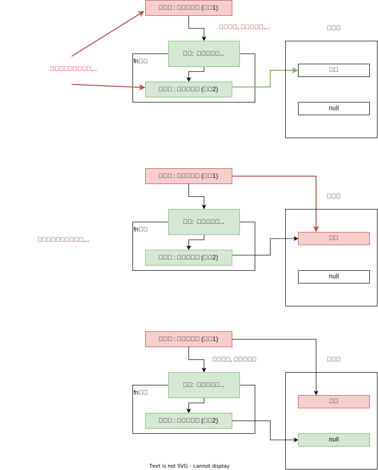

**即函数内对参数的修改, 不会影响到函数外的实参值. 但, 如果你在声明和调用函数时, 使用了 ref修饰符, 则函数内部, 就能直接修改函数外的实参值了. **

*使用 ref 和 out 修饰符, 可以控制参数的传递方式.*

[options="autowidth"]
|===
|参数修饰符 |传递类型 |必须明确赋值的变量

|无
|按值传递
|传入

|ref
|按引用传递
|传入

|out
|按引用传递
|传出
|===

*无论参数是"引用类型"还是"值类型", 都可以按"引用传递"或按"值传递".*

'''

==== ref 参数, 能直接在函数内, 改变传入的参数在函数外的实参值. -> 但, ref参数, 不要求你在函数内给它重新赋值. 它能获取到函数外的实参值.

[,subs=+quotes]
----
namespace ConsoleApp1 {

    internal class Program {

        *//如果你想让函数, 直接改变传入参数的实参的值, 就给这个参数, 加上 ref关键词.*
        public static void fn改变实参(*ref int a*) { //注意, 这个函数没有返回值,但它依然能直接改变外部实参的值.
            a += 1;
        }

        static void Main(string[] args) {
            int a = 3;
            *fn改变实参(ref a);  //调用函数时, 也要加上 ref.*
            Console.WriteLine(a); //4 *← 实参值被函数改变.*
        }
    }
}
----

如果你想用一个函数, 来交换函数外的两个变量的值, 那么ref 方法是必要的.

[,subs=+quotes]
----
internal class Program
{
    *//参数前使用了ref后, 就会在函数内, 直接修改到函数外的该参数来源的变量值.*
    static void fn交换两个变量的值(*ref int a, ref int b*) {
        int temp = a;
        a = b;
        b = temp;
    }

    //主函数
    static void Main(string[] args) {
        int a = 3;
        int b = 8;

        *fn交换两个变量的值(ref a, ref b);*

        Console.WriteLine(a); //8
        Console.WriteLine(b); //3
    }
}
----

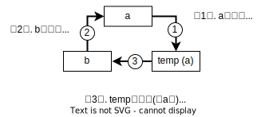

'''

==== ref, 也可以用于数组中的某一元素, 或对象上的某一字段身上

[,subs=+quotes]
----
int[] arrInt = { 0, 1, 2, 3, 4, 5 };

*ref int ref对某个数组元素的引用 = ref arrInt[3]; //即"ref对某个数组元素的引用"该变量, 指针指向了"arrInt"数组中索引位置=3 处的元素. 那么, 你直接改变这个指针变量指向的值, 就相当于改变了数组中该元素的值.*

ref对某个数组元素的引用 = 100;  *//通过外部的指针, 这里就直接改变了数组里元素的值*
Console.WriteLine(string.Join(",", arrInt)); //0,1,2,100,4,5
----

**引用局部变量的目标, 只能是"数组的元素"、"对象中的字段或者局部变量"﹔而不能是"属性"。**引用局部变量, 适用于在特定的场景下进行小范围优化，并通常和引用返回值合并使用。

从方法中返回的引用局部变量，称为"引用返回值"(ref return):

[,subs=+quotes]
----
internal class Program
{
    private static string str你的字符串 = "旧的str值";

    *//下面的静态方法, 返回值的类型, 就是 ref string 类型. 即返回一个字符串, 该字符串是 ref 引用类型的.*
    static *ref string* fn函数() {
        *return ref str你的字符串; //返回了一个指向"str你的字符串"的指针. 注意, 这个函数里, 是直接拿到函数外的"str你的字符串"变量的, 而不需要通过ref参数来拿到.*
    }

    //主函数
    static void Main(string[] args) {
        *ref string ref指针 = ref fn函数(); //将函数返回的指针, 赋给另一个ref变量接收. 注意, 这里等号右边, 不能直接写 fn函数(), 必须前面再加个 ref.* 否则会报错: Cannot initialize a by-reference variable with a value.

        ref指针 = "新的str值"; *//改变这个"指针所指向的变量"的值, 就是改变了那个变量本身.*
        Console.WriteLine(ref指针); //新的str值
    }

}
----

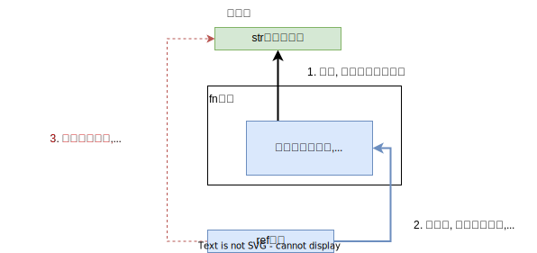

'''

==== out 参数, 会直接修改传入函数中的这个参数的"原始实参值"! -> 但 out参数, 要求必须在函数内部给它赋值! 即, 函数外即使它有值也没用, 你必须要在函数内, 重新给它赋一个值.

out参数和ref参数类似,但在以下几点上不同:

- 不需要在传入函数之前进行赋值。
- 必须在函数结束之前赋值。

*out修饰符, 通常用于获得方法的多个返回值.* +
*与ref参数一样，out参数按引用传递。*

[,subs=+quotes]
----
internal class Program
{
    *//参数前使用了out后, 就会直接修改到函数外的该参数来源的变量值.*
    static void fn函数(int a, *out int num两倍的a, out int num三倍的a*) {
        *num两倍的a = 2 * a;  //这个值, 会直接赋给函数外的"num两倍的a"变量上去.*
        num三倍的a = 3 * a; //这个值, 会直接赋给函数外的"num三倍的a"变量上去.
    }

    //主函数
    static void Main(string[] args) {
        int a = 3;
        *int num两倍的a; //这里我们没有赋值, 因为我们能在函数中, 来给这个函数外的变量赋到值.*
        int num三倍的a;

        *fn函数(a, out num两倍的a, out num三倍的a);  //调用该函数时, 里面的参数也要加上 out 关键词*

        Console.WriteLine(num两倍的a); //6
        Console.WriteLine(num三倍的a); //9
    }
}
----

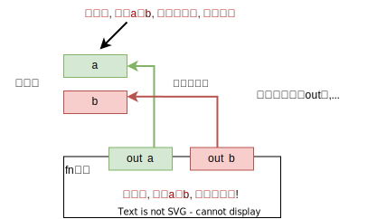

当调用含有多个out参数的方法时，若我们并非关注所有参数的值，那么可以使用下划线, 来“丢弃”那些不感兴趣的参数:

....
internal class Program
{
    //参数前使用了out后, 就会直接修改到函数外的该参数来源的变量值.
    static void fn函数(out string name, out string sex, out int age) {
        name = "wyy";
        sex = "female";
        age = 15;
    }

    //主函数
    static void Main(string[] args) {
        string name;  //只有声明, 无赋值.
        string sex;
        int age;

        fn函数(out _, out sex, out _); //调用函数, 由于我们只关心sex的值, 而不关心其他两个参数的值. 就用下划线_ 来作为"你不关心的参数"的名字.
        Console.WriteLine(sex); //female
    }
}
....

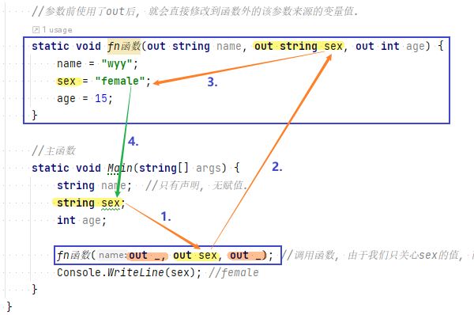

**此时，编译器会将"下划线"认定为一个特殊的符号，称为"丢弃符号"。**

可以一次丢弃多个参数. 比如, 下面的函数, 虽然有7个out参数，但我们只关心其中第4个(int类型的那个), 其他的全部丢弃:
....
SomeBigMethod(out _, out _, out _, out int x, out _, out _, out _);
....

但注意: 如果在作用域内，已经有一个名为下划线的变量的话，这个语言特性就失效了。

'''

==== ref 和 out 的区别

[options="autowidth"]
|===
||ref |out

|是指针
|√
|√

|
|
|*会把外面的参数值, 在函数体内清空, 重新赋值, 来返回.*

|
|*外面的参数传进函数之前, 必须先初始化(即赋值)*
|外面的参数传进函数之前, 可以不初始化, 而在函数体内赋值.

|
|如果希望函数内, 既能获得这个变量的值，又能在改动这个函数外的变量，用ref.（可读可写）
|如果希望函数内, 无法获得这个变量的值，但是能够改动这个函数外的变量，用out.（只写）
|===

[,subs=+quotes]
----
internal class Program {

    //下面的函数, 能返回多个不同类型的值. 注意: 函数不需要返回值, 所以是 void. *out参数会直接改变传进来的实参的值.*
    public static void fn函数( out int age, out string name, out int[] arrInt) { //这边形参的名字, 不需要跟传进来的实参的名字一致. 只要类型相同就行了.
        //out参数, 要求必须在方法的内部, 为其赋值.
        age = 19;
        name = "zrx";
        arrInt = new int[] { 1, 2, 3};

    }

    static void Main(string[] args) {

        int age;
        string name;
        int[] arrInt;

        *fn函数(out age, out name, out arrInt); //调用函数时, 其参数也要加上 out.*
        Console.WriteLine(age); //19
        Console.WriteLine(name); //zrx
        Console.WriteLine(arrInt); //System.Int32[]

    }
}
----

[,subs=+quotes]
----
internal class Program {

    public static void fn函数(*out* int a) {
        a = 456; *//即使传进来的参数a, 原先是有值的(=123), 也需要在函数中给它赋值才能通过.*
        Console.WriteLine(a); //456
    }

    static void Main(string[] args) {
        int a = 123;
        *fn函数(out a);*//456

        Console.WriteLine(a);//456 ←果然证明; 上面函数中的out参数, 实际上就是会改变实参的原始值.
    }
}
----

.标题
====
例如：

[,subs=+quotes]
----
namespace ConsoleApp1 {

    //下面是main函数
    internal class Program {

        *//下面的函数, 用来判断用户登录是否成功,  如果成功, 则同时再返回一个告知信息. 同样, 如果失败, 也返回一个告知信息.*
        *//注意, 我们这个函数, 返回的是一个bool值, 但用out来附带返回新的数据 string info提示信息.*
        public static *bool fn判断登录是否成功(string userName, int password, out string info提示信息) {*
            if (userName == "zrx" && password == 123) {
                info提示信息 = "登录成功"; //告知信息,必须写在return语句前面, 因为return语句之后的语句都不会被执行了.
                return true;
            }
            else if (userName == "zrx") {
                *info提示信息 = "密码错误!";*
                *return false;*
            }
            else if (password == 123) {
                info提示信息 = "用户名错误";
                return false;
            }
            else {
                info提示信息 = "用户名和密码, 都不正确";
                return false;
            }
        }

        static void Main(string[] args) {
            string userName;
            int password;
            *string info提示信息;*

            while (true) {
                Console.WriteLine("输入用户名:");
                userName = Console.ReadLine();

                Console.WriteLine("输入密码:");
                password = Convert.ToInt32(Console.ReadLine());

                *bool bl成功与否 = fn判断登录是否成功(userName, password, out info提示信息);*
                Console.WriteLine(info提示信息);
                Console.WriteLine("--------------");
                if (bl成功与否 == true) { break; }
            }
        }
    }
}
----

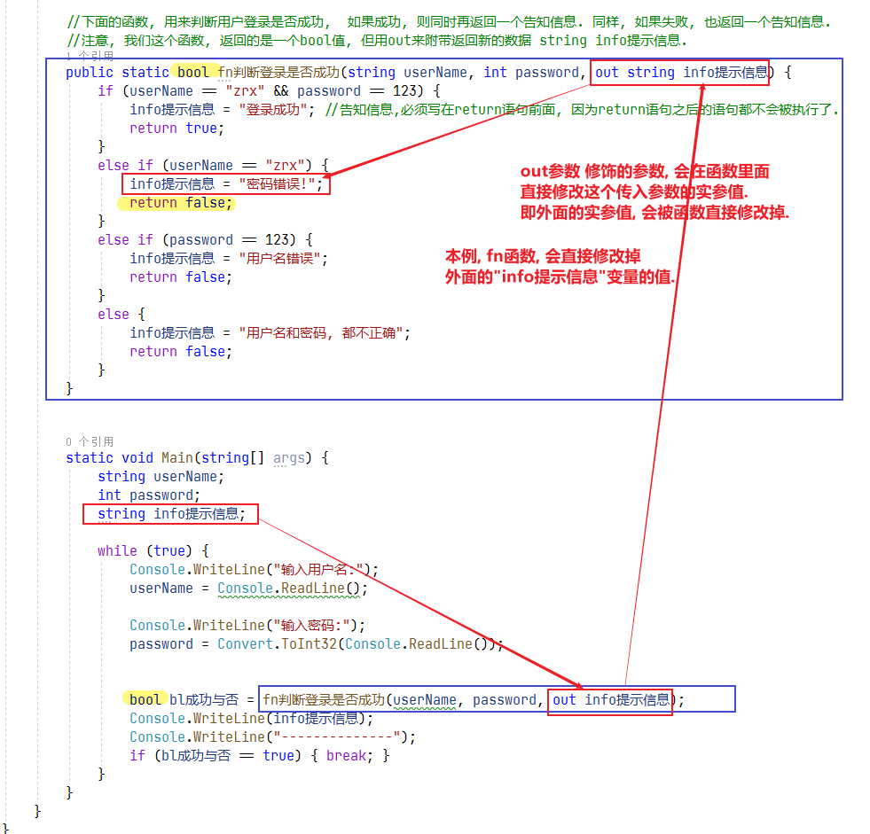

====

'''

== 函数的重载 -> 注意: 它不看"返回值类型"和"params修饰符"的不同.

比如, 你需要对两种不同的数据类型的变量, 执行相同的函数操作. 就可以定义两个同名函数, 函数体的功能相同, 但接收的参数类型不同. 比如, 一个函数对int做加法, 另一个同名函数对 double做加法.

[,subs=+quotes]
----
namespace ConsoleApp1 {
    internal class Program {

        //下面对同名的"fn加法"函数, 进行多个重载.
        public static *int fn加法(int a, int b)* { return a + b; }
        public static *int fn加法(int a, int b, int c)* { return a + b + c; }
        public static *double fn加法(double a, double b)* { return a + b; }
        public static *string fn加法(string a, string b)* { return a + b; }

        static void Main(string[] args) {
            Console.WriteLine(fn加法(5, 6)); //11
            Console.WriteLine(fn加法(1.2, 3.4)); //4.6
            Console.WriteLine(fn加法("zrx", "slf")); //zrxslf
        }
    }
}
----

函数（方法）重载   OverLoad

1.函数的名称相同，但是参数列表不同。

调用该函数的时候，会根据不用的参数，自动选择合适的函数重载形式。

2.参数不同的情况

①*如果参数的个数相同，那么参数的类型就不能相同;*

②*如果参数的类型相同，那么参数的个数就不能相同。*

*函数重载与返回值类型无关,* 只和参数类型、个数、顺序

[,subs=+quotes]
----
//下面对同名的"fn加法"函数, 进行多个重载.
public static *int* fn加法(int a, int b) { return a + b; }
public static *string* fn加法(int a, int b) { return "zrx"; } //*报错! 可知, 光有"返回值不同", 是不能构成"函数重载"的. 即, 决定权还是在参数那边. 必须参数的类型, 或参数数量不同, 才能构成"函数重载".  而不看"返回值"是否不同.*
----

*注意: 方法的"返回值类型"和"params修饰符", 不属于方法签名的一部分, 所以不能仅靠这两个的不同, 来重载函数.* +
比如, 下面的这两种重载就是错的.

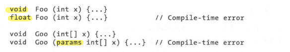

另外, *参数"按值传递"还是"按引用传递", 也是方法签名的一部分。* +
例如，Foo(int)和 Foo(*ref* int), 或Foo(int)同 Foo(*out* int), 可以同时出现在一个类中。 +
但Foo(*ref* int) 和 Foo(*out* int) 不能同时出现在一个类中:

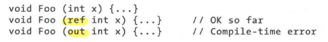

'''

== 函数的递归 -> 自己调用自己

递归. 就是函数在内部, 又调重自己.

用递归, 来求阶乘 : +

....
10!=10*9!
f(n)=n*f(n-1)    ← 这个是求阶乘的公式
....

[,subs=+quotes]
----
*static int fn阶乘(int n)*
{
  if (n == 1) { return 1; }
  *return n * fn阶乘(n - 1);  //这个函数在体内, 又调用自己. 套娃*
}

Console.WriteLine(fn阶乘(10)); //3628800
----

即: +
image:img/0009.png[,]

'''

== 箭头函数, lambda 表达式

[,subs=+quotes]
----
//有返回值的函数
int fn函数(int a) => a * 2;  *//箭头=> 就代表了花括号和return关键字.* 本处, 就等于是把 a*2的值 返回回去了.
Console.WriteLine(fn函数(99)); //198

//无返回值的函数
*void* fn函数2(int a) => Console.WriteLine(a);
fn函数2(99); //99
----

'''

== 方法中, 可以嵌套另一个方法

C# 允许在一个方法中, 定义另一个方法。被嵌套的方法函数, 就成了"局部方法".

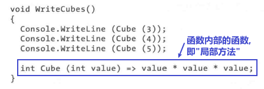

- 局部方法, 仅仅在包含它的"父方法"范围内可见.
- 局部方法, 可以访问"父方法"中的局部变量和参数.
- **局部方法不能用static修饰。**如果父方法是静态的，那么局部方法也是隐式静态的。

'''

