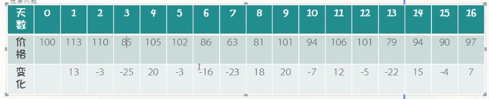
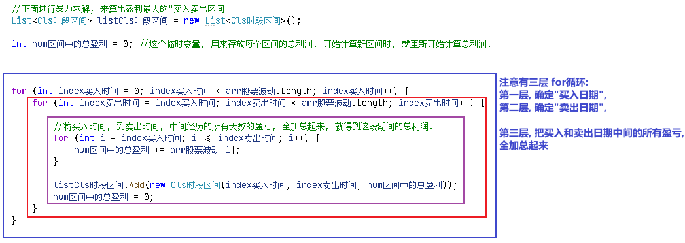

= 分治算法
:sectnums:
:toclevels: 3
:toc: left

---

== 分治算法 Divide-and-Conquer

"分治"法是一种很重要的算法。字面上的解释是“分而治之”，就是把一个复杂的问题分成两个或更多的相同或相似的子问题，再把子问题分成更小的子问题……直到最后子问题可以简单的直接求解，原问题的解即子问题的解的合并。这个技巧是很多高效算法的基础，如排序算法(快速排序，归并排序)，傅立叶变换(快速傅立叶变换)……

分治算法可以求解的一些经典问题:

- 二分搜索
- 大整数乘法
- 棋盘覆盖
- 合并排序
- 快速排序
- 线性时间选择
- 最接近点对问题
- 循环赛日程表
- 汉诺塔

分治法在每一层递归上都有三个步骤：

- 分解：将原问题分解为若干个规模较小，相互独立，*与原问题形式相同的子问题*
- 解决：若子问题规模较小而容易被解决, 则直接解; 否则, 递归地解各个子问题
- 合- 并：将各个子问题的解, 合并为原问题的解。

.标题
====
例如： +
问, 下面的股票, 你哪天买入, 哪天卖出, 才能使收益最大化?

[,subs=+quotes]
----
namespace ConsoleApp3 {
    internal class Program {
        static void Main(string[] args) {
            int[] arr股票每日价格 = { 100, 113, 110, 85, 105, 102, 86, 63, 81, 101, 94, 106, 101, 79, 94, 90, 97 };

            //创建一个用来存放每日股价相比昨天, 涨跌程度的数组.
            int[] arr股票波动 = new int[arr股票每日价格.Length];

            //给"arr股票波动"数组中的所有元素, 赋值
            for (int i = 1; i < arr股票每日价格.Length; i++) {
                arr股票波动[i] = arr股票每日价格[i] - arr股票每日价格[i - 1];
            }

            foreach (var item in arr股票波动) {
                Console.Write(item + " "); //0 13 -3 -25 20 -3 -16 -23 18 20 -7 12 -5 -22 15 -4 7
            }

            Console.WriteLine("arr股票波动,长度是={0}", arr股票波动.Length);

            //下面进行暴力求解, 来算出盈利最大的"买入卖出区间"
            List<Cls时段区间> listCls时段区间 = new List<Cls时段区间>();

            int num区间中的总盈利 = 0; //这个临时变量, 用来存放每个区间的总利润. 开始计算新区间时, 就重新开始计算总利润.

            for (int index买入时间 = 0; index买入时间 < arr股票波动.Length; index买入时间++) {
                for (int index卖出时间 = index买入时间; index卖出时间 < arr股票波动.Length; index卖出时间++) {

                    *//将买入时间, 到卖出时间, 中间经历的所有天数的盈亏, 全加总起来, 就得到这段期间的总利润.*
                    for (int i = index买入时间; i <= index卖出时间; i++) { *//注意中间是小于等于号! 而不是小于号.*
                        num区间中的总盈利 += arr股票波动[i];
                    }

                    listCls时段区间.Add(new Cls时段区间(index买入时间, index卖出时间, num区间中的总盈利));
                    num区间中的总盈利 = 0;
                }
            }

            //查看时间段列表中, 所有存储下来的区间段的盈利情况
            foreach (var insCls时段区间 in listCls时段区间) {
                Console.WriteLine(insCls时段区间);
            }

            Console.WriteLine("-----------------");

            //用linq, 来对列表中的所有ins实例, 排序某个字段的值
            var queryRes = from ins in listCls时段区间
                           orderby ins.num总利润 descending
                           select ins;

            foreach (var ins in queryRes) {
                Console.WriteLine(ins);
            }

        }
    }
}
----

打印出:
....
0 13 -3 -25 20 -3 -16 -23 18 20 -7 12 -5 -22 15 -4 7 arr股票波动,长度是=17
indexStart: 0, indexEnd: 0, num总利润: 0
indexStart: 0, indexEnd: 1, num总利润: 13
indexStart: 0, indexEnd: 2, num总利润: 10
indexStart: 0, indexEnd: 3, num总利润: -15
indexStart: 0, indexEnd: 4, num总利润: 5
indexStart: 0, indexEnd: 5, num总利润: 2
indexStart: 0, indexEnd: 6, num总利润: -14
indexStart: 0, indexEnd: 7, num总利润: -37
indexStart: 0, indexEnd: 8, num总利润: -19
indexStart: 0, indexEnd: 9, num总利润: 1
indexStart: 0, indexEnd: 10, num总利润: -6
indexStart: 0, indexEnd: 11, num总利润: 6
indexStart: 0, indexEnd: 12, num总利润: 1
indexStart: 0, indexEnd: 13, num总利润: -21
indexStart: 0, indexEnd: 14, num总利润: -6
indexStart: 0, indexEnd: 15, num总利润: -10
indexStart: 0, indexEnd: 16, num总利润: -3
indexStart: 1, indexEnd: 1, num总利润: 13
indexStart: 1, indexEnd: 2, num总利润: 10
indexStart: 1, indexEnd: 3, num总利润: -15
indexStart: 1, indexEnd: 4, num总利润: 5
indexStart: 1, indexEnd: 5, num总利润: 2
indexStart: 1, indexEnd: 6, num总利润: -14
indexStart: 1, indexEnd: 7, num总利润: -37
indexStart: 1, indexEnd: 8, num总利润: -19
indexStart: 1, indexEnd: 9, num总利润: 1
indexStart: 1, indexEnd: 10, num总利润: -6
indexStart: 1, indexEnd: 11, num总利润: 6
indexStart: 1, indexEnd: 12, num总利润: 1
indexStart: 1, indexEnd: 13, num总利润: -21
indexStart: 1, indexEnd: 14, num总利润: -6
indexStart: 1, indexEnd: 15, num总利润: -10
indexStart: 1, indexEnd: 16, num总利润: -3
indexStart: 2, indexEnd: 2, num总利润: -3
indexStart: 2, indexEnd: 3, num总利润: -28
indexStart: 2, indexEnd: 4, num总利润: -8
indexStart: 2, indexEnd: 5, num总利润: -11
indexStart: 2, indexEnd: 6, num总利润: -27
indexStart: 2, indexEnd: 7, num总利润: -50
indexStart: 2, indexEnd: 8, num总利润: -32
indexStart: 2, indexEnd: 9, num总利润: -12
indexStart: 2, indexEnd: 10, num总利润: -19
indexStart: 2, indexEnd: 11, num总利润: -7
indexStart: 2, indexEnd: 12, num总利润: -12
indexStart: 2, indexEnd: 13, num总利润: -34
indexStart: 2, indexEnd: 14, num总利润: -19
indexStart: 2, indexEnd: 15, num总利润: -23
indexStart: 2, indexEnd: 16, num总利润: -16
indexStart: 3, indexEnd: 3, num总利润: -25
indexStart: 3, indexEnd: 4, num总利润: -5
indexStart: 3, indexEnd: 5, num总利润: -8
indexStart: 3, indexEnd: 6, num总利润: -24
indexStart: 3, indexEnd: 7, num总利润: -47
indexStart: 3, indexEnd: 8, num总利润: -29
indexStart: 3, indexEnd: 9, num总利润: -9
indexStart: 3, indexEnd: 10, num总利润: -16
indexStart: 3, indexEnd: 11, num总利润: -4
indexStart: 3, indexEnd: 12, num总利润: -9
indexStart: 3, indexEnd: 13, num总利润: -31
indexStart: 3, indexEnd: 14, num总利润: -16
indexStart: 3, indexEnd: 15, num总利润: -20
indexStart: 3, indexEnd: 16, num总利润: -13
indexStart: 4, indexEnd: 4, num总利润: 20
indexStart: 4, indexEnd: 5, num总利润: 17
indexStart: 4, indexEnd: 6, num总利润: 1
indexStart: 4, indexEnd: 7, num总利润: -22
indexStart: 4, indexEnd: 8, num总利润: -4
indexStart: 4, indexEnd: 9, num总利润: 16
indexStart: 4, indexEnd: 10, num总利润: 9
indexStart: 4, indexEnd: 11, num总利润: 21
indexStart: 4, indexEnd: 12, num总利润: 16
indexStart: 4, indexEnd: 13, num总利润: -6
indexStart: 4, indexEnd: 14, num总利润: 9
indexStart: 4, indexEnd: 15, num总利润: 5
indexStart: 4, indexEnd: 16, num总利润: 12
indexStart: 5, indexEnd: 5, num总利润: -3
indexStart: 5, indexEnd: 6, num总利润: -19
indexStart: 5, indexEnd: 7, num总利润: -42
indexStart: 5, indexEnd: 8, num总利润: -24
indexStart: 5, indexEnd: 9, num总利润: -4
indexStart: 5, indexEnd: 10, num总利润: -11
indexStart: 5, indexEnd: 11, num总利润: 1
indexStart: 5, indexEnd: 12, num总利润: -4
indexStart: 5, indexEnd: 13, num总利润: -26
indexStart: 5, indexEnd: 14, num总利润: -11
indexStart: 5, indexEnd: 15, num总利润: -15
indexStart: 5, indexEnd: 16, num总利润: -8
indexStart: 6, indexEnd: 6, num总利润: -16
indexStart: 6, indexEnd: 7, num总利润: -39
indexStart: 6, indexEnd: 8, num总利润: -21
indexStart: 6, indexEnd: 9, num总利润: -1
indexStart: 6, indexEnd: 10, num总利润: -8
indexStart: 6, indexEnd: 11, num总利润: 4
indexStart: 6, indexEnd: 12, num总利润: -1
indexStart: 6, indexEnd: 13, num总利润: -23
indexStart: 6, indexEnd: 14, num总利润: -8
indexStart: 6, indexEnd: 15, num总利润: -12
indexStart: 6, indexEnd: 16, num总利润: -5
indexStart: 7, indexEnd: 7, num总利润: -23
indexStart: 7, indexEnd: 8, num总利润: -5
indexStart: 7, indexEnd: 9, num总利润: 15
indexStart: 7, indexEnd: 10, num总利润: 8
indexStart: 7, indexEnd: 11, num总利润: 20
indexStart: 7, indexEnd: 12, num总利润: 15
indexStart: 7, indexEnd: 13, num总利润: -7
indexStart: 7, indexEnd: 14, num总利润: 8
indexStart: 7, indexEnd: 15, num总利润: 4
indexStart: 7, indexEnd: 16, num总利润: 11
indexStart: 8, indexEnd: 8, num总利润: 18
indexStart: 8, indexEnd: 9, num总利润: 38
indexStart: 8, indexEnd: 10, num总利润: 31
indexStart: 8, indexEnd: 11, num总利润: 43
indexStart: 8, indexEnd: 12, num总利润: 38
indexStart: 8, indexEnd: 13, num总利润: 16
indexStart: 8, indexEnd: 14, num总利润: 31
indexStart: 8, indexEnd: 15, num总利润: 27
indexStart: 8, indexEnd: 16, num总利润: 34
indexStart: 9, indexEnd: 9, num总利润: 20
indexStart: 9, indexEnd: 10, num总利润: 13
indexStart: 9, indexEnd: 11, num总利润: 25
indexStart: 9, indexEnd: 12, num总利润: 20
indexStart: 9, indexEnd: 13, num总利润: -2
indexStart: 9, indexEnd: 14, num总利润: 13
indexStart: 9, indexEnd: 15, num总利润: 9
indexStart: 9, indexEnd: 16, num总利润: 16
indexStart: 10, indexEnd: 10, num总利润: -7
indexStart: 10, indexEnd: 11, num总利润: 5
indexStart: 10, indexEnd: 12, num总利润: 0
indexStart: 10, indexEnd: 13, num总利润: -22
indexStart: 10, indexEnd: 14, num总利润: -7
indexStart: 10, indexEnd: 15, num总利润: -11
indexStart: 10, indexEnd: 16, num总利润: -4
indexStart: 11, indexEnd: 11, num总利润: 12
indexStart: 11, indexEnd: 12, num总利润: 7
indexStart: 11, indexEnd: 13, num总利润: -15
indexStart: 11, indexEnd: 14, num总利润: 0
indexStart: 11, indexEnd: 15, num总利润: -4
indexStart: 11, indexEnd: 16, num总利润: 3
indexStart: 12, indexEnd: 12, num总利润: -5
indexStart: 12, indexEnd: 13, num总利润: -27
indexStart: 12, indexEnd: 14, num总利润: -12
indexStart: 12, indexEnd: 15, num总利润: -16
indexStart: 12, indexEnd: 16, num总利润: -9
indexStart: 13, indexEnd: 13, num总利润: -22
indexStart: 13, indexEnd: 14, num总利润: -7
indexStart: 13, indexEnd: 15, num总利润: -11
indexStart: 13, indexEnd: 16, num总利润: -4
indexStart: 14, indexEnd: 14, num总利润: 15
indexStart: 14, indexEnd: 15, num总利润: 11
indexStart: 14, indexEnd: 16, num总利润: 18
indexStart: 15, indexEnd: 15, num总利润: -4
indexStart: 15, indexEnd: 16, num总利润: 3
indexStart: 16, indexEnd: 16, num总利润: 7
-----------------
indexStart: 8, indexEnd: 11, num总利润: 43
indexStart: 8, indexEnd: 9, num总利润: 38
indexStart: 8, indexEnd: 12, num总利润: 38
indexStart: 8, indexEnd: 16, num总利润: 34
indexStart: 8, indexEnd: 10, num总利润: 31
indexStart: 8, indexEnd: 14, num总利润: 31
indexStart: 8, indexEnd: 15, num总利润: 27
indexStart: 9, indexEnd: 11, num总利润: 25
indexStart: 4, indexEnd: 11, num总利润: 21
indexStart: 4, indexEnd: 4, num总利润: 20
indexStart: 7, indexEnd: 11, num总利润: 20
indexStart: 9, indexEnd: 9, num总利润: 20
indexStart: 9, indexEnd: 12, num总利润: 20
indexStart: 8, indexEnd: 8, num总利润: 18
indexStart: 14, indexEnd: 16, num总利润: 18
indexStart: 4, indexEnd: 5, num总利润: 17
indexStart: 4, indexEnd: 9, num总利润: 16
indexStart: 4, indexEnd: 12, num总利润: 16
indexStart: 8, indexEnd: 13, num总利润: 16
indexStart: 9, indexEnd: 16, num总利润: 16
indexStart: 7, indexEnd: 9, num总利润: 15
indexStart: 7, indexEnd: 12, num总利润: 15
indexStart: 14, indexEnd: 14, num总利润: 15
indexStart: 0, indexEnd: 1, num总利润: 13
indexStart: 1, indexEnd: 1, num总利润: 13
indexStart: 9, indexEnd: 10, num总利润: 13
indexStart: 9, indexEnd: 14, num总利润: 13
indexStart: 4, indexEnd: 16, num总利润: 12
indexStart: 11, indexEnd: 11, num总利润: 12
indexStart: 7, indexEnd: 16, num总利润: 11
indexStart: 14, indexEnd: 15, num总利润: 11
indexStart: 0, indexEnd: 2, num总利润: 10
indexStart: 1, indexEnd: 2, num总利润: 10
indexStart: 4, indexEnd: 10, num总利润: 9
indexStart: 4, indexEnd: 14, num总利润: 9
indexStart: 9, indexEnd: 15, num总利润: 9
indexStart: 7, indexEnd: 10, num总利润: 8
indexStart: 7, indexEnd: 14, num总利润: 8
indexStart: 11, indexEnd: 12, num总利润: 7
indexStart: 16, indexEnd: 16, num总利润: 7
indexStart: 0, indexEnd: 11, num总利润: 6
indexStart: 1, indexEnd: 11, num总利润: 6
indexStart: 0, indexEnd: 4, num总利润: 5
indexStart: 1, indexEnd: 4, num总利润: 5
indexStart: 4, indexEnd: 15, num总利润: 5
indexStart: 10, indexEnd: 11, num总利润: 5
indexStart: 6, indexEnd: 11, num总利润: 4
indexStart: 7, indexEnd: 15, num总利润: 4
indexStart: 11, indexEnd: 16, num总利润: 3
indexStart: 15, indexEnd: 16, num总利润: 3
indexStart: 0, indexEnd: 5, num总利润: 2
indexStart: 1, indexEnd: 5, num总利润: 2
indexStart: 0, indexEnd: 9, num总利润: 1
indexStart: 0, indexEnd: 12, num总利润: 1
indexStart: 1, indexEnd: 9, num总利润: 1
indexStart: 1, indexEnd: 12, num总利润: 1
indexStart: 4, indexEnd: 6, num总利润: 1
indexStart: 5, indexEnd: 11, num总利润: 1
indexStart: 0, indexEnd: 0, num总利润: 0
indexStart: 10, indexEnd: 12, num总利润: 0
indexStart: 11, indexEnd: 14, num总利润: 0
indexStart: 6, indexEnd: 9, num总利润: -1
indexStart: 6, indexEnd: 12, num总利润: -1
indexStart: 9, indexEnd: 13, num总利润: -2
indexStart: 0, indexEnd: 16, num总利润: -3
indexStart: 1, indexEnd: 16, num总利润: -3
indexStart: 2, indexEnd: 2, num总利润: -3
indexStart: 5, indexEnd: 5, num总利润: -3
indexStart: 3, indexEnd: 11, num总利润: -4
indexStart: 4, indexEnd: 8, num总利润: -4
indexStart: 5, indexEnd: 9, num总利润: -4
indexStart: 5, indexEnd: 12, num总利润: -4
indexStart: 10, indexEnd: 16, num总利润: -4
indexStart: 11, indexEnd: 15, num总利润: -4
indexStart: 13, indexEnd: 16, num总利润: -4
indexStart: 15, indexEnd: 15, num总利润: -4
indexStart: 3, indexEnd: 4, num总利润: -5
indexStart: 6, indexEnd: 16, num总利润: -5
indexStart: 7, indexEnd: 8, num总利润: -5
indexStart: 12, indexEnd: 12, num总利润: -5
indexStart: 0, indexEnd: 10, num总利润: -6
indexStart: 0, indexEnd: 14, num总利润: -6
indexStart: 1, indexEnd: 10, num总利润: -6
indexStart: 1, indexEnd: 14, num总利润: -6
indexStart: 4, indexEnd: 13, num总利润: -6
indexStart: 2, indexEnd: 11, num总利润: -7
indexStart: 7, indexEnd: 13, num总利润: -7
indexStart: 10, indexEnd: 10, num总利润: -7
indexStart: 10, indexEnd: 14, num总利润: -7
indexStart: 13, indexEnd: 14, num总利润: -7
indexStart: 2, indexEnd: 4, num总利润: -8
indexStart: 3, indexEnd: 5, num总利润: -8
indexStart: 5, indexEnd: 16, num总利润: -8
indexStart: 6, indexEnd: 10, num总利润: -8
indexStart: 6, indexEnd: 14, num总利润: -8
indexStart: 3, indexEnd: 9, num总利润: -9
indexStart: 3, indexEnd: 12, num总利润: -9
indexStart: 12, indexEnd: 16, num总利润: -9
indexStart: 0, indexEnd: 15, num总利润: -10
indexStart: 1, indexEnd: 15, num总利润: -10
indexStart: 2, indexEnd: 5, num总利润: -11
indexStart: 5, indexEnd: 10, num总利润: -11
indexStart: 5, indexEnd: 14, num总利润: -11
indexStart: 10, indexEnd: 15, num总利润: -11
indexStart: 13, indexEnd: 15, num总利润: -11
indexStart: 2, indexEnd: 9, num总利润: -12
indexStart: 2, indexEnd: 12, num总利润: -12
indexStart: 6, indexEnd: 15, num总利润: -12
indexStart: 12, indexEnd: 14, num总利润: -12
indexStart: 3, indexEnd: 16, num总利润: -13
indexStart: 0, indexEnd: 6, num总利润: -14
indexStart: 1, indexEnd: 6, num总利润: -14
indexStart: 0, indexEnd: 3, num总利润: -15
indexStart: 1, indexEnd: 3, num总利润: -15
indexStart: 5, indexEnd: 15, num总利润: -15
indexStart: 11, indexEnd: 13, num总利润: -15
indexStart: 2, indexEnd: 16, num总利润: -16
indexStart: 3, indexEnd: 10, num总利润: -16
indexStart: 3, indexEnd: 14, num总利润: -16
indexStart: 6, indexEnd: 6, num总利润: -16
indexStart: 12, indexEnd: 15, num总利润: -16
indexStart: 0, indexEnd: 8, num总利润: -19
indexStart: 1, indexEnd: 8, num总利润: -19
indexStart: 2, indexEnd: 10, num总利润: -19
indexStart: 2, indexEnd: 14, num总利润: -19
indexStart: 5, indexEnd: 6, num总利润: -19
indexStart: 3, indexEnd: 15, num总利润: -20
indexStart: 0, indexEnd: 13, num总利润: -21
indexStart: 1, indexEnd: 13, num总利润: -21
indexStart: 6, indexEnd: 8, num总利润: -21
indexStart: 4, indexEnd: 7, num总利润: -22
indexStart: 10, indexEnd: 13, num总利润: -22
indexStart: 13, indexEnd: 13, num总利润: -22
indexStart: 2, indexEnd: 15, num总利润: -23
indexStart: 6, indexEnd: 13, num总利润: -23
indexStart: 7, indexEnd: 7, num总利润: -23
indexStart: 3, indexEnd: 6, num总利润: -24
indexStart: 5, indexEnd: 8, num总利润: -24
indexStart: 3, indexEnd: 3, num总利润: -25
indexStart: 5, indexEnd: 13, num总利润: -26
indexStart: 2, indexEnd: 6, num总利润: -27
indexStart: 12, indexEnd: 13, num总利润: -27
indexStart: 2, indexEnd: 3, num总利润: -28
indexStart: 3, indexEnd: 8, num总利润: -29
indexStart: 3, indexEnd: 13, num总利润: -31
indexStart: 2, indexEnd: 8, num总利润: -32
indexStart: 2, indexEnd: 13, num总利润: -34
indexStart: 0, indexEnd: 7, num总利润: -37
indexStart: 1, indexEnd: 7, num总利润: -37
indexStart: 6, indexEnd: 7, num总利润: -39
indexStart: 5, indexEnd: 7, num总利润: -42
indexStart: 3, indexEnd: 7, num总利润: -47
indexStart: 2, indexEnd: 7, num总利润: -50
....

====
