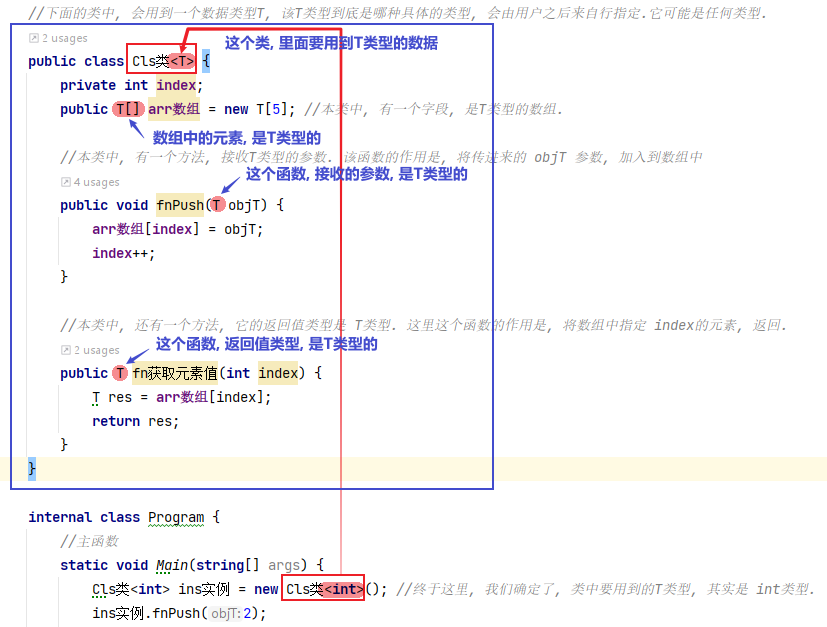
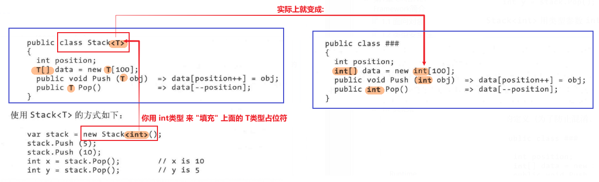
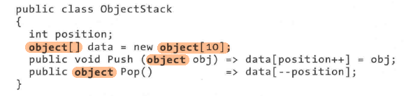
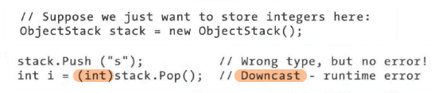

= 泛型
:sectnums:
:toclevels: 3
:toc: left

---

== 泛型类, 会在"实例化"它时, 传入具体的类型, 以取代泛型类中的"T类型"占位符.

C#有两种不同的机制, 来编写"跨类型"可复用的代码: 继承和泛型。但继承的复用性来自基类，而泛型的复用性, 是通过带有“占位符”的“模板”类型实现的。*和继承相比，泛型能够提高类型的安全性,并减少类型的转换和装箱。*

[,subs=+quotes]
----
*//下面的类中, 会用到一个数据类型T, 该T类型到底是哪种具体的类型, 会由用户之后来自行指定.它可能是任何类型.*
*public class Cls类<T> {*
    private int index;
    public T[] arr数组 = new T[5]; //本类中, 有一个字段, 是T类型的数组.

    //本类中, 有一个方法, 接收T类型的参数. 该函数的作用是, 将传进来的 objT 参数, 加入到数组中
    public void fnPush(T objT) {
        arr数组[index] = objT;
        index++;
    }

    //本类中, 还有一个方法, 它的返回值类型是 T类型. 这里这个函数的作用是, 将数组中指定 index的元素, 返回.
    public T fn获取元素值(int index) {
        T res = arr数组[index];
        return res;
    }
}

internal class Program {
    //主函数
    static void Main(string[] args) {
        *Cls类<int> ins实例 = new Cls类<int>(); //终于这里, 我们确定了, 类中要用到的T类型, 其实是 int类型.*
        ins实例.fnPush(2);
        ins实例.fnPush(4);
        ins实例.fnPush(6);
        ins实例.fnPush(8);
        Console.WriteLine(string.Join(",",ins实例.arr数组)); //2,4,6,8,0

        Console.WriteLine(ins实例.fn获取元素值(1)); //4
        Console.WriteLine(ins实例.fn获取元素值(3)); //8
    }
}
----

从上例可以看出, *<T> 就相当于一个"类型占位符". 需要有你事后来"填充"上具体明确的类型.*

泛型的本质如下图:

技术上，我们称 Cls类名<T> 是开放类型，称 Cls类名<int> 是封闭类型。

'''

== 使用泛型的目的 :

为什么需要泛型?

泛型是为了"代码能够跨类型复用", 而设计的。假定我们需要一个整数栈，如果没有"泛型"的支持, 那么解决方案之一是: 为每一个需要的元素类型, 硬编码不同版本的类 (例如IntStack、StringStack等)。显然，这将导致大量的重复代码。

另一个解决方法是: 写一个用 object作为"元素类型"的栈:

但是 0bjectstack 类, 不会像硬编码的 IntStack 类一样只处理整数元素。而且, *objectStack 需要用到"装箱"和"向下类型转换"，而这些都不能够在编译时进行检查:*

*我们需要的栈, 既需要支持各种不同类型的元素，又要有一种方法, 容易地将栈的元素类型, 限定为特定类型，以提高类型安全性，减少"类型转换"和"装箱"。而"泛型"恰好通过参数化元素类型, 提供了这些功能。*

Stack<T> 具有 0bjectStack 和 IntStack 的全部优点: +
-> 与 objectStack 的共同点是: Stack<T>只需要书写一次, 就可以支持各种类型; +
-> 而与 IntStack 的共同点是: Stack<T>的元素是特定的某个类型。Stack<T>的独特之处在于, 操作的类型是T，并可以在编程时任意替换。

'''

== 泛型方法

'''

我们在编程程序时，经常会遇到功能非常相似的模块，只是它们处理的数据不一样。但我们没有办法，只能分别写多个方法来处理不同的数据类型。这个时候，那么问题来了，有没有一种办法，用同一个方法来处理传入不同种类型参数的办法呢？泛型的出现就是专门来解决这个问题的。

[,subs=+quotes]
----
*internal class Cls泛型类<T>  // 尖括号<>中的T, 就是type的首字母,  这里我们就将这个类, 设为"泛型"了, 表示这个类, 属于任何类型都行. 具体的类型, 由你在实例化时再具体指定.*
{
    private T a;
    private T b;

    public Cls泛型类(T a, T b) //构造函数
    {
        this.a = a;
        this.b = b;
    }

    public T fn求和()
    {
        // return a + b;  *//这句会报错,因为由于我们把 a和b设为任意类型T了, 所以它们如果类型不同, 就未必能相加了, 比如 数组+类, 这会是什么呢?*

        dynamic num1 = a; *//dynamic 表示"动态类型"，即在运行时确定类型. 类型为 dynamic 的对象, 会跳过静态类型检查*
        dynamic num2 = b;
        dynamic resNum = num1+num2;
        return (T)resNum;  //把resNum  强制类型转换成T类型

    }
}

static void Main(string[] args)
{
    *Cls泛型类<int> ins泛型实例 = new Cls泛型类<int>(10, 20); //将泛型类, 实例化时, 就要在这里直接指定该"泛型类"的具体类型. 写在尖括号里面.*
    Console.WriteLine(ins泛型实例.fn求和()); //30

    Cls泛型类<double> ins泛型实例2 = new Cls泛型类<double>(5.5, 3.14);
    Console.WriteLine(ins泛型实例2.fn求和()); //8.64
}
----

'''

== 类中的"泛型静态方法"

静态方法, 只能由类自身来调用, 不能被实例调用. 那如何定义一个泛型的静态方法呢?

[,subs=+quotes]
----
internal class ClsPerson
{
    //泛型的静态方法
    *public static T fn求和<T>(T a, T b)*
    {
        dynamic num1 = a;
        dynamic num2 = b;
        dynamic res = num1 + num2;
        return (T)res;
    }
}

static void Main(string[] args)
{
    Console.WriteLine(*ClsPerson.fn求和<int>(4, 5)*); //9 *← 静态方法, 是由类来直接调用的. 这里还是个泛型的静态方法, 所以我们要给它申明实际的类型. 写在尖括号里.*
    Console.WriteLine(ClsPerson.fn求和<double>(2.5, 3.14)); //5.64
}
----

'''

