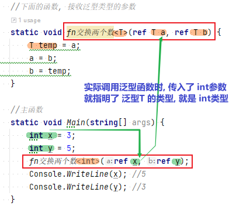
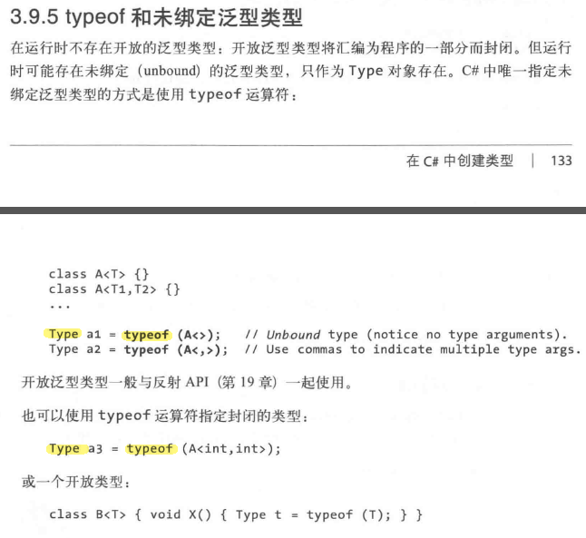
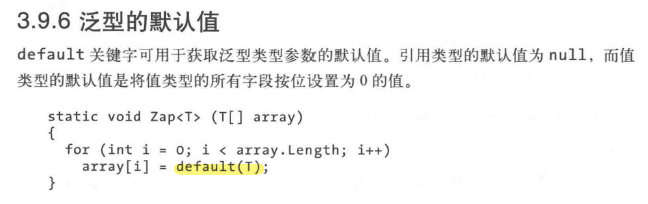
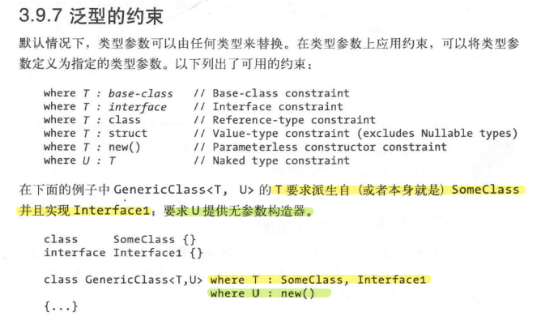
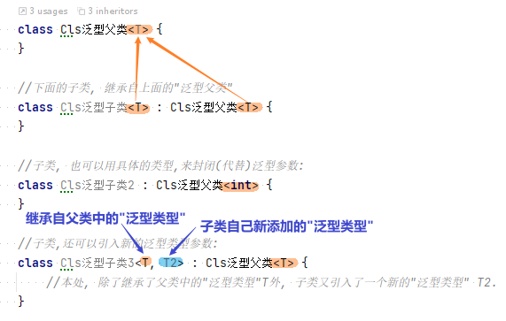
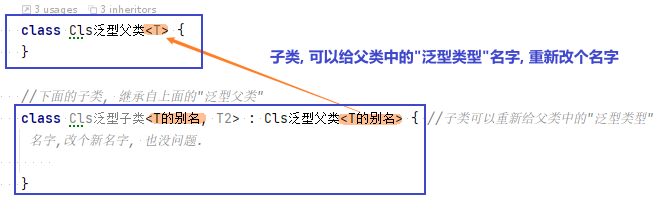
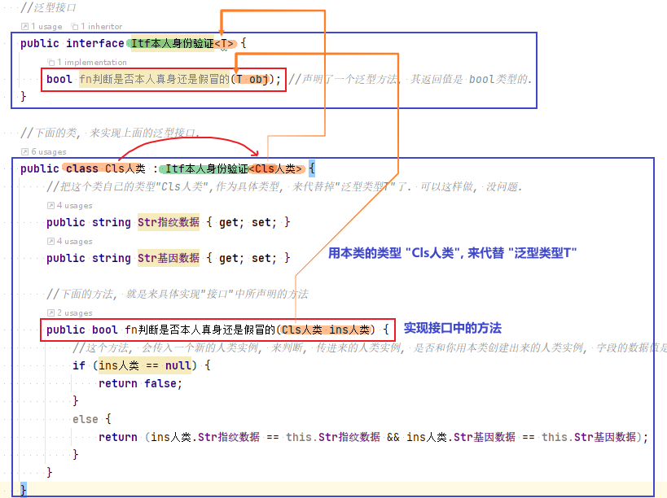

= 泛型
:sectnums:
:toclevels: 3
:toc: left

---

== 泛型类, 会在"实例化"它时, 传入具体的类型, 以取代泛型类中的"T类型"占位符.

C#有两种不同的机制, 来编写"跨类型"可复用的代码: 继承和泛型。但继承的复用性来自基类，而泛型的复用性, 是通过带有“占位符”的“模板”类型实现的。*和继承相比，泛型能够提高类型的安全性,并减少类型的转换和装箱。*

[,subs=+quotes]
----
*//下面的类中, 会用到一个数据类型T, 该T类型到底是哪种具体的类型, 会由用户之后来自行指定.它可能是任何类型.*
*public class Cls类<T> {*
    private int index;
    public T[] arr数组 = new T[5]; //本类中, 有一个字段, 是T类型的数组.

    //本类中, 有一个方法, 接收T类型的参数. 该函数的作用是, 将传进来的 objT 参数, 加入到数组中
    public void fnPush(T objT) {
        arr数组[index] = objT;
        index++;
    }

    //本类中, 还有一个方法, 它的返回值类型是 T类型. 这里这个函数的作用是, 将数组中指定 index的元素, 返回.
    public T fn获取元素值(int index) {
        T res = arr数组[index];
        return res;
    }
}

internal class Program {
    //主函数
    static void Main(string[] args) {
        *Cls类<int> ins实例 = new Cls类<int>(); //终于这里, 我们确定了, 类中要用到的T类型, 其实是 int类型.*
        ins实例.fnPush(2);
        ins实例.fnPush(4);
        ins实例.fnPush(6);
        ins实例.fnPush(8);
        Console.WriteLine(string.Join(",",ins实例.arr数组)); //2,4,6,8,0

        Console.WriteLine(ins实例.fn获取元素值(1)); //4
        Console.WriteLine(ins实例.fn获取元素值(3)); //8
    }
}
----

image:img/0225.png[,]

从上例可以看出, *<T> 就相当于一个"类型占位符". 需要有你事后来"填充"上具体明确的类型.*

泛型的本质如下图:

image:img/0226.png[,]

技术上，我们称 Cls类名<T> 是开放类型，称 Cls类名<int> 是封闭类型。

'''

== 使用泛型的目的 :

为什么需要泛型?

泛型是为了"代码能够跨类型复用", 而设计的。假定我们需要一个整数栈，如果没有"泛型"的支持, 那么解决方案之一是: 为每一个需要的元素类型, 硬编码不同版本的类 (例如IntStack、StringStack等)。显然，这将导致大量的重复代码。

另一个解决方法是: 写一个用 object作为"元素类型"的栈:

image:img/0227.png[,]

但是 0bjectstack 类, 不会像硬编码的 IntStack 类一样只处理整数元素。而且, *objectStack 需要用到"装箱"和"向下类型转换"，而这些都不能够在编译时进行检查:*

image:img/0228.png[,]

*我们需要的栈, 既需要支持各种不同类型的元素，又要有一种方法, 容易地将栈的元素类型, 限定为特定类型，以提高类型安全性，减少"类型转换"和"装箱"。而"泛型"恰好通过参数化元素类型, 提供了这些功能。*

Stack<T> 具有 0bjectStack 和 IntStack 的全部优点: +
-> 与 objectStack 的共同点是: Stack<T>只需要书写一次, 就可以支持各种类型; +
-> 而与 IntStack 的共同点是: Stack<T>的元素是特定的某个类型。Stack<T>的独特之处在于, 操作的类型是T，并可以在编程时任意替换。

'''

== 泛型方法

[,subs=+quotes]
----
internal class Program {
    //下面的函数, 接收泛型类型的参数
    static void fn交换两个数<T>(ref T a, ref T b) {
        T temp = a;
        a = b;
        b = temp;
    }

    //主函数
    static void Main(string[] args) {
        int x = 3;
        int y = 5;
        *fn交换两个数(ref x, ref y); // 通常, 调用泛型方法时, 不需要提供类型参数，因为编译器可以隐式推断得出。当然, 你也可以显示的指明类型, 就写成: fn交换两个数<int>(ref x, ref y);* 不过, ide会提示你: Type argument specification is redundant. 指定"参数类型"是多余的.

        Console.WriteLine(x); //5
        Console.WriteLine(y); //3
    }
}
----

'''

== 只有方法和类(就包括结构体类, 接口, 委托), 可以引入"类型(泛型)参数"

**唯有方法和类(就包括结构体类, 接口, 委托), 可以引入类型参数。属性、索引器、事件、字段、构造器、运算符等, 都不能声明类型参数，虽然它们可以参与使用所在类型中已经声明的类型参数。**例如，在泛型的栈中, 我们可以写一个索引器返回一个泛型项。

....
public T this [int index] => data [index];
....

类似的，构造器可以参与使用已经存在的类型参数，但是不能引入新的类型参数:

....
//构造函数
public stack<T>() {} //Illegal
....

*类中的属性, 虽不能引入类型参数，但可以使用类型参数。*

[,subs=+quotes]
----
//类, 可以有多个泛型类型的参数:
public class **Cls类<T1, T2> **{
    public T1 var1 { get; set; } //"泛型类型"的属性

    //方法, 也可以有多个泛型类型的参数:
    public void fn方法(T2 var2) {
        Console.WriteLine(var1);
        Console.WriteLine(var2);
    }
}

internal class Program {
    //主函数
    static void Main(string[] args) {
        *Cls类<int, string> ins实例 = new Cls类<int, string>();*
        ins实例.var1 = 99;
        ins实例.fn方法("zrx"); //99, zrx
    }
}
----

'''

== typeof 和 未绑定泛型类型

'''

== 泛型类型的默认值 ->  可用 default(T) 来获得.

'''

== 可以对"泛型类型", 指定它是属于"哪些具体类型" (而不是所有的类型都能替代该泛型)

像上面这种对"泛型类型"的约束语句, 可以写在 "class" 或 "函数方法" 这些地方.

- 基类约束: 要求"类型参数"必须是子类(或者匹配基类).
- 接口约束: 要求"类型参数"必须实现特定的接口。

这些约束, 要求"类型参数"的实例, 可以隐式转换为相应的类和接口。

- where T : struct 这表明T必须是一个值类型，像是int,decimal这样的
- where T : class 这表明T必须是一个引用类型，像是自定义的类、接口、委托等
- where T : new() 这表明T必须有无参构造函数，且如果有多个where约束，new()放在最后面
- where T : [基类] 这表明T必须是base class类获其派生类
- where T : [接口] 这表明T必须实现了相应的接口

教程 +
https://blog.csdn.net/Ericafyl/article/details/106378320

https://www.bilibili.com/read/cv15897739/

'''

== 泛型类, 可以有子类

[,subs=+quotes]
----
class Cls泛型父类<T> {
}

//下面的子类, 继承自上面的"泛型父类"
*class Cls泛型子类<T> : Cls泛型父类<T> {*
}

//子类, 也可以用具体的类型,来封闭(代替)泛型参数:
*class Cls泛型子类2 : Cls泛型父类<int> {*
}

//子类,还可以引入新的泛型类型参数:
*class Cls泛型子类3<T, T2> : Cls泛型父类<T> {*
    //本处, 除了继承了父类中的"泛型类型"T外, 子类又引入了一个新的"泛型类型" T2.
}
----

技术上，子类型中所有的类型参数, 都是新的: 可以说, 子类型封闭后, 又重新开放了基类的类型参数。这表明子类可以为其重新打开的类型参数, 使用更有意义的新名称:

[,subs=+quotes]
----
class Cls泛型父类<T> {
}

//下面的子类, 继承自上面的"泛型父类"
class Cls泛型子类<T的别名, T2> : Cls泛型父类<T的别名> { //子类可以重新给父类中的"泛型类型"名字,改个新名字, 也没问题.

}
----

'''

== 泛型类, 可以把这个类的自身类型, 来具体指代"泛型"的类型. 相当于类型的"递归". 自己调用自己的类型.

[,subs=+quotes]
----
//泛型接口
*public interface Itf本人身份验证<T> {*
    bool fn判断是否本人真身还是假冒的(T obj); *//声明了一个泛型方法, 其返回值是 bool类型的.*
}

//下面的类, 来实现上面的泛型接口.
*public class Cls人类 : Itf本人身份验证<Cls人类> {*
    *//把这个类自己的类型"Cls人类",作为具体类型, 来代替掉"泛型类型T"了. 可以这样做, 没问题.*
    public string Str指纹数据 { get; set; }
    public string Str基因数据 { get; set; }

    //下面的方法, 就是来具体实现"接口"中所声明的方法
    *public bool fn判断是否本人真身还是假冒的(Cls人类 ins人类) {*
        //这个方法, 会传入一个新的人类实例, 来判断, 传进来的人类实例, 是否和你用本类创建出来的人类实例, 字段的数据值是否相等, 即是否是同一个人?
        if (ins人类 == null) {
            return false;
        }
        else {
            return (ins人类.Str指纹数据 == this.Str指纹数据 && ins人类.Str基因数据 == this.Str基因数据);
        }
    }
}

internal class Program {
    //主函数
    static void Main(string[] args) {
        Cls人类 ins我 = new Cls人类();
        ins我.Str指纹数据 = "zrx的指纹";
        ins我.Str基因数据 = "zrx的基因";

        Cls人类 ins假冒者 = new Cls人类();
        ins假冒者.Str指纹数据 = "假冒者的指纹";
        ins假冒者.Str基因数据 = "假冒者的基因";

        bool bolRes = ins我.fn判断是否本人真身还是假冒的(ins假冒者); //把假冒者传进去, 和你的实例中的字段数据作比较. 假冒者实例中的字段值, 肯定和你的实例中的字段值,不一样, 所以会返回 false.
        Console.WriteLine(bolRes); //False

        Console.WriteLine(ins我.fn判断是否本人真身还是假冒的(ins我)); //True
    }
}
----

'''

== other

我们在编程程序时，经常会遇到功能非常相似的模块，只是它们处理的数据不一样。但我们没有办法，只能分别写多个方法来处理不同的数据类型。这个时候，那么问题来了，有没有一种办法，用同一个方法来处理传入不同种类型参数的办法呢？泛型的出现就是专门来解决这个问题的。

[,subs=+quotes]
----
*internal class Cls泛型类<T>  // 尖括号<>中的T, 就是type的首字母,  这里我们就将这个类, 设为"泛型"了, 表示这个类, 属于任何类型都行. 具体的类型, 由你在实例化时再具体指定.*
{
    private T a;
    private T b;

    public Cls泛型类(T a, T b) //构造函数
    {
        this.a = a;
        this.b = b;
    }

    public T fn求和()
    {
        // return a + b;  *//这句会报错,因为由于我们把 a和b设为任意类型T了, 所以它们如果类型不同, 就未必能相加了, 比如 数组+类, 这会是什么呢?*

        dynamic num1 = a; *//dynamic 表示"动态类型"，即在运行时确定类型. 类型为 dynamic 的对象, 会跳过静态类型检查*
        dynamic num2 = b;
        dynamic resNum = num1+num2;
        return (T)resNum;  //把resNum  强制类型转换成T类型

    }
}

static void Main(string[] args)
{
    *Cls泛型类<int> ins泛型实例 = new Cls泛型类<int>(10, 20); //将泛型类, 实例化时, 就要在这里直接指定该"泛型类"的具体类型. 写在尖括号里面.*
    Console.WriteLine(ins泛型实例.fn求和()); //30

    Cls泛型类<double> ins泛型实例2 = new Cls泛型类<double>(5.5, 3.14);
    Console.WriteLine(ins泛型实例2.fn求和()); //8.64
}
----

'''

== 类中的"泛型静态方法"

静态方法, 只能由类自身来调用, 不能被实例调用. 那如何定义一个泛型的静态方法呢?

[,subs=+quotes]
----
internal class ClsPerson
{
    //泛型的静态方法
    *public static T fn求和<T>(T a, T b)*
    {
        dynamic num1 = a;
        dynamic num2 = b;
        dynamic res = num1 + num2;
        return (T)res;
    }
}

static void Main(string[] args)
{
    Console.WriteLine(*ClsPerson.fn求和<int>(4, 5)*); //9 *← 静态方法, 是由类来直接调用的. 这里还是个泛型的静态方法, 所以我们要给它申明实际的类型. 写在尖括号里.*
    Console.WriteLine(ClsPerson.fn求和<double>(2.5, 3.14)); //5.64
}
----

'''

