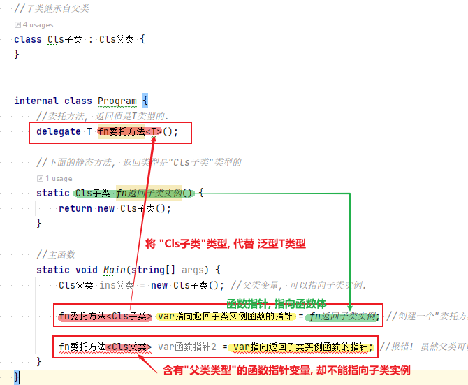
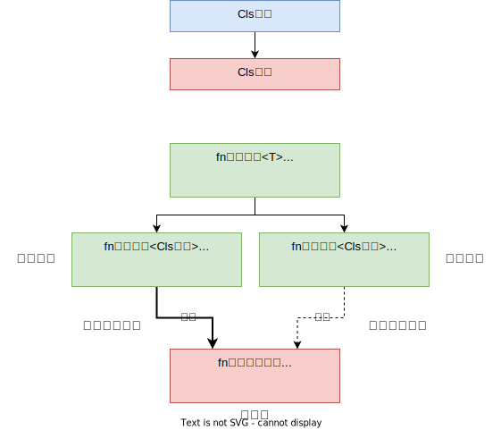
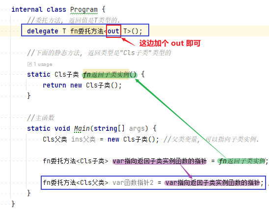
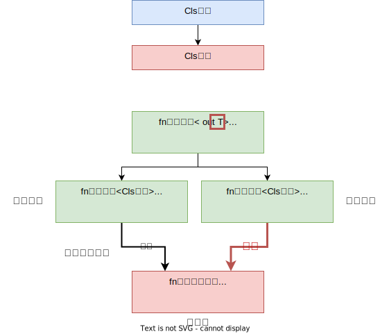

= 协变 & 逆变
:sectnums:
:toclevels: 3
:toc: left

---

只有泛型接口, 和泛型委托参数, 支持协变和逆变.

- 如果某个返回的类型, 可以由其"子类"替换，那么这个类型就是支持"协变"的.
- 如果某个参数类型, 可以由其"父类"替换，那么这个类型就是支持"逆变"的.

- *协变 out : 是用一个"窄类型"替换"宽类型". 这样记忆, 从小的地方, 出来到(out)大世界的里.*
- *逆变 in : 则是用"宽类型"覆盖"窄类型". 这样记忆: 大的物体, 钻进(in)小的空间里.*

协变和逆变, 是针对"泛型接口或泛型委托"参数的,而不能针对"泛型类".

——在泛型中，如果确定泛型参数是只读或者只写的，那么就可以使用协变或者逆变。如果泛型参数无法确定只读或只写，这种类型参数, 既不能协变也不能逆变，只能精确类型匹配.

——*在泛型或委托中，如果不使用协变或逆变，那么泛型类型是一个固定类型，而使用协变或逆变的话，则泛型类型可以实现多态化*

——*协变和逆变, 只针对于"引用类型". 而"值类型"不参与协变和逆变.*

——声明属性时要注意，*只有"只读属性"才允许使用out类型参数，"只写属性"才允许使用in类型参数.*

'''

== 协变

*协变, 在泛型方法的参数里, 以out表示.*  +
使用out, 可以在声明父类泛型参数的时候, 使用子类泛型参数构造. +
out参数只能用在输出位置，作为返回值.

[,subs=+quotes]
----
class Cls父类 {
    public static string name;
}

//子类继承自父类
class Cls子类 : Cls父类 {
}

internal class Program {
    //委托方法, 返回值是T类型的.
    *delegate T fn委托方法<T>();*

    //下面的静态方法, 返回类型是"Cls子类"类型的
    static Cls子类 fn返回子类实例() {
        return new Cls子类();
    }

    //主函数
    static void Main(string[] args) {
        Cls父类 ins父类 = new Cls子类(); //父类变量, 可以指向子类实例.

        *fn委托方法<Cls子类> var指向返回子类实例函数的指针 = fn返回子类实例; //创建一个"委托方法"类型的变量"var函数指针", 指针指向"fn返回子类实例"函数.*

        *//fn委托方法<Cls父类> var函数指针2 = var指向返回子类实例函数的指针; //报错! 虽然父类可以指向子类实例, 但是委托之间,却未存在关联，无法进行强制类型的转换.*
    }
}
----

要解决上面的问题, 就要引入了"协变"来解决. 只要改动一个地方就行了:

<c# 7.0 核心技术指南> p 138 继续

'''

== 逆变

*逆变, 在泛型方法的参数里, 以in表示.* +
使用in, 可以在声明子类泛型参数的时候, 使用父类泛型参数构造. +
int参数只能用在输入位置，作为传入值.

- co- 在英语中表示“协同”、“合作”的前缀，协变的字面意思就是“与变化的方向相同”。
- contra- 在英语中表示“相反”的前缀，逆变的字面意思就是“与变化方向相反”。

'''
