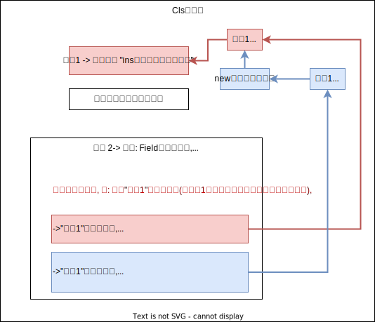

= 23种设计模式 - 01 singleton单件(创建型模式)
:sectnums:
:toclevels: 3
:toc: left

'''

23种设计模式

从目的来看:

- 创建型(Creational)模式: 负责"对象创建"。
- 结构型(Structural）模式: 处理"类"与"对象"间的组合。
- 行为型（Behavioral〉模式: "类"与"对象"交互中的职责分配。

从范围来看:

- 类模式: 处理"类"与"子类"的静态关系。
- 对象模式: 处理"对象间"的动态关系。

'''

== singleton单件(创建型模式)

*动机（Motivation): 在软件系统中，经常有这样一些特殊的类，必须保证它们在系统中只存在一个实例，* 才能确保它们的逻辑正确性、以及良好的效率。

如何绕过常规的构造器，提供一种机制, 来保证一个类只有一个实例? 这应该是类设计者的责任，而不是使用者的责任。

==== 模型1

[,subs=+quotes]
----
namespace ConsoleApp3 {

    //单件类
    public class Cls单件类 {

        private static Cls单件类 ins本单件类的实例对象;  *//定义一个静态字段, 这个字段的指针会指向的目标, 其实就是会指向"本类的一个实例对象".*

        //定义一个私有的构造函数,以覆盖掉默认的构造函数
        private Cls单件类() { }

        *//再定义一个"Cls单件类"类型的字段"Field单件类字段".*
        public static Cls单件类 Field单件类字段 {
            get {
                if (ins本单件类的实例对象 == null) {
                    ins本单件类的实例对象 = new Cls单件类(); *//只要你对本类, 使用new来创建实例, 这个创建出的实例, 统统赋值给本类中的"ins本单件类的实例对象"字段.*
                }
                return ins本单件类的实例对象;
            } *//这个get函数的意思是, 如果"ins单件类"字段, 还没有被赋值过, 即它的指针还没有指向任何"Cls单件类"的实例对象的话, 我们就给它new出一个Cls单件类的实例对象, 来赋给它. 否则, 我们就不new出新的实例对象了, 指向把已存在的那一个实例对象, 赋值给"ins单件类"字段. 这样, 就能保证本"Cls单件类", 永远只有单一的一个实例对象了.即, 单件类.*

        }
    }

    //主函数
    internal class Program {
        static void Main(string[] args) {

            Cls单件类 ins单件1 = Cls单件类.Field单件类字段; /*/因为"Field单件类字段"这个字段,里面有get方法, 即当你直接调用该字段时, 就会直接创建new出一个"Cls单件类"的实例, 传给"ins本单件类的实例对象"字段来指针指向. 所以, 我们这里这一句代码中的"ins单件1", 其实就是指针指向了"ins本单件类的实例对象"字段.*
            Cls单件类 ins单件2 = Cls单件类.Field单件类字段; //这里的"ins单件2"变量, 同样指针指向"Cls单件类"类中的"ins本单件类的实例对象"字段.

            Console.WriteLine(Object.ReferenceEquals(ins单件1, ins单件2) == true); //True  ← 所以"ins单件1"和"ins单件2"变量, 都指向同一个对象.

        }
    }
}
----

单线程Singleton模式的几个要点:

- Singleton模式中的实例构造器, 可以设置为 protected, 以允许子类派生。
- Singleton模式, 一般不要支持ICloneable接口,因为这可能会导致多个对象实例，与Singleton模式的初衷违背。
- Singleton模式一般不要支持序列化,因为这也有可能导致多个对象实例，同样与Singleton模式的初衷违背。
- Singletom模式只考虑到了对象创建的管理，没有考虑对象销毁的管理。就支持垃圾回收的平台和对象的开销来讲，我们一般没有必要对其销毁进行特殊的管理。
- *不能应对"多线程环境": 在多线程环境下, 使用Singleton模式仍然有可能得到singleton类的多个实例对象。*

'''

==== 模型2

