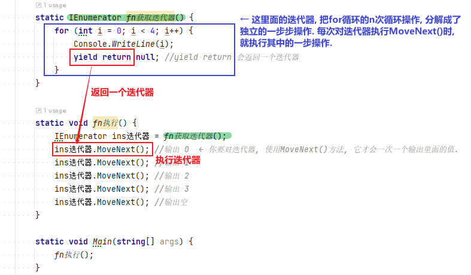
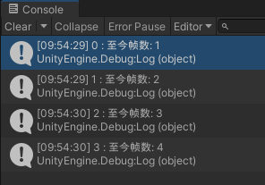
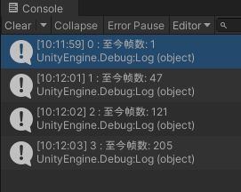
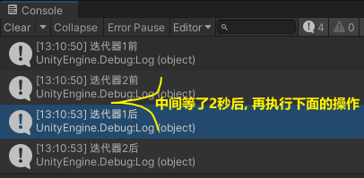
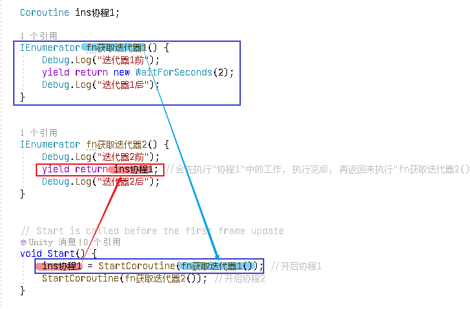
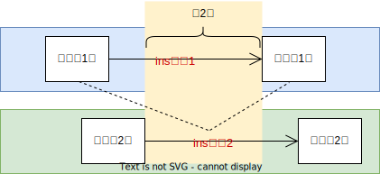
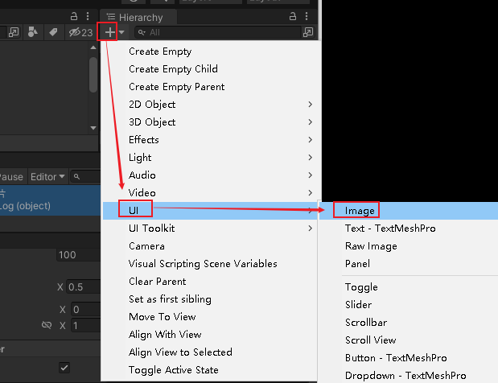
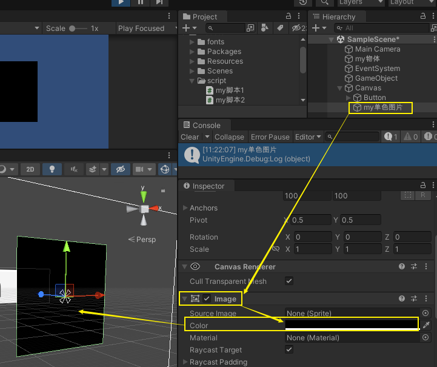
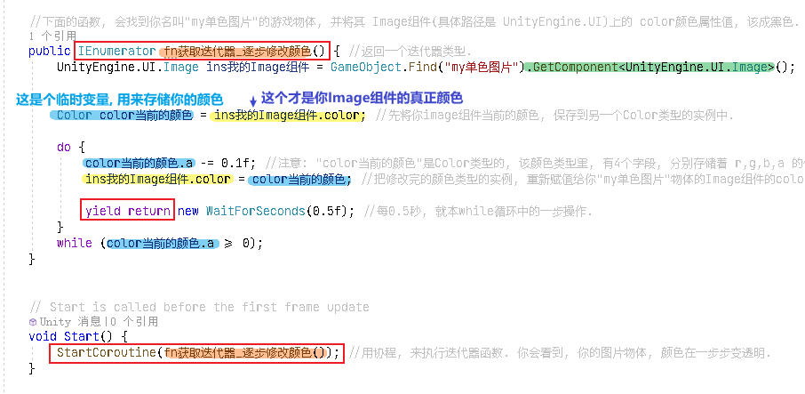
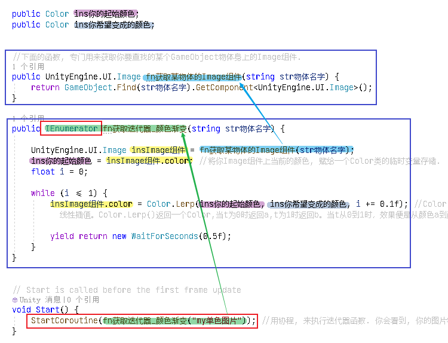

= 协程
:sectnums:
:toclevels: 3
:toc: left

---

== unity中的 协程 coroutine

....
coroutine /kəruːˈtiːn/ n.协同程序
....

[,subs=+quotes]
----
static *IEnumerator fn获取迭代器()* { //该函数, 会返回一个 IEnumerator 迭代器类型.
    for (int i = 0; i < 4; i++) {
        Console.WriteLine(i);
        *yield return* null; *//yield return 会返回一个迭代器. 我们在for循环里加了这个迭代器后, 就相当于把本处for循环的5次循环步骤, 分成了5个独立的操作. 之后调用这个迭代器的MoveNext()方法, 就会每次调用就执行一次独立操作. 即, 分步执行.*
    }
}

static void fn执行() {
    *IEnumerator ins迭代器 = fn获取迭代器();*
    *ins迭代器.MoveNext(); //输出 0  ← 你要对迭代器, 使用MoveNext()方法, 它才会一次一个输出里面的值.*
    ins迭代器.MoveNext(); //输出 1
    ins迭代器.MoveNext(); //输出 2
    ins迭代器.MoveNext(); //输出 3
    ins迭代器.MoveNext(); //输出空
}

static void Main(string[] args) {
    fn执行();
}
----

在unity中, 使用协程:

[,subs=+quotes]
----
//下面的函数, 会返回一个迭代器.
*IEnumerator fn获取迭代器() {*
    for (int i = 0; i < 4; i++) {
        Debug.Log($"{i} : 至今帧数: {Time.frameCount}");//Time.frameCount 是: 游戏运行到现在一共所用帧数
        *yield return null; //返回迭代器. yield return null 是等待下一帧执行. 调用顺序在Update后，LateUpdate前. "yield return null", 和 "yield return + 任意的数字", 意思是一样的, 就是"暂缓一帧，在下一帧接着往下处理".  *
    }
}

// Start is called before the first frame update
void Start() {
    //给下面的 StartCoroutine()方法,传入一个迭代器实例对象.
    *StartCoroutine(fn获取迭代器()); //通过MonoBehaviour提供的StartCoroutine()方法, 来实现启动协同程序。StartCoroutine()方法,会自动帮你执行迭代器对象的 MoveNext()方法. 即每帧调用一次MoveNext()方法.*
}

// Update is called once per frame
void Update()
{

}
----

[,subs=+quotes]
----
IEnumerator fn获取迭代器() {
    Debug.Log("zrx :" + Time.frameCount);
    *yield return null; //推迟1帧, 再执行 yield return null 后面的语句*
    Debug.Log("slf :"+ Time.frameCount);
}

    // Start is called before the first frame update
    void Start() {
    **StartCoroutine(fn获取迭代器()); **
}
----

==== 等待1秒 -> yield return new WaitForSeconds(1)

[,subs=+quotes]
----
*IEnumerator fn获取迭代器() {*
    for (int i = 0; i < 4; i++) {
        Debug.Log($"{i} : 至今帧数: {Time.frameCount}");//Time.frameCount 是: 游戏运行到现在一共所用帧数
        *yield return new WaitForSeconds(1); //等待1秒后, 再执行 yield return 后面的语句. 这句的意思其实是: 先执行 yield return 返回出来的语句, 即 new出一个1秒, 等着1秒过去后, 再回来, 执行for循环本轮之后的下一次循环内容.*
    }
}

// Start is called before the first frame update
void Start() {
    *StartCoroutine(fn获取迭代器());*
}
----

'''

所以, Unity的 *协同程序(Coroutine) , 其定义就是 : 具有多个返回点(yield)，可以在特定时机"分步执行"的函数。*

原理:  +
unity每帧处理 GameObject 中的协同函数，直到函数执行完毕。

*当一个协同函数启动时，本质是执行迭代器对象, 调用其 MoveNext()方法，执行到yield时, 暂时退出, 等待满足条件后(比如等待了1秒后), 再回来再次调用MoveNext()方法，执行后续代码，直至遇到下一个yield为止. 如此循环, 直至整个函数结束。*

可以被yield return的对象：

- null或数字 -- 在Update后执行，适合分解耗时的逻辑处理。
- WaitForFixedUpdate -- 在FixedUpdate后执行，适合分解物理操作。
- WaitForSeconds -- 在指定时间后执行，适合延迟调用。
- WaitForSecondsRealtime -- 同上，不受时间缩放影响。
- WaitForEndOfFrame -- 在每帧结束后执行，适合相机的跟随操作。
- Coroutine -- 在另一个协程执行完毕后再执行。
- WaitUntil -- 在委托返回true时执行，适合等待某一操作。
- WaitWhile -- 在委托返回false时执行，适合等待某一操作。
- WWW -- 在请求结束后执行，适合加载数据，如文件、贴图、材质等。

- yield return null; // 下一帧再执行后续代码
- yield return 0; //下一帧再执行后续代码
- yield return 6;//(任意数字) 下一帧再执行后续代码
- *yield break; //直接结束该协程的后续操作*
- yield return asyncOperation;//等异步操作结束后再执行后续代码
- *yield return StartCoroution(某个协程); //等待某个协程执行完毕后,再执行后续代码*
- *yield return WWW();//等待WWW操作完成后, 再执行后续代码*
- yield return new WaitForEndOfFrame();//等待帧结束,等待直到所有的摄像机和GUI被渲染完成后，在该帧显示在屏幕之前执行
- *yield return new WaitForSeconds(0.3f);//等待0.3秒，一段指定的时间延迟之后继续执行，在所有的Update函数完成调用的那一帧之后（这里的时间会受到Time.timeScale的影响）;*
- yield return new WaitForSecondsRealtime(0.3f);//等待0.3秒，一段指定的时间延迟之后继续执行，在所有的Update函数完成调用的那一帧之后（这里的时间不受到Time.timeScale的影响）;
- yield return WaitForFixedUpdate();//等待下一次FixedUpdate开始时再执行后续代码
- *yield return new WaitUntil()//将协同执行直到 当输入的参数（或者委托）为true的时候....如:yield return new WaitUntil(() => frame >= 10);*
- yield return new WaitWhile()//将协同执行直到 当输入的参数（或者委托）为false的时候.... 如:yield return new WaitWhile(() => frame < 10);

YieldInstruction 有以下子类:

- WaitForEndOfFrame：等待所有相机与GUI渲染只后，直到帧结束，继续执行后续代码
- WaitForFixedUpdate：等待下一个FixedUpdate() 之后，继续执行代码。
- WaitForSeconds()：等待指定的秒钟后将继续往下执行。该参数受到Time.Scale 的影响。
- WaitForSecondsRealtime()：等待指定的秒钟后将继续往下执行，该参数不受Time.Scale的影响。
- WaitUntil() 等待方法返回True继续往下执行
- WaitWhile() 等待方法返回False继续往下执行

'''

== 协程的作用

==== 延时调用

[,subs=+quotes]
----
Coroutine ins协程1;

IEnumerator fn获取迭代器1() {
    Debug.Log("迭代器1前");
    yield return new WaitForSeconds(2);
    Debug.Log("迭代器1后");
}

IEnumerator fn获取迭代器2() {
    Debug.Log("迭代器2前");
    *yield return ins协程1; //会先执行"协程1"中的工作, 执行完后, 再返回来执行"fn获取迭代器2()"剩下的内容.*
    Debug.Log("迭代器2后");
}

// Start is called before the first frame update
void Start() {
    ins协程1 = StartCoroutine(fn获取迭代器1()); //开启协程1
    StartCoroutine(fn获取迭代器2()); //开启协程2
}
----

'''

==== 分解操作 (透明渐变)

比如, 你想修改 ui 中 image 物体的颜色

[,subs=+quotes]
----
//下面的函数, 会找到你名叫"my单色图片"的游戏物体, 并将其 Image组件(具体路径是 UnityEngine.UI)上的 color颜色属性值, 该成黑色.

public void fn修改颜色() {
    GameObject goMy单色图片 = GameObject.Find("my单色图片");

    *goMy单色图片.GetComponent<UnityEngine.UI.Image>().color = new Color(0f, 0f, 0f, 1f); //纯黑色. Color()接收的是4个[0,1]的值，需要用R，G，B，A(透明度)四个值各自除以255. ←注意, 这里获取该组件时, 必须要写全名 GetComponent<UnityEngine.UI.Image>, 而不能只写 GetComponent<Image>, 否则会找不到该组件!*

}

// Start is called before the first frame update
void Start() {
    fn修改颜色();}

----

加上协程, 来让它逐渐变色:

[,subs=+quotes]
----
using Microsoft.Unity.VisualStudio.Editor;
using System.Collections;
using System.Collections.Generic;
using Unity.VisualScripting;
using UnityEngine;
using UnityEngine.UI;

public class my脚本2 : MonoBehaviour {

    //下面的函数, 会找到你名叫"my单色图片"的游戏物体, 并将其 Image组件(具体路径是 UnityEngine.UI)上的 color颜色属性值, 该成黑色.
    *public IEnumerator fn获取迭代器_逐步修改颜色() { //返回一个迭代器类型.*
        UnityEngine.UI.Image ins我的Image组件 = GameObject.Find("my单色图片").GetComponent<UnityEngine.UI.Image>();

        Color color当前的颜色 = ins我的Image组件.color; //先将你image组件当前的颜色, 保存到另一个Color类型的实例中.

        do {
            color当前的颜色.a -= 0.1f; //注意: "color当前的颜色"是Color类型的, 该颜色类型里, 有4个字段, 分别存储着 r,g,b,a 的值. a就是透明度. 这里, 我们只来修改它的透明度数据.
            ins我的Image组件.color = color当前的颜色; //把修改完的颜色类型的实例, 重新赋值给你"my单色图片"物体的Image组件的color字段值上.

            *yield return new WaitForSeconds(0.5f); //每0.5秒, 就本while循环中的一步操作.*
        }
        while (color当前的颜色.a >= 0);
    }

    // Start is called before the first frame update
    void Start() {
        *StartCoroutine(fn获取迭代器_逐步修改颜色()); //用协程, 来执行迭代器函数. 你会看到, 你的图片物体, 颜色在一步步变透明.*
    }

    // Update is called once per frame
    void Update() {

    }

}
----

'''

==== 分解操作 (颜色渐变)

[,subs=+quotes]
----
using Microsoft.Unity.VisualStudio.Editor;
using System.Collections;
using System.Collections.Generic;
using Unity.VisualScripting;
using UnityEngine;
using UnityEngine.UI;

public class my脚本2 : MonoBehaviour {

    public Color ins你的起始颜色;
    public Color ins你希望变成的颜色;

    *//下面的函数, 专门用来获取你要查找的某个GameObject物体身上的Image组件.*
    public UnityEngine.UI.Image fn获取某物体的Image组件(string str物体名字) {
        return GameObject.Find(str物体名字).GetComponent<UnityEngine.UI.Image>();
    }

    *//下面的函数, 返回一个迭代器*
    public *IEnumerator* fn获取迭代器_颜色渐变(string str物体名字) {
        UnityEngine.UI.Image insImage组件 = fn获取某物体的Image组件(str物体名字);
        ins你的起始颜色 = insImage组件.color; //将你Image组件上当前的颜色, 赋给一个Color类的临时变量存储.
        float i = 0;

        while (i <= 1) {
            insImage组件.color = Color.Lerp(ins你的起始颜色, ins你希望变成的颜色, i += 0.1f); //Color Lerp (Color a, Color b, float t); 这个静态方法,功能是: 在颜色 a 与 b 之间, 按 t 进行线性插值。Color.Lerp()返回一个Color,当t为0时返回a,t为1时返回b。当t从0到1时，效果便是从颜色a到颜色b的渐变。

            *yield return new WaitForSeconds(0.5f);*
        }
    }

    // Start is called before the first frame update
    void Start() {
        *StartCoroutine(fn获取迭代器_颜色渐变("my单色图片")); //用协程, 来执行迭代器函数. 你会看到, 你的图片物体, 颜色在一步步变透明.*
    }

    // Update is called once per frame
    void Update() {

    }
}
----

上面的例子, 我们还有一个漏洞, 就是"ins你希望变成的颜色"这个Color类型的变量, 忘了给它赋值了. 不过, 代码依然能运行. 只不过是变成了透明度渐变.

'''

