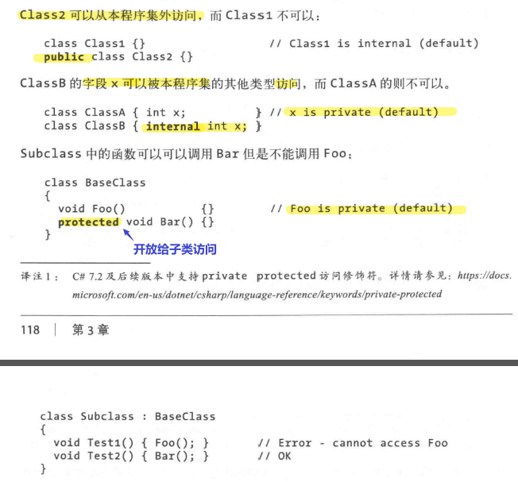
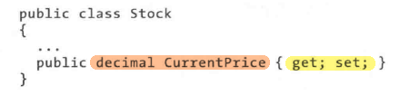
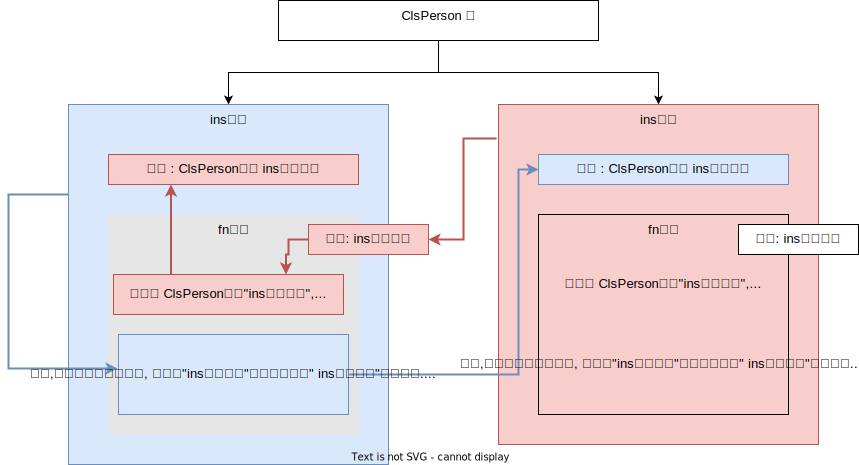


= 类
:sectnums:
:toclevels: 3
:toc: left

---

C# 中, 习惯上, 一个"类" 就放在一个cs文件里. (文件名, 就跟你的类名保持一致就行了.) 而不要把多个类写在一个文件中.

添加"类文件"的方法

image:img/0004.png[,]

image:img/0005.png[,]

'''

== 字段 field

[,subs=+quotes]
----
class ClsPerson
{
    private string name; //这个就是字段
    private int age;
}
----

字段不一定要初始化. 没有初始化的字段, 就均为默认值（0、\0、null、false).  +
字段初始化的逻辑, 要在构造器之前运行. 

public int Age = 10;

字段, 可用以下修饰符进行修饰:

[options="autowidth"]
|===
|Header 1 |Header 2

|静态修饰符
|static

|访问权限修饰符
|public, internal, private, protected

|继承修饰符
|new

|不安全代码修饰符
|unsafe

|只读修饰符
|readonly +
**readonly修饰符, 可以防止字段在构造后, 被变更. **只读字段只能在声明时, 或在其所属的类构造器中来赋值. 

|线程访问修饰符
|volatile
|===

'''

== 方法函数

方法可以用以下修饰符修饰:

[options="autowidth"]
|===
|Header 1 |Header 2

|静态修饰符
|static

|访问权限修饰符
|public, internal, private, protected

|继承修饰符
|new, virtual, abstract, override, sealed

|部分方法修饰符
|partial

|非托管代码修饰符
|unsafe, extern

|异步代码修饰符
|async
|===

'''

== 访问权限

[options="autowidth"]
|===
|Header 1 |本类 |子类| 实例对象 | 外部 |具体说明

|public
|√
|√
|√
|√
|

|protected
|√
|√
|×
|
|在類的內部或者在派生類中訪問，無論該類和派生類是否是在同一程序集(本项目)中.

|private
|√
|
|
|
|

|internal
|
|
|
|
|只能在同一程序集(Assembly)中訪問.

|protected internal
|
|
|
|
|受保護的內部： +
-> 若是繼承關係，無論是否是在同一程序集中, 均可以訪問； +
-> 若不是繼承關係, 则只能在同一程序集中訪問對象.
|===

*注意: class 的可访问性, 是它内部声明成员可访问性的封顶。 即内部成员权限再大, 也大不过class类自己的权限范围.*

最常见的操作是:
[,subs=+quotes]
----
class Cls{  //类, 默认是 internal 权限的.
    public void fnFoo();
}
----

*上面, 虽然类里面的函数 FnFoo 的可访问性权限是 public的, 但因为其所属的类 Cls的权限只是 internal (默认的), 所以,  FnFoo 的可访问性权限也被压制成了 internal的.* 既然如此, 我们为什么还要将  FnFoo 指定为public呢? 这是为了将来如果会将 Cls 的权限改成 public时, 我们重构会更方便, 不用再去一个个修改"类里面成员"的权限等级了.

在类中, 我们一般把所有数据, 都设为private私有的, 然后通过 get 和 set方法, 来暴露给用户, 来修改私有的属性值. 你就可以在这些函数方法里, 添加"验证代码"了.  +
比如 , 用户想修改密码, 就先验证用户的身份信息, 正确了才能继续使用set函数来修改密码这个数据.

[,subs=+quotes]
----
namespace ConsoleApp1
{
  //创建一个"人"类
  internal class ClsPerson
  {
      private string name = "";  //字段 field
      private string id身份证号="000"; //默认为000
      private string password = "123456"; //默认密码为123456

      *public void fnGetPassword() // get函数*
      {
          Console.WriteLine("你的当前password 是: {0}",password);
      }

      *public void fnSetPassword()  // set函数. 里面可以设置"验证代码"*
      {
          while (true)
          {
              Console.WriteLine("输入你正确的身份证号, 才能更改密码");
              string tempID= Console.ReadLine();

              if (tempID == id身份证号)
              {
                  Console.WriteLine("验证身份通过");
                  break; //跳出while循环
              }
              else
              {
                  Console.WriteLine("你输入的身份证号码错误!");
              }
          }

          Console.WriteLine("请输入新密码");
          password  = Console.ReadLine(); //上面的验证通过后, 就允许用户来更改密码了
      }

  }
}
----

'''

== 属性 Property

对每一个类中的 private数据, 都要设置 get和set函数, 太麻烦了! 所以 C# 提供了一种简单的方法来实现这个功能 --- 这就是"属性". +
类中的"属性", 其功能 相当于把get和set函数, 总和到一起了. 其实就是将get 和set函数 打包的简便写法.

[,subs=+quotes]
----
internal class ClsPerson{
  private string name;  //没有get, set方法的, 只能叫"字段"
  private int age;

  *public int Age  //定义"属性". 注意习惯上要大写, 以区别上面的"数据成员".*
  {
      *get //这里相当于是 fnGet函数*
      {
          return age;
      }

      *set //这里相当于是 fnSet函数. 这里的set功能块, 默认会接收一个叫value的参数*
      {
          age = value;
      }
  }

  //构造函数
  public ClsPerson(string name, int age) {
      this.name = name;  //this就代表你之后实例化本类对象时, 当时创建出的那一个实例对象
      this.age = age;
  }

  public void fnInfo()
  {
      Console.WriteLine("info : 姓名:{0}, 年龄:{1}",name,age);
  }
}
----

即: +
image:img/0008.png[,]

主页面中, 这样写: +
[,subs=+quotes]
----
ClsPerson p1 = new ClsPerson("zrx",19);
*p1.Age = 10;  //赋值, 会直接调用类中"Age属性"中的 get块(功能相当于get函数)*
Console.WriteLine(p1.Age); //10  ←读取, 会直接调用类中"Age属性"的set块
----

你会发现, 虽然"Age属性"的体内是函数功能, 但我们在使用它时, 可以把它当做一个普通的"数据成员"变量来使用, 直接赋值. 很方便.

"属性 Property"和"字段"的声明很类似，但是"属性"比字段多出了get/set 代码块. 

读取属性时, 会调用 get访问器. +
给属性赋值时, 会调用 set访问器. 它有一个名为value的隐含参数，其类型和属性的类型相同. 

*如果只定义了get 访问器，那么该属性就是"只读"的.* +
如果只定义了set访问器，那么该属性就是"只写"的. 但一般很少使用只写属性.

[,subs=+quotes]
----
internal class Program {
    class ClsPerson {
        public string name;
        public int num存款;

        //将 "num存款"字段, 设置成"属性"
        *public int Num存款 { //对某个字段添加get/set访问器时, 在这里该字段名的首字母, 必须强制改成大写!*
            *get { //你可以在get方法中动手脚, 让外界访问该字段时, 什么都得不到.*
                Console.WriteLine("你无权查看我的存款额");
                return 0;
            }
            set { }
        }

        //构造函数
        public ClsPerson(string name, int num存款) {
            this.name = name;
            this.num存款 = num存款;
        }
    }

    //主函数
    static void Main(string[] args) {
        ClsPerson insP = new ClsPerson("zrx", 8888);
        Console.WriteLine(insP.Num存款); //先输出"你无权查看我的存款额",然后输出0
    }
}
----

属性可以简写成:

==== 可以给"属性"赋初始化的值

[,subs=+quotes]
----
internal class Program {

    class ClsPerson {
        public string name;
        p**ublic int Num存款 { get; set; } = 800; //给属性, 赋初始化的值**

        //构造函数
        public ClsPerson(string name) {
            this.name = name;
        }

        public ClsPerson(string name, int num存款) {
            this.name = name;
            Num存款 = num存款;
        }
    }

    //主函数
    static void Main(string[] args) {
        ClsPerson insP = new ClsPerson("zrx"); *//实例化时, 没有传入"Num存款"字段的值, 那么就用该字段在类中定义过的初始化的值.*
        Console.WriteLine(insP.Num存款); //800

        insP.Num存款 = 3000;
        Console.WriteLine(insP.Num存款); //3000

    }
}
----

可以给"只读属性"的值, 做初始化:
[,subs=+quotes]
----
public int num数值上限 { get; } = 999;  //只有一个get访问器存在, 该属性就是"可读,而不可写"了.
----

'''

==== get和set访问器, 可以有不同的访问级别

典型操作是: 将 public 的属性 的set访问器, 设置成 internal 或 private 的:

[,subs=+quotes]
----

----

*注意，属性本身, 应当声明具有较高的访问级别(本例中为public)，然后在需要较低级别的访问器上, 添加相应的访问权限修饰符。*

'''

==== 属性支持以下的修饰符:

- 静态修饰符: static
- 访问权限修饰符: public, internal, private, protected
- 继承修饰符: new, virtual, abstract, override, sealed
- 非托管代码修饰符: unsafe, extern

'''

== this引用, 指代实例本身

[,subs=+quotes]
----
internal class Program
{
    class ClsPerson
    {
        public string name;
        public ClsPerson ins婚姻伴侣; //另一半(妻子或丈夫),当然也是人类 ClsPerson类型的.

        //构造函数
        public ClsPerson(string name, ClsPerson ins婚姻伴侣)
        {
            this.name = name;
            *this.ins婚姻伴侣 = ins婚姻伴侣;*
        }

        public void fn结婚(ClsPerson ins结婚对象)
        {
            ins婚姻伴侣 = ins结婚对象; //先把结婚对象, 赋值到自己实例的"另一半"字段里.
            *ins结婚对象.ins婚姻伴侣 = this; //this就指代实例本身. ← 再把你自己(你这个实例对象), 赋值到你结婚对象实例的"另一半"字段里.  即互相赋值了.*
        }
    }

    //主函数
    static void Main(string[] args)
    {
        ClsPerson ins丈夫 = new ClsPerson("zrx", null);
        ClsPerson ins妻子 = new ClsPerson("slf", null);

        ins丈夫.fn结婚(ins妻子);
        Console.WriteLine(ins丈夫.ins婚姻伴侣.name); //slf
        Console.WriteLine(ins妻子.ins婚姻伴侣.name); //zrx

    }
}
----

'''

== 查看类图 (类的继承关系图)

先在 visual studio 的菜单:  工具 -> 获取工具和功能

image:img/0015.png[,]

安装 "扩展开发"

image:img/0016.png[,]

然后, 在"单个组件"中, 搜索"类", 勾选"类设计器".

image:img/0017.png[,]

然后, 点整个界面右下角的"修改" (相当于是安装功能)

选菜单: 视图 -> 类视图

image:img/0018.png[,]

image:img/0019.png[,]

image:img/0020.png[,]

image:img/0021.png[,]

'''

== 实例对象

==== "实例对象"的变量名, 只是个指针

由类实例化出来 的对象, 其变量名, 只是个指针而已.

[,subs=+quotes]
----
ClsPerson p1 = new ClsPerson("zrx"); // p1变量, 只是个指针, 它指向 ClsPerson实例化出来的一个对象.
Console.WriteLine(p1.Name); //zrx

ClsPerson p2;  //创建p2对象, 这里没有对它进行初始化赋值
p2 = p1; // 让 p2 指针指向p1对象, 现在, p2和p1这两个指针, 都指向同一块内存地址了.
Console.WriteLine(p2.Name); //zrx  ← 现在, p2就完全接收了p1里面的数据.

p2.Name = "wyy";  //由于p2指针指向了p1, 所以我们修改p2对象的name数据(Name属性), 就相当于是修改了 p1对象的name数据.
Console.WriteLine(p1.Name); //wyy

*p1 = null; // 断开p1的指针, 不再指向任何具体对象了.*
//Console.WriteLine(p1.Name);  // 这里就会报错了, 因为 p1指针, 指向了空的内存地址.
Console.WriteLine(p2.Name); //wyy  ← p2不受影响
----

'''

