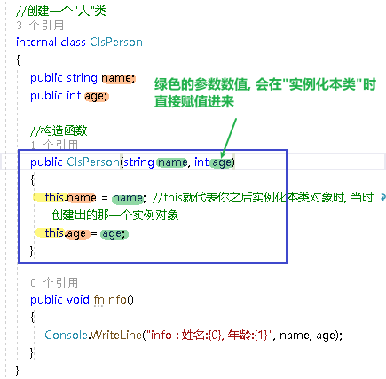
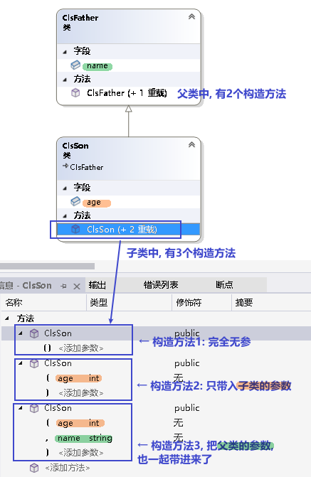
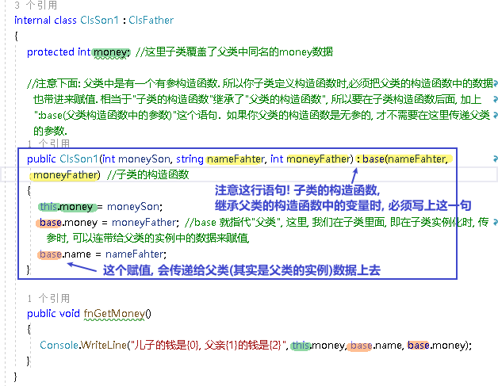
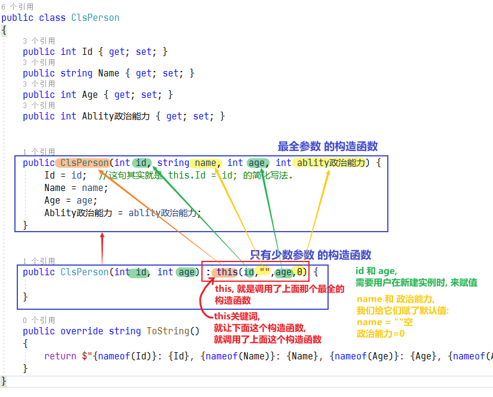


= 类 - 构造函数
:sectnums:
:toclevels: 3
:toc: left

---

== 构造函数

"构造函数"的返回值, 只能和封装它的class类的类型相同. 即: "构造函数"的作用, 是用来在"实例化"该类时, 对实例化出的对象, 进行数据赋值.

注意: 构造函数有这几个特点:

- *构造函数的函数名, 要和类名一致.* 
- 构造函数不需要返回值. 构造函数没有返回值, 连 void 也不能写.
- *构造函数的修饰符, 必须是 public.*
- 如果你不手动显式的写一个构造函数, 则程序会自动帮你在类里面, 创建一个"无参的构造函数".
- *构造函数中, 要使用this关键词, 来代表"实例对象"自己.*

实例构造器, 支持以下的修饰符:

- 访问权限修饰符: public, internal, private, protected.
- 非托管代码修饰符: unsafe, extern

C#编译器, 会自动为没有显式定义"构造器"的类, 生成一个"无参数的公有构造器"。但是，一旦你显式地定义了至少一个构造器, 那么系统就不再自动生成"无参数的构造器"了。

'''

== 子类的构造函数

==== 子类的构造函数, 是"无参数"的

[,subs=+quotes]
----
namespace ConsoleApp4 {

    //父类
    public class ClsFather
    //构造函数
    {
        public ClsFather() {
            Console.WriteLine("父类的构造函数");
        }
    }

    //子类 
    *internal class ClsSon : ClsFather //继承自父类*
   {
        *public ClsSon() //子类这个构造函数, 这里是无参的. 注意, 这里有 ":base()"代码. 说明继承自父类的构造函数*
        {
            Console.WriteLine("子类的构造函数");
        }
    }

    //主函数
    internal class Program {
        static void Main(string[] args) {
            ClsSon insSon = new ClsSon();
        }
    }
}
----

输出:
....
父类的构造函数
子类的构造函数
....

可以看出, 子类继承自父类后, 在实例化子类对象时, 会先执行父类的构造函数, 再执行子类的构造函数.

'''

==== 子类的构造函数, 给父类的构造函数中的字段, 传参 -> 子类的这个构造函数, 要加上 ": base(父类中字段)" 这句代码

子类虽然可以访问父类的构造器, 但并非自动继承, 所以子类必须声明自己的构造函数. +
子类可以通过 base 关键字, 来调用父类的构造器.

base关键字, 和this 关键字很像，但 *base关键字调用的是基类的构造器。*

[,subs=+quotes]
----
public class Cls父类
{
    public int num;

    //无参构造函数
    public Cls父类() {
    }

    //有参构造函数
    *public Cls父类(int num) {*
        this.num = num;
    }
}

public class Cls子类 : Cls父类
{
    *//子类中, 调用父类的有参构造函数*
    *public Cls子类(int num) : base(num) {*
    }
}

internal class Program
{
    //主函数
    static void Main(string[] args) {
        Cls子类 ins子类 = new Cls子类(100);
        Console.WriteLine(ins子类.num); //100

    }
}
----

[,subs=+quotes]
----
namespace ConsoleApp4 {

    //父类
    class ClsFather {
        public string name;

        // 下面, 可以同时写多个构造函数, 只要传入的参数不同就行了.
        public ClsFather() //构造函数(无参)
        {
            Console.WriteLine("父类的构造函数(无参)");
        }

        public ClsFather(string name) //构造函数(有参)
        {
            this.name = name;
            Console.WriteLine("父类的构造函数(有参)");
        }
    }

    //子类
    class ClsSon : ClsFather //继承自父类
    {
        public int age;
        public ClsSon()  //构造函数(无参). 我们先称为"构造函数1"
        {
            Console.WriteLine("子类的构造函数(无参)");

        }

        public ClsSon(int age)  //构造函数(有参).  我们称为"构造函数2"
        {
            this.age = age;
            Console.WriteLine("子类的构造函数(有参)");
        }

        *public ClsSon(int age, string name) : base(name)  //构造函数(有参, 并把"父类的参数"也包括进来. 要给父类中的字段传参, 子类构造函数这里, 就要加上 : base(传给父类的实参值) 的代码了).*  这一个我们称为"构造函数3".  *如果你父类的构造函数是无参的, 就不需要在这里传递父类的参数, 也就不需要在子类构造函数后面, 写": base()"这句代码.*
        {
            this.age = age;
            base.name = name; //这个name的具体值, 会传递给从父类继承而来的name成员. *base 就指代"父类".*
            Console.WriteLine("子类的构造函数(有参, 并包括进父类的参数)");
        }

    }

    //主函数
    internal class Program {
        //主函数
        static void Main(string[] args) {
            ClsSon insSon = new ClsSon(); //子类实例化时, 无参传入
            //会输出:
            //父类的构造函数(无参)
            //子类的构造函数(无参)
            

            ClsSon insSon2 = new ClsSon(19);  //子类实例化时, 给构造函数传入参数
            //会输出:
            //父类的构造函数(无参)  //这说明, 无论你的子类实例化时, 传不传入参数, 父类的无参构造函数都会被调用.
            //子类的构造函数(有参)  //子类实例化时, 传入参数, 就会调用子类的"有参构造函数", 而忽略"无参构造函数".
             

            ClsSon insSon3 = *new ClsSon(19, "爸爸的名字诸葛亮"); //既然你实例化时, 连带父类的成员name 的具体值, 也一并传入了, 于是就会调用子类中相应的"构造函数3"了.*
            //会输出:
            //父类的构造函数(有参)
            //子类的构造函数(有参, 并包括进父类的参数)
            

        }
    }
}
----

又如:

[,subs=+quotes]
----
namespace ConsoleApp4 {

    //父类
    internal class ClsFather {
        protected string name;
        protected int money;

        //构造函数
        public ClsFather(string name, int money) {
            this.name = name;
            this.money = money;
        }

        public void fnGetMoney() {
            Console.WriteLine(this.money);
        }
    }

    //子类
    internal class ClsSon1 : ClsFather {
        protected int money;  //这里子类覆盖了父类中同名的money数据

        public ClsSon1(int moneySon, *string nameFahter, int moneyFather) : base(nameFahter, moneyFather)*  //注意: 父类中有一个有参构造函数. 所以你子类定义构造函数时,必须把父类的构造函数中的数据也带进来赋值. 相当于"子类的构造函数"继承了"父类的构造函数", 所以要在子类构造函数后面, 加上 ":base(父类构造函数中的参数)"这个语句.  如果你父类的构造函数是无参的, 才不需要在这里传递父类的参数.
        {
            this.money = moneySon;
            base.money = moneyFather;  //base 就指代"父类", 这里, 我们在子类里面, 即在子类实例化时, 传参时, 可以连带给父类的实例中的数据来赋值,
            base.name = nameFahter;
        }

        public void fnGetMoney() {
            Console.WriteLine("儿子的钱是{0}, 父亲{1}的钱是{2}", this.money, base.name, base.money);
        }
    }

    //主函数
    internal class Program {
        static void Main(string[] args) {
            ClsFather insFather = new ClsFather("zrx", 3000);
            insFather.fnGetMoney(); //3000

            *ClsSon1 insSon1 = new ClsSon1(800, "zrx", 3000); //因为我们在ClsSon1子类的构造函数里, 规定要传入三个参数: 儿子的钱, 父亲的名字,父亲的钱*
            insSon1.fnGetMoney(); //儿子的钱是800, 父亲zrx的钱是3000
        }
    }
}
----

'''

== 构造函数, 调用另一个字段赋值最全的构造函数

但是, 上面的多个构造函数, 里面有同名的字段, 在每个构造函数里面我们都给它赋值了(比如 this.age = age, 在每个构造函数里都写了这句代码), 这造成了代码的重复编写. 太麻烦了

所以, 我们要让后面的构造函数, 去调用前面那个"赋值已经写的比较全的构造函数". 比如, 你第一个构造函数, 字段已经都赋值过了. 那么你第二个函数就能直接调用第一个构造函数, 以免重复赋值. 方法如下:

[,subs=+quotes]
----
public class ClsPerson
{
    public int Id { get; set; }
    public string Name { get; set; }
    public int Age { get; set; }
    public int Ablity政治能力 { get; set; }

    public ClsPerson(int id, string name, int age, int ablity政治能力) {
        Id = id;  //这句其实就是 this.Id = id; 的简化写法.
        Name = name;
        Age = age;
        Ablity政治能力 = ablity政治能力;
    }

    //下面, 我们就让下面的构造函数, 来调用上面的构造函数. 注意: 下面的构造函数中, 只写了两个字段(id 和 age), 所以另两个字段(name 和 "Ablity政治能力"), 你就可以给它们赋默认值. 即 name="",  Ablity政治能力=0. 然后, *this这个关键词, 就代表调用上面那个写的最全的构造函数. 即把我们的两个需要用户赋值的字段 id 和 age, 和我们赋予了默认值的字段 name 和 政治能力, 都传进上面的最全的构造函数中来处理.  即, 下面这个只有两个参数的构造函数, 其实是调用了上面那个最全的4个参数的构造函数来处理的!*
    public ClsPerson(int id, int age) *: this(id,"",age,0)* {

    }

    public override string ToString()
    {
        return $"{nameof(Id)}: {Id}, {nameof(Name)}: {Name}, {nameof(Age)}: {Age}, {nameof(Ablity政治能力)}: {Ablity政治能力}";
    }
}

//主文件中
ClsPerson insP = new ClsPerson(1,19);  *//只传两个参数的值, 即 id=1, age=19. 则另两个参数, 就会使用默认值.*
Console.WriteLine(insP); //Id: 1, Name: , Age: 19, Ablity政治能力: 0
----

'''

== 静态构造函数

- *每个class类的"静态构造器", 只会执行一次，而不是每个实例执行一次.*
- 一个class类, 只能定义一个"静态构造器"，名称必须和类型同名，且没有参数.

以下两种行为, 可以触发静态构造器执行: +
1. 实例化类型 +
2. 访问类型的静态成员

[,subs=+quotes]
----
public class ClsP
{
    public static string strInfo = "我是静态字段"; //静态字段

    *//静态构造函数*
    *static ClsP() {*
        Console.WriteLine("我是静态构造函数");
    }
}

internal class Program
{
    //主函数
    static void Main(string[] args) {
        Console.WriteLine(1);
        ClsP ins1 = new ClsP(); //我是静态构造函数 *← 下面都没执行静态构造器, 说明静态构造函数, 只会在第一个实例化时, 执行一次.*

        Console.WriteLine(2);
        ClsP ins2 = new ClsP(); //空

        Console.WriteLine(3);
        Console.WriteLine(ClsP.strInfo); *//静态构造函数已经执行了后, 即使调用静态字段, 也不会再执行静态构造函数了.*
    }
}
----

上面的例子, 如果倒过来, 先执行静态字段, 再执行实例化的话:

[,subs=+quotes]
----
public class ClsP
{
    public static string strInfo = "我是静态字段"; //静态字段

    *//静态构造函数*
    *static ClsP() {*
        Console.WriteLine("我是静态构造函数");
    }
}

internal class Program
{
    //主函数
    static void Main(string[] args) {
        Console.WriteLine(3);
        *Console.WriteLine(ClsP.strInfo); //我是静态构造函数  ← 如果本类还没有被实例化过, 直接调用静态字段, 则"静态构造函数"也会被执行一次. 执行完后, 下面再实例化本类, 或调用静态成员时, 就不会再执行"静态构造函数"了.*

        Console.WriteLine(1);
        ClsP ins1 = new ClsP(); //空 ← 不会在执行"静态构造函数"

        Console.WriteLine(2);
        ClsP ins2 = new ClsP(); //空 ← 不会在执行"静态构造函数"

        Console.WriteLine(4);
        Console.WriteLine(ClsP.strInfo); //只会打印静态字段里的值, 不会在执行"静态构造函数"
    }
}
----

静态构造器, 只支持两个修饰符: unsafe 和 extern.

