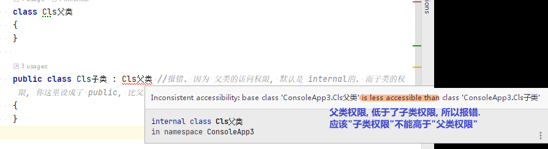
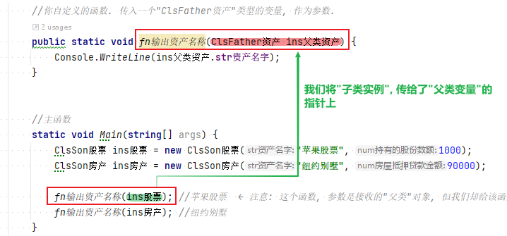
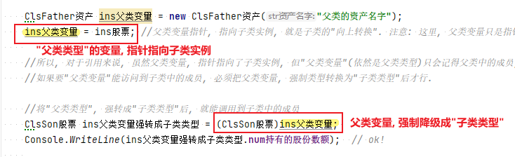
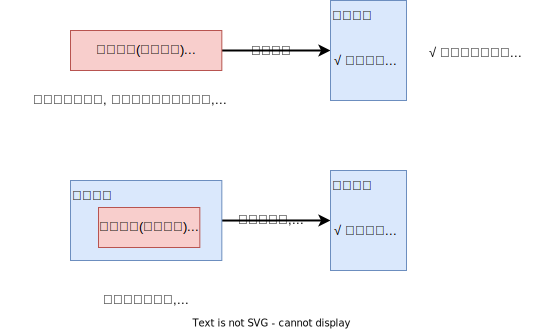


= 类的继承
:sectnums:
:toclevels: 3
:toc: left

---

== 子类的访问权限, 不能比父类的访问权限更高

[,subs=+quotes]
----
class Cls父类 {}

public class Cls子类 : Cls父类 *//报错. 因为 父类的访问权限, 默认是 internal的. 而子类的权限, 你这里设成了 public, 比父类的权限还高! 这是不行的. 子类权限只能 小于等于 ≤ 父类的权限.*
{ }
----

== 多态

引用是多态的。意味着x类型的变量, 可以指向x子类的对象。

....
asset n.   /ˈæset/

1.~ (to sb/sth)a person or thing that is valuable or useful to sb/sth 有价值的人（或事物）；有用的人（或事物）

•She'll be an asset to the team. 她将是这个队的骨干。
•In his job, patience is an invaluable asset. 他干的这份工作，耐心是无价之宝。

2.[ usually pl.] a thing of value, especially property, that a person or company owns, which can be used or sold to pay debts 资产；财产

•the net asset value of the company 公司的资产净值
•Her assets include shares in the company and a house in France. 她的财产包括公司的股份和在法国的一座房子。
•asset sales/management 资产销售╱管理
•financial/capital assets 金融╱资本资产

英语单词asset原本是个法律术语，表示“足以清偿债务的财产”。该单词来自拉丁文ad satis，其中，ad=to，astis=enough，如satisfy（满足），所以该单词的字面意思就是“足够的”。
....

....
mort·gage   /ˈmɔːɡɪdʒ/

( also informal ˌhome ˈloan )
( also informal also ˌhome ˈloan ) a legal agreement by which a bank or similar organization lends you money to buy a house, etc., and you pay the money back over a particular number of years; the sum of money that you borrow 按揭（由银行等提供房产抵押借款）；按揭贷款

•to apply for/take out/pay off a mortgage 申请╱取得╱还清抵押贷款
•mortgage rates (= of interest) 按揭贷款利率

 -mort-死 + -gage-(承诺,抵押) → 抵押人(mortgagor)到期如果不能清还贷款,其被抵押的财产就会死(丧失) 同源词：wed, wage, engage 搭配：in mortgage 在抵押中on mortgage 以抵押方式place a mortgage on… 以…作抵押
....

[,subs=+quotes]
----
*public class ClsFather资产*
{
    public string str资产名字;

    public ClsFather资产(string str资产名字) {
        //构造函数
        this.str资产名字 = str资产名字;
    }
}

//子类1
*public class ClsSon股票 : ClsFather资产*
{
    public long num持有的股份数额;

    public ClsSon股票(string str资产名字, long num持有的股份数额) : base(str资产名字) {
        //构造函数
        this.num持有的股份数额 = num持有的股份数额;
    }
}

//子类2
*public class ClsSon房产 : ClsFather资产*
{
    public long num房屋抵押贷款金额;

    public ClsSon房产(string str资产名字, long num房屋抵押贷款金额) : base(str资产名字) {
        //构造函数
        this.num房屋抵押贷款金额 = num房屋抵押贷款金额;
    }
}

internal class Program
{
    *//你自定义的函数. 传入一个"ClsFather资产"类型的变量, 作为参数.*
    *public static void fn输出资产名称(ClsFather资产 ins父类资产) {*
        Console.WriteLine(ins父类资产.str资产名字);
    }

    //主函数
    static void Main(string[] args) {
        ClsSon股票 ins股票 = new ClsSon股票("苹果股票", 1000);
        ClsSon房产 ins房产 = new ClsSon房产("纽约别墅", 90000);

        *fn输出资产名称(ins股票); //苹果股票  ← 注意: 这个函数, 参数是接收的"父类"对象, 但我们却给该函数传入了其"子类的实例", 这说明: 父类变量, 可以指向其子类的实例. 即: 引用是"多态"的.*
        fn输出资产名称(ins房产); //纽约别墅

    }
}
----

**多态之所以能够实现，即"父类变量"只所以能指针指向"子类实例", 是因为子类(Stock和House)具有基类(Asset)的全部特征，反过来则不正确。即"子类变量",不能指针指向"父类实例".**

'''

== 类型转换和引用转换

"对象引用"可以:

- "隐式"向上转换为"基类"的引用;
- "显式"向下转换为"子类"的引用。

*类型转换, 会生成一个新的引用(即指针), 指向同一个对象.*

==== 父类变量, 降级成"子类类型"后, 就能看到子类中的成员

"向上"类型转换, 会创建一个父类的指针, 指向子类:

[,subs=+quotes]
----
ClsSon股票 ins股票 = new ClsSon股票("苹果股票", 1000);
ClsSon房产 ins房产 = new ClsSon房产("纽约别墅", 90000);

ClsFather资产 ins父类变量 = new ClsFather资产("父类的资产名字");
*ins父类变量 = ins股票; //父类变量指针, 指向子类实例, 就是子类的"向上转换". 注意: 这里, 父类变量只是指针指向子类实例, 这个"父类变量"依然是属于父类类型的. 而没有被类型转换为"子类类型".*

*//所以, 对于引用来说, 虽然父类变量, 指针指向了子类实例, 但"父类变量"(依然是父类类型)只会记得父类中的成员, 不会记得子类中多出来的成员. 即"父类变量"无法调用"只属于子类中的成员".
//如果要"父类变量"能访问到子类中的成员, 必须把父类变量, 强制类型转换为"子类类型"后才行.*

**//将"父类类型", 强转成"子类类型"后, 就能调用到子类中的成员
ClsSon股票 ins父类变量强转成子类类型 = (ClsSon股票)ins父类变量; **
Console.WriteLine(ins父类变量强转成子类类型.num持有的股份数额);  // ok!
----

'''

==== as 和 is

向下转换, 是"子类变量"指针指向一个"父类被强制降级成子类"后的"原父类变量".

即:
....
Cls子类 ins子类实例 = (Cls子类)ins父类变量;
....

如果"向下转换"失败，会抛出 InvalidCastException.

as运算符, 在"向下类型转换"出错时, 返回 null (而不是抛出异常):

'''

== 里式转换

==== (1)"父类变量", 可以指向"子类的实例". 但无法记得子类中的函数方法. (2)但你可以将"父类变量", 强制类型转换为"子类类型"后, 父类变量, 就既能记得父类中的函数方法, 也能记得子类中的函数方法了.

即, 子类对象可以调用父类中的成员，但是父类对象, 永远都只能调用(记得)自己(父类中的)的成员。

[,subs=+quotes]
----
namespace ConsoleApp1
{
    //父类
    public class ClsFather {
        public  void fnFatherPrint() {
            Console.WriteLine("我是父类");
        }
    }

    //子类1
    public class ClsSon:ClsFather { //子类继承子父类
        public  void fnSonPrint() {
            Console.WriteLine("我是子类-男");
        }
    }

    //子类2
    public class ClsDaughter : ClsFather { //子类继承子父类
        public  void fnDaughterPrint() {
            Console.WriteLine("我是子类-女");
        }
    }

    //主文件中
    internal class Program
    {
        static void Main(string[] args)
        {

            ClsSon insSon = new ClsSon();
            insSon.fnSonPrint(); //我是子类-男
            *insSon.fnFatherPrint(); //我是父类 ←子类可以调用"从父类上继承来的方法".*

            ClsFather  insFather =new ClsFather();
           ** //insFather.fnSonPrint();  //报错. ← 但父类实例, 无法调用只属于子类的方法.**

            *//1.子类可以赋值给父类. 即, 父类实例的变量, 可以指针指向子类实例.*
            insFather = insSon; //这有什么用处呢? *比如, 如果一个地方, 需要使用父类来作为参数, 则我们可以用一个子类来代替它. (可以木兰替父从军)*

            ClsFather insFather2 = new ClsSon(); //上面一句的代码就相当于这句. "父类实例"的变量,可以指向"子类实例".
            insFather2.fnFatherPrint();  *//但是, 父类变量, 依然不会忘记自己的本源出处, 即脑袋里只会记得父类中的方法, 而不会记得子类中的方法. 即, 它访问不到子类中的方法.*
                                         // insFather2.fnSonPrint(); //报错.

            *//2.如果父类变量中, 指向的是子类实例, 那么我们就可以将这个父类变量, 强制转换为"子类类型"的实例对象.*
            ClsSon  insFather2toSon = (ClsSon)insFather2; *//将指向子类的"父类变量", 强制类型转换为子类类型.*
            insFather2toSon.fnSonPrint(); *//然后, 该父类变量, 就能记得子类中的方法了.*
            insFather2toSon.fnFatherPrint(); *//同时, 该父类变量, 也不会忘记父类中的方法. 即, 现在它拥有了双重记忆, 一个是父类中的记忆, 一个是子类中的记忆.*

        }
    }
}
----

但, 上面我们都是用的"强制类型转换"，这有可能会导致异常。 为了解决这一问题, C# 就提供了 is 与 as 的语法来帮你转换，is与as永远不会抛出异常.

使用is和as, 可以取代你手动的"强制类型转换".

使用is: 
[,subs=+quotes]
----
if(a is Dog)  //is 会返回 ture 或 false
{
    Dog d = (Dog)a;
    ...
}
----

使用as
[,subs=+quotes]
----
Dog d = a as Dog;  //as会返回 转换后的对象 或 null
if(d!=null)
{
    ...
}
----

'''

== 将父类变量, 转成"子类类型"

将父类变量, 转成"子类类型"之前, 要先做类型判断.

==== is -> ins父类实例 is Cls子类类型 ← is 如果能够转换成功，则返回一个true; 否则返回一个false

[,subs=+quotes]
----
ClsFather ins父类实例 = new ClsFather();
ClsSon ins子类男实例= new ClsSon();
ClsDaughter ins子类女实例 = new ClsDaughter();

ins父类实例 = ins子类男实例;

*//下面的判断, 能成功, 因为上面一行代码, 我们的确是将父类变量, 指向子类类型的. 即父类变量, 的确是属于子类类型.*
*if(ins父类实例 is ClsSon) { //is运算符, 用来判断对象是不是某种类型. 比如, x is double*
    ClsSon ins父类实例转子类类型 = (ClsSon)ins父类实例;
    ins父类实例转子类类型.fnSonPrint();
}
else {
    Console.WriteLine("a变量不属于B类型, 所以无法将a变量\"强制类型转换\"成B类型");
}

*//下面的判断, 会判定为类型不符. 因为父类变量, 并不指向"子类女"的类型. 所以就无法强制类型转换成"子类女"的类型.*
if (ins父类实例 is ClsDaughter) { //is运算符, 用来判断对象是不是某种类型. 比如, x is double
    ClsDaughter ins父类实例转子类女类型 = (ClsDaughter)ins父类实例;
}
else {
    Console.WriteLine("a变量不属于B类型, 所以无法将a变量\"强制类型转换\"成B类型");
}
----

'''

==== as -> ins父类实例 as Cls子类类型  ← as如果转换成功, 则返回对应的对象; 否则，返回 Null.

[,subs=+quotes]
----
ClsFather ins父类实例 = new ClsFather();
ClsSon ins子类男实例= new ClsSon();
ClsDaughter ins子类女实例 = new ClsDaughter();

*ClsSon ins父类变量转男子类 = ins父类实例 as ClsSon; //"父类变量", 强制类型转成"子类类型". 即, as的用法, 如果转换成功, 则就把转换后的实例返回给你. 如果转换失败, 则返回null.*
ins父类变量转男子类.fnSonPrint(); //ok
ins父类变量转男子类.fnFatherPrint();  //ok

ClsFather ins父类实例2 = new ClsSon(); //父类变量,指向子类男实例
ClsDaughter ins父类变量转女子类 = ins父类实例2 as ClsDaughter;  /*/这里, 会转换失败, 返回null. 因为上面我们将父类变量, 指向了"子类男", 显然就不能再将父类变量, 转成"子类女"了*
ins父类变量转女子类.fnDaughterPrint(); //报错.提示: ins父类变量转男子类 是 null.
----

'''

== 子类变量, 指向父类实例 -> 要先将父类实例, 转成"子类类型"后,  子类变量才能指向该父类实例.

子类变量insSon, 不能指向父类实例insFather. 但我们可以通过强制类型转换, 来讲父类实例insFather, 转成属于子类类型的 (ClsSon)insFather, 于是, 这个子类变量insSon, 就能指向这个实例了 insSon = (ClsSon)insFather.

[,subs=+quotes]
----
static void Main(string[] args)
{

    ClsFather insFather;
    ClsSon insSon;

    insFather = new ClsSon(); //父类变量, 指向子类的实例
    insFather.fnFather(); //from fahter  ← 即使父类变量, 指向子类实例, 它也不会忘记自己是属于父类的, 只会访问到父类中的方法, 而不能访问到子类中的方法.

    // insSon =new ClsFather();  //这句会报错, 因为子类变量, 不能指向父类实例.

    *insSon = (ClsSon)insFather; // 但你可以用强制类型转换, 把父类实例, 转成子类类型, 这样,  子类变量 insSon 就能指向该实例对象(insFather)了.   这样后, 该子类变量, 既记得自己属于子类, 也记得自己属于父类. 于是就,  既可以调用子类中的方法, 也可以调用父类中的方法*
    insSon.fnFather(); //from fahter
    insSon.fnSon(); //from son

    //上面的强制类型转换, 还可以写成更简单的形式:
    *insSon = insFather as ClsSon;*  // 这句的意思就相当于 insSon = (ClsSon)insFather;  即: insSon这个变量, 会指针指向 "被强制类型转换成子类ClsSon类型"的父类实例 insFather.
    insSon.fnFather(); //from fahter
    insSon.fnSon(); //from son
}
----

image:img/0037.svg[,50%]

'''

