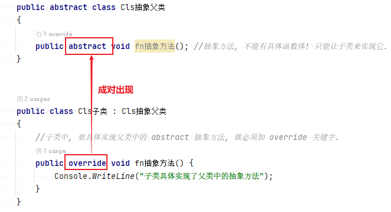


= 抽象类
:sectnums:
:toclevels: 3
:toc: left

---

== abstract 抽象类

*声明为抽象(abstract)的类, 不能够实例化*，只有抽象类的具体实现子类, 才能实例化。

抽象类中, 可以定义"抽象成员". "抽象成员"和"虚成员"相似，只不过**"抽象成员"不提供默认的实现**。除非子类也声明为抽象类，否则其实现必须由子类提供:

[,subs=+quotes]
----
public abstract class Cls抽象父类
{
    *public abstract void fn抽象方法(); //抽象方法, 不能有具体函数体! 只能让子类来实现它.*
}

public class Cls子类 : Cls抽象父类
{
    *//子类中, 要具体实现父类中的 abstract 抽象方法, 就必须加 override 关键字.*
    *public override void fn抽象方法() {*
        Console.WriteLine("子类具体实现了父类中的抽象方法");
    }
}

internal class Program
{
    //主函数
    static void Main(string[] args) {
        Cls子类 ins子类 = new Cls子类();
        ins子类.fn抽象方法(); //子类具体实现了父类中的抽象方法

    }
}
----

类和函数, 能用 abstract 关键词, 把它们变成"抽象"的.

抽象类:

- 类是一个模板, 抽象类就是一个不完整的模板.
- *抽象类不能被实例化, 不能使用new关键字. 所以抽象类只能作为其他类的基类.*
- 如果一个"非抽象类"从"抽象类"中派生，则其必须通过"重载"来实现所有继承而来的抽象成员。
- *如果派生类(即子类)没有实现所有的抽象方法，则该"派生类"也必须声明为"抽象类".*
- *也不能被密封.*
- 抽象类中, 可以包含普通函数, 和抽象函数.
- 抽象类如果含有抽象的变量或值，则它们要么是null类型，要么包含了对非抽象类的实例的引用。

抽象函数:

- 抽象函数, 只有函数定义, 没有函数体. 即抽象函数本身也是虚拟的 virtual.

[,subs=+quotes]
----
//抽象类
*abstract* internal class abstClsLife  *//抽象类, 用 abstract 申明*
{
    public *abstract* void fn觅食(); *//抽象方法, 不需要函数体.*

    public void fnMove() *//抽象类中, 可以包含普通的方法*
    {
        Console.WriteLine("本生命体在移动");
    }
}

//抽象类的子类
internal class ClsFather:abstClsLife // 这个父类继承自抽象类
{
    public  void fnTalking()
    {
        Console.WriteLine("父类的口才");
    }

    public *override* void fn觅食()  *// 在子类中, 对其父类(是抽象类)中的"抽象方法"的重写 , 要用 override 关键词*
    {
        Console.WriteLine("父类在觅食");
    }
}

//主文件中
static void Main(string[] args)
{
    ClsFather insFather = new ClsFather();
    insFather.fn觅食(); //父类在觅食

    abstClsLife insLife = new ClsFather(); // 我们将抽象类的变量, 指针指向其子类 "ClsFather类"的实例.
    insLife.fn觅食(); //父类在觅食
    insLife.fnMove(); //本生命体在移动  ← 虽然, insLife 所指向的子类"ClsFather类"中没有 fnMove()方法, 但抽象类中有, 所以这里依然能找到父类中的该方法.
    //insLife.fnTalking(); //这句会报错. 虽然 "ClsFather类" 中有这个方法, 但抽象类中却没有这个方法. 所以无法被调用.
}
----

image:img/0030.png[,]

总结就是: 父类变量, 即使指向子类对象, 也没忘了本身父类中的方法! (身在曹营心在汉). 即, 只执行父类中有的, 和父类和子类共同有的东西(交集部分. 比如同名函数). 而忽略掉父类中不存在的东西(哪怕这些东西子类中有), 也不执行.

'''

