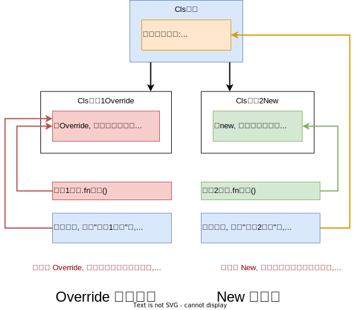
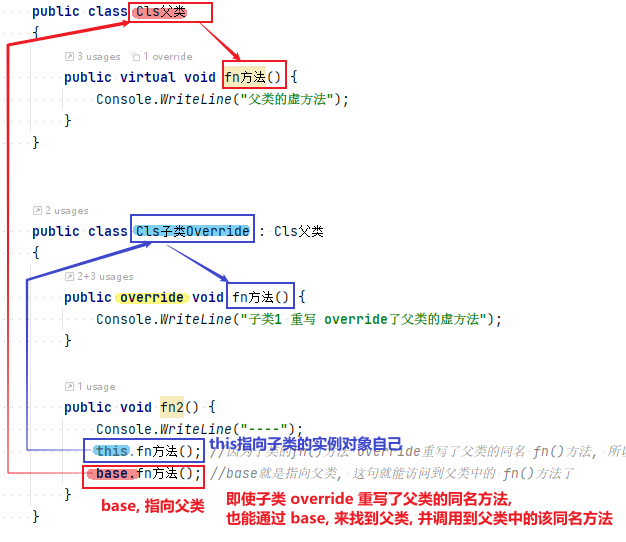



= 子类重写, 覆盖 父类中的同名方法
:sectnums:
:toclevels: 3
:toc: left

---

== 子类中, 重写父类的同名方法, 就会"覆盖掉"父类的方法. (父类中该方法依然存在, 只不过被子类的同名方法屏蔽了) 

[,subs=+quotes]
----
internal class ClsSon2: ClsFather {
    public string language; //添加一个子类2自己的数据

    *public void fnCan2() //重写继承自父类的 fnCan2方法. 会覆盖掉父类的同名方法.*
    {
        Console.WriteLine("会走(子类2专属)");
    }
}
----

'''

== 虚方法 virtual ← 也是 在子类中,重写父类中的同名方法

*一个方法(函数), 如果被标识为 virtual, 就表明它可以被"重写 overriden".* +
可以被标识为 virtual 的有: 方法, 事件, 属性, 索引器.

[,subs=+quotes]
----
namespace ConsoleApp4 {

    //父类
    internal class ClsFather {
        public *virtual* void fnTalking() *//virtual 让本方法, 变成了"虚方法"*
        {
            Console.WriteLine("父类的口才");
        }
    }

    //子类
    internal class ClsSon : ClsFather {
        public *override* void fnTalking() { *// 子类要通过override修饰符, 来重写父类中的虚方法. 在子类中, 只要先输入 "override+空格", 软件就会提示你要重写哪个父方法.*
            Console.WriteLine("子类的口才");
        }
    }

    //主函数
    internal class Program {
        static void Main(string[] args) {
            ClsSon insSon = new ClsSon();
            insSon.fnTalking(); //子类的口才
        }
    }
}
----

'''

== new ->  子类会隐藏掉父类中的同名成员

[,subs=+quotes]
----
public abstract class Cls父类
{
    *public int age = 50;*
}

public class Cls子类 : Cls父类
{
    *public int age = 20; //子类中, 有一个和父类同名的字段, 就会隐藏掉父类中的同名字段.*
}

internal class Program
{
    //主函数
    static void Main(string[] args) {
        Cls子类 ins子类 = new Cls子类();
        *Console.WriteLine(ins子类.age); //20 ← 只会打印出子类自己的字段的值*
    }
}
----

如果你是特意写重名的, 就在子类的该成员前面, 加上 new 关键字.
[,subs=+quotes]
----
public abstract class Cls父类
{
    public int age = 50;
}

public class Cls子类 : Cls父类
{
    *public new int age = 20; //子类中, 有一个和父类同名的字段, 但我们这里加了 new 关键字,  就是告诉编译器: 我这里重复的成员是有意义的! 而不是疏忽写重名了. 此时, 子类同名成员, 依然会隐藏掉父类中同名成员的值.*
}

internal class Program
{
    //主函数
    static void Main(string[] args) {
        Cls子类 ins子类 = new Cls子类();
        Console.WriteLine(ins子类.age); //20 ← 只会打印出子类自己的字段的值
    }
}
----

'''

== "new" 和 "override 重写" 的区别 ->   New, 仅仅"隐藏"(依然是可以访问)父类中的方法.  而 Override 会"覆盖掉"(无法访问)父类中的方法.

[,subs=+quotes]
----
    public class Cls父类
    {
        public *virtual* void fn方法() {
            Console.WriteLine("父类的虚方法");
        }
    }

    public class Cls子类Override : Cls父类
    {
        public *override* void fn方法() {
            Console.WriteLine("子类1 重写 override了父类的虚方法");
        }
    }

    public class Cls子类New : Cls父类
    {
        public *new* void fn方法() {
            Console.WriteLine("子类2 隐藏 new了父类的虚方法");
        }
    }

    internal class Program
    {
        //主函数
        static void Main(string[] args) {
            Cls子类Override ins子类Override = new Cls子类Override();
            ins子类Override.fn方法(); //子类1 重写 override了父类的虚方法

            *Cls父类 ins父类1 = ins子类Override; //父类变量, 指向子类实例.*
            ins父类1.fn方法(); //子类1 重写 override了父类的虚方法

            Cls子类New ins子类New = new Cls子类New();
            ins子类New.fn方法(); //子类2 隐藏 new了父类的虚方法

            *Cls父类 ins父类2 = new Cls子类New(); //父类变量, 指向子类实例.*
            ins父类2.fn方法(); //父类的虚方法

        }
    }
----

*如果, 你想在子类中, 能访问到被override的父类方法, 就要使用 base 关键字*.

[,subs=+quotes]
----
public class Cls父类
{
   *public virtual void fn方法() {*
        Console.WriteLine("父类的虚方法");
    }
}

public class Cls子类Override : Cls父类
{
    *public override void fn方法() { //override 重写*
        Console.WriteLine("子类1 重写 override了父类的虚方法");
    }

    public void fn2() {
        *this.fn方法(); //因为子类的fn()方法 override重写了父类的同名 fn()方法, 所以这里只调用的就只是 子类中的 fn()方法了.*
        *base.fn方法(); //base就是指向父类, 这句就能访问到父类中的 fn()方法了*
    }
}
----

在"用 new 隐藏掉父类同名属性"的子类中, base关键字依然有效.

'''

在子类中, 要隐藏掉父类的同名方法, 要在子类这个方法前 使用关键词 new.

[,subs=+quotes]
----
namespace ConsoleApp4 {

    //父类
    internal class ClsFather {
        public void fnTalking() {
            Console.WriteLine("父类的口才");
        }
    }

    //子类
    internal class ClsSon : ClsFather  //子类继承自父类
    {
        public *new* void fnTalking()  *//要隐藏父类中的同名方法, 在这里要加 new 关键词*
        {
            Console.WriteLine("子类的口才");
        }
    }

    //主函数
    internal class Program {
        static void Main(string[] args) {
            ClsSon insSon = new ClsSon();
            insSon.fnTalking(); //子类的口才

            ClsFather insFather = new ClsSon();  // 父类变量, 指向子类的实例对象
            insFather.fnTalking(); //父类的口才  ← 你发现, 虽然父类中有子类的同名方法, 但是父类变量指向子类实例后, 调用该同名方法时, 依然执行的是父类中的方法, 而不是子类中的方法. 这就是本"隐藏函数"和"虚函数"在重写父类方法的区别所在.
                                   //即, *子类中, 用"虚函数"方式 override 重写的父类方法, 父类变量指向子类对象, 再调用子类的方法, 会执行"子类中的方法". 这意味着"父类中的方法"已经完全被清除掉了, 不存在了, 覆盖掉了.*
                                   // *如果用"隐藏函数"的方法, 来改写的父类方法. 父类变量指向子类对象, 再调用子类的方法, 会执行"父类中的方法". 这说明父类方法保存完好.*

        }
    }
}
----

image:img/0027.png[,]

'''

