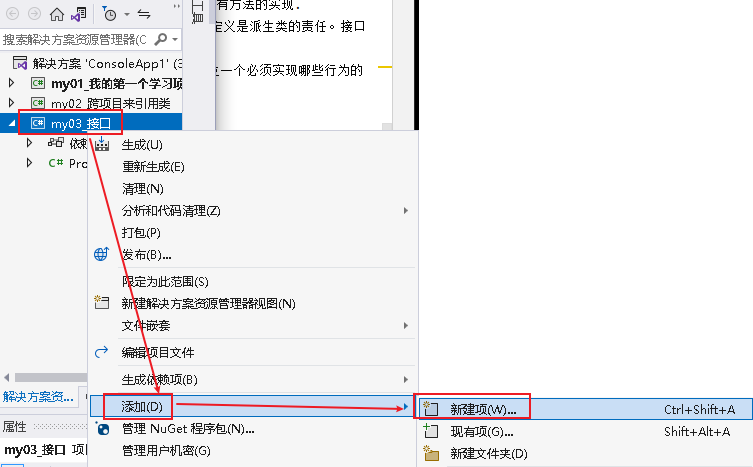
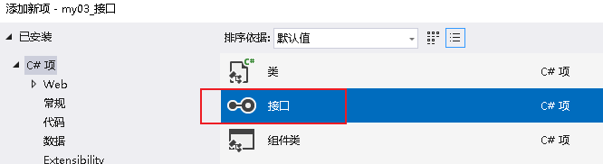
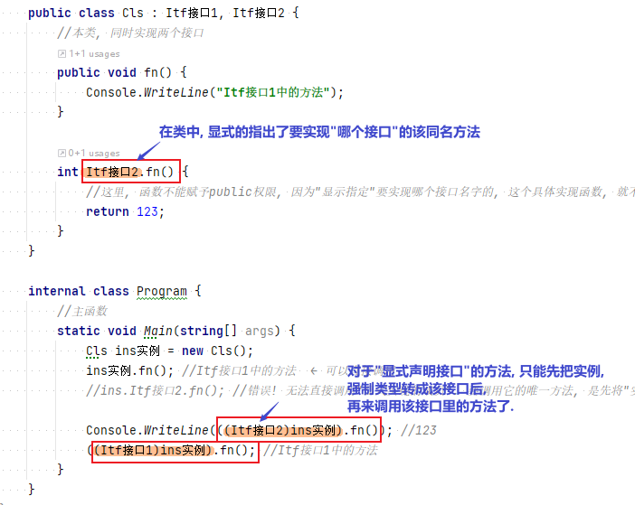
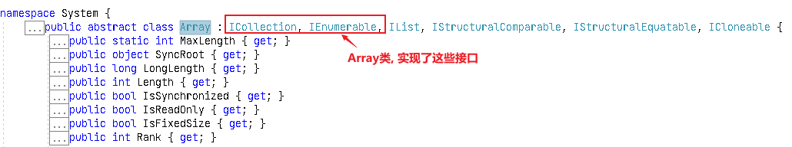
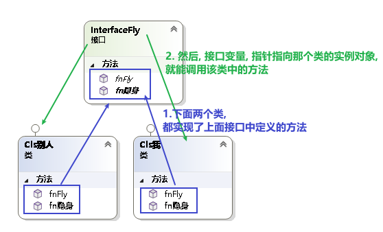

= 接口
:sectnums:
:toclevels: 3
:toc: left

---

== 接口 interface

接口只为成员提供定义, 而不提供实现.

- **接口的成员都是隐式抽象(abstract)的。**相反，类可以包含"抽象的成员"和"有具体实现的成员". *接口只能包含方法、属性、事件, 索引器，而这些正是类中可以定义为"抽象"的成员类型。*

- 一个类(或者结构体）可以实现多个接口。而一个类只能够继承一个类，结构体则完
全不支持继承(只能从System.valueType派生)。

*接口成员总是隐式 public 的，并且不能用"访问权限修饰符"声明。实现接口, 意味着它将为所有的成员提供 public 实现.*

*比如, 虽然你的类是 internal权限的, 但只要它实现了 public的接口, 则类中实现了该接口的成员, 就可以作为 public成员来访问 (自动获得访问权限升级).*

但假如你的接口, 本身就定义成了 internal权限的, 则类中的成员就不会超过这个权限了.

- 接口中, 只包含方法的声明, 而没有方法的实现. 方法的实现是派生类的责任. 换言之, 接口本身并不实现任何功能，它只是提供了派生类应遵循的标准结构 (苹果 Apple MFi 认证).
- 接口不能有"构造函数"，也不能有字段.
- 接口也不允许运算符重载.
- 接口定义中, 不允许声明成员的修饰符，接口成员都是公有的.

'''

== 创建一个接口

[,subs=+quotes]
----
//接口
namespace my03_接口
{
    internal *interface InterfaceFly*
    {
        public void fnFly(); *//在本接口中, 我们声明一个fly飞翔方法, 但没有具体函数体.*
    }
}

//用来实现接口的"类":
internal *class Cls我 : InterfaceFly  // 本类, 将要实现 InterfaceFly接口*
{

    *public void fnFly()  //在本类中, 来具体实现"接口中定义的方法".*
    {
        Console.WriteLine("Cls我, 这个类, 具体实现了 fly 方法");
    }
}
----

'''

== 接口, 可以继承自另一个接口

[,subs=+quotes]
----
//父接口
internal *interface IF父接口*
{
    public void fn父接口中的方法();
}

//子接口
internal *interface IF子接口: IF父接口   //子接口, 继承自父接口*
{
    public void fn子接口中的方法();
}

//实现接口的"类"
internal *class Cls我 : IF子接口  // 本类, 将要实现 "IF子接口", 由于"子接口", 继承了"父接口", 所以"子接口"中就有两个方法了, 都要被具体实现*
{
    public void fn子接口中的方法()
    {
        Console.WriteLine("Cls我, 实现了\"子接口\"中的方法");
    }

    public void fn父接口中的方法()
    {
        Console.WriteLine("Cls我, 实现了\"父接口\"中的方法");
    }
}

//主文件
Cls我 my = new Cls我();
my.fn子接口中的方法(); //Cls我, 实现了"子接口"中的方法
my.fn父接口中的方法(); //Cls我, 实现了"父接口"中的方法
----

'''

==== 如果父接口, 和子接口中, 有同名的方法, 则你可以通过在类中, 来"显式指定要实现哪个接口中的方法"(explicitly implementing),来解决冲突.

[,subs=+quotes]
----
    interface Itf接口1
    {
        void fn(); //无返回值
    }

    interface Itf接口2
    {
        int fn(); //返回int类型. *← 这个接口里, 有一个和上面接口同名的方法存在, 虽然返回类型不同.*
    }

    *public class Cls : Itf接口1, Itf接口2 //本类, 同时实现两个接口*
    {
        public void fn() {
            Console.WriteLine("Itf接口1中的方法");
        }

        int Itf接口2.fn() {
            *//这里, 函数不能赋予public权限, 因为"显示指定"要实现哪个接口名字的, 这个具体实现函数, 就不能设为 public的.*
            return 123;
        }
    }

    internal class Program
    {
        //主函数
        static void Main(string[] args) {
            Cls ins实例 = new Cls();
            ins实例.fn(); //Itf接口1中的方法  ← 可以直接调用
            //ins.Itf接口2.fn(); //错误! *无法直接调用"显式实现的成员". 要调用它的唯一方法, 是先将"实例对象"转换为对应的"接口".*

            Console.WriteLine(*((Itf接口2)ins实例).fn()*); //123
           *((Itf接口1)ins实例).fn();* //Itf接口1中的方法
        }
    }
----

另一个使用"显式实现接口成员"的原因是: 为了隐藏那些高度定制化的,或对类的正常使用干扰很大的接口成员(即,最大程度降低"胖接口"的影响, 接口中有很多你的class类不需要的方法. 你不想全继承下来)。例如，实现了ISerializable接口的类, 通常会选择隐藏ISerializable成员，除非显式转换成这个接口。

'''

==== C#中的类, 允许同时继承多个接口.

C#中的类, 不允许同时继承多个父类, 但允许同时继承多个接口.

[,subs=+quotes]
----
internal *class Cls我 : ClsFather, IF子接口, IF父接口*
{
}
//一个类, 既继承了"父类", 又继承了"接口"时, 接口必须写在后面.
----

'''

== 接口的"多态": 接口变量, 可以指针指向"任何实现了该接口的具体类的实例对象"

[,subs=+quotes]
----
//接口
internal *interface* InterfaceFly {
    public void fnFly();
    public void fn隐身();
}

//实现了该接口的 "Cls我"类
internal *class Cls我 : InterfaceFly  // 本类, 将要实现 InterfaceFly接口*
{

    public void fnFly() { //在本类中, 来具体实现"接口中定义的方法".
        Console.WriteLine("Cls我, 这个类, 具体实现了 fly 方法");
    }

    public void fn隐身() {
        Console.WriteLine("Cls我, 这个类, 具体实现了 \"隐身\"方法");
    }
}

//实现了该接口的 "Cls别人"类
internal **class Cls别人 : InterfaceFly { //本类实现了该接口 **
    public void fnFly() {
        Console.WriteLine("Cls别人, 这个类, 具体实现了 fly 方法");
    }

    public void fn隐身() {
        Console.WriteLine("Cls别人, 这个类, 具体实现了 隐身 方法");
    }
}

//主函数
internal class Program {
    static void Main(string[] args) {
        *InterfaceFly v接口变量;  //这里,我们定义了一个接口变量, 让它可以指向"任何实现了该接口的具体类的实例对象".  即, 这个接口变量的指针, 指向那个类的实例, 就能调用该类实例中的方法.*

        *v接口变量 = new Cls我();  // 让接口变量,指向 "Cls我"类的实例.*
        v接口变量.fnFly(); //Cls我, 这个类, 具体实现了 fly 方法

        *v接口变量 = new Cls别人(); // 让接口变量,指向 "Cls别人"类的实例.*
        v接口变量.fn隐身(); //Cls别人, 这个类, 具体实现了 隐身 方法
    }
}
----

上面, v接口变量, 由于指向了不同的类的实例, 就能"变身"为不同角色, 执行不同功能. 这就是"多态" (多种形态).

'''

== 引入接口, 就能让类与类之间的耦合, 变松

[,subs=+quotes]
----
namespace ConsoleApp4 {

    //接口
    *interface Itf手机 {*
        void fn拨号();
        void fn上网();
        void fn装app();
    }

    //下面的类, 来实现上面的接口
    *class Cls苹果手机 : Itf手机 {*
        public void fn拨号() {
            Console.WriteLine("苹果手机, 拨号...");
        }

        public void fn上网() {
            Console.WriteLine("苹果手机, 上网...");
        }

        public void fn装app() {
            Console.WriteLine("苹果手机, 装app...");
        }
    }

    //谷歌手机, 也实现上面的接口
    class Cls谷歌手机 : Itf手机 {
        public void fn拨号() {
            Console.WriteLine("谷歌手机, 拨号...");
        }

        public void fn上网() {
            Console.WriteLine("谷歌手机, 上网...");
        }

        public void fn装app() {
            Console.WriteLine("谷歌手机, 装app...");
        }
    }

    //用户类
    class Cls消费者 {
        *private Itf手机 ins手机;  //有一部接口类型的手机*

        //构造函数
        *public Cls消费者(Itf手机 ins手机) {*
            this.ins手机 = ins手机;
        }

        public void fn用户使用手机() {
            this.ins手机.fn拨号();
            this.ins手机.fn上网();
            this.ins手机.fn装app();
        }
    }

    //主函数
    internal class Program {
        static void Main(string[] args) {

            *Cls消费者 ins消费者 = new Cls消费者(new Cls苹果手机()); //给用户实例, 传入一步实现了接口的苹果手机.*
            ins消费者.fn用户使用手机();

            //输出:
            // 苹果手机, 拨号...
            // 苹果手机, 上网...
            // 苹果手机, 装app...

            *Cls消费者 ins消费者2 = new Cls消费者(new Cls谷歌手机()); //给用户实例, 传入一步实现了接口的谷歌手机.*
            ins消费者2.fn用户使用手机();
            //输出:
            // 谷歌手机, 拨号...
            // 谷歌手机, 上网...
            // 谷歌手机, 装app...
        }
    }
}
----

*接口, 就是为了 class 与 class 之间"解耦合"的目的而生. +
但注意:当类实现一个接口的时候，class 与 interface 之间的关系也是“紧耦合”.*

'''

