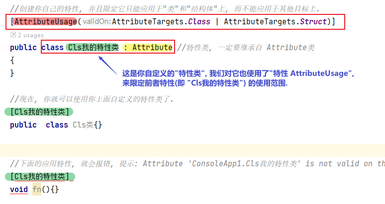
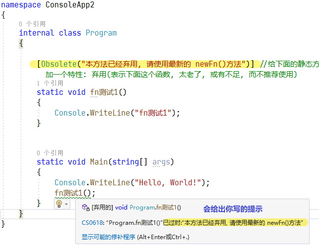
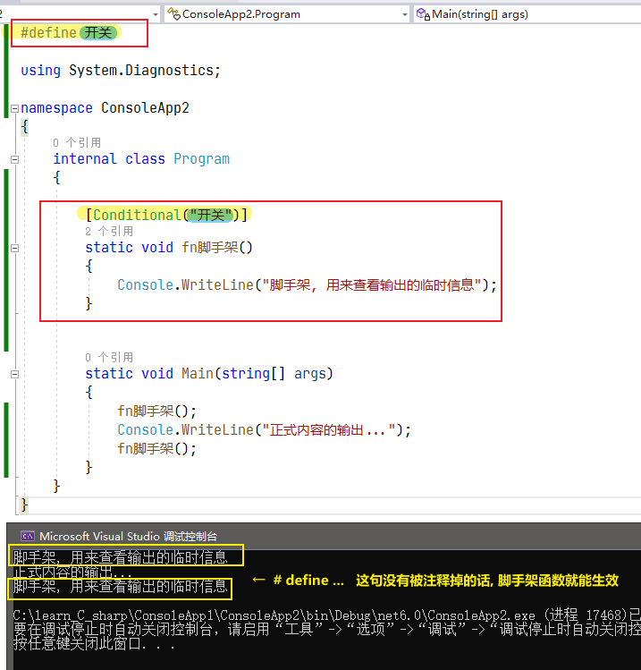
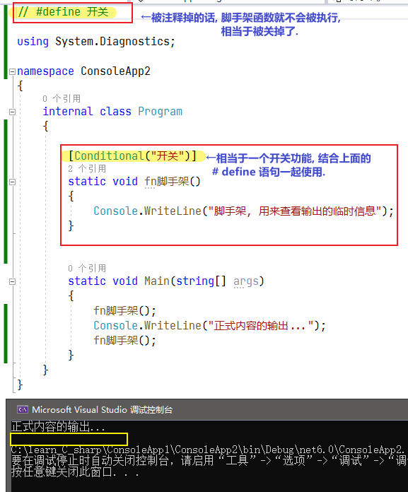
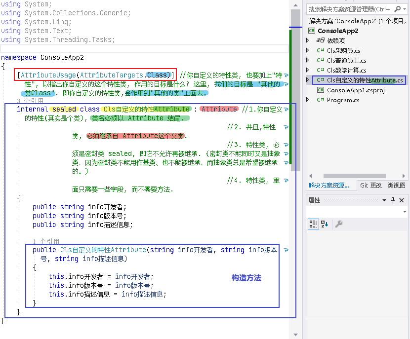
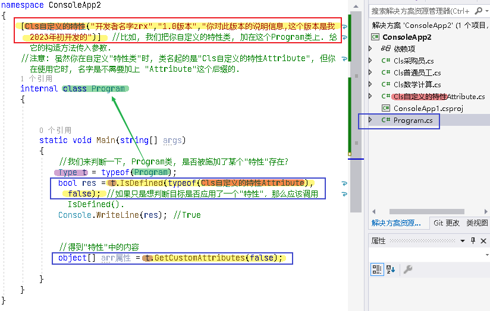

= 特性 attribute
:sectnums:
:toclevels: 3
:toc: left

---

== 特性

在 C# 中，*"特性"是继承自 Attribute 基类的类。 所有继承自 Attribute 的类都可以用作其他代码块的一种“标记”。*  +
例如，有一个名为 ObsoleteAttribute 的特性。 它用于示意代码已过时，不得再使用。 可以将此"特性"应用于类（比如说，使用方括号）。

[,subs=+quotes]
----
[Obsolete("ThisClass is obsolete. Use ThisClass2 instead.")]
public class MyClass
{
}
----

*注意，虽然此类的名称为 ObsoleteAttribute，但只需在代码中使用 [Obsolete]。* 这是 C# 遵循一项约定。 如果愿意，也可以使用全名 [ObsoleteAttribute]。

*按照约定，所有特性名称均以“Attribute”一词结尾，以便与 .NET 库中的其他项区分开来。 不过，在代码中使用特性时，无需指定特性后缀。* 例如，[DllImport] 等同于 [DllImportAttribute]，但 DllImportAttribute 是此特性在 .NET 类库中的实际名称。

上例中, Obsolete()小括号中的字符串, 此字符串会作为自变量传递给 ObsoleteAttribute 构造函数，就像在编写 var attr = new ObsoleteAttribute("some string") 一样。

*注意: 对于特性来说, 只能向"特性构造函数" 传递以下简单类型/文本类型参数：bool, int, double, string, Type, enums, etc和这些类型的数组。 不能使用表达式或变量。* 可以使用任何位置参数或已命名参数。

'''

== 创建你自己的特性类 -> 让它继承 Attribute类 即可

[,subs=+quotes]
----
//创建你自己的特性,
*public class Cls我的特性类 : Attribute //特性类, 一定要继承自 Attribute类*
{
}

//现在, 你就可以使用你上面自定义的特性类了.
*[Cls我的特性类]*
public  class Cls类{}
----

'''

== 将你的特性类, 限定它只能适用于某些目标 -> 只需对你的特性类, 使用 "AttributeUsageAttribute特性" 即可, 即将特性应用于特性！

[,subs=+quotes]
----
//创建你自己的特性, 并且限定它只能应用于"类"和"结构体"上, 而不能应用于其他目标上.
*[AttributeUsage(AttributeTargets.Class | AttributeTargets.Struct)]*
public class Cls我的特性类 : Attribute //特性类, 一定要继承自 Attribute类
{
}

//现在, 你就可以使用你上面自定义的特性类了.
*[Cls我的特性类]*
public  class Cls类{}

//下面的应用特性, 就会报错, 提示: Attribute 'ConsoleApp1.Cls我的特性类' is not valid on this declaration type. It is valid on 'Class, Struct' declarations only.
*[Cls我的特性类]*
void fn(){}
----

'''

== 对某函数,提示用户"请弃用" -> [Obsolete("你给出的提示信息"), bool是否完全禁用本函数]

[Obsolete] 特性,可以应用于类、结构、方法、构造函数等, 用于向用户声明"元素已过时"。

[,subs=+quotes]
----
namespace ConsoleApp2
{
    internal class Program
    {

        *[Obsolete("本方法已经弃用, 请使用最新的 newFn()方法")]* //给下面的静态方法, 添加一个特性: 弃用(表示下面这个函数, 太老了, 或有不足, 而不推荐使用)
        static void fn测试1()
        {
            Console.WriteLine("fn测试1");
        }

        static void Main(string[] args)
        {
            Console.WriteLine("Hello, World!");
            fn测试1();
        }
    }
}
----

[Obsolete("提示信息",true)] //如果你第二个参数设为 ture, 它所标识的方法, 就完全被禁用了, 你使用会报错.

[,subs=+quotes]
----
namespace ConsoleApp2
{
    internal class Program
    {

        *[Obsolete("本方法已经弃用, 请使用最新的 newFn()方法",true)]* //如果你第二个参数设为 ture, 它所标识的方法, 就完全被禁用了, 你使用会报错.
        static void fn测试1()
        {
            Console.WriteLine("fn测试1");
        }

        static void Main(string[] args)
        {
            Console.WriteLine("Hello, World!");
            *//fn测试1(); ← 这个方法就完全不能使用了, 会报错*
        }
    }
}
----

'''

== "是否执行某函数"的开关

比如, 我们为了查看程序的各阶段输出, 安插了很多脚手架输出函数. 最后, 我们要同一关闭它们, 就可以用这个方法:

[,subs=+quotes]
----
*#define 开关*

using System.Diagnostics;

namespace ConsoleApp2
{
    internal class Program
    {

        *[Conditional("开关")]*  //对脚手架函数上方, 添加一个"Conditional"特性, 给他一个字符串参数, 把写在本文件最顶端的 #define 处. 只要该 "#define 开关" 不被注释掉的话, 脚手架函数就能生效, 可以被执行. 如果该 "#define 开关"被注释掉的话, 脚手架函数就会失效, 不会被执行. 所以"#define 开关"这句代码, 就相当于是一个开关功能了.
        static void fn脚手架()
        {
            Console.WriteLine("脚手架, 用来查看输出的临时信息");
        }

        static void Main(string[] args)
        {
            fn脚手架();
            Console.WriteLine("正式内容的输出...");
            fn脚手架();
        }
    }
}
----

#define...  其实是个"宏".

---

== 自定义"特性类"

"特性"本质上都是一个类。所有我们自定义的"特性", 都派生于Attribute基类。

有很多种方式,来检测"特性"的存在. 我们聚焦于System.Reflection.CustomAttributeExtensions类定义的扩展方法。该类定义了三个静态方法来获取与目标关联的特性： IsDefined, GetCustomAttributes和GetCustomAttribute。每个方法都有几个重载版本。例如：每个方法都有一个版本能操作类型成员（类、结构、枚举、接口、委托、构造器、方法、属性、字段、事件和返回类型）。

你自定义"特性", 要写在一个类里面.
[,subs=+quotes]
----
using System;
using System.Collections.Generic;
using System.Linq;
using System.Text;
using System.Threading.Tasks;

namespace ConsoleApp2
{
    *[AttributeUsage(AttributeTargets.Class)]* //你自定义的特性类, 也要加上"特性", 以指出你自定义的这个特性类, 作用的目标是什么? 这里, 我们的目标是 "其他的类Class". 即你自定义的特性类,会作用到"其他的类"上面去.
    *internal sealed class Cls自定义的特性Attribute : Attribute* //1.你自定义的特性(其实是个类), 类名必须以 Attribute 结尾.
                                                         //2. 并且,特性类, 必须继承自 Attribute这个父类.
                                                         //3. 特性类, 必须是密封类 sealed, 即它不允许再被继承. (密封类不能同时又是抽象类，因为密封类不能用作基类、也不能被继承，而抽象类总是希望被继承的。)
                                                         //4. 特性类, 里面只需要一些字段, 而不需要方法.
    {
        public string info开发者;
        public string info版本号;
        public string info描述信息;

        public Cls自定义的特性Attribute(string info开发者, string info版本号, string info描述信息)
        {
            this.info开发者 = info开发者;
            this.info版本号 = info版本号;
            this.info描述信息 = info描述信息;
        }
    }
}
----

这个"特性"被引用到下面的类上:

[,subs=+quotes]
----
namespace ConsoleApp2
{
    *[Cls自定义的特性("开发者名字zrx","1.0版本","你对此版本的说明信息,这个版本是我2023年初开发的")]*  //比如, 我们把你自定义的特性类, 加在这个Program类上. 给它的构造方法传入参数.
    //注意: 虽然你在自定义"特性类"时, 类名起的是"Cls自定义的特性Attribute", 但你在使用它时, 名字是不需要加上 "Attribute"这个后缀的.
    internal class Program
    {

        static void Main(string[] args)
        {
            //我们来判断一下, Program类, 是否被施加了某个"特性"存在?
            Type t = typeof(Program);
            bool res = *t.IsDefined(typeof(Cls自定义的特性Attribute), false)*; //如果只是想判断目标是否应用了一个"特性"，那么应该调用IsDefined().
            Console.WriteLine(res); //True

            //得到"特性"中的内容
            object[] arr属性 = *t.GetCustomAttributes(false)*;

        }
    }
}
----

---
