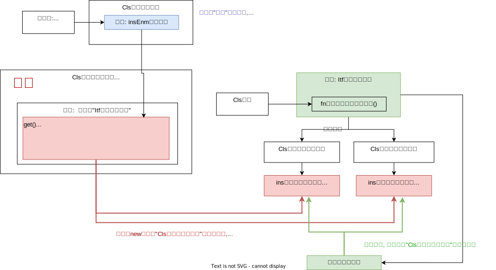

= 抽象工厂
:sectnums:
:toclevels: 3
:toc: left

---

== 抽象工厂

[,subs=+quotes]
----
enum Enm游戏平台 {
    单机,
    网络,
}

//存放当前的需求. 需求是会经常改变的. 所以这个类中字段的值, 也会经常变化.
class Cls游戏当前需求 {
    public static Enm游戏平台 insEnm游戏平台 = Enm游戏平台.单机;
}

class Cls用户 {
}

//"游戏管理"接口
interface Itf游戏管理接口 {
    void fn将用户添加到数据库中(Cls用户 ins用户);
}

class Cls单机游戏数据管理 : Itf游戏管理接口 {
    public void fn将用户添加到数据库中(Cls用户 ins用户) {
        Console.WriteLine("将用户数据, 添加到单机中");
    }
}

class Cls网络游戏数据管理 : Itf游戏管理接口 {
    public void fn将用户添加到数据库中(Cls用户 ins用户) {
        Console.WriteLine("将用户数据, 添加到服务器中");
    }
}

*//下面的类(工厂), 专门用来生成"Cls单机游戏数据管理" 或"Cls网络游戏数据管理" 的实例对象. 判断到底是返回"单机"还是"网络游戏"类的实例对象, 这个判断逻辑代码, 我们都封装在了这个类中. 之后用户直接调用这个类中的静态属性"Ins生成的某个游戏管理类的实例"就行了. 不用再做"生成单机还是网络类的实例"的条件判断了. 这个类中已经帮我们做好了脏活累活.*
class Cls游戏数据管理的实例的生成工厂 {
    //本类里面, 有一个属性:
    public static Itf游戏管理接口 Ins生成的某个游戏管理类的实例 {
        get {
            //如果当前的游戏需求, 是在开发单机游戏的话, 就创建出一个"单机游戏数据管理"类的实例, 让接口变量, 来指向它.
            if (Cls游戏当前需求.insEnm游戏平台 == Enm游戏平台.单机) {
                return new Cls单机游戏数据管理(); //接口变量, 指向"实现它的类"的实例
            }
            else if (Cls游戏当前需求.insEnm游戏平台 == Enm游戏平台.网络) {
                return new Cls网络游戏数据管理();
            }
            else {
                return null;
            }
        }
    }
}

//主函数
internal class Program {
    static void Main(string[] args) {
        Itf游戏管理接口 insItf游戏管理变量指针 = null; //创建一个接口类的实例变量

        //将新用户, 添加到"本地单机", 或"网络服务器"的数据库中
        insItf游戏管理变量指针 = Cls游戏数据管理的实例的生成工厂.Ins生成的某个游戏管理类的实例;
        insItf游戏管理变量指针.fn将用户添加到数据库中(new Cls用户());
    }
}
----

