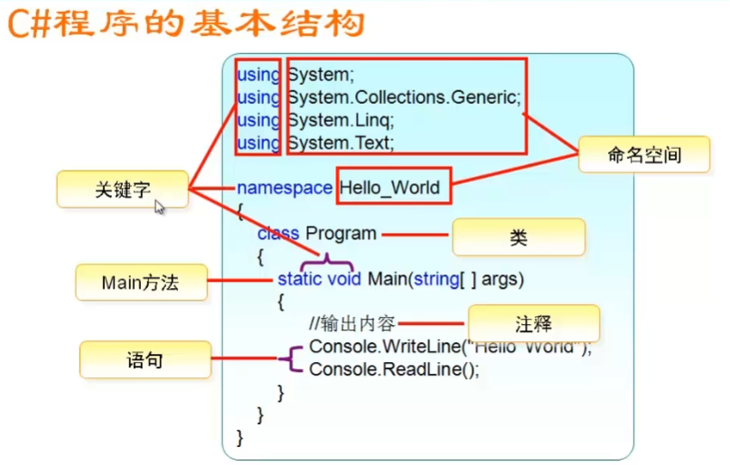
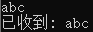
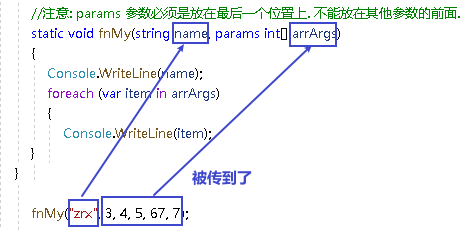
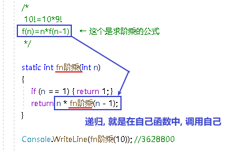

- [https://www.bilibili.com/video/BV1gR4y1b7oW?p=9&vd_source=52c6cb2c1143f8e222795afbab2ab1b5](https://www.bilibili.com/video/BV1gR4y1b7oW?p=18&vd_source=52c6cb2c1143f8e222795afbab2ab1b5)
-
- https://www.bilibili.com/video/BV1EK4y1b7ux?p=13&spm_id_from=pageDriver&vd_source=52c6cb2c1143f8e222795afbab2ab1b5
-
- 快捷键
	- 快速输入 Console.WriteLine() : cw+两次Tab
	- for循环：for+两次Tab
	- 快速格式化代码 : Ctrl(按住不放)+K+D
	- 移动行 : alt + 上下键
	- 复制本行到下一行上：Ctrl + D
	- 将选中行, 往下移一行位置：Alt+Shift+T
	- 删除当前行：Ctrl+Shift+L或Shift+Delete（前提是没有选中任何文本，否则Shift+Delete只删除选中的文本）
	- 注释 : ctrl+k , 然后按住ctrl不放, 再按c
	- 取消注释: ctrl+k , 然后按住ctrl不放, 再按u
	- 快速智能提示 :Ctrl+J
	-
	-
	- 选择括号、括号内的文本：Ctrl + Shift + }
	- 切换代码中的大小写:
		- 转换为大写：Ctrl + Shift + U
		- 转换为小写：Ctrl + U
		-
	-
-
- 创建项目 → 我们选"控制台应用"
  collapsed:: true
	- 
-
- 设置
	- 修改代码显示的字体
	  collapsed:: true
		- 在工具 -> 选项里面
		- 
	- 代码过长的话, 让它在窗口内自动换行
	  collapsed:: true
		- 
-
- 程序的基本结构
  collapsed:: true
	- 
- 命名空间
  collapsed:: true
	- 
	- ```
	  ```
	- 调用另一个命名空间中的类
	  collapsed:: true
		- ```
		  namespace  S1
		  {
		      class Person { }
		  }
		  
		  namespace S2
		  {
		      Person p = new Person();   //我们想调用Person类, 但这个类, 我们是写在 S1命名空间中的, 而不在现在的 S2命名空间中. 所以无法调用, 会报错.
		  }
		  ```
-
-
- 获取用户输入的内容: Console.ReadLine(); 
  collapsed:: true
  注意, 该函数的返回值是字符串! 所以你不能用它来获取输入的纯数字类型, 因为数字类型也会被转成字符串返回.
	- ```
	  String str = Console.ReadLine(); //获取用户的键盘输入内容
	  Console.WriteLine("已收到: "+ str);  //
	  ```
	- 
-
- 输出语句
	- 基本: Console.WriteLine("Hello, World!")
	  collapsed:: true
		- ```
		  Console.WriteLine("Hello, World!");
		  Console.WriteLine(123);
		  Console.ReadLine();  // 这行用来等待用户的下一行输入. 可以防止上面的输出代码一闪而过.
		  ```
	- 同时输出多个变量: 在字符串中, 用 {0},{1},{2}这些索引,来代表后面的多个变量
	  collapsed:: true
		- ```
		  string name = "zrx";
		  string sex = "male";
		  int age = 18;
		  Console.WriteLine("姓名:{0}, 性别:{1}, 年龄:{2}",name,sex,age); //姓名:zrx, 性别:male, 年龄:18
		  ```
	- 输出换行: `\n`
	  collapsed:: true
		- ```
		  Console.WriteLine("1 \n 2");
		  ```
	- 输出制表符: `\t`
	- 不转义字符, 按原始内容直接输出: 在字符串前面加@
	  collapsed:: true
		- ```
		  Console.WriteLine("a\\b\\c");       // 输出: a\b\c
		  Console.WriteLine(@"a\\b\\c");      //字符串前面加了@后, 意思就是让后面的"转义功能"失效. 按原始字符串输出. 本处会输出 a\\b\\c
		  Console.WriteLine(@"c:\my\document"); //所以我们比如想输出路径, 可以用这个方法, 更方便. 本处输出 c:\my\document
		  ```
	- 字符串前使用了@后, 如何输出字符串中的引号? 用两个引号"", 来输出1个引号"
	  collapsed:: true
		- ```
		  Console.WriteLine(@"aaa""引号里的内容""bbb");  //在使用了@后, 如何再输出引号呢? 就要用两个引号"", 来代表1个引号" . 本处输出 : aaa"引号里的内容"bbb
		  ```
	- 数字加字符串, 这个操作, 会把数字自动转成字符串
	  collapsed:: true
		- ```
		  int age = 3;
		  double money = 8;
		  
		  Console.WriteLine(age+money);  //11
		  Console.WriteLine(age+"+"+money);  //3+8  ← 因为数字加字符串, 相当于都转成了字符串
		  Console.WriteLine("a+b"+age+money);  //a+b38  ← age先和前面的字符串合并, 就会先把age转成了字符串, 再把money也转成了字符串, 最终就是 不存在数字的加减了.
		  Console.WriteLine("a+b"+(age+money));  //a+b11
		  ```
-
- 变量类型
  collapsed:: true
	- 字符串类型
	  collapsed:: true
		- 拼接两个字符串, 用加号
			- ```
			  Console.WriteLine("你好"+"zrx");  // 你好zrx
			  Console.WriteLine("你好 "+"zrx");  // 你好 zrx
			  ```
			-
-
-
- 类型转换
	- 强制类型转换:
	  collapsed:: true
		- ```
		  int num = 103;
		  char c = (char)num;   //(char) 是强制类型转换成"字符类型".但注意, 大字节的变量数据, 强赛到小字节的变量空间里, 会导致数据丢失.
		  Console.WriteLine(c);  //本例会打印出一个"g"
		  ```
	- 将字符串数字, 转成int型数字 : Convert.ToInt32(你的字符串类型的数字)
	  collapsed:: true
		- ```
		  String str_num = Console.ReadLine(); //如果你输入的是数字的话, 注意该"读取输入"的函数, 返回的是字符串. 比如, 你这里输入 123
		  Console.WriteLine(str_num.GetType()); //System.String  ← GetType() 方法, 是获取数据的类型
		  
		  int int_num=Convert.ToInt32(str_num); //所以, 我们还要把这个字符串, 转成数字整数类型
		  Console.WriteLine(int_num.GetType()); //System.Int32
		  ```
		- ```
		  //下面, 读取用户输入的两个数字, 转成数字类型, 再相加
		  int a = Convert.ToInt32(Console.ReadLine());
		  int b = Convert.ToInt32(Console.ReadLine());
		  int c = a + b;
		  Console.WriteLine(c);
		  ```
-
- 数字运算
	- +=
	  collapsed:: true
		- ```
		  int a = 5;
		  int b = 3;
		  b += a; //这里相当于 b=b+a, 即b=8
		  Console.WriteLine(b); //8
		  ```
		-
-
- 布尔类型判断
  collapsed:: true
	- ```
	  bool a = 23 == 45; // 判断 23 和45 是否相等, 将结果赋给一个布尔类型的变量
	  Console.WriteLine(a); //False
	  ```
-
- 逻辑运算符, &&, || , !
  collapsed:: true
	- ```
	  bool a = (3 < 4) && (9 < 6); // && 是前后两个都为true时, 才最终为ture.
	  Console.WriteLine(a); //False
	  -------------
	  bool a = (3 < 4) || (9 < 6);
	  Console.WriteLine(a); //True
	  ---------------
	  bool a = !(3 < 5); //3<5为ture, 但前面加个!, 就是取非了, 就变成了!ture=false
	  Console.WriteLine(a); //False
	  ```
-
- 条件判断
  collapsed:: true
	- ```
	  Console.WriteLine("输入x,y坐标\n");
	  int x = Convert.ToInt32(Console.ReadLine());
	  int y = Convert.ToInt32(Console.ReadLine());
	  
	  if (x > 0 && y > 0)
	  {
	  Console.WriteLine("在象限1");
	  }
	  else if (x < 0 && y > 0) //当上面的条件不满足时, 再执行本处的条件判断
	  {
	  Console.WriteLine("在象限2");
	  }
	  else if (x < 0 && y < 0)
	  {
	  Console.WriteLine("在象限3");
	  }
	  else if (x > 0 && y < 0)
	  {
	  Console.WriteLine("在象限4");
	  }
	  else
	  {
	  Console.WriteLine("在坐标轴上");
	  }
	  ```
- 条件判断 Switch语句
  collapsed:: true
	- ```
	   int num = Convert.ToInt32(Console.ReadLine());
	   
	              switch (num)
	              {
	                  case 1: //当num=1时,就执行这条case语句
	                      Console.WriteLine("you input 1");
	                      break; //每条case语句,必须以 break; 结束!
	  
	                  case 2:
	                      Console.WriteLine("you input 2");
	                      break;
	                  case 3:
	                      Console.WriteLine("you input 3");
	                      break;
	                  default:
	                      Console.WriteLine("you input other");
	                      break;
	              }
	  ```
-
- while循环
  collapsed:: true
	- ```
	             int i = 1;
	              while (i <= 10)
	              {
	                  Console.WriteLine(i);
	                  i++;
	              } //该循环, 会输出i的值, 然后让它递增. 这个操作, 一直到循环到 i=10为止, 就跳出该while循环. 即, 本例会从1输出到10
	  ```
	- 例: 从1加到100
	  collapsed:: true
		- ````
		              int i = 1;
		              int total = 0;
		              
		              while (i <= 100)
		              {
		                  total = total + i;
		                  Console.WriteLine(total);
		                  i++;
		              } //5050
		  ```
-
- for循环
  collapsed:: true
	- ```
	              int total = 0;
	              int length = 100;
	              
	              for (int i = 0; i <= length; i++)
	              {
	                  total = total+ i; //i是从0循环到100的, 所以这里就是从0加到100
	              }
	              Console.WriteLine(total); //5050
	  ```
-
- 字符串
	- 字符串类型数据, 其方法, 不会修改原字符串, 而会返回一个新字符串. 因为字符串是不能被修改的.
	- 去除字符串头尾的空白字符: string变量.Trim()
	  collapsed:: true
		- ```
		  string str = "     32r      ";
		  Console.WriteLine(str);
		  
		  string str2 = str.Trim(); // 去除字符串头尾的空白字符, 空格等.
		  Console.WriteLine( str2);  //"32r"
		  ```
	- 分割字符串 : string变量.Split(分隔符)
	  collapsed:: true
		- ```
		              string nameAll = "zrx,zzr,wyy";
		              string[] arrStr = nameAll.Split(","); // 字符串的Split()方法, 会返回一个字符串数组.     本处, 会将字符串, 从里面的逗号处来切割,
		              foreach (string i in arrStr) // 遍历数组
		              {
		                  Console.WriteLine(i);  
		              }
		  ```
-
-
-
-
-
- 数组
	- 新建数组
	  collapsed:: true
		- ```
		  //新建数组, 方式1:
		  string[] arrSex = { "F", "M", "M" };
		  
		  //新建数组, 方式2:
		  string[] arrNames = new string[10];  //声明,并创建一个10个元素的数组, 每个元素会赋默认值
		  
		  //新建数组,方式3:
		  int[] arrAges = new int[] { 1, 2, 3, 4};
		  ```
	- 遍历数组
		- 方法1 : foreach()方法
		  collapsed:: true
			- ```
			              int[] ages = { 1, 2, 3 };
			              Console.WriteLine(ages); //System.Int32[]
			              Console.WriteLine(ages[2]); //3
			  -----------
			              string[] names = { "zrx", "zzr", "wyy" };
			              foreach (string item in names) //遍历数组. 将数组中的每个元素, 赋值给 我们新建的string类型的 item变量
			              {
			                  Console.WriteLine(item); //打印出数组中的每个元素的值
			              }
			  ```
		- 方法2 :先获取数组中元素的长度(使用: 你的数组.Length属性), 然后使用for循环
		  collapsed:: true
			- ```
			              //遍历数组的方法2: 先获取数组中元素的长度, 然后使用for循环
			              int arrLength = arr我的数组.Length;  // 该Length属性, 能获取数组的长度
			              Console.WriteLine(arrLength); //4
			  
			              for (int i = 0; i < arrLength; i++)
			              {
			                  Console.WriteLine(arr我的数组[i]);
			              }
			  ```
-
-
- 函数
	- 定义函数
	  collapsed:: true
		- ```
		              static int fnMy(int a, int b) // 定义一个函数, 返回int类型.
		              {
		                  int c = a + b;
		                  return c;
		              }
		  
		              Console.WriteLine(fnMy(1, 2)); //3
		  ```
	- 可变数量的参数 : params(称为"参数数组") , 可以让你传入函数的"任意数量"的参数, 封装在一个数组中. 然后就可以在函数体内遍历来操作该数组了.
	  collapsed:: true
		- ```
		              //下面的函数, 将输入的参数, 全加起来, 然后返回这个总和.
		              static int fnMy(params int[] arr) //params关键词, 能帮我们把传入函数的不确定数目的参数, 自动组装到一个数组中
		              {
		                  int total = 0;
		                  foreach(int i in arr) { 
		                      total += i;
		                  }
		                  return total;
		              }
		  
		              int res= fnMy(4, 6, 2, 5, 7); //24
		              Console.WriteLine(res);
		  ```
		- 注意: params 参数, 必须是放在所有参数的最后一个位置上.
		  collapsed:: true
			- ```
			              //注意: params 参数必须是放在最后一个位置上. 不能放在其他参数的前面.
			              static string fnMy(string name, params string[] arrArgs)
			              {
			                  foreach (var item in arrArgs):
			                  {
			              }
			  ```
			- 
			-
	- 函数的重载: 就是你可以定义两个同名函数, 但这两个函数必须参数不同! 比如, 你可以定义一个加法函数, 接收int类型的参数. 然后你再定义一个同名, 同功能的函数, 但接收浮点类型的参数.  它们的接收参数不同, 但执行的函数功能, 本质是一样的.
	- 函数递归
		- ```
		  用递归, 来求阶乘
		              /*
		               10!=10*9!
		              f(n)=n*f(n-1)    ← 这个是求阶乘的公式
		               */
		  
		              static int fn阶乘(int n)
		              {
		                  if (n == 1) { return 1; }
		                  return n * fn阶乘(n - 1);
		              }
		  
		              Console.WriteLine(fn阶乘(10)); //3628800
		  ```
		- 
-