- https://www.bilibili.com/video/BV1RL411T7Ai?p=15&spm_id_from=pageDriver&vd_source=52c6cb2c1143f8e222795afbab2ab1b5
-
- https://www.bilibili.com/video/BV1EK4y1b7ux?p=13&spm_id_from=pageDriver&vd_source=52c6cb2c1143f8e222795afbab2ab1b5
-
-
-
- 基本框架代码
  collapsed:: true
	- ```
	  using System.IO.Compression;
	  
	  namespace ConsoleApp1
	  {
	      internal class Program
	      {
	          
	          static void Main(string[] args)
	          {
	            
	          }
	  
	  
	      }
	  
	  }
	  
	  ```
-
- 快捷键
	- 快速输入 Console.WriteLine() : cw+两次Tab
	- for循环：for+两次Tab
	- 快速格式化代码 : Ctrl(按住不放)+K+D
	- 移动行 : alt + 上下键
	- 复制本行到下一行上：Ctrl + D
	- 将选中行, 往下移一行位置：Alt+Shift+T
	- 删除当前行：Ctrl+Shift+L或Shift+Delete（前提是没有选中任何文本，否则Shift+Delete只删除选中的文本）
	- 注释 : ctrl+k , 然后按住ctrl不放, 再按c
	- 取消注释: ctrl+k , 然后按住ctrl不放, 再按u
	- 快速智能提示 :Ctrl+J
	- 快速找到括号的另一半匹配位置: ctrl+}
	- 在匹配的括号内, 选中文本: Ctrl + Shift +}
	  collapsed:: true
		- 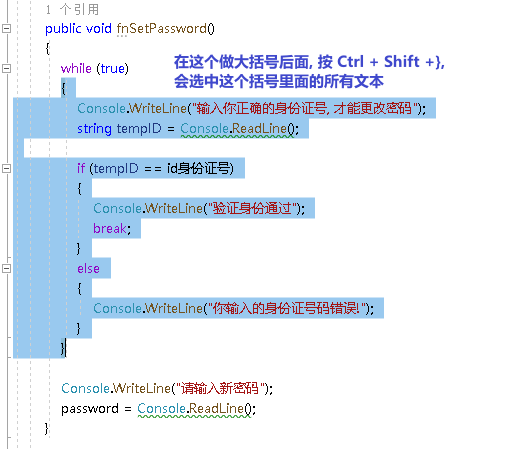
	-
	-
	- 选择括号、括号内的文本：Ctrl + Shift + }
	- 切换代码中的大小写:
		- 转换为大写：Ctrl + Shift + U
		- 转换为小写：Ctrl + U
		-
	-
-
- 创建项目 → 我们选"控制台应用"
  collapsed:: true
	- 
-
-
- 程序的基本结构
  collapsed:: true
	- 
- 命名空间
  collapsed:: true
	- 
	- ```
	  ```
	- 调用另一个命名空间中的类
	  collapsed:: true
		- ```
		  namespace  S1
		  {
		      class Person { }
		  }
		  
		  namespace S2
		  {
		      Person p = new Person();   //我们想调用Person类, 但这个类, 我们是写在 S1命名空间中的, 而不在现在的 S2命名空间中. 所以无法调用, 会报错.
		  }
		  ```
-
-
- 获取用户输入的内容: Console.ReadLine(); 
  collapsed:: true
  注意, 该函数的返回值是字符串! 所以你不能用它来获取输入的纯数字类型, 因为数字类型也会被转成字符串返回.
	- ```
	  String str = Console.ReadLine(); //获取用户的键盘输入内容
	  Console.WriteLine("已收到: "+ str);  //
	  ```
	- 
-
- 输出语句
	- 基本: Console.WriteLine("Hello, World!")
	  collapsed:: true
		- ```
		  Console.WriteLine("Hello, World!");
		  Console.WriteLine(123);
		  Console.ReadLine();  // 这行用来等待用户的下一行输入. 可以防止上面的输出代码一闪而过.
		  ```
	- 同时输出多个变量: 在字符串中, 用 {0},{1},{2}这些索引,来代表后面的多个变量
	  collapsed:: true
		- ```
		  string name = "zrx";
		  string sex = "male";
		  int age = 18;
		  Console.WriteLine("姓名:{0}, 性别:{1}, 年龄:{2}",name,sex,age); //姓名:zrx, 性别:male, 年龄:18
		  ```
	- 输出换行: `\n`
	  collapsed:: true
		- ```
		  Console.WriteLine("1 \n 2");
		  ```
	- 输出制表符: `\t`
	- 不转义字符, 按原始内容直接输出: 在字符串前面加@
	  collapsed:: true
		- ```
		  Console.WriteLine("a\\b\\c");       // 输出: a\b\c
		  Console.WriteLine(@"a\\b\\c");      //字符串前面加了@后, 意思就是让后面的"转义功能"失效. 按原始字符串输出. 本处会输出 a\\b\\c
		  Console.WriteLine(@"c:\my\document"); //所以我们比如想输出路径, 可以用这个方法, 更方便. 本处输出 c:\my\document
		  ```
	- 字符串前使用了@后, 如何输出字符串中的引号? 用两个引号"", 来输出1个引号"
	  collapsed:: true
		- ```
		  Console.WriteLine(@"aaa""引号里的内容""bbb");  //在使用了@后, 如何再输出引号呢? 就要用两个引号"", 来代表1个引号" . 本处输出 : aaa"引号里的内容"bbb
		  ```
	- 数字加字符串, 这个操作, 会把数字自动转成字符串
	  collapsed:: true
		- ```
		  int age = 3;
		  double money = 8;
		  
		  Console.WriteLine(age+money);  //11
		  Console.WriteLine(age+"+"+money);  //3+8  ← 因为数字加字符串, 相当于都转成了字符串
		  Console.WriteLine("a+b"+age+money);  //a+b38  ← age先和前面的字符串合并, 就会先把age转成了字符串, 再把money也转成了字符串, 最终就是 不存在数字的加减了.
		  Console.WriteLine("a+b"+(age+money));  //a+b11
		  ```
-
- 变量类型
  collapsed:: true
	- 字符串类型
	  collapsed:: true
		- 拼接两个字符串, 用加号
			- ```
			  Console.WriteLine("你好"+"zrx");  // 你好zrx
			  Console.WriteLine("你好 "+"zrx");  // 你好 zrx
			  ```
			-
-
-
- 类型转换
	- 强制类型转换:
	  collapsed:: true
		- ```
		  int num = 103;
		  char c = (char)num;   //(char) 是强制类型转换成"字符类型".但注意, 大字节的变量数据, 强赛到小字节的变量空间里, 会导致数据丢失.
		  Console.WriteLine(c);  //本例会打印出一个"g"
		  ```
	- 将字符串数字, 转成int型数字 : Convert.ToInt32(你的字符串类型的数字)
	  collapsed:: true
		- ```
		  String str_num = Console.ReadLine(); //如果你输入的是数字的话, 注意该"读取输入"的函数, 返回的是字符串. 比如, 你这里输入 123
		  Console.WriteLine(str_num.GetType()); //System.String  ← GetType() 方法, 是获取数据的类型
		  
		  int int_num=Convert.ToInt32(str_num); //所以, 我们还要把这个字符串, 转成数字整数类型
		  Console.WriteLine(int_num.GetType()); //System.Int32
		  ```
		- ```
		  //下面, 读取用户输入的两个数字, 转成数字类型, 再相加
		  int a = Convert.ToInt32(Console.ReadLine());
		  int b = Convert.ToInt32(Console.ReadLine());
		  int c = a + b;
		  Console.WriteLine(c);
		  ```
-
- 数字运算
	- +=
	  collapsed:: true
		- ```
		  int a = 5;
		  int b = 3;
		  b += a; //这里相当于 b=b+a, 即b=8
		  Console.WriteLine(b); //8
		  ```
		-
-
- 布尔类型判断
  collapsed:: true
	- ```
	  bool a = 23 == 45; // 判断 23 和45 是否相等, 将结果赋给一个布尔类型的变量
	  Console.WriteLine(a); //False
	  ```
-
- 逻辑运算符, &&, || , !
  collapsed:: true
	- ```
	  bool a = (3 < 4) && (9 < 6); // && 是前后两个都为true时, 才最终为ture.
	  Console.WriteLine(a); //False
	  -------------
	  bool a = (3 < 4) || (9 < 6);
	  Console.WriteLine(a); //True
	  ---------------
	  bool a = !(3 < 5); //3<5为ture, 但前面加个!, 就是取非了, 就变成了!ture=false
	  Console.WriteLine(a); //False
	  ```
-
- 条件判断
  collapsed:: true
	- ```
	  Console.WriteLine("输入x,y坐标\n");
	  int x = Convert.ToInt32(Console.ReadLine());
	  int y = Convert.ToInt32(Console.ReadLine());
	  
	  if (x > 0 && y > 0)
	  {
	  Console.WriteLine("在象限1");
	  }
	  else if (x < 0 && y > 0) //当上面的条件不满足时, 再执行本处的条件判断
	  {
	  Console.WriteLine("在象限2");
	  }
	  else if (x < 0 && y < 0)
	  {
	  Console.WriteLine("在象限3");
	  }
	  else if (x > 0 && y < 0)
	  {
	  Console.WriteLine("在象限4");
	  }
	  else
	  {
	  Console.WriteLine("在坐标轴上");
	  }
	  ```
- 条件判断 Switch语句
  collapsed:: true
	- ```
	   int num = Convert.ToInt32(Console.ReadLine());
	   
	              switch (num)
	              {
	                  case 1: //当num=1时,就执行这条case语句
	                      Console.WriteLine("you input 1");
	                      break; //每条case语句,必须以 break; 结束!
	  
	                  case 2:
	                      Console.WriteLine("you input 2");
	                      break;
	                  case 3:
	                      Console.WriteLine("you input 3");
	                      break;
	                  default:
	                      Console.WriteLine("you input other");
	                      break;
	              }
	  ```
-
- while循环
  collapsed:: true
	- ```
	             int i = 1;
	              while (i <= 10)
	              {
	                  Console.WriteLine(i);
	                  i++;
	              } //该循环, 会输出i的值, 然后让它递增. 这个操作, 一直到循环到 i=10为止, 就跳出该while循环. 即, 本例会从1输出到10
	  ```
	- 例: 从1加到100
	  collapsed:: true
		- ````
		              int i = 1;
		              int total = 0;
		              
		              while (i <= 100)
		              {
		                  total = total + i;
		                  Console.WriteLine(total);
		                  i++;
		              } //5050
		  ```
-
- for循环
  collapsed:: true
	- ```
	              int total = 0;
	              int length = 100;
	              
	              for (int i = 0; i <= length; i++)
	              {
	                  total = total+ i; //i是从0循环到100的, 所以这里就是从0加到100
	              }
	              Console.WriteLine(total); //5050
	  ```
-
- 常量
  collapsed:: true
	- ```
	  const int NUM= 97; //定义常量. 常量的变量名一般用大写
	  ```
-
- 字符串
	- 字符串类型数据, 其方法, 不会修改原字符串, 而会返回一个新字符串. 因为字符串是不能被修改的.
	- 去除字符串头尾的空白字符: string变量.Trim()
	  collapsed:: true
		- ```
		  string str = "     32r      ";
		  Console.WriteLine(str);
		  
		  string str2 = str.Trim(); // 去除字符串头尾的空白字符, 空格等.
		  Console.WriteLine( str2);  //"32r"
		  ```
	- 分割字符串 : string变量.Split(分隔符)
	  collapsed:: true
		- ```
		              string nameAll = "zrx,zzr,wyy";
		              string[] arrStr = nameAll.Split(","); // 字符串的Split()方法, 会返回一个字符串数组.     本处, 会将字符串, 从里面的逗号处来切割,
		              foreach (string i in arrStr) // 遍历数组
		              {
		                  Console.WriteLine(i);  
		              }
		  ```
-
-
-
-
-
- 数组
	- 新建数组
	  collapsed:: true
		- ```
		  //新建数组, 方式1:
		  string[] arrSex = { "F", "M", "M" };
		  
		  //新建数组, 方式2:
		  string[] arrNames = new string[10];  //声明,并创建一个10个元素的数组, 每个元素会赋默认值
		  
		  //新建数组,方式3:
		  int[] arrAges = new int[] { 1, 2, 3, 4};
		  ```
	- 遍历数组
		- 方法1 : foreach()方法
		  collapsed:: true
			- ```
			              int[] ages = { 1, 2, 3 };
			              Console.WriteLine(ages); //System.Int32[]
			              Console.WriteLine(ages[2]); //3
			  -----------
			              string[] names = { "zrx", "zzr", "wyy" };
			              foreach (string item in names) //遍历数组. 将数组中的每个元素, 赋值给 我们新建的string类型的 item变量
			              {
			                  Console.WriteLine(item); //打印出数组中的每个元素的值
			              }
			  ```
		- 方法2 :先获取数组中元素的长度(使用: 你的数组.Length属性), 然后使用for循环
		  collapsed:: true
			- ```
			              //遍历数组的方法2: 先获取数组中元素的长度, 然后使用for循环
			              int arrLength = arr我的数组.Length;  // 该Length属性, 能获取数组的长度
			              Console.WriteLine(arrLength); //4
			  
			              for (int i = 0; i < arrLength; i++)
			              {
			                  Console.WriteLine(arr我的数组[i]);
			              }
			  ```
-
- 枚举类型
  collapsed:: true
	- ```
	  namespace ConsoleApp2
	  {
	      internal class Program
	      {
	          enum type职业  //定义一个枚举类型的变量. 注意, 枚举类型的定义, 必须放在main函数前面
	          {
	              皇帝, 丞相, 大都督, 刺史, 太守, 将军  //注意:这些字符串不需要加双引号
	          }
	  
	          static void Main(string[] args)
	          {       
	  
	          type职业 status诸葛亮 = type职业.丞相;
	          Console.WriteLine(status诸葛亮); //丞相
	  
	          }
	      }
	  }
	  ```
	- 例子
	  collapsed:: true
		- 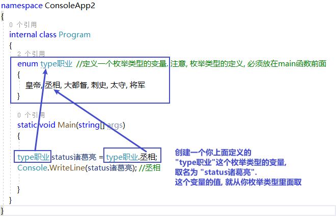
	- 例子
	  collapsed:: true
		- 
	-
-
- 结构体(相当于JavaScript中的"对象")
  collapsed:: true
	- ```
	  namespace ConsoleApp2
	  {
	      internal class Program
	      {
	  
	  
	          // 创建一个结构体类型, 要写在main函数前面
	          struct strcPerson
	          {
	              public string name;  //必须用public公开权限, 否则下面新建"结构体"变量时, 会访问不到这里
	              public int age;
	  
	              public enum Enum_Sex { male, female }; //在结构体中, 我们定义了一个枚举类型
	              public Enum_Sex sex;  //创建一个枚举类型的变量
	  
	              public enum Enum_IsMarried { yes, no };
	              public Enum_IsMarried isMarried;
	          }
	  
	          static void Main(string[] args)
	          {
	              strcPerson p1 = new strcPerson();  //创建一个结构体变量
	              p1.name = "zrx";
	              p1.age = 18;
	              p1.sex = strcPerson.Enum_Sex.male;
	              p1.isMarried = strcPerson.Enum_IsMarried.no;
	  
	  
	              Console.WriteLine(p1); //ConsoleApp2.Program+strcPerson
	              Console.WriteLine(p1.name); //zrx
	              Console.WriteLine(p1.isMarried); //no
	  
	          }
	      }
	  }
	  ```
	- 例子
		- 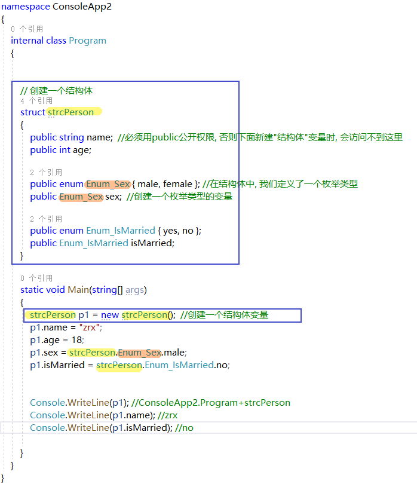
	- 创建结构体类型的数组
	  collapsed:: true
		- ```
		  namespace ConsoleApp2
		  {
		      internal class Program
		      {
		  
		  
		          // 创建一个结构体
		          struct STRC_PERSON
		          {
		              public string name;  //必须用public公开权限, 否则下面新建"结构体"变量时, 会访问不到这里
		              public int age;
		          }
		  
		          static void Main(string[] args)
		          {
		              STRC_PERSON[] arrStrcPerson = new STRC_PERSON[3]; //创建一个数组(含3个元素的长度), 里面放的元素是结构体
		              arrStrcPerson[0].name = "zrx";
		              arrStrcPerson[1].name = "wyy";
		              arrStrcPerson[2].name = "zm";
		  
		              Console.WriteLine(arrStrcPerson); //ConsoleApp2.Program+STRC_PERSON[]
		  
		              foreach (var item in arrStrcPerson)
		              {
		                  Console.WriteLine(item.name); //输出3行, 分别是 zrx, wyy, zm
		              }
		  
		          }
		      }
		  }
		  ```
		- 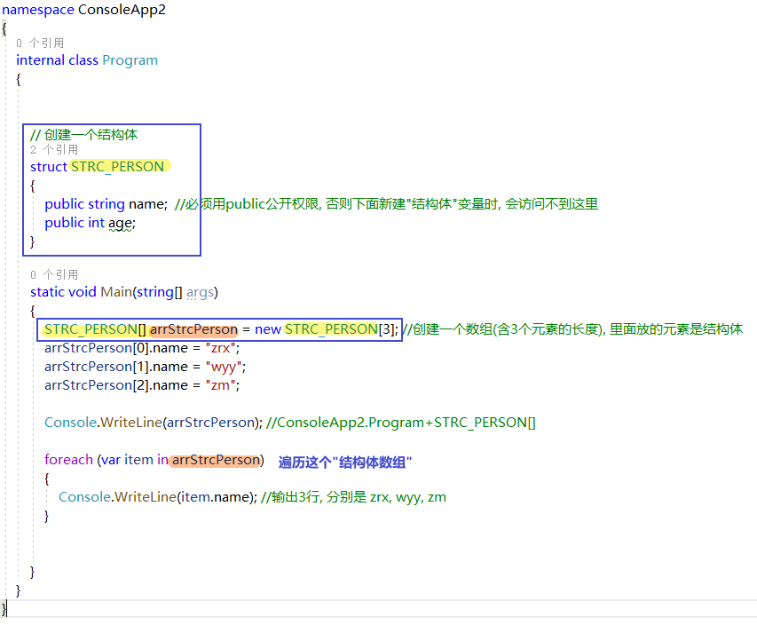
- 在结构体中, 定义方法
  collapsed:: true
	- ```
	  namespace ConsoleApp2
	  {
	      internal class Program
	      {
	  
	  
	          // 创建一个结构体
	          struct STRC_PERSON
	          {
	              public string name;
	              public int age;
	  
	              public void fnPrintInfo()  // 在结构体中, 可以定义方法(即函数)
	              {
	                  Console.WriteLine("name:{0}, age:{1}", name, age);
	              }
	          }
	  
	          static void Main(string[] args) 
	          {
	              STRC_PERSON p1 = new STRC_PERSON();
	              p1.name = "zrx";
	              p1.age = 19;
	              p1.fnPrintInfo(); //name:zrx, age:19
	  
	          }
	      }
	  }
	  ```
	- 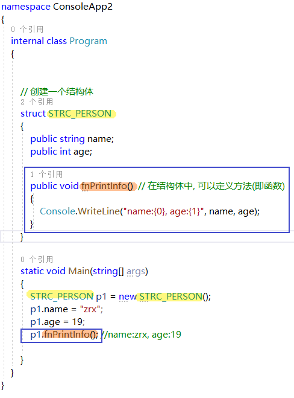
-
- 类
	- C# 习惯, 一个类, 就放在一个cs文件里. (文件名, 就跟你的类名保持一致就行了.) 而不要多个类写在一个文件中.
	- 基本用法
	  collapsed:: true
		- 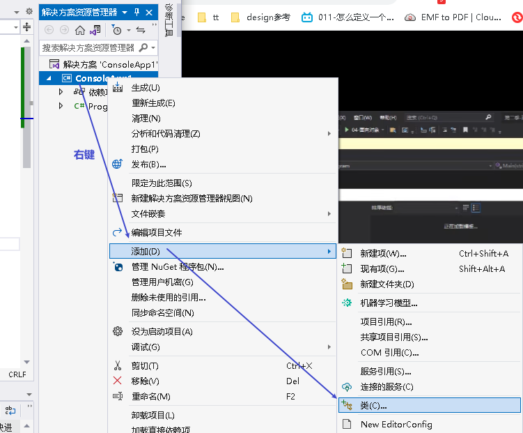
		- 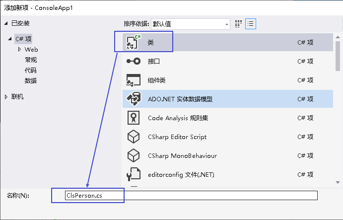
		- 现在, 你就有了一个专门存放类的文件, 名叫 ClsPerson.cs, 输入代码:
		- ```
		  using System;
		  using System.Collections.Generic;
		  using System.Linq;
		  using System.Text;
		  using System.Threading.Tasks;
		  
		  namespace ConsoleApp1
		  {
		      //创建一个"人"类
		      internal class ClsPerson
		      {
		          public string name;
		          public int age;
		          public int ability_政治;
		          public string country;
		  
		          public void fnShowInfo()
		          {
		              Console.WriteLine("name:{0}, age:{1}, 政治能力:{2}, 国籍:{3}", name, age, ability_政治, country);
		          }
		                 
		      }
		  }
		  
		  ```
		- 然后, 你回到主文件 Program.cs中, 输入:
		- ```
		  using System.IO.Compression;
		  
		  namespace ConsoleApp1
		  {
		      internal class Program
		      {
		  
		          static void Main(string[] args)
		          {
		  
		  
		              //创建你"ClsPerson类"的实例对象. 注意: ClsPerson类的具体代码, 你是写在另一个文件里的. 但没关系, 这里 main函数 能调用到该类. 
		              ClsPerson p1 = new ClsPerson();
		              p1.name = "zrx";
		              p1.age= 19;
		              p1.ability_政治 = 98;
		              p1.country = "曹魏";
		  
		              p1.fnShowInfo(); //name:zrx, age:19, 政治能力:98, 国籍:曹魏
		  
		          }
		  
		      }
		  
		  }
		  
		  ```
		- 即:
		- 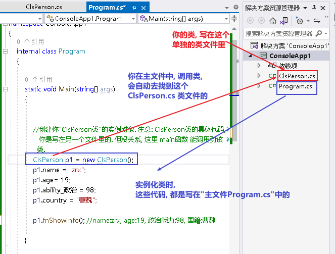
	- 类中属性的访问权限:
	  collapsed:: true
		- 在定义类时, 加上private关键词的属性, 无法在该类的实例中访问到, 也无法修改该属性. 换言之, 该private属性, 只能在类的内部被使用.
		- ```
		  Cls文件中:
		  
		  using System;
		  using System.Collections.Generic;
		  using System.Linq;
		  using System.Text;
		  using System.Threading.Tasks;
		  
		  namespace ConsoleApp1
		  {
		      internal class ClsBus
		      {
		          private int speed;
		          private int spaceArea;  // 访问权限设成 private后, 这个属性, 就只能在类的内部被访问到, 而不能在实例中访问到
		          public string name;
		  
		          public void fnRun()
		          {
		              Console.WriteLine("your bus {0}  is running ...", name);
		          }
		  
		          public void fnStop()
		          {
		              Console.WriteLine("your bus {0} stop...", name);
		          }
		      }
		  }
		  
		  ```
		- 主文件中:
		- ```
		  using System.IO.Compression;
		  
		  namespace ConsoleApp1
		  {
		      internal class Program
		      {
		  
		          static void Main(string[] args)
		          {
		  
		  
		              ClsBus bus1 = new ClsBus();
		              bus1.name = "zrx's 爱车";
		              bus1.fnRun(); //your bus zrx's 爱车  is running ...
		  
		              bus1.speed = 200;  //会报错, 无法访问到 speed属性, 因为这个属性在 ClsBus 的内部, 被我们设置为 private权限了, 不对外公开.
		          }
		  
		      }
		  
		  }
		  
		  ```
	- 在类中, 我们一般把所有属性都设为private私有的, 然后通过 get 和 set方法, 来暴露给用户, 来修改私有的属性值. 你就可以在这些函数方法里, 添加验证代码了. 比如 ,先验证用户的身份信息, 正确了才能继续使用set函数里后面的代码.
	  collapsed:: true
		- ```
		  类文件里:
		  using System;
		  using System.Collections.Generic;
		  using System.Linq;
		  using System.Text;
		  using System.Threading.Tasks;
		  
		  namespace ConsoleApp1
		  {
		      //创建一个"人"类
		      internal class ClsPerson
		      {
		          private string name = "";
		          private string id身份证号="000"; //默认为000
		          private string password = "123456"; //默认密码为123456
		  
		          public void fnGetPassword()
		          {
		              Console.WriteLine("你的当前password 是: {0}",password);
		          }
		  
		          public void fnSetPassword()
		          {
		              while (true)
		              {
		                  Console.WriteLine("输入你正确的身份证号, 才能更改密码");
		                  string tempID= Console.ReadLine();
		  
		                  if (tempID == id身份证号)
		                  {
		                      Console.WriteLine("验证身份通过");
		                      break;
		                  }
		                  else
		                  {
		                      Console.WriteLine("你输入的身份证号码错误!");
		                  }
		              }
		  
		              Console.WriteLine("请输入新密码");
		              password  = Console.ReadLine();
		          }
		                 
		      }
		  }
		  
		  ```
		- 主文件里:
		- ```
		  using System.IO.Compression;
		  
		  namespace ConsoleApp1
		  {
		      internal class Program
		      {
		  
		          static void Main(string[] args)
		          {
		  
		              ClsPerson p1= new ClsPerson();
		              p1.fnGetPassword();
		              p1.fnSetPassword();
		              p1.fnGetPassword();
		  
		  
		          }
		  
		      }
		  
		  }
		  
		  ```
		- 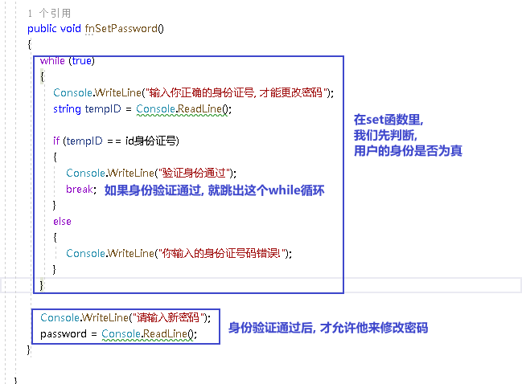
		-
	- 构造函数
		- 构造函数的作用, 使用来初始化属性值, 即给属性一些你自定义的初始默认值.
		- 构造函数的函数名, 要和类名一致. 并且, 构造函数不需要返回值.
		- ```
		  类文件里:
		  
		  using System;
		  using System.Collections.Generic;
		  using System.Linq;
		  using System.Text;
		  using System.Threading.Tasks;
		  
		  namespace ConsoleApp1
		  {
		      //创建一个"人"类
		      internal class ClsPerson
		      {
		          private string name;
		          private int id身份证号;
		          private string password;
		  
		  
		          //下面, 创建构造函数, 它使用来对属性值进行初始化的. .注意:
		          //1.该函数的名字, 必须与类名保持一致!
		          //2.该构造函数, 会在实例化该类时, 自动被调用.
		          //3.如果你不手动显式的写一个构造函数, 则程序会自动帮你在类里面, 创建一个无参的构造函数.
		          //4. 本例的构造函数, 能接收三个值, 然后会赋值给本类的各属性中. 所以, 你在实例化对象时, 必须传入这三个参数值.
		          public ClsPerson(string arg1Name, int arg2ID, string arg3PassWord)
		          {
		              Console.WriteLine("我是构造函数");
		              name = arg1Name;
		              id身份证号 = arg2ID;
		              password = arg3PassWord;
		          }
		  
		          public void fnShowInfo()
		          {
		              Console.WriteLine("你的信息是, name:{0}, id:{1}, 密码:{2}", name, id身份证号, password);
		          }
		  
		      }
		  }
		  
		  ```
		- 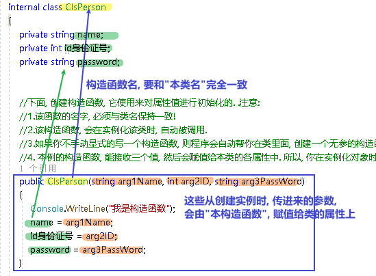
		- 主文件里:
		- ```
		  using System.IO.Compression;
		  
		  namespace ConsoleApp1
		  {
		      internal class Program
		      {
		  
		          static void Main(string[] args)
		          {
		  
		              ClsPerson p1= new ClsPerson("zrx",3202,"白日依山尽"); //在创建实例时, 把初始化信息传进去. 类里面的构造函数, 会将这些值, 赋值到各个属性上去.
		              p1.fnShowInfo(); //你的信息是, name:zrx, id:3202, 密码:白日依山尽
		  
		  
		          }
		  
		      }
		  
		  }
		  
		  ```
-
-
- 函数
  collapsed:: true
	- 定义函数
	  collapsed:: true
		- ```
		              static int fnMy(int a, int b) // 定义一个函数, 返回int类型.
		              {
		                  int c = a + b;
		                  return c;
		              }
		  
		              Console.WriteLine(fnMy(1, 2)); //3
		  ```
	- 可变数量的参数 : params(称为"参数数组") , 可以让你传入函数的"任意数量"的参数, 封装在一个数组中. 然后就可以在函数体内遍历来操作该数组了.
	  collapsed:: true
		- ```
		              //下面的函数, 将输入的参数, 全加起来, 然后返回这个总和.
		              static int fnMy(params int[] arr) //params关键词, 能帮我们把传入函数的不确定数目的参数, 自动组装到一个数组中
		              {
		                  int total = 0;
		                  foreach(int i in arr) { 
		                      total += i;
		                  }
		                  return total;
		              }
		  
		              int res= fnMy(4, 6, 2, 5, 7); //24
		              Console.WriteLine(res);
		  ```
		- 注意: params 参数, 必须是放在所有参数的最后一个位置上.
		  collapsed:: true
			- ```
			              //注意: params 参数必须是放在最后一个位置上. 不能放在其他参数的前面.
			              static string fnMy(string name, params string[] arrArgs)
			              {
			                  foreach (var item in arrArgs):
			                  {
			              }
			  ```
			- 
			-
	- 函数的重载: 就是你可以定义两个同名函数, 但这两个函数必须参数不同! 比如, 你可以定义一个加法函数, 接收int类型的参数. 然后你再定义一个同名, 同功能的函数, 但接收浮点类型的参数.  它们的接收参数不同, 但执行的函数功能, 本质是一样的.
	- 函数递归
	  collapsed:: true
		- ```
		  用递归, 来求阶乘
		              /*
		               10!=10*9!
		              f(n)=n*f(n-1)    ← 这个是求阶乘的公式
		               */
		  
		              static int fn阶乘(int n)
		              {
		                  if (n == 1) { return 1; }
		                  return n * fn阶乘(n - 1);
		              }
		  
		              Console.WriteLine(fn阶乘(10)); //3628800
		  ```
		- 
-
- 委托 delegate
  collapsed:: true
	- 委托类型的变量, 其实就相当于一个指针, 能指向另一个函数体. 从而这个委托变量, 就能当做那个函数来执行.
	- 委托, 就相当于它只有灵魂(有参数和返回值),没有身体(没有函数体),  它必须依附(指针指向)在一个身体(其他函数体)上, 才能执行那个函数功能.
	- 基本用法:
	  collapsed:: true
		- ```
		  using System.IO.Compression;
		  
		  namespace ConsoleApp1
		  {
		      internal class Program
		      {
		          static void fn卖房(int money, int age)
		          {
		              Console.WriteLine("我是中介, 帮你卖房. 你的年龄是{0}, 资产是{1}", money, age);
		          }
		  
		          static void fn理财投资(int money, int age)
		          {
		              Console.WriteLine("我是中介, 帮你理财投资. 你的年龄是{0}, 资产是{1}", money, age);
		          }
		  
		          //定义委托, 用delegate关键词.  注意, 定义委托类型时, 必须写在main函数前面.
		          delegate void MY委托(int money, int age); //这里, 1. 我们定义了一个委托类型, 叫"my委托"(注意,这里还不是变量, 只是个类型, 就像你自定义创建的"结构体"类型一样), 它就像"函数定义"一样, 有返回值, 有参数. 注意, 它的返回值和参数, 必须和你要挂钩到的"真正函数的返回值和参数", 完全一致.  2. 另外, 委托不需要写函数体. 因为我们这个委托会借用其他的函数体.
		  
		          static void Main(string[] args)
		          {
		              //下面, 我们再实例化这个委托类型, 创建出一个委托类型的变量
		              MY委托 dlg中介;
		  
		              dlg中介= fn卖房;   //我们将委托变量, 指针指向函数"fn卖房", 现在, 这个委托变量, 就可以执行"fn卖房"的函数功能了.
		              dlg中介(3000, 18); //我是中介, 帮你卖房. 你的年龄是3000, 资产是18
		  
		              //现在, 我们将这个委托变量, 重新指向另一个函数体.
		              dlg中介 = fn理财投资;
		              dlg中介(3000, 18); //我是中介, 帮你理财投资. 你的年龄是3000, 资产是18
		  
		          }
		      }
		  
		  }
		  ```
		- 
	- 例子: 给函数1传入另一个函数.  即 函数1, 接收一个"函数类型"的参数"函数2"进来.   这个"函数2", 其形参, 我们就可设为"委托类型".
	  collapsed:: true
		- ```
		  using System.IO.Compression;
		  
		  namespace ConsoleApp1
		  {
		      internal class Program
		      {
		          delegate void Dlg委托类();  //创建委托类, 这里我们没有给它设置接收的函数参数
		          static void fn日常运营(Dlg委托类 var委托) //这个函数接收一个"函数类型的参数", 会把传入的函数, 赋值给 "var委托"这个变量.
		          {
		              Console.WriteLine("听取属下提案");
		              var委托();   //执行这个"委托变量"指向的函数, 即作为参数传入"本fn日常运营()函数"中的 "fn判断是否出征他国()函数".
		          }
		  
		          static void fn判断是否出征他国()
		          {
		              Console.WriteLine("军方判断是否出征敌国");
		          }
		  
		          static void Main(string[] args)
		          {
		              fn日常运营(fn判断是否出征他国); //给函数, 传入另一个函数作为参数.
		  
		          }
		  
		  
		      }
		  
		  }
		  
		  ```
		- 
		- 这个程序的输出值:
		  听取属下提案
		  军方判断是否出征敌国
-
- 调试bug
	- 断点
	  collapsed:: true
		- 
	- 逐条语句执行  F11
	  collapsed:: true
		- 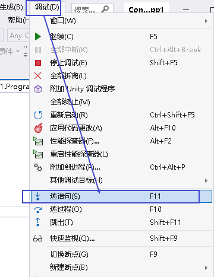
		-
	- 查看局部变量中的值
	  collapsed:: true
		- 
	- try catch finally
	  collapsed:: true
		- 基本用法
		  collapsed:: true
			- ```
			  			try
			  			{
			  				int[] arr = { 1, 2, 3 };
			  				Console.WriteLine(arr[3]); //这里会出错
			  			}
			  			catch (IndexOutOfRangeException e) //我们打算捕捉这个异常. 即创建一个IndexOutOfRangeException异常类型 的对象e
			              {
			  				Console.WriteLine("出现数组下标越界错误");
			  				throw;
			  			}
			  			catch(Exception e) //可以连续写多条catch 来同时捕获多个可能的异常错误
			  			{
			  
			  			}
			              finally  // finally语句表示, 不管上面出现何种异常, 这条finally语句都会执行
			  			{
			  
			  			}
			  ```
		- 例子: 判断用户输入的数据,是否符合程序要求的类型
		  collapsed:: true
			- ```
			              int num1 = 0;
			              int num2 = 0;
			  
			  
			              Console.WriteLine("请输入两个数字, 每个一行");
			  
			              while (true)  //使用while循环的目的是, 如果用户连续出错, 可以一直让用户输入, 来输入正确的数据. 而非只判断一次.
			              {
			                  try
			                  {
			                      num1 = Convert.ToInt32(Console.ReadLine());
			                      num2 = Convert.ToInt32(Console.ReadLine());
			                      break; //如果上面两条"读取输入"的语句, 没出错, 就用break跳出该while循环. 否则, 程序会一直循环要我们输入, 无穷无尽了.
			                  }
			                  catch (FormatException e)  //如果你输入的不是数字, 就会这里捕获到输入类型错误.
			                  {
			                      Console.WriteLine("必须输入数字!");
			                  }
			              }
			              
			              Console.WriteLine("sum is = {0}", num1 + num2);
			  
			  ```
		-
-
-
-