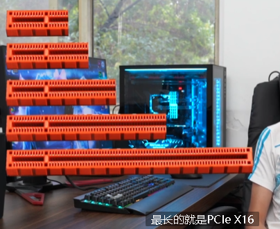
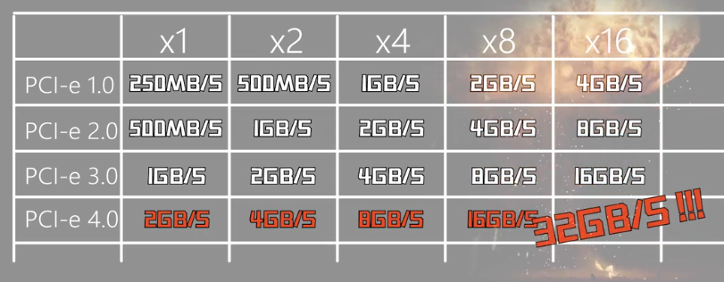

= PCIE 接口
:sectnums:
:toc:

---

AMD在7月7号发售了新的X570芯片组以及Ryzen 3000系列CPU, 其中X570芯片组中有一个非常非常重要的升级内容, 那就是PCIe的版本从3.0版本升级到了4.0, 很多不怎么懂电脑的同学就来问我了, 这个PCIe到底是个什么东西呢, 这个PCIe在电脑当中到底有什么作用呢, PCIe3.0升级到4.0对于我们来讲有什么意义呢, 有没有必要为了PCIe4.0去购买X570主板呢, 这期视频我们就从PCIe的功能和作用来为大家讲解一下, 电脑中的PCIe总线以及AMD新发布的PCIe4.0, 不过由于PCIe涉及到的内容实在是太多了, 所以我们不太可能一期视频将所有的内容介绍完毕, 本期视频我们先从PCIe的基本功能, 和作用以及带宽分配简单介绍一下PCIe是个什么东西, 至于PCIe升级对我们来讲的意义将放到南桥芯片组介绍完之后再讲了, 在介绍PCIe之前, 需要了解两个概念, 总线和带宽, 这个上一期视频我们已经讲过了, 这里就不在赘述了, 如果有不知道总线和带宽是什么概念的, 请自行查看上一期视频, 早些年的时候, 在微型电脑进入普通民用家庭的时候, 电脑当中, 不同的设备所使用的总线接口是完全不一样的, 声卡用着声卡的接口, 网卡用着网卡的接口, 显卡用着显卡的接口, 而且最要命的是，不同品牌的接口还不一样, 这就导致了你选择一块主板后, 其搭载了什么总线接口, 你就可以使用什么样接口的设备, 你将来升级也只能使用这个接口的设备, 这样的情况就造成了很多的局限性, 而且对于硬件规格的统一带来了很多的麻烦, 为了解决这个情况呢, 当时业内的电脑巨头IBM就联合intel为他们的PC/AT, 电脑制定了一个接口的标准, 这就是大名鼎鼎的ISA总线, ISA总线接口长这个样子, 由于ISA总线实在是太过久远了, 我本人并没有使用过, 以下关于ISA总线的内容来自维基百科, 如果有纰漏欢迎各位评论区补充, 由于兼容性好, 它在上个世纪80年代是最广泛采用的系统总线, 不过它的弱点也是显而易见的, 由于使用的是并行总线, 加上当时的抗干扰技术不成熟, 他的频率无法做到很高, 所以他的带宽只能达到每秒8MB/S的速率, 比现在的USB接口还要慢很多, 而且你插上一个设备后不能自动配置, 还需要你手动去分配资源, 无法做到即插即用, 而且ISA总线最大只支持到6个外围设备, 此外这个接口依赖于特定CPU才可以使用, 并且受到CPU外频的影响, 更换CPU导致的外频变更, 会波及到所有接驳到ISA总线上的设备, 而也正是因为ISA总线的这些弊端, 再加上我们电脑当中一些外围设备的性能需求越来越高, 所需要的带宽也越来越高, 所以ISA总线就逐渐被淘汰了, 而在这之后有很多厂商陆续推出了各种各样的总线想来统一市场, 但是最后都是昙花一现, 有兴趣了解的同学可以自行去维基百科查询, 而最终统一天下的就是PCI总线了, 于是后来在PC/98规范中, 大家就开始放弃了ISA总线, 取而代之的就是更为先进的PCI总线, PCI总线接口长这个样子, 我相信很多的同学如果家里有那种五六年七八年没换代的老古董机器, 你拆开主机侧板后就能在你的主板上找到这样的接口, 我家里还有一块正在服役的华硕G41主板, 就提供了2个一样的PCI插槽, PCI接口相对于ISA接口来讲, 不仅提高了带宽, 达到了132MB/s, 如果数据位宽升级到64位, 数据传输率可达264MB/s, 所以速度提升是非常的明显的, 除此之外还做到了即插即用, 插上设备以后, 可以自动配置, 不需要你手动去分配资源了, PCI也是一种不依赖于具体的某款CPU的独立总线, 之前的ISA就必须要在指定的CPU上才可以用, 此外PCI总线还解决了硬件中断共享的一些相关问题, 但是PCI也有他的天生设计缺陷, PCI采用的依旧是和ISA一样的并行传输, 所以他的频率依旧不能做的很高, 虽然速度相对于ISA提高了不少, 但是还是不够快, 此外PCI是采用共享总线的机制, 这就让高负载下很多设备会一块抢带宽, 最后还有一个就是不支持热拔插, 这里的话大家听不懂的话, 就简单了解一下就可以, 我们本期视频的主角也不是ISA和PCI, 所以为了解决PCI总线的这些缺陷, 技术再一次进行了总线革新, 这就是目前我们所用的PCIe总线了, PCIe有两个存在形态, 一个是接口，一个是通道, 当他以接口形式存在的时候, 就是你主板上那横着的长槽, 也就是显卡槽, 大多数人对于PCIe插槽的理解可能就只是插显卡, 事实上，除了显卡, 你还可以插PCIe接口的固态硬盘, PCIe接口的无线网卡, PCIe接口的有线网卡, PCIe接口的声卡, 视频采集卡, 你还可以把PCIe转接成其他的接口, 比如PCIe转M.2, PCIe转USB, PCIe转Type-c, 所以这个接口的用途真的是异常的广泛, 几乎所有高带宽需求的外围设备都能插在这个接口上, 希望大家看完这期视频后不要狭隘的就认为这个接口只能插显卡, PCIe除了作为接口形式存在, 他还可以作为通道的形式存在, 比如你主板上的M.2固态硬盘接口, 他虽然外形是M.2, 但是数据传输是依赖于PCIe通道的, 所以这时候接口形状是M.2, PCIe在这里就承担数据传输总线的作用了, 因此你可以简单理解为M.2接口就是一个换了形状的PCIe接口, 还有一个大家熟知的雷电3接口, 大家都知道雷电3接口传输速度非常的快, 可以给笔记本外接显卡, 甚至可以外接4K显示器, 之所以雷电3这么快速度, 就是因为他是利用PCIe通道来传输数据的, 那残血满血的雷电3还有残血满血的M.2说的是怎么一回事呢？, 这时候我们就要来介绍一下PCIe带宽的分配了, PCIe总线的带宽是按长度计算的, 最短的是PCIe X1, 然后是PCIe X2，PCIe X4P，CIe X8, 最长的就是PCIe X16, X16的PCIe速度就是X8的2倍, X4就是X1的4倍, 是不是很好计算呢, 任何X16的设备都可以插在尾部非闭合的X1槽中运行, 只不过这个设备肯定是没法发挥全部的性能了, 你也可以把X1的设备插在X16的槽中运行, 只不过这样就会浪费带宽了, 残血M.2雷电3说的就是PCIe X2速率的, 满血M.2和雷电3说的就是PCIe X4速率的, 好，介绍到了这里, 现在你清楚了PCIe是什么东西了, 知道他在电脑里是一种高速传输数据的总线了, 也知道他有接口和通道两种形态了, 那这次的PCIe3.0升级到4.0升级了些什么呢, 我们现在来讲这个, PCIe1.0的时候单向传输X1的速度只有250MB/S, 那X2就是500MB/S, X4也就1GB/S，X8的话是2GB/S, X16才4GB/S, 而我们的显卡，硬盘，还有网卡这些设备速度在不断的提高, 所以第一版PCIe的速度很快就不够用了, 由于PCIe目前没有什么明显的使用缺陷, 所以不需要进行大版本的技术革新和换代, 我们只需要让他传输的速度更快就行了, 接口的形状和通讯协议就不需要变动了, 这样的话还可以做到向下兼容, 一些1.0的设备还可以插到2.0上用, 2.0的设备也可以插在1.0的接口上用, 虽然会降速，但是总比不能用强, 而PCIe2.0的时候速度就相对于1.0做到了翻倍, X1的速度为500MB/S, X2为1GB/S，X4为2GB/S, X8为4GB/S，X16为8GB/S, 而后来2.0也不够快了, 所以我们的工程师又把PCIe的版本进行了更新, 升级到了3.0, 也就是目前我们绝大多数电脑里正在使用的PCIe总线的版本了, 只要你是近几年配的电脑, 主板上的PCIe总线版本都是3.0, PCIe3.0的速度相对于2.0又进行了翻倍, X1的速度就可以达到了1GB/S, 而X2就是2GB/S，X4就是4GB/S, X8就是8GB/S，X16就是16GB/S, 所以我们这就可以解释一个问题了, 为什么目前的M.2固态硬盘顺序读写速度最高就3点多G每秒呢, 是因为目前的M.2接口所使用的总线版本为均为PCIe3.0 X4, 速率上限4GB/S, 所以你是无论如何也不可能跑到4GB/S以上的, 因为接口的速率上限就这么高, 另外一个例子就是我曾经使用过的小米笔记本Pro 15.6寸, 这个笔记本提供了两个M.2接口, 默认的固态硬盘使用的那个接口速率是X4的, 所以可以发挥全部性能, 而另外一个接口是X2的, 所以你去给米pro加固态的时候, 那个接口的速率是无论如何也不可能超过2GB/S的, 而这次AMD所更新的PCIe4.0大家就知道是什么了, PCIe4.0在3.0的基础上速度又进行了翻倍, X1就可以达到2GB/S了，X2就是4GB/S了, X4为8GB/S，而X8就是16GB/S了, X16则可以达到32GB/S, 其实每次PCIe版本更新, 速度就是在上个版本的基础上翻倍了, 那现在肯定又有人要问了, PCIe3.0升级到4.0速度翻倍对我们来讲有什么意义呢, 这期视频是不可能给大家讲完的, 因为这涉及到一个CPU的PCIe通道数量以及CPU和南桥通信的问题, 我们需要讲完PCIe通道切分后才能告诉大家, 这期视频我们就先介绍完PCIe的作用就差不多了, 我会在下一期视频给大家来继续讲解PCIe和南桥通信的一些相关知识, 本期视频的内容到这里就算介绍完毕了, 如果你觉得这期视频对你有帮助的话, 就请不要忘了关注我并素质三连, 同时你还可以利用分享按钮分享给你不懂PCIe是什么意思的朋友, 也许可以帮助他们在学习电脑知识上少走一些弯路, 感谢各位的观看和支持, 我们将持续输出干货满满的软硬件知识, 这里是硬件茶谈，我是浮梁卖茶人, 我们下期视频再见,
