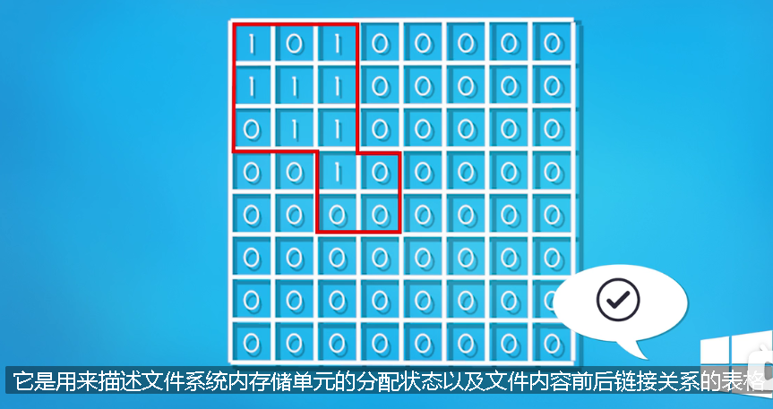
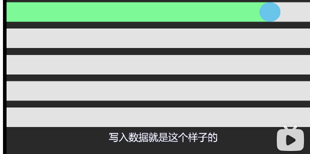
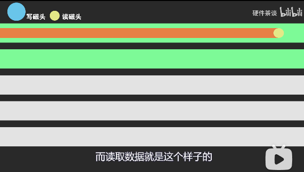
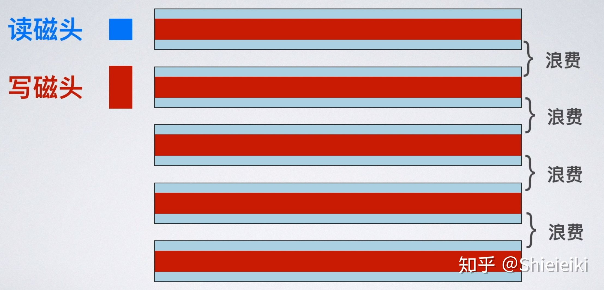

= 硬盘
:toc:
:sectnums:

---

== 硬盘上的数据

磁盘是利用二进制来存储数据的, 但系统并不知道硬盘上, 哪些数据是文件A的, 所以我们用红色的方框把它们框起来, 以标明这个红框内是一个整体的文件. 这个红色的方框, 以前就叫FAT表, 现在则是 "NTFS表"了.

在电脑上删除文件, 清空回收站, 执行的就是删除该文件在FAT表当中的记录, 把红框拿掉. 实际上你的数据在磁盘上并没有消失. 当你写入新的数据的时候, 系统是直接往旧的数据上去覆盖的.

但上述内容只适用于机械硬盘, 固态硬盘是不适用的.  因为**固态硬盘在写入新数据的时候, 必须要保证那一块的区域是空的**, 如果不是空的, 就需要先进行"擦除"操作, 再进行"写入". 所以固态硬盘不能像机械硬盘那样直接往旧的数据上覆盖. 正是因为有这个特性, 所以固态硬盘有一个特殊的功能 -- "*TRIM回收指令*".

你的固态硬盘, 你再进行写入数据的时候, 加入刚好用到之前删除过文件的一块区域, 因为需要先进行擦除, 所以会浪费一定的磁盘性能, 造成写入速度的下降. 所以说, 固态硬盘用久了会发生降速的现象.

**为了避免出现降速的情况, 固态硬盘的厂商就搞了"TIM回收指令", 在你删除数据以后, 如果系统检测到你当前没有进行数据读写, 也硬盘处于空闲的状态, 就会自动帮你擦除你之前删除的数据. 这样当下一次再写入的时候, 就能直接往上写, 而不需要临时进行"先擦除, 再写入"的操作了. **

Windows XP系统, 系统并不支持"TRIM指令". win7 开始, 才加入"TRIM指令". 目前的系统, 都是默认帮你打开 TRIM, 以提升磁盘性能的.  *在 TRIM 擦除数据后, 数据就几乎就不可能再找回来了.* 所以, 你的固态硬盘, 应该在文件被删除后的立刻, 就进行数据恢复, 祈祷系统现在尚没有进行 TIM 回收操作.

---

== 低性能的代表: SMR瓦楞式堆叠硬盘

|===
|Header 1 |Header 2

|PMR 磁盘 (Perpendicular Magnetic Recording，垂直磁性记录)
|Column 2, row 1

|Column 1, row 2
|Column 2, row 2
|===

====
我们截取磁盘表面一小块的部分，把它近似看做水平的直线. 为了避免相邻磁道的数据发生磁干扰，轨道与轨道之间是存在间隙的，这些间隙就导致了数据密度的降低.

读取的磁头, 和写入的磁头, 是分开的. 在传统没有使用"瓦叠技术"的 PMR 磁盘, 也就是CMR磁盘中, 由于"写磁头"比"读磁头"宽,

这里就有一个问题, 真正有效的数据, 只有"读磁头"扫过去中间的窄窄的一条. 因为"读磁头"只需要这么宽的数据带, 就可以获取数据. 所以不得已浪费了上下磁道的空间.

SMR瓦楞式堆叠硬盘解决的问题就是这些空隙，SMR磁盘采用了特殊的技术，把磁道和叠瓦片一样叠到了一块去，因为很像房顶的瓦片，所以我们称之为瓦楞式堆叠硬盘。
